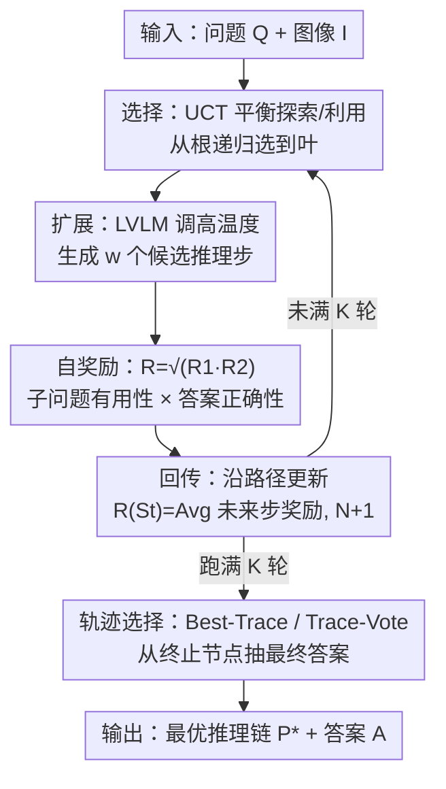

# VReST: Enhancing Reasoning in Large Vision-Language Models through Tree Search and Self-Reward Mechanism

**会议**: ACL 2025  
**arXiv**: [2506.08691](https://arxiv.org/abs/2506.08691)  
**代码**: https://github.com/GaryJiajia/VReST  
**领域**: 多模态VLM  
**关键词**: 视觉语言模型、多模态推理、蒙特卡洛树搜索、自奖励、测试时扩展

## 一句话总结
VReST 把蒙特卡洛树搜索（MCTS）搬到视觉语言模型（LVLM）上做多模态数学推理：每个树节点是一个推理步、每条路径是一条完整推理链，再用一套**不引入任何额外模型**的多模态自奖励（Self-Reward）给每步打分，从而在不训练的前提下系统地探索推理空间，在三个多模态数学推理基准上拿到 SOTA，并验证了多模态任务也存在测试时扩展律。

## 研究背景与动机

**领域现状**：Chain-of-Thought（CoT）提示已被证明能显著提升大语言模型在复杂推理上的表现，OpenAI o1 更展示了"超长 CoT + 推理时扩展"的潜力。很多工作把 CoT 范式迁移到 LVLM，希望增强其多模态推理能力，做法包括加场景图、加相关图像区域、把问题拆成子问题（DDCoT）、把 LVLM 当多面专家（Cantor）等。

**现有痛点**：这些多模态 CoT 方法本质上都是**贪心**地生成一条推理链——中间步骤数量有限、且生成后没有任何评估和修正机制。结果是在真正困难的视觉数学题上提升很小，甚至出现一个尴尬的现象：在 MathVista / MathVision / CharXiv 这类复杂视觉数学任务上，**多模态 CoT 反而打不过直接问答（Direct QA）**（如 MathVista 上 CoT 54.60% < QA 55.70%）。

**核心矛盾**：要提升 LVLM 推理，一条路是构造大规模 LVLM 推理数据集再训练，但这又贵又难扩展；另一条路（纯文本 LLM 已验证有效）是用 MCTS 在**不训练**的前提下扩张推理空间。但 MCTS 的灵魂是奖励函数——而要"公平对比 baseline、不引入额外模型"，就不能像纯文本那样套一个现成的奖励模型；同时多模态场景下奖励还必须把**视觉信息**纳进来，否则模型对图表、几何图的判断就成了无源之水。

**本文目标**：(1) 把 MCTS 扩展到 LVLM，自动生成更深、更高质量的推理链；(2) 设计一个**只用 LVLM 自身、不引入额外奖励模型**且融合视觉信息的自奖励机制；(3) 验证多模态任务上的测试时扩展律。

**切入角度**：作者注意到——既然 LVLM 自己就能对"子问题是否有用""答案是否正确"做判断，那就让它**自己给自己当奖励模型**，用首 token 是否为"Yes"的概率作为打分信号，这样既不破坏 training-free 的公平性，又天然带上了图像条件。

**核心 idea**：用"MCTS 树搜索 + LVLM 自奖励"代替"单链贪心 CoT"来求解多模态推理，把局部最优的一条链升级成对整个推理空间的系统探索。

## 方法详解

### 整体框架
给定问题 $Q$ 和图像 $I$，目标是找到一条最优推理链 $\mathcal{P}^{*}$ 通向正确答案 $A$。一条推理链写成 $\{Q, S_1, S_2, \dots, S_n\}$，其中每一步 $S_i$ 含一个子问题 $Q_i$ 和对应子答案 $A_i$。VReST 把这条链的搜索建成一棵树：**根节点是原始问题 $Q$，每个节点是一个推理步 $S_i$，每条边是步与步之间的转移，每条根到叶的路径就是一条完整推理链**。

整体流程是一个标准 MCTS rollout 迭代，重复 $K$ 次：**选择（Selection）→ 扩展（Expansion）→ 奖励（Rewarding）→ 回传（Backpropagation）**。扩展阶段调用 LVLM 实际生成新推理步；奖励阶段用自奖励机制给新步打分；$K$ 轮跑完后，再用一个轨迹选择策略（Best-Trace / Trace-Vote）从整棵树里挑出最终推理链，从其终止节点抽取最终答案。整个过程不训练任何参数，只在推理时反复调用同一个 LVLM。

### 关键设计

**1. MCTS 四步迭代：把单链贪心升级成对推理空间的系统搜索**

针对"现有多模态 CoT 贪心生成一条链、步骤有限又无法修正"的痛点，VReST 把 reasoning 建成树并跑 MCTS 四步循环。**选择**阶段从根节点出发，按 UCT 公式递归下选直到叶节点：

$$UCT(v) = R(v) + c\sqrt{\frac{\ln N(p(v))}{N(v)}}$$

其中 $R(v)$ 是节点奖励、$N(v)$ 是访问次数、$p(v)$ 是父节点、$c$ 是探索常数——前一项偏向已知高分节点（利用），后一项偏向访问少的节点（探索）。**扩展**阶段以 $\mathcal{P}_{t-1}=[Q, S_1, \dots, S_{t-1}]$ 为提示，把 LVLM 的温度调高来生成 $w$ 个互不相同的候选步 $\{S_{t,j}\}$，再用自奖励选出分最高的 $S_{t,\text{selected}}=\arg\max_j R(S_{t,j})$ 继续往下扩，直到命中终止节点或到达最大深度 $D_{\max}$。终止判定很朴素：当 LVLM 生成的子问题里出现 "Now we can answer the question" 这个片段，就视为终止节点。这套循环让模型能反复回到高潜力节点重新探索，而不是一条道走到黑。

**2. 多模态自奖励：让 LVLM 给自己打分，且不引入任何额外模型**

这是全文最关键的创新，直接解决"MCTS 需要奖励函数、但又不能为公平对比引入额外奖励模型、还得带视觉信息"这一矛盾。VReST 用 LVLM 自身对两件事做判断，构造 Rewarding 提示 $\mathcal{P}_t=[Q, S_1, \dots, S_t]$ 后分别算：

$$R_1 = P(\text{"Yes"} \mid [\mathcal{P}_t, \mathcal{P}_Q], I), \quad R_2 = P(\text{"Yes"} \mid [\mathcal{P}_t, \mathcal{P}_A], I), \quad R = \sqrt{R_1 R_2}$$

其中 $\mathcal{P}_Q$ 是问句"Are questions $Q_1,\dots,Q_t$ useful?"（**子问题有用性**），$\mathcal{P}_A$ 是"Is the answer $A_t$ correct?"（**最终答案正确性**），而 $P(\text{"Yes"}\mid\cdot)$ 就是 LVLM 生成的**首 token 为 "Yes" 的概率**。注意两次判断都把图像 $I$ 作为条件输入，所以奖励信号天然融合了视觉线索；最终奖励取两者的**几何平均** $\sqrt{R_1 R_2}$——只要任一项偏低，整体奖励就被显著拉低，比算术平均更"苛刻"，能防止某条链光靠"子问题看起来有用"却答错也拿高分。整个机制不需要训练，也不需要外挂奖励模型，因此和 baseline 的对比是公平的。

**3. 奖励回传 + Best-Trace/Trace-Vote 轨迹选择：从全树聚合出最优链**

到达终止节点 $S_T$ 后做**回传**：对路径上每个节点 $S_t$，把它"未来所有步"的奖励取平均来更新自己的统计量，并把访问数加一：

$$R(S_t) = Avg(\{R(S_i)\}_{i=t}^{T}), \quad N(S_t) = N(S_t) + 1$$

这样靠后却关键的步骤会把信号反馈给前面的步骤，使 UCT 在下一轮选择时更准。跑满 $K$ 轮后用三选一策略挑最终链：**Greedy-Trace**（从根每步贪心选最高奖励节点）、**Best-Trace**（对每条链算平均奖励 $R(\mathcal{P})=Avg(\{R(S_t)\})$，取 $\mathcal{P}^*=\arg\max_{\mathcal{P}} R(\mathcal{P})$，论文主表里的 "VReST" 即此策略）、**Trace-Vote**（取奖励最高的 $n$ 条链，对它们的答案做多数投票，主表里的 "VReST-Vote" 即此策略）。实验证明 Best-Trace 和 Trace-Vote 明显优于 Greedy-Trace——单纯贪心容易掉进局部最优，而聚合多条高奖励链更稳健。

### 损失函数 / 训练策略
VReST 是**完全 training-free** 的推理时方法，没有任何训练损失。所有"模型"调用都用同一个现成 LVLM（Qwen2-VL-7B-Instruct），它在三处被复用：扩展阶段生成推理步、计算 $R_1$、计算 $R_2$；温度 0.7、top_p 0.95。另用纯文本 LLM（Qwen2.5-7B-Instruct）判断最终答案与标准答案是否一致，并在消融里替换 LVLM。关键超参：最大深度 $D_{\max}=8$、迭代次数 $K=10$、探索常数 $c=1$、树宽 $w=5$、投票链数 $n=K$。

## 实验关键数据

### 主实验
在 MathVista、MathVision、CharXiv 三个视觉数学推理基准上，统一用 Qwen2-VL-7B-Instruct，与 QA、CoT、CoT-Vote、Best-of-N、Cantor、ToT 六个 baseline 公平对比（总体准确率 ALL，%）：

| 数据集 | QA | CoT | CoT-Vote | ToT（次优代表） | VReST | VReST-Vote |
|--------|------|------|----------|------|-------|------------|
| MathVista | 55.70 | 54.60 | 62.30 | 60.20 | 64.50 | **65.40** |
| MathVision | 18.42 | 14.47 | 21.71 | 20.39 | 26.64 | **28.29** |
| CharXiv | 29.50 | 27.30 | 30.90 | 32.10 | 33.10 | **38.10** |

可以看到一个有意思的现象：CoT 在 MathVista（54.60 < 55.70）和 MathVision（14.47 < 18.42）上**反而低于直接 QA**，印证了"贪心单链 CoT 在难视觉题上失效"的动机；而 VReST-Vote 在三个基准上全面领先，相对最强 baseline 分别 +3.1 / +6.6 / +6.0 个点。分项上 VReST-Vote 在 MathVista 的 MWP 拿到 75.81%、CharXiv 的 "Text in General" 拿到 61.62%，在 MathVision 的拓扑（Topo）等难几何任务上也大幅领先。

### 消融实验
不同最终轨迹选择策略（Table 4，ALL 准确率 %）：

| 配置 | MathVista | MathVision | CharXiv | 说明 |
|------|-----------|-----------|---------|------|
| Trace-Vote | **65.40** | **28.29** | **38.10** | 高奖励多链投票，最优 |
| Best-Trace | 64.50 | 26.64 | 33.10 | 选平均奖励最高的单链 |
| Greedy-Trace | 60.00 | 23.03 | 31.30 | 每步贪心，掉点最多 |

另有两组图示消融（Figure 3）：(a) 把三个组件（推理生成 / $R_1$ / $R_2$）中的 LVLM 逐个换成纯文本 LLM，全用 LVLM 的 (V,V,V) 配置在三个数据集上都最高，部分替换为纯文本后性能显著下降，说明**视觉信息不可或缺**；(b) 奖励机制消融，`w/o R1`、`w/o R2` 分别去掉子问题有用性 / 答案正确性项，`w/o PRM` 则不再给非终止节点打过程奖励（统一设为 0.5、只靠回传更新），三者去掉任一都明显掉点。

### 关键发现
- **轨迹选择策略影响最大**：从 Greedy-Trace 到 Trace-Vote，MathVista 从 60.00 提到 65.40、MathVision 从 23.03 提到 28.29——单链贪心容易陷局部最优，聚合多条高奖励链最稳健。
- **视觉信息是命门**：把奖励里的 LVLM 换成纯文本 LLM 后性能骤降，尤其在 MathVision / CharXiv 这类强依赖图表、几何图的任务上，说明自奖励真正用上了图像条件而非空有其名。
- **多模态测试时扩展律成立**：随着采样数 / MCTS 迭代数增加，VReST-Vote 在所有取值下都稳定超过 CoT-Vote、Best-of-N、ToT，且随迭代增多领先幅度还在扩大——它能高效利用额外算力持续精化推理链。

## 亮点与洞察
- **"首 token Yes 概率"当奖励**：不训练奖励模型、不引入额外模型，直接把 LVLM 对"子问题有用吗 / 答案对吗"回答 "Yes" 的概率当连续奖励信号——既保住了和 baseline 的公平对比，又让奖励天然带上图像条件，这个 trick 可迁移到任何需要 training-free 打分的多模态搜索场景。
- **几何平均而非算术平均**：$R=\sqrt{R_1 R_2}$ 让"子问题有用但答案错"或反之的链都拿不到高分，比相加更能逼出"既走对方向又答对"的链，是个小而精妙的设计。
- **首次把 MCTS 用于多模态 CoT**：作者声称是第一个把 MCTS 引入多模态推理的工作，并把纯文本侧已验证的测试时扩展律迁移到多模态任务上，给"推理时加算力换准确率"在视觉推理上提供了实证。

## 局限与展望
- **自奖励依赖模型自身判断**：奖励完全来自 LVLM 自己，模型偏见或错误可能通过奖励过程传播，影响推理可靠性；作者建议未来可训练一个额外奖励模型来辅助、缓解偏置。
- **计算开销大**：MCTS 需要多轮迭代和大量树探索，相比普通 prompting 方法开销显著，限制了大规模应用；未来可引入剪枝或早停策略降本。
- **模型依赖**：方法效果与底座 LVLM 自身能力强相关（原文 Limitations 提及），换更弱的底座时自奖励信号质量也会下降。
- 自己补充：实验只用了单一 7B 底座（Qwen2-VL-7B），未验证在更大/更小或不同家族 LVLM 上的普适性；三个基准都偏数学/图表推理，对开放域常识类多模态推理是否仍有效未知。

## 相关工作与启发
- **vs CoT / CoT-Vote**: 它们贪心生成一条（或几条投票）推理链、无中间评估；VReST 用树搜索系统探索 + 自奖励逐步打分，在难视觉题上 CoT 甚至低于直接 QA，而 VReST 稳定领先。
- **vs ToT（Tree of Thoughts）**: ToT 也建树但用启发式选步、易收敛到局部最优且无奖励回传量化；VReST 用 MCTS 的 UCT + 回传机制跨多轮量化每条链，并把视觉信息纳入奖励，三基准上全面优于 ToT。
- **vs Cantor / DDCoT**: 它们把问题拆子问题或把 LVLM 当多面专家来扩充推理，但仍是单链、缺反馈修正；VReST 的核心增量是"可搜索 + 可打分 + 可回传"的闭环。
- **vs 纯文本 MCTS 推理（如 RAP/Hao et al.）**: 借鉴其 MCTS + 过程奖励思路，但关键差异是把奖励计算改成**带图像条件**的多模态自奖励，是首个面向多模态 CoT 的 MCTS 方法。

## 评分
- 新颖性: ⭐⭐⭐⭐ 首次把 MCTS 引入多模态 CoT，自奖励"首 token Yes 概率 + 几何平均"设计巧妙。
- 实验充分度: ⭐⭐⭐⭐ 三基准 + 六 baseline + 三组消融 + 扩展律验证，但仅单一 7B 底座。
- 写作质量: ⭐⭐⭐⭐ 方法公式清晰、图示完整，动机用"CoT 不如 QA"的反差讲得有说服力。
- 价值: ⭐⭐⭐⭐ training-free 即插即用，验证多模态测试时扩展律，方向有前景但计算开销是落地门槛。

<!-- RELATED:START -->

## 相关论文

- [\[ACL 2025\] VisuoThink: Empowering LVLM Reasoning with Multimodal Tree Search](visuothink_empowering_lvlm_reasoning_with_multimodal_tree_search.md)
- [\[ACL 2025\] Evaluating Multimodal Large Language Models on Video Captioning via Monte Carlo Tree Search](mcts_video_captioning_eval.md)
- [\[ACL 2025\] Jailbreak Large Vision-Language Models Through Multi-Modal Linkage](jailbreak_large_vision-language_models_through_multi-modal_linkage.md)
- [\[ACL 2025\] Weaving Context Across Images: Improving Vision-Language Models through Focus-Centric Visual Chains](weaving_context_across_images_improving_vision-language_models_through_focus-cen.md)
- [\[ICML 2025\] Re-ranking Reasoning Context with Tree Search Makes Large Vision-Language Models Stronger](../../ICML2025/multimodal_vlm/re-ranking_reasoning_context_with_tree_search_makes_large_vision-language_models.md)

<!-- RELATED:END -->
