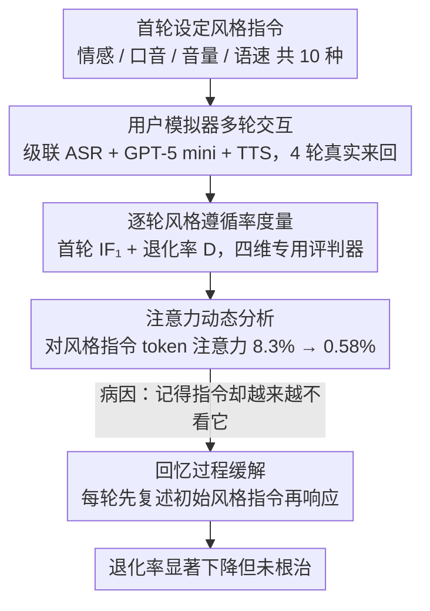

# Style Amnesia: Investigating Speaking Style Degradation and Mitigation in Multi-Turn Spoken Language Models

**会议**: ACL 2026 Findings  
**arXiv**: [2512.23578](https://arxiv.org/abs/2512.23578)  
**代码**: [GitHub](https://github.com/YuXiangLin1234/SLM-Style-Amnesia)  
**领域**: 语音语言模型  
**关键词**: 口语语言模型, 风格遗忘, 多轮对话, 说话风格, 指令遵循

## 一句话总结

发现口语语言模型（SLMs）在多轮对话中无法维持初始指定的说话风格（情感、口音、音量、语速），称之为"风格遗忘"现象，并通过注意力分析揭示其成因（注意力衰减），提出显式回忆过程作为缓解手段。

## 研究背景与动机

**领域现状**：口语语言模型（如GPT-4o、Gemini Live、Qwen2.5-Omni等）已能在单轮交互中遵循用户指定的说话风格（情感、口音、语速等），展现出令人印象深刻的表达能力。

**现有痛点**：现有研究几乎全部聚焦于单轮评估，对多轮对话中风格一致性的维持能力一无所知。然而在实际应用中，用户在对话开始时设定风格后，期望SLM在整个会话过程中始终保持该风格，不可能每轮都重复指令。

**核心矛盾**：SLMs在第一轮能较好地遵循风格指令，但随着对话轮次增加，风格遵循率急剧下降——模型并非"忘记"了指令（回忆测试表明模型能准确复述指令），而是"无法执行"已记住的指令。

**本文目标**：系统性地评估和分析SLMs在多轮对话中的风格维持能力，找出成因并探索缓解方法。

**切入角度**：构建端到端评估框架，使用用户模拟器进行真实交互式多轮对话，逐轮测量风格遵循率。

**核心idea**：风格遗忘的根本原因是注意力稀释——随着对话轮次增加，模型对风格指令token的注意力权重从~8%衰减到<0.6%，而非真正的记忆丢失。

## 方法详解

### 整体框架

本文不是提模型而是做诊断：搭一套端到端评估框架，把 SLM 在多轮对话里"风格越说越散"的现象量出来、找出病因、再试一招缓解。流程从对话开始时给定一条风格指令出发——情感（悲伤/快乐/愤怒/中性）、口音（北美/印度英语）、音量（高/低）、语速（快/慢）共 10 种；对话主题取自 Soda 数据集的 100 个多样开场白；交互则用级联 SLM（ASR + GPT-5 mini + TTS）当用户模拟器，与被评估模型做 4 轮真实来回。逐轮测量风格遵循率，配合注意力分析定位成因，最后用显式回忆过程检验能否止损。

### 关键设计

**1. 逐轮风格遵循率度量：把退化拆到每一轮看。** 聚合成一个全局分数会把"第几轮开始崩、怎么崩的"信息抹平，所以本文坚持逐轮统计。用首轮遵循率 $IF_1$ 刻画模型的基线能力，再用退化率 $D = \sum_{j=2}^{K} \frac{\max(IF_1(s) - IF_j(s), 0)}{K-1}$ 把第 2 轮到第 $K$ 轮相对首轮的掉幅平均起来，单独度量"越说越散"的程度。四种风格各配专用自动评判器——情感用 Emotion2vec-Large、口音用 Voxlect、音量用 LUFS、语速用 WPM，保证每一维的遵循判断都有可靠依据。

**2. 注意力动态分析：区分"忘了"还是"做不到"。** 风格散掉到底是模型记不住指令，还是记得却执行不出来？这决定了该用提示工程还是改架构，因此必须看进模型内部。本文在开源的 Step-Audio 2 mini 上提取生成响应时对风格指令 token 的平均注意力权重，结果是逐轮断崖式稀释：第 1 轮约 8.3%、第 2 轮约 1.6%、第 3 轮约 0.87%、第 4 轮约 0.58%，四轮内衰减约 14 倍，且这条曲线与 IF 率的退化高度吻合。这正面支持了"模型记得住指令（回忆测试近乎满分）却越来越不去看它"的判断，把病根锁定在注意力分配而非记忆丢失。

**3. 回忆过程：用显式提醒检验能否止损。** 既然问题出在模型不再关注指令，一个最朴素的对策就是每轮开口前先让它把初始风格指令复述一遍再处理用户输入。实验显示大部分模型确实能准确回忆（闭源模型回忆率近 100%），且这一步能明显压低退化率——GPT-4o mini 的悲伤风格退化率从 65.3% 降到 30.3%。值得一提的是，不同模型实现风格的手段并不相同：语义和声学会同步遗忘（情感风格下文本内容和声音表达一起退化），而"说得快"上 Gemini Live 靠减少字数、GPT-4o 靠声学加速，但随轮次推进，快/慢条件的 WPM 差异都在持续缩小，说明回忆只是缓解而非根治。

## 实验关键数据

### 主实验

| 模型 | 风格 | IF₁(首轮) | 退化率D |
|------|------|----------|---------|
| GPT-4o mini | 悲伤 | ~85% | 65.3% |
| GPT-4o mini | 印度口音 | ~75% | 49.7% |
| GPT-4o | 悲伤 | ~95% | 26.7% |
| Gemini Live | 悲伤 | ~85% | 21.3% |
| Step-Audio 2 mini | 悲伤 | ~70% | 14.0% |
| 级联基线(TTS) | 所有情感 | ~95% | <3.0% |

### 消融实验

| 配置 | 关键指标 | 说明 |
|------|---------|------|
| 指令在系统消息 | IF₁下降30-80% | 系统消息反而更难遵循 |
| 指令在用户消息 | IF₁较高 | 默认设置效果更好 |
| +回忆过程 | D降低3-35% | GPT-4o mini 获益最大 |
| 注意力权重 | 8.3%→0.58% | 4轮内衰减14倍 |

### 关键发现
- 所有5个评估模型（3个闭源+2个开源）均出现风格遗忘，无一例外
- 模型"记得"指令但"做不到"——回忆率近100%但IF率持续下降
- 系统消息悖论：系统消息设计用于全局持久指令，但SLMs对系统消息中的风格指令遵循更差
- 默认风格偏差：模型倾向于回退到"快乐/中性"情感和"北美"口音等默认风格
- 级联基线（每轮给TTS提供风格指令）几乎不退化，证明问题出在端到端SLM的架构上

## 亮点与洞察
- **发现了一个重要且此前未被注意的问题**：风格遗忘是SLMs实用化的关键障碍
- **区分"记忆"和"执行"**：通过回忆测试精确定位问题不在记忆而在注意力分配，为解决方案指明方向
- **评估框架完善**：使用模拟器进行真实交互+4种专用评判器+人工验证，评估可靠性高
- **系统消息悖论的发现很有价值**：揭示了SLMs架构设计中的深层问题

## 局限与展望
- **风格种类有限**：仅覆盖4类副语言属性，未涉及语调变化、角色扮演等更复杂风格
- **未组合多种风格**：现有模型连单一风格都维持不了，多风格组合留待未来
- **开源模型注意力分析受限**：仅分析了Step-Audio 2 mini一个开源模型
- 未来方向：风格锚定注意力机制、风格嵌入的持久化表示、多风格组合遵循

## 相关工作与启发
- **vs Multi-Bench**：同样评估多轮SLM，但仅聚合全局分数；本文提供逐轮分析
- **vs VocalBench/VoxDialogue**：使用预定义对话而非真实交互，无法进行逐轮分析
- **vs 文本LLM多轮退化研究**：文本领域已发现类似的多轮性能退化，本文扩展到语音域的副语言特征

## 评分
- 新颖性: ⭐⭐⭐⭐⭐ 首次系统性揭示SLM风格遗忘现象，发现"记得但做不到"的关键洞察
- 实验充分度: ⭐⭐⭐⭐ 覆盖5个模型、10种风格、1000组对话，有注意力分析和缓解实验
- 写作质量: ⭐⭐⭐⭐⭐ 问题定义清晰，实验层层递进，图表直观
- 价值: ⭐⭐⭐⭐⭐ 指出SLMs实用化的关键障碍，对模型设计和训练有明确指导意义

<!-- RELATED:START -->

## 相关论文

- [\[ACL 2026\] SpeakerSleuth: Can Large Audio-Language Models Judge Speaker Consistency across Multi-turn Dialogues?](speakersleuth_can_large_audio-language_models_judge_speaker_consistency_across_m.md)
- [\[ICLR 2026\] When Style Breaks Safety: Defending LLMs Against Superficial Style Alignment](../../ICLR2026/audio_speech/when_style_breaks_safety_defending_llms_against_superficial_style_alignment.md)
- [\[ACL 2026\] ReStyle-TTS: Relative and Continuous Style Control for Zero-Shot Speech Synthesis](restyle-tts_relative_and_continuous_style_control_for_zero-shot_speech_synthesis.md)
- [\[ACL 2026\] FC-TTS: Style and Timbre Control in Zero-Shot Text-to-Speech with Disentangled Speech Representations](fc-tts_style_and_timbre_control_in_zero-shot_text-to-speech_with_disentangled_sp.md)
- [\[ACL 2026\] MTR-DuplexBench: Towards a Comprehensive Evaluation of Multi-Round Conversations for Full-Duplex Speech Language Models](mtr-duplexbench_towards_a_comprehensive_evaluation_of_multi-round_conversations_.md)

<!-- RELATED:END -->
