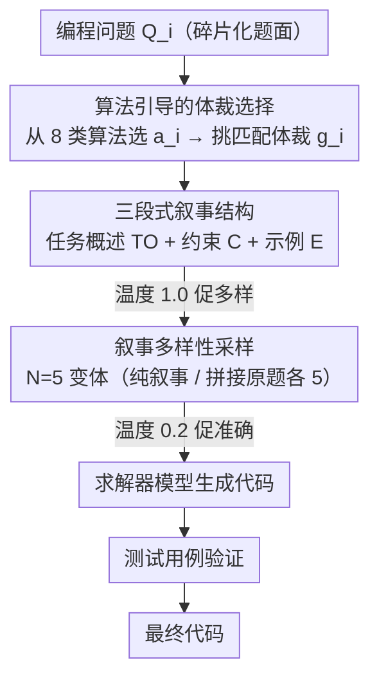

# StoryCoder: Narrative Reformulation for Structured Reasoning in LLM Code Generation

**会议**: ACL 2026  
**arXiv**: [2604.14631](https://arxiv.org/abs/2604.14631)  
**代码**: 有  
**领域**: 代码智能  
**关键词**: 叙事重构, 代码生成, 提示工程, 结构化推理, 算法选择

## 一句话总结

本文提出 StoryCoder，一种将代码生成问题重构为连贯自然语言叙事的提示框架，通过任务概述、约束条件和示例三个叙事组件引导 LLM 进行结构化推理，在 11 个模型上平均提升零样本 pass@10 达 18.7%。

## 研究背景与动机

**领域现状**：代码生成的性能不仅取决于模型能力，还取决于问题表示方式。现有方法主要通过增加推理步骤（CoT、SCoT）或重复采样来提升性能，但都没有改变问题描述本身——碎片化的、指令式的问题条件保持原样。

**现有痛点**：编程任务描述通常不完整或模糊，要求求解者从上下文推断缺失细节。CoT 引入推理步骤但不改变输入表示；重复采样扩展输出但不改进理解；SCoT 虽然引入程序结构，但这些方法都没有解决问题表述碎片化的根本问题。

**核心矛盾**：认知科学研究表明，人类在将碎片化条件组织成连贯心智模型时，理解和推理更有效。但 LLM 直接面对碎片化的问题描述，难以形成统一的问题表示，导致推理路径混乱。

**本文目标**：设计一种叙事重构框架，将代码问题转化为连贯的自然语言描述，提供比简单改写更丰富的上下文结构。

**切入角度**：受认知科学中类比推理和心智模型理论启发——人类通过将信息组织成连贯结构来更好地推理。将编程问题转化为"故事"，让模型在更自然的语言结构中理解和解决问题。

**核心 idea**：让模型先选择合适的算法类别和叙事体裁，然后将编程问题重构为包含任务概述、约束和示例的三段式叙事，用这种结构化的自然语言表示替代原始碎片化描述来引导代码生成。

## 方法详解

### 整体框架

StoryCoder 是一个纯推理时的提示框架，核心动作是在写代码之前先把碎片化的题面改写成一段连贯的自然语言"故事"。给定编程问题 $Q_i$，模型先识别其算法类别 $a_i$（从 8 个预定义类别中选）并挑一个匹配的叙事体裁（genre）$g_i$，据此把问题重构为结构化叙事 $\mathcal{N}_i$（含任务概述、约束、示例三段）；同一题生成 $N=5$ 种叙事变体以覆盖不同理解视角，最后把叙事交给求解器模型生成代码并用测试用例验证。

### 关键设计

**1. 算法引导的体裁选择：让叙事与问题的算法本质对齐**

如果体裁和问题的算法骨架对不上，反而会误导模型，实验里用不匹配的体裁会让性能显著下滑。所以重构开始前，模型先从 8 个预定义算法类别（排序、搜索、动态规划等）里判断最贴切的一类，再自由选一个与该算法和问题都契合的叙事体裁。不同叙事变体可以落在不同的算法判断和体裁组合上，从而给出多角度的问题表征；而恰当的体裁反过来也帮模型从碎片化描述里更早推断出正确的算法策略。

**2. 三段式叙事结构：把分散的题面条件整合成连贯的问题表征**

编程题面常常碎片化、不完整，要求解者自己从上下文推断缺失细节，而 CoT 只在这之上加推理步骤、并没改输入本身。选定体裁后，StoryCoder 把问题改写成 $\mathcal{N}_i = \{\text{TO}_i, \text{C}_i, \text{E}_i\}$ 三段：任务概述（TO）在叙事框架里呈现编码目标，把散落条件拼成一个连贯系统；约束（C）把输入范围、时间限制、规则重述为故事里的自然限制；示例（E）把测试用例嵌进上下文场景而非简单追加。这一设计直接对应心智模型理论——有效推理需要在动笔前先形成完整连贯的问题表征，三段结构保证原题所有关键信息都不丢。

**3. 叙事多样性采样：用多个叙事变体在输入端扩大解空间**

每道题生成 $N$ 种叙事变体，每种可能有不同的算法判断、体裁选择和展开方式；实验中聚合 5 个纯叙事变体和 5 个"叙事+原始题面"拼接变体，共 10 个响应。这与简单重复采样有本质区别——重复采样只在输出端换随机种子，而这里每个变体改变的是输入表征本身，因此能更有效地探索解空间。配套的温度设置也分工明确：叙事生成用温度 1.0 鼓励多样性，代码生成用温度 0.2 鼓励准确性。

## 实验关键数据

### 主实验（pass@10，开源模型平均）

| 方法 | HumanEval | LiveCodeBench | CodeForces |
|------|-----------|---------------|------------|
| 重复采样 (RS) | 81.31 | 26.36 | 18.96 |
| CoT | 82.26 | 27.57 | 19.32 |
| SCoT | 82.60 | 26.93 | 19.26 |
| **StoryCoder** | **89.76** | **32.22** | **28.58** |

闭源模型代表（pass@10）：

| 模型 | 方法 | LiveCodeBench | CodeForces |
|------|------|---------------|------------|
| Claude-3.5-Haiku | RS | 33.71 | 47.17 |
| Claude-3.5-Haiku | **Narr.** | **38.29** | **50.95** |
| Gemini-2.5-Flash | RS | 53.14 | 60.00 |
| Gemini-2.5-Flash | **Narr.** | **57.14** | **67.55** |

### 消融实验

| 分析维度 | 发现 |
|---------|------|
| 算法选择正确率 | StoryCoder 使模型更容易选择正确算法（+显著提升） |
| 实现错误率 | 叙事重构减少了实现错误 |
| 代码结构 | 叙事引导产生更模块化的代码结构 |
| 体裁不匹配 | 使用不匹配体裁导致性能显著下降 |

### 关键发现
- 叙事重构在所有 11 个模型和 3 个基准上一致优于所有基线，平均 pass@10 提升 18.7%
- 在困难基准（CodeForces）上提升尤为显著，开源模型平均从 18.96% 提升到 28.58%（+50.7% 相对提升）
- 叙事不仅提升了准确率，还引导模型选择正确的算法策略、减少实现错误、产生更模块化的代码
- 叙事生成质量与模型的指令遵循能力相关——Gemma-2 27B 的有效叙事率 96%，而 Llama-3.1 8B 仅 36.7%

## 亮点与洞察
- **"改变问题表示而非改变推理过程"**的思路非常新颖：不像 CoT 增加推理步骤，而是通过重构输入来改善理解。这与认知科学中心智模型理论的联系很有说服力
- **三段式叙事设计**兼顾了叙事连贯性和计算严格性，特别是将约束和测试用例嵌入叙事而非简单追加，保证了信息的有机整合
- **跨模型设置的发现**很有实践价值：可以用指令遵循能力强的模型生成叙事，由代码能力强的模型生成代码，实现互补

## 局限与展望
- 叙事生成本身消耗额外 token 和推理时间（虽然作者认为是"免费"的，但实际上叙事生成有开销）
- 叙事质量高度依赖生成模型的指令遵循能力，小模型（如 Llama-3.1 8B）的有效叙事率很低
- 8个预定义算法类别可能不够覆盖所有编程问题类型
- 叙事重构对数学证明、系统设计等非算法类编程任务的效果未知
- 未探索叙事与其他推理增强方法（如 self-consistency、反思）的组合

## 相关工作与启发
- **vs CoT/SCoT**: CoT 增加推理步骤但不改变输入表示，SCoT 引入代码结构但仍基于原始问题描述。StoryCoder 从输入端改善问题理解，与这些方法正交且可组合
- **vs 重复采样**: 重复采样在输出端增加多样性，StoryCoder 在输入端通过不同叙事变体增加多样性，后者更有效地探索解空间

## 评分
- 新颖性: ⭐⭐⭐⭐ 叙事重构的想法非常新颖且有认知科学基础
- 实验充分度: ⭐⭐⭐⭐⭐ 11个模型、3个基准、丰富的分析（算法选择、错误类型、代码结构）
- 写作质量: ⭐⭐⭐⭐ 动机和方法阐述清晰，认知科学关联有说服力
- 价值: ⭐⭐⭐⭐ 提供了提升代码生成的新维度，实际效果显著

<!-- RELATED:START -->

## 相关论文

- [\[ACL 2026\] ReCode: Reinforcing Code Generation with Reasoning-Process Rewards](recode_reinforcing_code_generation_with_reasoning-process_rewards.md)
- [\[ACL 2026\] SolidCoder: Bridging the Mental-Reality Gap in LLM Code Generation through Concrete Execution](solidcoder_bridging_the_mental-reality_gap_in_llm_code_generation_through_concre.md)
- [\[ACL 2025\] Tree-of-Code: A Tree-Structured Exploring Framework for End-to-End Code Generation](../../ACL2025/code_intelligence/tree-of-code_a_tree-structured_exploring_framework_for_end-to-end_code_generatio.md)
- [\[ICLR 2026\] Breaking the SFT Plateau: Multimodal Structured Reinforcement Learning for Chart-to-Code Generation](../../ICLR2026/code_intelligence/breaking_the_sft_plateau_multimodal_structured_reinforcement_learning_for_chart-.md)
- [\[NeurIPS 2025\] CodeCrash: Exposing LLM Fragility to Misleading Natural Language in Code Reasoning](../../NeurIPS2025/code_intelligence/codecrash_exposing_llm_fragility_to_misleading_natural_language_in_code_reasonin.md)

<!-- RELATED:END -->
