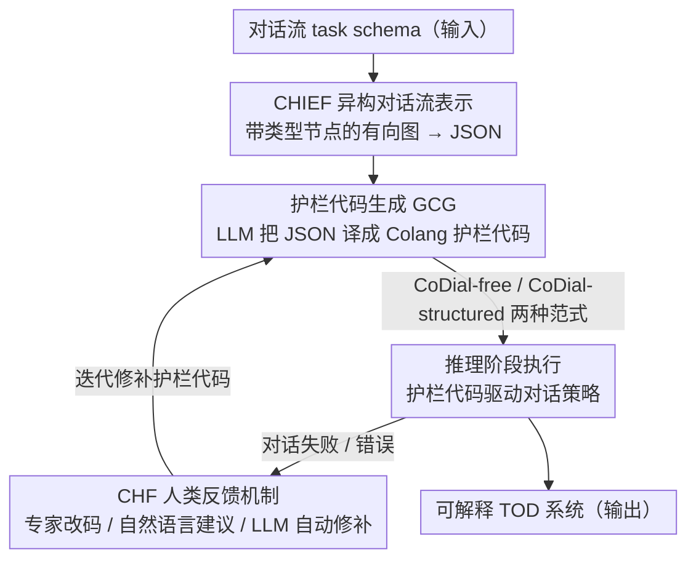

# CoDial: Interpretable Task-Oriented Dialogue Systems Through Dialogue Flow Alignment

**会议**: ACL 2026  
**arXiv**: [2506.02264](https://arxiv.org/abs/2506.02264)  
**代码**: [https://github.com/radinshayanfar/CoDial](https://github.com/radinshayanfar/CoDial)  
**领域**: 图像生成  
**关键词**: 任务型对话, LLM护栏, 可解释性, 对话流对齐, 零样本泛化

## 一句话总结

本文提出 CoDial，一个将预定义的对话流（task schema）转换为结构化异构图再自动生成 LLM 护栏代码（如 Colang）的框架，在推理阶段实现可解释且可控的任务型对话策略，在 STAR 基准上达到 SOTA，且无需训练数据。

## 研究背景与动机

**领域现状**：任务型对话（TOD）系统需要在不同任务间泛化。数据驱动方法难以迁移到未见过的任务；基于 schema 的方法通过解耦语言理解和任务逻辑来提升泛化能力，但依赖神经或生成模型进行 schema 解析，缺乏可解释性。

**现有痛点**：(1) 基于神经网络的 schema 方法不透明，用户无法理解 schema 如何影响对话行为；(2) AnyTOD 等方法虽通过程序化实现可解释性，但要求用户具备编程能力手动编写策略程序，增加了技术门槛；(3) 可解释性在法律、医疗等高风险领域尤为关键。

**核心矛盾**：现有 TOD 系统在泛化能力和可解释性之间难以兼得——神经方法有泛化能力但不可解释，程序化方法可解释但需要编程技能。

**本文目标**：设计一个无需训练数据或手动编程的 TOD 框架，自动将对话流转换为可执行的 LLM 护栏程序，在推理阶段提供可解释、可控的对话行为。

**切入角度**：将 LLM 护栏（guardrails）重新定位为定义 TOD 系统行为的基础，利用 LLM 代码生成能力自动将对话流转换为护栏代码。

**核心 idea**：对话流 → 异构图（CHIEF）→ 护栏代码（Colang）→ 可执行 TOD 系统，整个流程自动化且天然可解释。

## 方法详解

### 整体框架

CoDial 把"写一个任务型对话系统"重新拆成"把对话流编译成可执行护栏程序"，整条流水线无需训练数据也无需人工编程。输入是一份预定义的对话流（task schema）：先由 CHIEF 表示成结构化的异构有向图（区分请求/外部动作/告知/确认/全局/回退等节点类型），编码为 JSON；再交给 GCG 用 LLM 把这份 JSON 自动翻译成 Colang 护栏代码，推理阶段直接执行该代码来驱动对话策略；运行中暴露的错误则通过 CHF 反馈机制（人工或 LLM 给建议）迭代修补护栏代码。整个过程天然可解释——每个对话决策都能追溯到一段具体的护栏逻辑。

### 关键设计

**1. CHIEF 异构对话流表示：用带类型的图把丰富任务逻辑结构化**

先前工作多用同构图，所有节点同质，表达不了"这一步是要追踪槽位还是调外部 API"这类区别。CHIEF 改用异构有向图，给节点分配不同类型——Request 定义需追踪的槽位、External Action 调用外部函数、Inform/Confirm 负责提供信息与确认、Global/Fallback 处理全局动作和兜底——并用带条件的边把它们串成对话流，整体编码为 JSON。带类型的节点和元数据让 schema 既能表达复杂任务逻辑，又恰好契合 LLM 擅长读 JSON 的输入习惯，为下一步代码生成铺平了路。

**2. 护栏代码生成的两种范式（CoDial_free / CoDial_structured）：从自由生成到结构约束**

GCG 要把 CHIEF 的 JSON 翻成可执行的 Colang 护栏。CoDial_free 只给 LLM 一份 Colang 语法文档，让它自由设计护栏逻辑，作为验证"自动代码生成是否可行"的可解释基线；CoDial_structured 则显式指导 LLM 如何建模对话状态、如何实现 DST（对话状态追踪）和 NAP（下一动作预测），产出结构化的护栏代码。两者的对比本身就是一个消融——实验显示显式结构约束让代码质量和可靠性明显高于自由生成，CoDial_structured 才是拿下 SOTA 的版本。

**3. CoDial 人类反馈机制（CHF）：让生成的护栏可被迭代修补**

一次生成的护栏代码可能有错或有遗漏，CHF 提供三种由重到轻的反馈模式：(a) 人类专家直接改代码，效果最好但要求编程能力；(b) 人类用自然语言提修改建议、由 LLM 落地执行，降低技术门槛；(c) LLM 自动分析对话失败原因并生成修改建议（LLM-aided feedback），完全自动化。实验里仅 1–2 轮反馈就能显著抬升对话成功率，说明这套迭代回路是把"零样本生成"补全到"可用系统"的关键一环。

### 损失函数 / 训练策略

CoDial 是零样本、无训练的框架，所有对话策略都在推理阶段由护栏代码执行，不做任何梯度更新。核心算力来自两处 LLM 调用：把 CHIEF JSON 编译成 Colang 护栏代码，以及运行时基于护栏的对话推理。

## 实验关键数据

### 主实验

**STAR 基准上的性能（Task Success Rate %）**

| 方法 | 训练需求 | 可解释性 | 成功率 |
|------|---------|---------|--------|
| SGD-LLM | 需要训练 | 否 | 较低 |
| AnyTOD | 需要训练+手动编程 | 是 | 中等 |
| CoDialfree | 零样本 | 是 | 竞争力 |
| CoDialstructured | 零样本 | 是 | **SOTA** |
| CoDialstructured + CHF | 零样本+反馈 | 是 | **进一步提升** |

### 消融实验

| 反馈策略 | 效果 | 说明 |
|----------|------|------|
| 无反馈 | 基线 | 单次生成 |
| 人类直接修改 | 最优 | 需要编程技能 |
| 人类+LLM执行 | 接近最优 | 降低技术门槛 |
| LLM-aided反馈 | 显著提升 | 完全自动化 |

### 关键发现

- CoDialstructured 在 STAR 上达到 SOTA，在 MultiWOZ 上与 SOTA 持平，且完全零样本
- 结构化代码生成范式显著优于自由生成范式，说明显式结构约束对代码质量至关重要
- 仅 1-2 轮反馈即可显著提升对话成功率
- 用户研究证实 CoDial 生成的代码比神经方法更易理解和修改

## 亮点与洞察

- 将 LLM 护栏从安全领域重新定位为 TOD 行为定义的通用基础，视角独特
- 异构图表示比同构图更具表达力，且 JSON 编码自然适配 LLM 输入
- 零样本+可解释的组合在实际部署中价值极高——无需标注数据，且每个决策可追溯到代码逻辑

## 局限与展望

- 依赖 Colang 护栏语言，LLM 对该语言的熟悉度有限，可能影响代码质量
- CoDialstructured 的提示词较长且复杂，增加了 token 消耗
- 仅在英文数据集上评估，多语言场景的效果待验证
- 外部动作（API 调用）的模拟可能与真实环境存在差异

## 相关工作与启发

- **vs AnyTOD**: AnyTOD 需要手动编程和训练，CoDial 自动生成代码且零样本
- **vs SGD-LLM**: 基于神经 schema 的方法不可解释，CoDial 天然可解释
- **vs NeMo Guardrails**: CoDial 首次将护栏从安全约束扩展为 TOD 行为定义的通用框架

## 评分

- 新颖性: ⭐⭐⭐⭐⭐ 首次将 TOD 系统建模为自动生成的 LLM 护栏程序
- 实验充分度: ⭐⭐⭐⭐ 两个基准、多种反馈策略、用户研究，但基准数量有限
- 写作质量: ⭐⭐⭐⭐ 框架描述清晰，算法伪代码详细
- 价值: ⭐⭐⭐⭐ 为可解释 TOD 系统提供了实用的零样本框架

<!-- RELATED:START -->

## 相关论文

- [\[ACL 2026\] Template-assisted Contrastive Learning of Task-oriented Dialogue Sentence Embeddings](template-assisted_contrastive_learning_of_task-oriented_dialogue_sentence_embedd.md)
- [\[ACL 2025\] Know Your Mistakes: Towards Preventing Overreliance on Task-Oriented Conversational AI Through Accountability Modeling](../../ACL2025/dialogue/know_your_mistakes_towards_preventing_overreliance_on_task-oriented_conversation.md)
- [\[ACL 2026\] ETHICMIND: A Risk-Aware Framework for Ethical-Emotional Alignment in Multi-Turn Dialogue](ethicmind_a_risk-aware_framework_for_ethical-emotional_alignment_in_multi-turn_d.md)
- [\[ACL 2026\] STRIDE-ED: A Strategy-Grounded Stepwise Reasoning Framework for Empathetic Dialogue Systems](stride-ed_a_strategy-grounded_stepwise_reasoning_framework_for_empathetic_dialog.md)
- [\[ACL 2025\] Enhancing Goal-oriented Proactive Dialogue Systems via Consistency Reflection and Correction](../../ACL2025/dialogue/enhancing_goal-oriented_proactive_dialogue_systems_via_consistency_reflection_an.md)

<!-- RELATED:END -->
