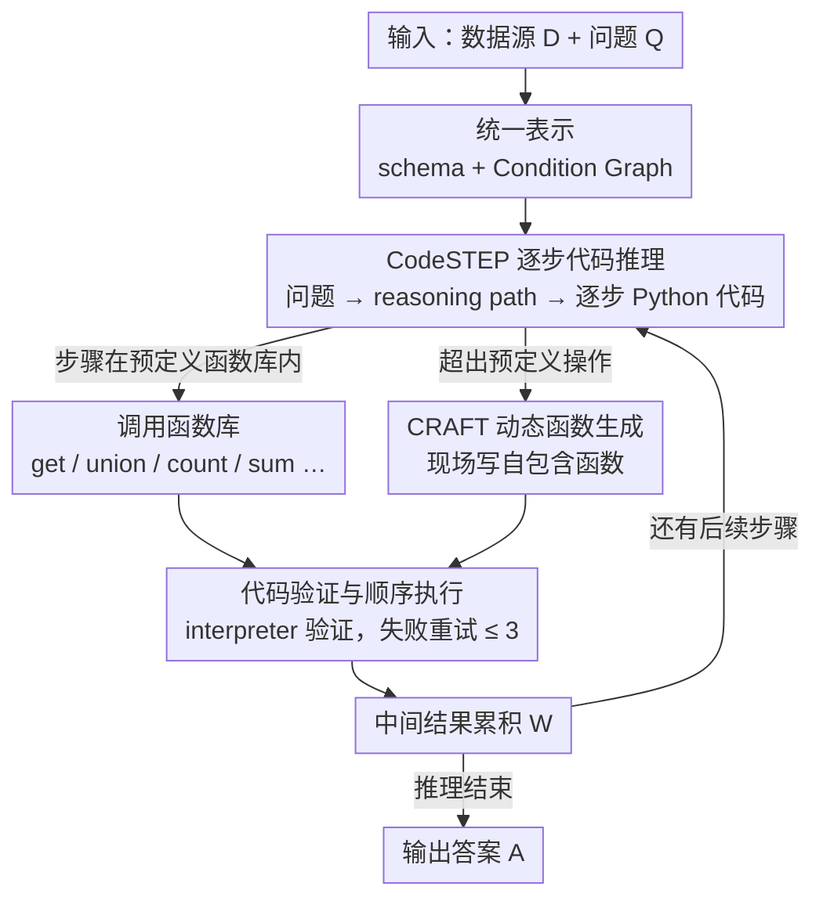

# CRAFTQA: A Code-Driven Adaptive Framework for Complex Structured Data Reasoning

**会议**: ACL2026 Findings  
**arXiv**: [2606.02170](https://arxiv.org/abs/2606.02170)  
**代码**: 未说明  
**领域**: 结构化数据推理 / 知识图谱问答  
**关键词**: 结构化数据问答, 代码推理, 动态函数生成, 表格问答, 知识图谱推理  

## 一句话总结
CRAFTQA 用 CodeSTEP 生成可执行的逐步 Python 推理代码，并在预定义操作不够时由 CRAFT 动态生成自定义函数，从而显著提升表格、知识图谱和时序知识图谱上的复杂结构化数据问答能力，GPT-4o 版本在复杂推理 Overall 上达到 76.6%。

## 研究背景与动机
**领域现状**：结构化数据问答需要模型根据自然语言问题访问表格、知识图谱或时序知识图谱，并输出可验证答案。近年来 unified structured data QA 方法尝试用一个框架处理多种数据类型，例如 StructGPT、Readi 和 TrustUQA。

**现有痛点**：统一框架通常依赖固定函数集合，例如查询、集合运算、计数、求和、最大最小值等。一旦问题需要超出预定义函数的复杂操作，系统就会受限，难以完成多步数值推理、复杂条件组合或定制化计算。

**核心矛盾**：固定函数集保证可控和可解释，但限制了推理表达力；直接让 LLM 生成自由文本答案更灵活，却难以验证和执行。复杂结构化数据问答需要同时具备“可执行性”和“动态扩展能力”。

**本文目标**：作者希望构建一个统一框架，在不同结构化数据类型上都能用代码执行完成推理，同时在遇到 out-of-predefined 操作时自动生成专用函数。

**切入角度**：论文把推理分成两个层次：CodeSTEP 负责主干的逐步代码推理，CRAFT 负责在执行过程中为超出函数库的步骤动态生成 custom function，并把结果返回主执行流。

**核心 idea**：让 LLM 不只是调用固定工具，而是在需要新工具时现场写一个可执行、可验证的函数，再继续结构化推理。

## 方法详解
CRAFTQA 想解决的是「统一结构化数据问答被固定函数集卡死」的问题：表格、知识图谱、时序知识图谱都能用一套框架访问，但只要某一步推理超出预定义算子（自定义排序、组合条件、特殊格式转换……），系统就无能为力。它的办法是把推理彻底落到可执行代码上，并在代码写不出来的那一步现场生成一个新函数。

### 整体框架
输入是数据源 $\mathcal{D}$ 和问题 $\mathcal{Q}$。系统先把异构数据统一成 schema $\mathcal{D}_{schema}$ 和 Condition Graph $\mathcal{D}_{cg}$，让表格、KG、TKG 都能用同一套图查询接口访问。随后 LLM 在 few-shot prompt 下把问题翻译成一段逐步的 Python 代码序列 $\mathcal{C}=\{c_i\}_{i=1}^n$，执行器顺序跑这些代码、累积中间结果，最后得到答案 $\mathcal{A}$。形式化地写就是 $\mathcal{M}_{\theta}(\mathcal{D}_{schema}, \mathcal{Q}, \mathcal{P}) \rightarrow \mathcal{C}$ 再 $\textsc{Exec}(\mathcal{C}, \mathcal{D}_{cg}) \rightarrow \mathcal{A}$。关键在于这段代码不必全用预定义函数：常规步骤调函数库，遇到库里没有的操作就调一个「请帮我写个函数」的接口，由 CRAFT 模块补上。

### 关键设计

**1. CodeSTEP 逐步代码推理：把推理和计算解耦成可执行、可检查的代码**

直接让 LLM 自由生成文本答案，在多跳数值、复杂条件这类问题上很容易算错又无法验证。CodeSTEP 的做法是先让模型写出自然语言 reasoning path，再逐步把每一步翻译成对应代码：基础查询函数 $get$ 从 Condition Graph 中按 relation、head/tail entity、比较符和属性条件检索实体，集合与数值算子则覆盖 union、intersection、difference、min、max、mean、count、sum 这些常规操作。把推理过程外化成代码后，每一步的计算都可执行、可复查，模型在数值和多跳操作上的自由发挥被代码语义约束住，错误率自然下降。

**2. CRAFT 动态函数生成：在预定义函数集表达不了的那一步，现场写一个新函数**

固定函数集的天花板很明显——一旦问题需要 out-of-predefined 操作，CodeSTEP 就写不出合法代码。CRAFT 的处理方式是：当某步无法用 $\mathcal{F}_{pred}$ 实现时，CodeSTEP 不会硬凑，而是生成一个占位调用 $f_{craft}(\mathcal{T}_i, W_i, F_{exp,i})$，把当前任务描述 $\mathcal{T}_i$、历史中间结果 $W_i$、期望函数签名 $F_{exp,i}$ 一起交给 CRAFT；CRAFT 再结合原问题和完整代码序列，生成一个自包含函数 $\hat{f}_i$，执行后把结果 $w_i$ 返回主执行流。这等于把「扩充工具库」这件离线的事变成了在线、按需的代码生成，比预先穷举所有可能算子灵活得多，也正是 CRAFTQA 在复杂场景上拉开差距的来源。

**3. 代码验证与顺序执行：用执行前验证 + 有限重试挡住语法/运行错误**

代码驱动方法最大的风险是生成的代码根本跑不起来。所以无论是 CodeSTEP 的主代码还是 CRAFT 临时生成的自定义函数，都先送进 Python interpreter 做一次 executability verification，验证失败就用相同输入重试，最多重试 $T=3$ 次。通过验证的代码再按顺序执行，每步产物并入中间结果集合 $W_{i+1}=W_i \cup \{w_i\}$，供后续步骤引用。这道关卡把一部分语法和运行错误挡在答案生成之前，让整条代码链更稳。

### 一个完整示例
以一个 WikiSQL-E 上需要自定义计算的问题为例：CodeSTEP 先写出 reasoning path，前几步用 $get$ 从 Condition Graph 取出候选行、再用 count/sum 做常规聚合，这些都落在预定义函数里、直接执行并把结果存进 $W$。走到「按某种自定义规则排序再取条件值」这一步时，函数库里没有现成算子，CodeSTEP 于是生成 $f_{craft}$ 调用，把任务描述「按 X 规则排序后返回满足 Y 的项」、当前中间结果和期望签名交给 CRAFT；CRAFT 写出一个自包含排序函数，先过 interpreter 验证（若报错则在 3 次内重试），验证通过后执行、结果回填 $W$。主执行流拿到这个值继续后续步骤，最终输出可验证答案。整条链里只有真正卡住的那一步走了动态生成，其余仍是统一、可控的库函数执行。

### 损失函数 / 训练策略
CRAFTQA 不是训练模型，而是一个推理框架。实验中使用不同 LLM 作为推理引擎，包括 GPT、LLaMA、DeepSeek、Gemini 和 Qwen 系列。推理策略包括 5-sample self-consistency、最大重试 $T=3$、以及 Sentence-BERT 语义实体对齐，用于把代码中的实体名映射到 Condition Graph 中的候选实体。

## 实验关键数据

### 主实验
| 方法 | Backbone | TableBench-FC DA | TableBench-NR DA | WikiSQL-E DA | Overall |
|------|----------|------------------|------------------|--------------|---------|
| PoT | GPT-4o | 51.0 | 43.7 | 27.4 | 32.6 |
| StructGPT | GPT-4o | 63.5 | 42.2 | 43.5 | 44.3 |
| Readi | GPT-4o | 62.5 | 49.5 | 51.3 | 51.5 |
| TrustUQA | GPT-4o | 62.5 | 29.6 | 80.1 | 67.2 |
| CRAFTQA | Qwen2.5-7B | 57.9 | 35.4 | 65.9 | 58.3 |
| CRAFTQA | LLaMA-3.1-8B | 57.3 | 31.1 | 76.0 | 64.4 |
| CRAFTQA | GPT-4o-mini | 64.6 | 40.7 | 79.0 | 69.2 |
| CRAFTQA | GPT-4o | 68.8 | 51.3 | 85.6 | 76.6 |

在同一 GPT-4o backbone 下，CRAFTQA 的 Overall 76.6 明显高于 TrustUQA 的 67.2、Readi 的 51.5 和 StructGPT 的 44.3。更有意思的是，CRAFTQA-LLaMA-3.1-8B 的 Overall 64.4 已超过多个使用 GPT-4o 的传统 baseline。

### 消融实验
| 配置 | FC DA/F1 | NR DA/F1 | WikiSQL-E DA/F1 | 说明 |
|------|----------|----------|-----------------|------|
| CRAFTQA | 68.8 / 71.6 | 51.3 / 51.9 | 87.3 / 87.6 | 完整框架 |
| w/o CRAFT | 65.3 / 67.7 | 45.9 / 46.3 | 84.5 / 84.6 | 去掉动态自定义函数 |
| w/o CRAFT & CodeSTEP | 59.4 / 63.2 | 18.4 / 19.7 | 79.8 / 80.0 | 去掉代码推理主干 |

### 关键发现
- CRAFT 对复杂数值推理贡献很大。Numerical Reasoning DA 从完整模型 51.3 降到 w/o CRAFT 的 45.9，再降到无代码主干的 18.4。
- Out-of-predefined 场景是 CRAFTQA 的主要优势来源。WikiSQL-E 上 GPT-4.1 的 Calling Denotation Accuracy 为 53.57%，而 TrustUQA 只有 6.98%。
- Numerical Reasoning 上 GPT-4.1 版本 CRAFTQA 的 DA 为 56.06%，TrustUQA 为 29.29%，提升 26.77 个百分点。
- 标准推理任务上 CRAFTQA 没有牺牲基本能力：WebQSP Hit@1 为 85.20，WikiSQL DA 为 86.10，CronQuestions Hit@1 为 97.10；其中前两项略高于 TrustUQA，CronQuestions 与 TrustUQA 的 97.20 接近。
- 框架会随 backbone 能力提升而变强。Fact Checking DA 从 GPT-3.5 的 61.5 提升到 GPT-4o 的 68.8，再到 o4-mini 的 83.3。

## 亮点与洞察
- 这篇论文的关键洞察是“工具集合不必预先封死”。在结构化数据 QA 中，固定函数集可控但僵硬，CRAFT 用动态代码生成把工具空间打开了。
- CodeSTEP 和 CRAFT 的分工很清楚。主干步骤保持统一执行逻辑，特殊步骤才委托给动态函数，避免每个问题都自由生成一整段不可控代码。
- Calling Denotation Accuracy 是一个很有用的诊断指标。它把“真的调用了 out-of-predefined 函数的问题”单独拿出来评价，能直接检验 CRAFT 模块有没有解决目标痛点。
- 小模型结果很有启发。好的推理框架可以让 7B/8B 模型在复杂结构化推理上逼近甚至超过更大闭源模型加旧框架。

## 局限与展望
- 在简单标准推理任务上增益较小。因为这些任务很少需要 out-of-predefined 操作，CRAFT 的动态函数能力没有太多发挥空间。
- 框架依赖 backbone 的代码生成能力。对编程能力较弱的 LLM，动态函数生成和主代码序列都可能失败或产生低质量代码。
- 代码执行带来安全和沙箱需求。论文主要讨论可执行性验证，但实际部署时还需要限制文件系统、网络和资源访问。
- 未来可以扩展到更多数据形式，例如半结构化文档、图数据库和多表关系数据库，并加入更强的静态分析或单元测试式代码验证。

## 相关工作与启发
- **vs PoT / PAL**: PoT/PAL 证明代码能提升数值推理，但多面向通用数学或文本问题；CRAFTQA 把代码推理接入统一结构化数据访问。
- **vs StructGPT / Readi**: 这些方法通过迭代读取或路径编辑访问结构化数据，表达力受操作设计限制；CRAFTQA 在需要新操作时能生成函数。
- **vs TrustUQA**: TrustUQA 的 Condition Graph 和统一查询很强，但仍依赖固定函数；CRAFTQA 延续统一表示，同时补上动态操作能力。
- **对后续系统的启发**: 结构化数据 agent 不一定要把所有工具预定义完，可以提供一个受控的动态工具生成接口，并用执行验证保证基本可靠性。

## 评分
- 新颖性: ⭐⭐⭐⭐ 动态自定义函数与结构化数据 QA 结合得自然，问题抓得准。
- 实验充分度: ⭐⭐⭐⭐ 覆盖复杂、标准、out-of-predefined、跨 backbone 和消融实验，证据较完整。
- 写作质量: ⭐⭐⭐⭐ 方法形式化清楚，实验组织按 RQ 展开；代码安全和运行环境讨论略少。
- 价值: ⭐⭐⭐⭐ 对表格/知识图谱问答、企业数据 agent 和复杂结构化推理都很有实践启发。

<!-- RELATED:START -->

## 相关论文

- [\[AAAI 2026\] Self-Correction Distillation for Structured Data Question Answering](../../AAAI2026/graph_learning/self-correction_distillation_for_structured_data_question_answering.md)
- [\[ACL 2026\] EA-Agent: A Structured Multi-Step Reasoning Agent for Entity Alignment](ea-agent_a_structured_multi-step_reasoning_agent_for_entity_alignment.md)
- [\[ICML 2026\] Finding the Minimal Parameter Budget for Implicit Reasoning: A Data Complexity Driven Scaling Law for Language Models](../../ICML2026/graph_learning/finding_the_minimal_parameter_budget_for_implicit_reasoning_a_data_complexity_dr.md)
- [\[AAAI 2026\] PathMind: A Retrieve-Prioritize-Reason Framework for Knowledge Graph Reasoning with Large Language Models](../../AAAI2026/graph_learning/pathmind_a_retrieve-prioritize-reason_framework_for_knowledge_graph_reasoning_wi.md)
- [\[AAAI 2026\] RFKG-CoT: Relation-Driven Adaptive Hop-count Selection and Few-Shot Path Guidance for Knowledge-Aware QA](../../AAAI2026/graph_learning/rfkg-cot_relation-driven_adaptive_hop-count_selection_and_few-shot_path_guidance.md)

<!-- RELATED:END -->
