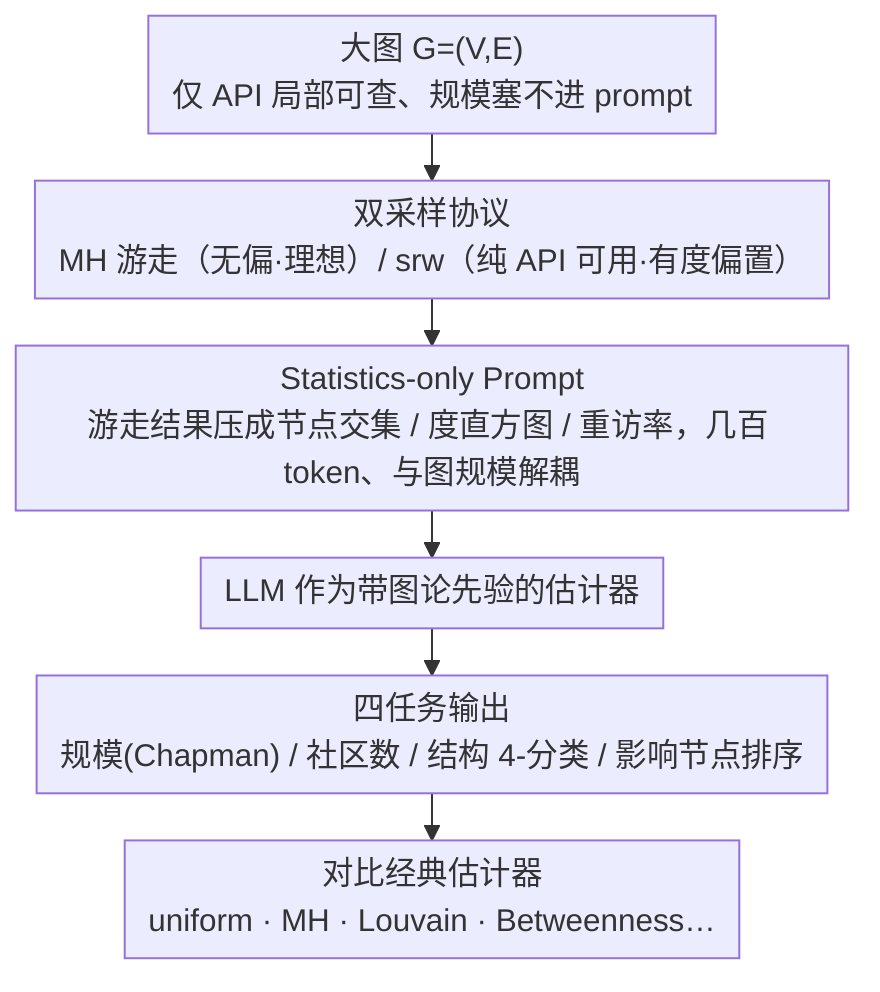

<!-- 由 src/gen_stubs.py 自动生成 -->
# Evaluating LLMs on Large-Scale Graph Property Estimation via Random Walks

**会议**: ACL 2026  
**arXiv**: [2605.01484](https://arxiv.org/abs/2605.01484)  
**代码**: https://zenodo.org/records/19632942  
**领域**: 图学习 / LLM 评测 / 估计算法  
**关键词**: large graph reasoning, random walk, LLM benchmark, graph property estimation, partial access

## 一句话总结
现有 LLM 图推理 benchmark 只用 20–50 节点的小图、还要求全图可见；本文用「随机游走统计量」把最多 2.39M 节点的真实图压成 prompt，提出 EstGraph 评估 LLM 在节点/边数、社区数、图结构、影响节点 4 项估计任务上的表现，发现 LLM 在中等规模图上可达 < 20% 相对误差并能识别图结构。

## 研究背景与动机

**领域现状**：NLGraph / GraphQA / GraphArena / GraphPattern 等几乎所有 LLM 图推理 benchmark 都把整张图编码成 edgelist 或邻接表塞进 prompt，问模型最短路径、连通性、Hamilton 路径等"算法执行"问题。

**现有痛点**：(1) **上下文容不下**——典型 benchmark 上限 20–50 节点，跟真实世界差 4–6 个数量级；(2) **全图可见假设不成立**——社交网/Web/P2P 的图常通过 API 只能局部查询，无法一次拿全；(3) **LLM 在大图上崩盘**——作者实测 edgelist→adjacency list 这种最简单的局部任务，随节点数增加，LLM 都会开始漏边或幻觉新边（Fig. 1）；(4) **任务焦点错位**——大图实际关心的是 community 结构、度分布、影响节点这类全局统计量，而不是具体算法执行。

**核心矛盾**：图规模增长 → 编码 token 数线性增长 → 撞上 context window；而即便强行塞进 prompt，LLM 也很难维持「全图一致视角」。同时，传统图估计算法（MH-walk、max-degree walk、return-time）要么需要无偏采样（实际 API 做不到），要么要 maximum degree 这种全局信息。

**本文目标**：(1) 抛掉「全图可见」假设，引入「partial access via random walks」新设置；(2) 设计 4 项面向大图的估计任务，覆盖 size / community / structure / influential node；(3) 构造任务专用的"游走统计量 prompt"，让 prompt 长度独立于图规模；(4) 在合成图（最大 100k 节点）与真实图（最大 2.39M 节点）上系统对比 LLM 与经典估计器。

**切入角度**：作者注意到经典图估计文献（capture-recapture、Chapman 估计器）本就是从局部随机游走推全局；如果先把游走结果压成统计量（度分布、回访率、共现节点数等）再喂给 LLM，让 LLM 用图论先验做推理，就能绕开 context limit、同时利用 LLM 的世界知识。

**核心 idea**：用「task-specific random-walk statistics」替代「full graph encoding」做 prompt，把 LLM 当成"有图论常识的估计器"而非"算法执行器"。

## 方法详解

### 整体框架

EstGraph 针对的是「图大到塞不进 prompt、又只能通过 API 局部查询」的真实场景：它不再把整张图编码进上下文，而是先在大图 $G=(V,E)$ 上跑若干条随机游走采样，把游走衍生的统计量（节点交集、度分布直方图、重访率等）压成一段与图规模脱钩的 prompt，让 LLM 以「带图论先验的估计器」身份直接输出标量估计或排序。节点/边数、社区数、图结构、影响节点这四项估计任务共享同一条「采样 → 统计 → LLM 推理 → 对比经典估计器」的流水线，区别仅在于游走策略、统计量种类与输出形式。

### 关键设计

**1. Statistics-only Prompt：把 prompt 长度从 $\Theta(n+m)$ 压到 $\Theta(\log n)$**

真实图（ego-Twitter、twitch-gamers、email-EuAll、as-skitter、wiki-Talk）做 edgelist 编码动辄需要 $10^5$–$10^7$ 个 token，远超任何 LLM 的上下文窗口，所以「编码整张图」这条路在大图上根本走不通。EstGraph 的破解办法是只把游走得到的汇总量喂进 prompt：对节点/边数估计，套用 capture-recapture 思路的 Chapman 估计器 $\hat{N}=\frac{(|\mathcal{S}_1|+1)(|\mathcal{S}_2|+1)}{|\mathcal{C}|}-1$，其中 $\mathcal{S}_1,\mathcal{S}_2$ 是两条独立 MH 游走采到的节点集、$\mathcal{C}$ 是二者交集，prompt 里只放 $|\mathcal{S}_1|,|\mathcal{S}_2|,|\mathcal{C}|,\bar{d}$ 这几个标量，边数再由 $\hat{M}=\bar{d}\hat{N}/2$ 推出；结构识别只塞游走访问节点的度直方图；社区估计只塞游走子图的节点重访与跳转模式。这样一来 prompt 被压到几百 token 级别（Fig. 4），相对 edgelist 最多缩减 **559×**，且 token 数与图规模彻底解耦，评测才得以从 50 节点跨到 239 万节点。

**2. 四任务 benchmark：覆盖大图分析的四类核心估计需求**

作者刻意挑选「都有 ground truth、又都能跑成熟经典估计器作对照」的四个任务，让大图分析被拆成互补的拼图。**Size estimation**（节点 + 边数）在 BA/ER/GRP 合成图加 5 个 SNAP 真实图上做，与 uniform / MH / max-degree / return-walk 比对；**Community count** 在 20 个 LFR 合成图上做，与 Louvain / Greedy / Label Propagation 比；**Graph structure recognition** 把 BA / ER / LFR / Grid 四类合成图做成 4-分类；**Influential node ranking** 在 LFR 图上预测 Betweenness / Closeness / PageRank 的 top-20，用 Precision@20 评。四个任务依次对应规模 → 模块化 → 全局拓扑 → 节点重要性，恰是现实里分析大图最常碰到的问题，而每个任务背后都有几十年沉淀的 baseline，可以把 LLM 放进公平的擂台。

**3. MH 与 srw 双采样协议：把「现实只能用 srw」这条约束摆上台面**

随机游走有两种典型采法，两者的部署可用性天差地别：MH-walk（含 burn-in）是无偏估计的金标准，但需要 reject samples、也要预知部分全局信息，真实 API 设置下并不可得；srw（simple random walk）按邻居均匀转移，可以纯 API 实现，代价是带有度偏置。以往工作往往只跑 MH 给出偏乐观的结论，本文则两种都跑、都报告，并在表格里用 † 显式标注「需无偏采样（真实不可用）」与「真正可用」两档，让读者一眼看清哪些数字是理想化的。这个 explicit 化让结论更具操作性——例如在 BA 真实图上 srw 下的 LLM 表现仅比 MH 差 9%，说明「无 burn-in、无 reject」的纯 API 友好方案在现实里确实跑得通。

### 损失函数 / 训练策略

本文是纯评测工作，没有任何训练：所有 LLM（gemini-2.5-pro、o3、sonnet-4、deepseek-v3.1）都走闭/开源 API 直推；游走超参（步数、起点数、burn-in）固定，每个实验跑 5 个独立游走集合后报中位数 / 均值 / 标准差。

## 实验关键数据

### 主实验

合成 BA/ER/GRP 大图节点数估计，相对误差 % 中位数（节选 Large 档：10k–100k 节点）：

| 图类型 | uniform† | MH† | o3 (MH)† | o3 (srw) | gemini-2.5-pro (srw) | deepseek-v3.1 (srw) |
|--------|------|------|------|------|------|------|
| BA Large | 0.60 | 12.17 | 13.08 | 25.47 | 52.56 | 26.97 |
| ER Large | 0.77 | 2.39 | 3.41 | 5.57 | 8.08 | 6.87 |
| GRP Large | 0.56 | 2.51 | 2.81 | 4.94 | 16.84 | 4.94 |

真实大图（百万节点）节点数估计，相对误差 % 中位数：

| 数据集 (规模) | MH† | gemini-2.5-pro (MH) | o3 (srw) | deepseek-v3.1 (srw) |
|---------------|------|------|------|------|
| ego-Twitter | 51.02 | 66.04 | 51.85 | 51.83 |
| twitch-gamers | 59.62 | 36.64 | 52.41 | 52.41 |
| email-EuAll | 136.20 | 19.06 | 28.84 | 29.99 |
| as-skitter | 75.21 | 30.01 | 49.84 | 50.21 |
| wiki-Talk | 181.04 | 64.37 | 33.03 | 34.38 |

LLM 在真实图上的多数表现**超过经典 MH baseline**，gemini-2.5-pro 在 email-EuAll 上甚至从 136% 降到 19%。

结构识别准确率（4 类）：

| 模型 | BA | ER | LFR | Grid |
|------|------|------|------|------|
| gemini-2.5-pro | 33.3% | 73.3% | 80.0% | 100% |
| o3 | 93.3% | 93.3% | 26.7% | 100% |
| sonnet-4 | 100% | 13.3% | 6.7% | 100% |
| DeepSeek-V3.1 | 80.0% | 66.67% | 66.67% | 100% |

Influential node ranking Precision@20 (%)：

| 模型 | Betweenness | Closeness | PageRank |
|------|------|------|------|
| gemini-2.5-pro | 6.5 ± 7.4 | 9.3 ± 8.4 | 27.5 ± 18.4 |
| o3 | **31.5 ± 14.2** | **35.0 ± 11.7** | **81.0 ± 19.9** |
| sonnet-4 | 15.3 ± 10.1 | 23.8 ± 16.1 | 42.8 ± 28.4 |
| DeepSeek-V3.1 | 23.0 ± 13.6 | 20.0 ± 16.4 | 28.5 ± 23.0 |

### 消融实验

| 维度 | 观察 |
|------|------|
| srw vs MH (BA Large) | srw 比 MH 误差高 78%（合成）/ 9%（真实） |
| LLM vs Baseline (BA Large, MH) | o3 13% vs uniform 0.6%（uniform 需全 nodelist 不可用） |
| 游走预算 (Fig. 6) | budget ↑ → size estimate 误差单调下降 |
| 多次取中位数 | 中位数 < 均值很多，提示存在长尾 over-estimate |
| Community 数 (5–12 范围) | LLM 平均绝对误差 1.9–2.6；Louvain ≈ 0 |
| Token 压缩比 | statistics prompt vs edgelist：最大 559× 缩减 |

### 关键发现

- **小图 vs 大图差异**：合成中等规模图上 LLM 中位误差 < 20%，与 MH baseline 相当；大图上 LLM 更稳定，gemini/o3 在真实百万节点图上反而比 MH 误差小。
- **srw 已经够用**：实际部署最重要的指标——srw 路线 LLM 误差只比 MH 差几个百分点，证明"无 burn-in、无 reject"的纯 API 友好方案可行。
- **中位 ≠ 均值**：LLM 偶发 over-estimate 把均值拉得很高（如 deepseek-v3.1 srw BA Large mean 35.38 vs median 26.97），暗示要多次跑取中位作为稳健估计。
- **模型差异显著**：o3 在结构识别、影响节点 ranking 全面最强；gemini-2.5-pro 在 size estimation 真实图上最稳；sonnet-4 偏向把任何图分类为 BA。
- **PageRank > Betweenness/Closeness**：因为 PageRank 与 srw 访问频率天然对齐，LLM 用度分布就能近似；最短路类指标对游走难以推断。
- **Token 压缩巨大**：对 wiki-Talk 类百万节点图，edgelist 编码需上千万 token，statistics prompt 只需几百，缩减 ≥ 500×。

## 亮点与洞察

- **「估计任务」是大图 + LLM 评测的正确切入口**：精确算法执行在小图上有意义，到大图必然崩；估计任务自带"近似 OK"的容忍度，刚好匹配 LLM 的近似推理能力，把 LLM benchmark 从 50 节点跃到 2M 节点。
- **Prompt = 任务专用统计量**：作者用图论先验把 prompt 设计成"统计 summary + 任务提示"的范式，prompt 长度与图规模解耦，对所有需要把大数据塞进 LLM 的场景（log 分析、流式监控、海量表）都有借鉴价值。
- **真实可用性约束 explicit 标注 (†)**：把"哪些 baseline 在真实 API 设置下可用、哪些不可用"做成表格标注，是评测设计上的好范例——它让 LLM 与不公平的"全图可用"baseline 不直接比，得出更可信的"LLM 在真实部署里到底有多好"。
- **LLM 在大图上有"隐式正则化"效应**：当数据噪声大时，LLM 凭世界知识给出的估计反而比无监督估计器更稳——这一点在 wiki-Talk、email-EuAll 上 LLM 误差比 MH 低数倍上得到验证。
- **可迁移启发**：把"游走 + 统计 + LLM 推理"换成"采样 + 直方图 + LLM"可以做表格/日志/SQL 大表的近似查询；把图论先验换成医学/金融领域先验也可类似构造 partial-access benchmark。

## 局限与展望

- **任务覆盖仍窄**：仅 4 类估计任务，没覆盖路径 / 流量 / 链路预测 / 异常检测；属于大图的常见任务集合的子集。
- **超参未充分消融**：游走步数、burn-in、起点数等没有完整网格 ablation，由于 reasoning LLM API 贵；难以判断不同 budget 下 LLM 与 baseline 的真实差距。
- **LLM 输出方差大**：mean/median 差距常常 2–10 倍，意味着单次估计不可靠，必须靠多次取中位数；尚无 confidence interval 输出。
- **对 BA 图偏弱**：度分布极度长尾的 BA 图上 LLM 整体不如 MH；说明 LLM 对极端 skew 分布的统计推理仍有欠缺。
- **影响节点估计 Betweenness < 35%**：因为最短路类信息无法从随机游走里直接推得；需更精细的中介性近似算法 + LLM 协同。
- **未在文本属性图**测试：现实图除了拓扑还有节点文本（如 paper、user profile），LLM 本应在这种 multi-modal 图上更有优势，但本文未评估。
- **未给训练数据**：评测纯靠 prompt + reasoning，没探索 fine-tune 一个 graph-stat-LLM 是否能更进一步。

## 相关工作与启发

- **vs NLGraph / GraphQA / GraphArena**：它们假设全图可见、≤50 节点、问算法执行；EstGraph 假设 partial access、最多 2.39M 节点、问估计——把 LLM 图评测从"小图算法"扩到"大图统计"。
- **vs GraphPattern (Dai et al. 2025)**：GraphPattern 测 motif 识别仍是局部+小图；EstGraph 测全局属性+大图，互补。
- **vs Talk like a Graph (Fatemi et al. 2024)**：Fatemi 系统比较了 edgelist / adjacency / 自然语言等图编码方式对小图任务的影响；本文直接放弃"编码整张图"路线，转向"编码采样统计"，给大图编码提供新范式。
- **vs 经典 capture-recapture / MH / max-degree 估计**：本文把这些方法的输出（节点交集大小、度均值等）作为 LLM 的输入特征，让 LLM 在此基础上推理。两者不是替代而是嵌套关系。
- **vs Walk&Retrieve (Böckling et al. 2025)**：Walk&Retrieve 用知识图谱游走做 RAG 检索；EstGraph 用游走做"图属性估计"，思路同源但任务正交。
- **可迁移启发**：「采样 → 任务专用统计 → LLM 推理」是把任何大规模结构化数据接入 LLM 的通用配方；MH/srw 双协议对比也启发其他 sampling-based ML 系统报告"理想 vs 现实"两套指标。

## 评分
- 新颖性: ⭐⭐⭐⭐ 第一次将 LLM 图评测从「全图可见小图」扩到「partial access 百万节点」，并把"采样统计 + LLM 推理"做成 systematic benchmark，开拓性强；技术单点（capture-recapture、MH walk）都是已有算法。
- 实验充分度: ⭐⭐⭐ 4 任务 × 4 LLM × 3 合成 + 5 真实数据集，覆盖较广；但超参 ablation 缺失、且部分任务 baseline 偏少（如 community 只 3 个）。
- 写作质量: ⭐⭐⭐⭐ 问题 motivation 与对比表格 (Table 1, Fig 4) 简洁有力；prompt design 细节略缺，需查附录。
- 价值: ⭐⭐⭐⭐ 提供新数据集 + 真实可用的 prompt 模式 + 实践建议（6 条），对所有想在大图上用 LLM 的从业者都有直接指导意义。

<!-- RELATED:START -->

## 相关论文

- [\[ACL 2026\] Graph-Based Alternatives to LLMs for Human Simulation](graph-based_alternatives_to_llms_for_human_simulation.md)
- [\[AAAI 2026\] GT-SNT: A Linear-Time Transformer for Large-Scale Graphs via Spiking Node Tokenization](../../AAAI2026/graph_learning/gt-snt_a_linear-time_transformer_for_large-scale_graphs_via_spiking_node_tokeniz.md)
- [\[ACL 2026\] AgentGL: Towards Agentic Graph Learning with LLMs via Reinforcement Learning](agentgl_towards_agentic_graph_learning_with_llms_via_reinforcement_learning.md)
- [\[ICLR 2026\] GraphUniverse: Synthetic Graph Generation for Evaluating Inductive Generalization](../../ICLR2026/graph_learning/graphuniverse_synthetic_graph_generation_for_evaluating_inductive_generalization.md)
- [\[ACL 2026\] From Nodes to Narratives: Explaining Graph Neural Networks with LLMs and Graph Context](from_nodes_to_narratives_explaining_graph_neural_networks_with_llms_and_graph_co.md)

<!-- RELATED:END -->
