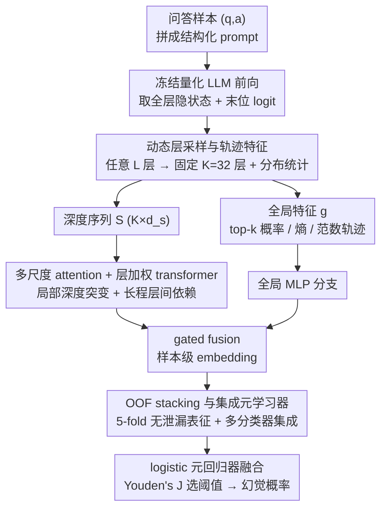

# MultiHaluDet: Multilingual Hallucination Detection via LLM Hidden State Probing

**会议**: ACL2026  
**arXiv**: [2605.24919](https://arxiv.org/abs/2605.24919)  
**代码**: https://github.com/alvi-uiu/MultiHaluDet  
**领域**: 幻觉检测  
**关键词**: 多语言幻觉检测, 隐状态探针, 多尺度注意力, OOF stacking, 跨语言鲁棒性

## 一句话总结
MultiHaluDet 用冻结 LLM 的全层隐状态轨迹做多尺度序列建模，再通过 out-of-fold 表征和集成元学习器判别幻觉，在 HaluEval / TriviaQA 上达到约 98% AUROC，并能迁移到法语、孟加拉语和阿姆哈拉语。

## 研究背景与动机

**领域现状**：LLM 幻觉检测大致分为三类：检索证据再核验的 evidence-based 方法、基于输出概率或一致性的 evidence-free 方法，以及直接探测模型内部状态的 hidden-state probing 方法。前两类分别受制于检索延迟、外部证据质量、多次采样成本或概率校准不可靠；第三类更轻量，但很多工作只看最后一层、最后一个 token 或少数固定层。

**现有痛点**：论文指出，幻觉往往是语义层面的 confabulation，而不是单个 token 的低置信度。因此，简单的 P(True)、平均概率、熵、单层 probe 或固定 token 位置很容易漏掉分布在整段回答中的事实不一致。这个问题在非英语和低资源语言中更严重，因为模型内部表征质量和语料覆盖本来就更不均衡。

**核心矛盾**：如果幻觉信号沿 transformer 深度逐步形成，那么只抓最终输出或某一层静态表示会丢掉“模型如何走向这个答案”的动态信息；但完整读取所有层又会带来维度、模型深度不一致和过拟合问题。

**本文目标**：作者希望构建一个不需要目标语言微调、不依赖外部检索、又能跨模型和跨语言工作的幻觉检测器。它需要同时解决三个子问题：如何把不同深度 LLM 的隐状态压成统一序列，如何捕捉局部和全局深度模式，如何避免深度特征训练中的数据泄漏和过拟合。

**切入角度**：论文从“隐状态轨迹”出发，把每层隐藏状态看作一条随深度演化的序列，而不是把单层向量当作一次性特征。作者的假设是，事实一致性和幻觉的差异会体现在层间范数、分布统计、logit 置信度与深度动态之间的耦合关系中。

**核心 idea**：用动态层采样 + 多尺度注意力 + OOF stacking，把冻结 LLM 的全深度内部轨迹转成稳健的幻觉检测特征。

## 方法详解

MultiHaluDet 是一个四阶段框架：先从冻结 LLM 中抽取 per-layer 统计特征和全局 logit 特征，再用多尺度 attention + transformer encoder 建模深度序列，然后用 out-of-fold 方式生成无泄漏深度表征，最后用多个传统/神经分类器组成的 stacking ensemble 输出幻觉概率。

### 整体框架

输入是一组问答样本 $(q_i, a_i)$，标签 $y_i \in \{0,1\}$ 表示回答是否幻觉。系统把问答拼成结构化 prompt，送入冻结且量化的 LLM，一次 forward 后得到所有层隐藏状态 $\{H^{(l)}\}_{l=0}^{L}$ 和最终位置的 logit 向量。LLM 参数全程不更新。

为了适配不同深度模型，方法先把任意 $L$ 层映射到固定 $K=32$ 个层索引。每个被采样层都会抽取最后 token 表示、序列平均表示、范数、均值、标准差、极值、稀疏度、近零比例、kurtosis、MAD 等统计量，拼成深度序列 $S \in \mathbb{R}^{K \times d_s}$。同时，方法还构建全局特征 $g$，包括 top-$k$ token 概率、logit 熵、logit 标准差、层间范数轨迹统计和 anchor layer 特征。

随后，$S$ 进入 MultiHaluDet 的序列分支，$g$ 进入全局 MLP 分支。两路表征经过 gated fusion 后得到样本级 embedding。训练阶段不直接把训练集 embedding 喂给最终分类器，而是用 5-fold out-of-fold 训练：每个样本的 deep feature 都来自没见过该样本的 fold 模型。最后，多个基分类器的概率通过 logistic meta-regressor 融合，阈值由 Youden's J statistic 选择。

### 关键设计

**1. 动态层采样与轨迹特征：把任意深度 LLM 的层压成固定长度深度序列，让不同模型共享同一检测器**

幻觉不一定集中在最后一个 token 或最后一层，可它又分布在层数各异的模型里，没法直接对齐。方法的做法是把任意 $L$ 层映射到固定 $K=32$ 个层索引：模型层数正好就直接取，更浅就重复最深层补齐，更深就按深度比例均匀插值采样。每个采样层不止保留最后 token，还抽出序列均值、范数、稀疏度、kurtosis、MAD 等分布统计，拼成深度序列。这样既保留了“从浅层到深层”的演化过程，又免去为每个模型手写层索引，Mistral-7B 和 LLaMA2-7B 因此能套用同一套检测器设计。

**2. 多尺度 attention + 层加权 transformer：同时抓短程的局部深度突变和长程的层间依赖**

幻觉信号有时表现为某个中间层突然的语义偏移，有时表现为整体范数轨迹的缓慢变化，单一的 mean pooling 太粗，会把这两种模式一起抹平。这里先把深度序列投影到统一 hidden space，再用多个 scale factor 做局部平均池化、线性投影和上采样，不同尺度通过位置相关 gate 加权融合；之后用一个可学习的层重要性向量 $\lambda$ 调制每个深度位置，送入 Pre-LN transformer encoder。多尺度让模型能同时看细粒度和粗粒度的深度模式，层加权再让它按样本自适应地决定哪些层更重要，避免固定 pooling 把信号平均掉。

**3. OOF stacking 与集成元学习器：用无泄漏表征加多分类器集成，压住高维深度特征的过拟合**

隐藏状态统计维度高、样本有限、不同语言分布还不一样，直接拿训练集 embedding 喂给最终分类器极易过拟合。方法改用 5-fold out-of-fold 训练：训练集里每个样本的融合 embedding 都由没见过它的 fold 模型生成，测试样本则平均多个 fold 模型的 embedding。随后 RandomForest、XGBoost、GradientBoosting、LightGBM、LogisticRegression、SVM 等基分类器各自输出概率，再由一个 logistic meta-regressor 学习最终融合权重。OOF 把数据泄漏的风险降下来，集成元学习器则把不同分类器的归纳偏置组合起来，换取跨架构的稳健性。

### 损失函数 / 训练策略

深度模型训练使用 AdamW，学习率 $2 \times 10^{-4}$，weight decay $6 \times 10^{-5}$，ReduceLROnPlateau 调度，训练 45 epochs，early stopping patience 为 15。框架使用 BCE、focal、asymmetric 和 contrastive objective 的组合，并加入 label smoothing、Mixup、CutMix。隐藏层固定采样到 $K=32$，序列模型 hidden dimension 为 384，8 个 attention heads，6 层 transformer encoder。实验采用 5-fold stratified cross-validation。

多语言评测不做语言特定微调。作者用 Gemini 2.5 Flash 将英文 HaluEval / TriviaQA 扩展到法语、孟加拉语和阿姆哈拉语，并人工检查每个数据集每种语言 100 个样本，共 600 个样本；初始翻译准确率为 96%，剩余 4% 被重新润色生成。

## 实验关键数据

### 主实验

| 数据集 | 基座 LLM | 最强基线 AUROC | MultiHaluDet AUROC | 关键结论 |
|--------|----------|----------------|--------------------|----------|
| HaluEval | Mistral-7B | Neural CDEs 95.4 | 98.43 | 超过最强连续动力学基线约 3.03 点 |
| HaluEval | LLaMA2-7B | Neural SDEs 92.8 | 98.55 | 跨架构保持近 98.5 AUROC |
| TriviaQA | Mistral-7B | Neural SDEs 85.1 | 98.30 | 对 plausible hard negatives 提升明显 |
| TriviaQA | LLaMA2-7B | Neural CDEs 83.7 | 98.26 | 相比隐藏状态/概率基线更稳 |

### 跨语言结果

| 语言资源层级 | 数据集 | Mistral-7B AUROC | LLaMA2-7B AUROC | 观察 |
|--------------|--------|------------------|-----------------|------|
| English | HaluEval | 98.4 | 98.5 | 英文基准接近饱和 |
| French high-resource | HaluEval | 96.2 | 95.8 | 相比英文只小幅下降 |
| Bangla medium-resource | HaluEval | 89.1 | 88.4 | 形态和语料覆盖带来更明显退化 |
| Amharic low-resource | HaluEval | 78.5 | 76.2 | 仍显著高于对应 best baseline 62.3 / 59.8 |
| French high-resource | TriviaQA | 95.5 | 94.9 | hard negative 场景仍稳定 |
| Bangla medium-resource | TriviaQA | 87.6 | 86.3 | 保留较强跨语言检测信号 |
| Amharic low-resource | TriviaQA | 75.8 | 73.4 | 低资源语言成为主要挑战 |

### 消融实验

| 配置 | Mistral HaluEval | Mistral TriviaQA | LLaMA2 HaluEval | LLaMA2 TriviaQA | 说明 |
|------|------------------|------------------|-----------------|-----------------|------|
| Full | 98.43 | 98.30 | 98.55 | 98.26 | 完整模型 |
| w/o MSA | 91.45 | 90.82 | 92.14 | 91.33 | 去掉多尺度 attention，下降约 6-8 点 |
| w/o OOF | 88.67 | 87.41 | 89.25 | 88.19 | 最大降幅，说明 OOF stacking 是稳健泛化关键 |
| w/o TP | 93.28 | 92.56 | 93.71 | 93.04 | 只用静态最终层会损失约 5 点 |

### 关键发现

- 表层概率类特征几乎失效：P(True)、AvgProb、AvgEnt 在 41.1%-49.7% AUROC 之间徘徊，说明“低置信度等于幻觉”的启发式不够可靠。
- OOF stacking 是最关键组件；去掉后 TriviaQA 上下降超过 10 点，说明 plausible hard negatives 特别容易诱发过拟合。
- 低资源语言仍是瓶颈：Amharic 上 AUROC 明显低于 French / Bangla，作者也把这归因于基座模型中低资源语言表征质量不足。

## 亮点与洞察

- 最有价值的视角是把幻觉检测从“看输出置信度”转为“看隐状态演化轨迹”。这比单层 probe 更接近模型生成事实判断的过程，也解释了为什么 trajectory probing 的消融会掉点。
- 动态层采样是一个很实用的工程设计。它没有假设某个绝对层编号最重要，而是用相对深度对齐不同模型，适合跨架构复用。
- 多尺度 attention 与 self-attention pooling 的组合很适合这类检测任务：前者抓局部深度异常，后者让模型按样本自适应选择重要层，避免固定 pooling 把信号平均掉。
- 多语言实验虽然基于翻译数据，但高/中/低资源分层清楚地展示了表示质量的瓶颈。它提示后续多语言安全检测不能只报告英语结果。

## 局限与展望

- **白盒依赖明显**：方法需要访问目标 LLM 的 hidden states 和 logits，因此不能直接用于 GPT-4、Claude 等黑盒商业模型。
- **计算和显存成本高于简单 heuristic**：虽然不需要语言特定微调，但全层隐状态抽取、深度序列建模和 5-fold OOF 仍比 P(True) 或 logit entropy 昂贵。
- **多语言评估仍是翻译基准**：French / Bangla / Amharic 数据来自英文 benchmark 翻译。即使作者做了人工 QA 和 back-translation，也可能漏掉本地语境、文化知识和自然低资源 prompt 的细微现象。
- **任务边界偏 QA 幻觉检测**：实验主要围绕 HaluEval 和构造版 TriviaQA，尚不清楚在长文生成、工具调用、RAG 多跳场景中是否仍有同样强的 AUROC。
- 后续可尝试把 full-depth trajectory probing 压缩成少数关键层或蒸馏成轻量 detector，以降低部署成本。

## 相关工作与启发

- **vs P(True) / AvgProb / AvgEnt**: 这些方法直接看输出置信度或熵，成本低但在本文表格中接近随机；MultiHaluDet 读取内部轨迹，成本更高但能捕捉高置信幻觉。
- **vs SAPLMA / MIND / Probe@Exact**: 这些 hidden-state probe 已经比表层概率强，但多依赖单点或静态表示。MultiHaluDet 的区别在于显式建模全深度序列，并用 OOF 表征减少训练泄漏。
- **vs Neural ODE / CDE / SDE hidden trajectory methods**: 这些方法也看连续动态，其中 Neural CDEs 在 HaluEval Mistral 上达到 95.4 AUROC；MultiHaluDet 通过多尺度 attention、全局特征融合和 stacking ensemble 进一步提升到 98.43。
- **启发**：对安全检测类任务，内部表征的“路径”可能比最终状态更有信息。类似思想可迁移到越狱检测、事实一致性评估、跨语言有害内容检测和 RAG 答案可信度估计。

## 评分
- 新颖性: ⭐⭐⭐⭐☆ 把全层轨迹、多尺度 attention 和 OOF stacking 结合用于多语言幻觉检测，组合设计扎实但仍建立在已有 hidden-state probing 方向上。
- 实验充分度: ⭐⭐⭐⭐☆ 主实验、跨语言、消融都较完整；不足是多语言数据来自翻译，真实低资源场景还需验证。
- 写作质量: ⭐⭐⭐⭐☆ 方法拆解清楚，表格给出关键数值；但框架组件较多，工程复杂度偏高。
- 价值: ⭐⭐⭐⭐⭐ 对多语言 LLM 安全检测很有启发，尤其说明低资源语言幻觉检测不能只依赖输出概率。

<!-- RELATED:START -->

## 相关论文

- [\[ACL 2025\] ICR Probe: Tracking Hidden State Dynamics for Reliable Hallucination Detection in LLMs](../../ACL2025/hallucination/icr_probe_tracking_hidden_state_dynamics_for_reliable_hallucination_detection_in.md)
- [\[ACL 2026\] Rethinking Evaluation for LLM Hallucination Detection: A Desiderata, A New RAG-based Benchmark, New Insights](rethinking_evaluation_for_llm_hallucination_detection_a_desiderata_a_new_rag-bas.md)
- [\[ACL 2026\] 为什么 LLM 在结构化知识上产生幻觉：推理过程的机制分析](why_llms_hallucinate_on_structured_knowledge_a_mechanistic_analysis_of_reasoning.md)
- [\[ACL 2026\] Logical Consistency as a Bridge: Improving LLM Hallucination Detection via Label Constraint Modeling between Responses and Self-Judgments](logical_consistency_as_a_bridge_improving_llm_hallucination_detection_via_label_.md)
- [\[ACL 2025\] Activation Steering Decoding: Mitigating Hallucination in Large Vision-Language Models through Bidirectional Hidden State Intervention](../../ACL2025/hallucination/activation_steering_decoding_mitigating_hallucination_in_large_vision-language_m.md)

<!-- RELATED:END -->
