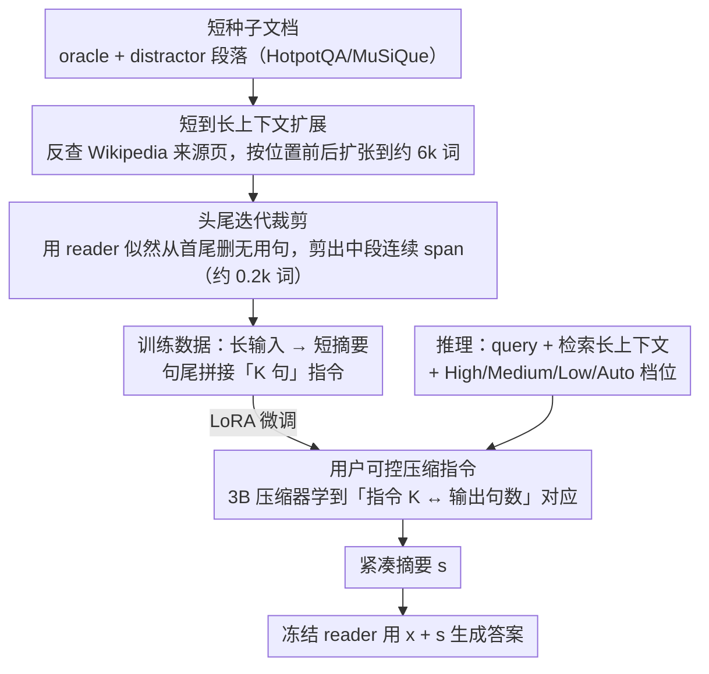

# BRIEF-Pro: Universal Context Compression with Short-to-Long Synthesis for Fast and Accurate Multi-Hop Reasoning

**会议**: ACL 2026 Findings  
**arXiv**: [2510.13799](https://arxiv.org/abs/2510.13799)  
**代码**: https://github.com/JasonForJoy/BRIEF (有)  
**领域**: 信息检索 / RAG / 上下文压缩  
**关键词**: 长上下文压缩, RAG, 多跳问答, 合成数据, 用户可控

## 一句话总结
针对 RAG 在 10k+ 词长上下文下推理慢、信息淹没的问题，作者用「短上下文种子数据 → 维基扩张 → 头尾迭代裁剪」合成多跳长上下文训练数据，微调一个 3B 的 Llama-3.2 抽取式摘要器 BRIEF-Pro，在四个多跳 QA 数据集上以 32× 压缩率反超 LongLLMLingua 的 9× 压缩，并支持用户用句数指令直接控制摘要长度。

## 研究背景与动机

**领域现状**：RAG 已成为缓解 LLM 幻觉、补充新知识的主流范式，但当检索文档增多、上下文延展到 10k 词级别后，推理延迟和 reader 模型的"认知负担"会急剧上升。多跳问答因为需要跨多段证据推理，问题更突出——relevant 信号被大量 distractor 稀释，"lost in the middle"现象严重。

**现有痛点**：现有上下文压缩工作分两条路线。一是软提示（GIST / AutoCompressor），但需绑定特定 reader、无法迁移；二是文本摘要式（RECOMP、BRIEF、CompAct、LongLLMLingua），但训练数据基本来自 <1k 词的短上下文（HotpotQA 原文档），泛化到 10k+ 词输入时容易丢失关键依赖；同时压缩预算固定，用户无法按需调节摘要粒度。LongLLMLingua 虽然支持长输入，但靠 perplexity 做 token 级裁剪，长文中 7B backbone 反复编码 chunk，FLOPs 反而比 reader 还高。

**核心矛盾**：要训出能压 10k+ 词长上下文的压缩器，最直接的方法是收集 10k+ 词的训练数据，但这种数据稀缺且标注昂贵；而仅用短数据训练，模型遇到长输入会失效——存在「训练数据可得性」与「目标输入长度」之间的 gap。

**本文目标**：(1) 用便宜的短上下文种子数据合成长上下文训练样本；(2) 提供用户可控的压缩粒度（句数）；(3) 在多跳 QA 上同时拿到更高 QA 准确率 + 更高压缩率 + 更低 FLOPs。

**切入角度**：作者注意到 HotpotQA / MuSiQue 的 oracle 段落本来就来自 Wikipedia 某条具体的 page，可以「按位置」向前后扩展原文段落人工造长上下文；同时 oracle 段落本身有冗余，可以再用一个"删词不掉点"准则把它裁紧 → 这样一边把输入加长、一边把目标摘要压短，对比度更大。

**核心 idea**：用"短到长合成"造数据——把短的 oracle/distractor 文档按 Wikipedia 位置扩展到 6k 词左右，再用头尾迭代裁剪生成紧凑摘要，最后用句数指令做长度可控的 SFT，训出一个 3B 的轻量压缩器。

## 方法详解

### 整体框架
系统由一个 3B 压缩器 $\mathcal{C}$（Llama-3.2-3B-Instruct）和一个冻结的 reader $\mathcal{M}$（8B/70B/GPT-4.1-nano）两部分组成，核心要解决的是"想训长上下文压缩器却没有长上下文训练数据"这个 gap。在线推理时，检索器对 query $\mathbf{x}$ 返回长上下文 $\mathbf{D}$，压缩器在一条可选的句数指令 $\mathbf{i}$（"Summarize ... in K sentences, K=[P] k [\P]"）约束下输出紧凑摘要 $\mathbf{s}$，reader 再用 $\mathbf{x}+\mathbf{s}$ 生成答案。训练数据 $\mathcal{D}_{comp}$ 完全由一条"短到长合成"流水线产出——把短种子文档扩长、把 oracle 摘要剪短，制造出"长输入对短摘要"的强对比样本，压缩器在其上以标准 next-token 目标 $\max_{\mathcal{C}} \mathbb{E}\log p_{\mathcal{C}}(\mathbf{s}|\mathbf{x},\mathbf{D},\mathbf{i})$ 学习。

### 关键设计

**1. 短到长上下文扩展：用 Wikipedia 把短文档造成 6k 词长输入**

直接收集 10k+ 词的训练数据稀缺又昂贵，作者改从便宜的短种子数据合成。注意到 HotpotQA/MuSiQue/LongAlign 的 oracle 与 distractor 段落本就来自具体的 Wikipedia 页面，于是对每段文档反查它在 Izacard 等人 Wikipedia 语料里的来源页面，再以原段落位置为锚点向前后扩张若干句，扩张倍率从均值为 20 的正态分布采样以保证长度多样。关键在于 oracle 和 distractor 两类一起扩——只扩 oracle 会得到不自然的"干净"长上下文，表 4 显示这样训出来的模型平均 QA 掉 2.77~3.77 个点。保留扩长后的 distractor 才能复现真实 RAG 里"信号被噪声稀释"的检索现场，而借用现成 Wikipedia 也避免了硬拼接造成的语义割裂。

**2. 头尾迭代裁剪：用似然判据把目标摘要压成连续紧凑片段**

要的是"长输入→短摘要"的大对比度，所以 oracle 段落里答题不需要的句子要删掉。本文定义句子的"helpfulness"——比较 reader 在去掉句子 $\mathbf{p}_{ij}$ 前后对正确答案 $\mathbf{y}$ 的对数似然 $\log p(\mathbf{y}|\cdot)$，若删除后似然不降反升则判为无用。逐句评估整段代价太高，作者假设关键信息一般居中，于是只对头部和尾部迭代检测：从首句往里逐句判，无用就删直到遇到有用句，尾部同理。这样剪出的目标摘要恰好是文档中段的连续 span，自然紧凑，训练数据最终平均 6.0k 词输入压到 0.2k 词摘要（约 30× 压缩率）。相比让 LLM 直接"总结"易生抽象式幻觉，这套 LM 似然剪枝是无监督的、不依赖人工标注，且连续 span 让模型倾向"抽取"而非"编造"。

**3. 用户可控压缩指令：把摘要长度做成自然语言条件**

RECOMP、CompAct、BRIEF 等旧压缩器压缩率写死，下游无法按延迟预算调档。本文在压缩器输入末尾插入"Summarize the documents relevant to the question in K sentences, where K = [P] k [\P]"，训练时把 $k$ 设成对应 target summary 的实际句数，让模型学到"指令中的 $k$"与"输出句数"之间的精确对应。推理时直接给出 High/Medium/Low（5/10/20 句）和 Auto（模型自决）四种档位，另有 Auto$_{L7C}$ 变体用 Llama2-7B-Chat 初始化，纯为与 LongLLMLingua 做同 backbone 公平对比。把长度控制显式建模成自然语言条件，比调超参友好，也让一个模型覆盖多种压缩粒度。

### 损失函数 / 训练策略
LoRA 微调 Llama-3.2-3B-Instruct，AdamW，batch 64，3 epoch，在 2× A100-80GB 上跑约 2 天；训练集 45.2k 样本，上下文平均 6.0k 词（标准差 3.5k），摘要平均 0.2k 词。

## 实验关键数据

### 主实验
4 个多跳 QA 数据集（MuSiQue / HotpotQA / 2WikiMultiHopQA / LongSeal，上下文长度 4.9k–14.8k 词），3 种 reader（Llama-3.1-8B/70B、GPT-4.1-nano），指标为 EM/F1 和压缩率（Rate）。

| Reader | 方法 | 平均 QA (EM+F1)/2 | 压缩率 |
|--------|------|----|----|
| Llama-3.1-8B | Non-compression | 32.09 | 1× |
| Llama-3.1-8B | LongLLMLingua | 32.02 | 9× |
| Llama-3.1-8B | GPT-4.1-nano 作压缩 | 36.87 | 110× |
| Llama-3.1-8B | **BRIEF-Pro-Auto** | **38.79** | **32×** |
| Llama-3.1-8B | **BRIEF-Pro-Low** | **40.06** | **25×** |
| Llama-3.1-70B | Non-compression | 44.98 | 1× |
| Llama-3.1-70B | LongLLMLingua | 40.91 | 9× |
| Llama-3.1-70B | **BRIEF-Pro-Auto** | **45.58** | **32×** |
| Llama-3.1-70B | **BRIEF-Pro-Low** | **46.49** | **25×** |
| GPT-4.1-nano | Non-compression | 33.53 | 1× |
| GPT-4.1-nano | LongLLMLingua | 33.03 | 9× |
| GPT-4.1-nano | **BRIEF-Pro-Auto** | **40.80** | **32×** |

70B reader 上 BRIEF-Pro-Auto 比 LongLLMLingua 高 4.67 个点，压缩率高出 3.5×，且总 FLOPs 只是后者的 23%。

### 消融实验

| 配置 | 输入平均长度 | 8B 平均 QA | 70B 平均 QA | GPT-4.1-nano 平均 QA |
|------|------|------|------|------|
| Oracle++ & Distractor++（完整方法） | 6.0k | **38.79** | **45.58** | **40.80** |
| Oracle+ & Distractor+（少扩） | 3.6k | 36.02 | 41.74 | 39.11 |
| Oracle+++ only（只扩 oracle） | 3.6k | 33.76 | 41.68 | 37.03 |

| 压缩模式 | 期望句数 | 实际平均句数 |
|------|------|------|
| High | 5 | 6.2 |
| Medium | 10 | 10.4 |
| Low | 20 | 18.0 |

### 关键发现
- **长输入 + 长距离噪声是关键**：只扩 oracle 训出来的压缩器平均掉 3~5 个点；distractor 提供的"信号噪声混杂"是模型学会鲁棒压缩的必要训练信号。
- **压缩反超 non-compression**：在 70B 和 GPT-4.1-nano 上，32× 压缩比直接喂原文还高 0.6~7.3 个点，说明长上下文真的会拖累 reader 的多跳整合能力。
- **句数指令的可控性比预期好**：High/Medium 模式实际句数误差只有 0.4~1.2 句；Low（20 句）反而生成略短（18 句），但仍非常接近指令。
- **算力收益更显著**：70B reader 下整体 TFLOPs 降到 non-compression 的 8%、LongLLMLingua 的 24%；端到端延迟降到 LongLLMLingua 的 7%。

## 亮点与洞察
- "短数据合成长数据"的思路很务实——HotpotQA/MuSiQue 的 oracle 本身就带 Wikipedia 出处，用现成结构化语料做"位置可控的上下文扩张"几乎零成本，比硬合成长文档要自然得多。
- 头尾迭代裁剪绕过了"LM 似然判定整段贡献"的高昂代价：每段只需要 O(头+尾) 次似然评估，复杂度从 O(段长) 降到接近常数；同时保证目标摘要在原文中是连续 span，训出来的模型更倾向"抽取"而不是"编造"。
- 把"压缩长度"做成自然语言指令而不是超参/特殊 token，相当于给压缩器装了一个"文本接口"，下游可以让 reader 模型自己根据上下文动态决定要多长摘要，迁移性比固定 budget 的方案强很多。
- 在 70B reader 上压缩比反胜 non-compression 是个非常强的 "lost in the middle" 直接证据——证明长上下文 LLM 即便能"读完"长文档，也不代表能"用好"。

## 局限与展望
- 训练数据上限 ~10k 词，遇到 20k+ 词的极长上下文（如完整论文、多文档对话）未必能保持质量。
- 评测局限在多跳 QA，对 few-shot ICL、代码补全、长对话记忆这类对"完整性"要求高的任务没测；尤其是代码场景，抽取式摘要可能破坏语法/变量依赖。
- 头尾裁剪基于"关键信息居中"的假设，遇到答案出现在文档开头/末尾的领域（如新闻 lead、技术文档结论）可能漏掉关键句。
- 改进思路：(1) 用层次化压缩处理 20k+ 输入；(2) 学一个"压缩长度选择器"在 Auto 模式下自适应决定句数；(3) 加 code-aware 监督扩展到代码补全等结构化场景。

## 相关工作与启发
- **vs RECOMP / BRIEF**: 都是文本摘要式压缩，但 RECOMP 蒸馏 GPT-3.5 摘要、BRIEF 用 T5 + chunk 拼接，输入长度受限（<1k 或需要分块）；本文用 short-to-long 合成 + 3B Llama 直接处理 6k 词输入，是它们的长上下文扩展版。
- **vs LongLLMLingua**: LongLLMLingua 用 7B causal LM 算 perplexity 做 token 级压缩，压缩本身计算量很大；本文 3B 抽象压缩器一次前向就出摘要，FLOPs 只有它的 23%，且压缩率高 3.5×。
- **vs CoLoR (Seo et al. 2025)**: 同样合成数据训压缩器，但 CoLoR 的合成 pipeline、监督信号、目标长度都不同；本文强调"短到长 + 用户可控"两个独有维度。
- **启发**：「用结构化外部语料按位置扩张原始数据」这个技巧可以迁移到 long-context SFT 数据合成（如 long-context instruction-tuning、long-context RM 数据）——比 needle-in-haystack 式合成更自然。

## 评分
- 新颖性: ⭐⭐⭐⭐ short-to-long 合成 + 句数可控指令是简单但有效的组合，head-tail 剪枝也是聪明的工程取巧。
- 实验充分度: ⭐⭐⭐⭐⭐ 3 种 reader × 4 个多跳数据集 + non-Wikipedia 跨域 + FLOPs/延迟 + 句数控制精度 + oracle/distractor 扩张消融，非常完整。
- 写作质量: ⭐⭐⭐⭐ 主线清晰，但合成 pipeline 细节散布在 3.3.1~3.3.3 三节，初读需要前后对照。
- 价值: ⭐⭐⭐⭐⭐ 3B 压缩器 + 32× 压缩比 + 反超 non-compression 的组合在工业 RAG 上非常实用，开源代码 + 数据 pipeline 可复现。

<!-- RELATED:START -->

## 相关论文

- [\[ICML 2026\] ParisKV: Fast and Drift-Robust KV-Cache Retrieval for Long-Context LLMs](../../ICML2026/information_retrieval/pariskv_fast_and_drift-robust_kv-cache_retrieval_for_long-context_llms.md)
- [\[ACL 2026\] MASS-RAG: Multi-Agent Synthesis Retrieval-Augmented Generation](mass-rag_multi-agent_synthesis_retrieval-augmented_generation.md)
- [\[ICLR 2026\] Q-RAG: Long Context Multi-Step Retrieval via Value-Based Embedder Training](../../ICLR2026/information_retrieval/q_rag_long_context_multi_step_retrieval.md)
- [\[AAAI 2026\] OPERA: A Reinforcement Learning--Enhanced Orchestrated Planner-Executor Architecture for Reasoning-Oriented Multi-Hop Retrieval](../../AAAI2026/information_retrieval/opera_a_reinforcement_learning--enhanced_orchestrated_planner-executor_architect.md)
- [\[ICML 2026\] Less Is More: Elevating RAG via Performance-Driven Context Compression](../../ICML2026/information_retrieval/less_is_more_elevating_rag_via_performance-driven_context_compression.md)

<!-- RELATED:END -->
