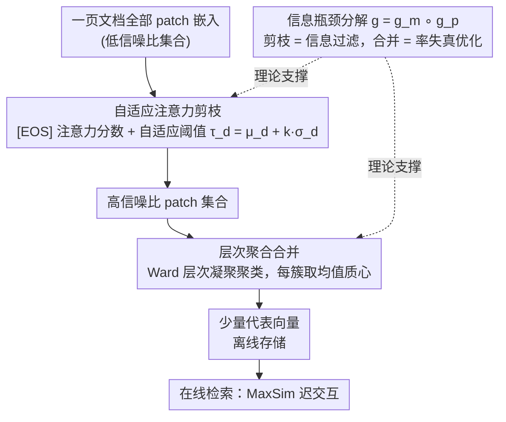

# Prune-then-Merge: Towards Efficient Multi-Vector Visual Document Retrieval

**会议**: ACL 2026 Findings  
**arXiv**: [2602.19549](https://arxiv.org/abs/2602.19549)  
**代码**: 无  
**领域**: 信息检索 / 文档检索  
**关键词**: 视觉文档检索, 多向量压缩, 自适应剪枝, 层次聚合, ColPali

## 一句话总结

本文提出 Prune-then-Merge，一个两阶段的免训练多向量文档压缩框架——先通过自适应注意力剪枝移除低信息 patch，再对剩余高信号 patch 进行层次聚类合并，在 29 个 VDR 数据集上将近无损压缩范围从 50-60% 扩展到 60-70%，并在 80%+ 高压缩率下显著优于单阶段方法。

## 研究背景与动机

**领域现状**：视觉文档检索（VDR）使用 LVLM 将文档页面作为图像处理，多向量范式（如 ColPali）将每页表示为 patch 级别嵌入集合，通过 MaxSim 迟交互实现精细匹配，性能最优。

**现有痛点**：多向量模型的存储和计算开销巨大——每页存储数百甚至上千个向量，大规模部署不切实际。现有优化分两派：(1) 剪枝法（如 DocPruner）在中等压缩率下近无损但高压缩率时性能急剧下降；(2) 合并法（如 Light-ColPali）在高压缩率下更优雅但可能稀释区分性特征，近无损范围不稳定。

**核心矛盾**：剪枝擅长精确移除噪声但不能处理高冗余；合并擅长高比例压缩但在含噪数据上质心被噪声拉偏。两种方法各有短板且单独使用无法同时满足近无损和高压缩的需求。

**本文目标**：协同两种互补方法——先剪枝提高信噪比，再合并实现高比例压缩。

**切入角度**：从信息瓶颈理论出发，将总体压缩分解为两个更易处理的子问题：查询无关的信息过滤（剪枝）和冗余消除（合并）。

**核心 idea**：先精炼再压缩——剪枝将输入从低信噪比集合转化为高信噪比集合，后续合并在高质量向量上操作，避免噪声引起的质心偏移。

## 方法详解

### 整体框架

Prune-then-Merge 是一个离线、查询无关、完全免训练的多向量压缩框架，要解决的问题是：ColPali 这类多向量 VDR 模型每页存数百上千个 patch 向量，存储和迟交互计算都太重。它把"如何在高压缩率下少掉点"拆成两步顺序处理——先剪枝再合并。给定一页文档的全部 patch 嵌入，阶段一用 LVLM 最后一层注意力算出每个 patch 的重要性，按自适应阈值剪掉低信息 patch，把输入从低信噪比集合提纯成高信噪比集合；阶段二对剩下的高质量 patch 做层次凝聚聚类，每簇用质心代替，得到一小批代表性向量离线存好，在线检索时直接拿它们做 MaxSim。这两步的串行设计由信息瓶颈（Information Bottleneck, IB）理论支撑，解释了为什么"先提纯再压缩"优于单阶段。

### 关键设计

**1. 自适应注意力剪枝：按文档自身信息密度决定保留多少 patch。** 这一步要剔除空白区域、装饰边框等低信息 patch。方法直接复用编码器最后一层 Transformer 的注意力权重，取 [EOS] token 对每个 patch 的平均注意力作为重要性分数 $I(\mathbf{d}_j) = \bar{\mathbf{A}}^{(L)}_{\text{eos},j}$，再以文档级统计量设定自适应阈值 $\tau_d = \mu_d + k \cdot \sigma_d$，只保留分数高于阈值的 patch，超参数 $k$ 控制剪枝严格度。

关键在于阈值是按每篇文档的均值与方差动态算出来的，而非固定比例。不同页面信息密度差异很大——一页满是表格的文档和一页大量留白的封面，合理保留量天差地别；固定比例剪枝要么对密集页砍过头，要么对稀疏页留太多噪声，自适应阈值则让每篇都恰好保留与其信息量匹配的 patch 数。

**2. 层次聚合合并：在干净集合上求无偏质心。** 剪枝后仍可能有语义冗余（比如多个 patch 描述同一张表的同一行）。这一步先对所有嵌入做 L2 归一化、计算余弦距离矩阵，用 Ward 方法做层次凝聚聚类，目标簇数为 $N_p'' = \max(1, \lfloor N_p' / m \rfloor)$，合并因子 $m$ 控制压缩比；每簇取均值质心作为新的代表向量。

把合并放在剪枝之后是整套方法的关键：若直接在含噪原始集合上聚类，质心会被空白/噪声 patch 拉偏，稀释掉真正有区分性的特征——这正是单阶段合并法（如 Light-ColPali）在含噪数据上掉点的原因。先剪掉噪声再求质心，质心落在高信号样本的中心，因而更无偏、更能在高压缩率下保住检索精度。

**3. 信息瓶颈分解：从理论上说明两步为何强于一步。** 作者把整体 IB 优化目标 $\max I(\mathbf{D}''; s(q,\mathbf{D})) - \beta I(\mathbf{D}''; \mathbf{D})$ 分解为复合映射 $g = g_m \circ g_p$：剪枝 $g_p$ 负责查询无关的信息过滤，目标是最大化对全局语义的信息保留；合并 $g_m$ 负责率失真优化，目标是最小化量化（质心替代）带来的 MSE。

这一分解把一个难解的联合压缩问题切成两个各有明确优化目标、且彼此协同的子问题，也从理论上印证了设计 2 的直觉——单阶段合并的质心受噪声偏移，而两阶段先过滤后量化得到的质心更接近无偏，从而为剪枝严格度 $k$ 与合并因子 $m$ 的选择提供了原则性依据，而非纯靠调参。

### 损失函数 / 训练策略

Prune-then-Merge 是完全免训练的后处理框架，不涉及任何模型训练，可直接套用于任意多向量 VDR 模型；全部超参数只有剪枝严格度 $k$ 与合并因子 $m$。

## 实验关键数据

### 主实验

**29 个 VDR 数据集上的 nDCG@5（60% 压缩率）**

| 方法 | ColQwen2.5 | ColNomic | Jina-v4 |
|------|-----------|---------|---------|
| 无压缩 | 基线 | 基线 | 基线 |
| DocPruner (剪枝) | 接近无损 | 轻微下降 | 轻微下降 |
| Light-ColPali (合并) | 明显下降 | 明显下降 | 明显下降 |
| **Prune-then-Merge** | **近无损** | **近无损** | **近无损** |

### 消融实验

| 压缩率 | 仅剪枝 | 仅合并 | Prune-then-Merge |
|--------|--------|--------|-----------------|
| 50% | 近无损 | 轻微下降 | 近无损 |
| 60% | 开始下降 | 下降明显 | **仍近无损** |
| 70% | 急剧下降 | 下降 | 轻微下降 |
| 80% | 崩溃 | 下降较大 | **仍可用** |

### 关键发现

- 近无损压缩范围从 [50-60%] 扩展到 [60-70%]，平均提升 10 个百分点
- 在 80%+ 压缩率下，仅剪枝方法性能崩溃（急剧悬崖），Prune-then-Merge 避免了这一问题
- 在三个主流多向量模型（ColQwen2.5、ColNomic、Jina-v4）上一致有效
- 理论预测与实验结果吻合——先提高信噪比再压缩确实减少了质心偏移

## 亮点与洞察

- "先精炼再压缩"的分步思路简洁但深刻——将复杂问题分解为两个更易解的子问题
- 完全免训练、模型无关，可直接应用于任何多向量检索模型
- IB 理论分析不仅解释了方法的有效性，还提供了选择超参数的原则性指导

## 局限与展望

- 层次聚类的 $O(N^2)$ 空间复杂度在极大文档上可能成为瓶颈
- 查询无关的剪枝可能误删对某些特定查询重要的 patch
- 合并因子 $m$ 的选择仍是经验性的
- 未来可探索查询感知的自适应压缩和学习型的合并策略

## 相关工作与启发

- **vs DocPruner**: 仅剪枝，高压缩率崩溃；Prune-then-Merge 通过后续合并扩展压缩范围
- **vs Light-ColPali**: 仅合并，质心被噪声稀释；Prune-then-Merge 先剪噪声再合并
- **vs MetaEmbed**: 需要训练和架构修改；Prune-then-Merge 完全免训练

## 评分

- 新颖性: ⭐⭐⭐⭐ 分步压缩思路简洁有效，IB 理论分析增加了深度
- 实验充分度: ⭐⭐⭐⭐⭐ 29 个数据集、3 个模型、全面压缩率对比
- 写作质量: ⭐⭐⭐⭐⭐ 方法清晰，理论与实验结合紧密
- 价值: ⭐⭐⭐⭐ 为多向量检索的实际部署提供了即插即用的压缩方案

<!-- RELATED:START -->

## 相关论文

- [\[ACL 2026\] Hybrid-Vector Retrieval for Visually Rich Documents: Combining Single-Vector Efficiency and Multi-Vector Accuracy](hybrid-vector_retrieval_for_visually_rich_documents_combining_single-vector_effi.md)
- [\[ACL 2026\] A Picture is Worth a Thousand Words? An Empirical Study of Aggregation Strategies for Visual Financial Document Retrieval](a_picture_is_worth_a_thousand_words_an_empirical_study_of_aggregation_strategies.md)
- [\[ACL 2025\] Towards Storage-Efficient Visual Document Retrieval: An Empirical Study on Reducing Patch-Level Embeddings](../../ACL2025/information_retrieval/towards_storage-efficient_visual_document_retrieval_an_empirical_study_on_reduci.md)
- [\[ICML 2026\] LEMUR: Learned Multi-Vector Retrieval](../../ICML2026/information_retrieval/lemur_learned_multi-vector_retrieval.md)
- [\[ACL 2026\] Navigating Large-Scale Document Collections: MuDABench for Multi-Document Analytical QA](navigating_large-scale_document_collections_mudabench_for_multi-document_analyti.md)

<!-- RELATED:END -->
