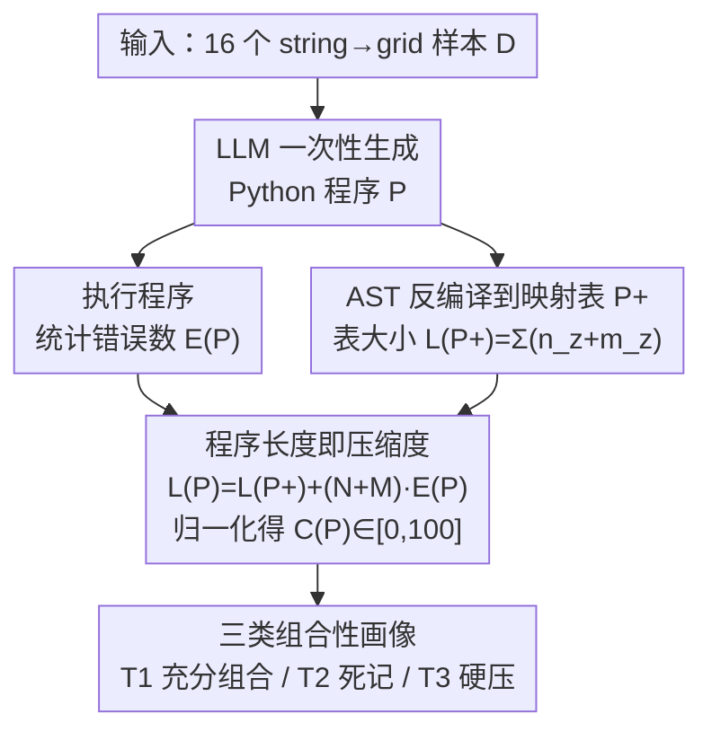

# Investigating More Explainable and Partition-Free Compositionality Estimation for LLMs: A Rule-Generation Perspective

**会议**: ACL 2026  
**arXiv**: [2604.27340](https://arxiv.org/abs/2604.27340)  
**代码**: https://github.com/xzy-xzy/RGP (有)  
**领域**: 可解释性 / 组合性评估 / LLM 评测  
**关键词**: 组合泛化, Kolmogorov 复杂度, 规则生成, 程序长度, 大模型评测

## 一句话总结
论文跳出"造测试集做组合泛化测试"的传统范式，让 LLM 直接为整个数据集生成一段 Python 程序作为映射规则，再用基于 Kolmogorov 复杂度上界的 $\mathcal{C}(\text{P})$ 把"程序的压缩度 + 正确率"折成 0–100 的组合性分数；从而把"看输出对不对"换成"看规则压得多紧"，既绕开了大模型预训练时已经"见过组合"的污染，又给出了可解释的内省式评估。

## 研究背景与动机
**领域现状**：研究 LLM 组合性的标准做法是"组合泛化测试"——把训练集 / 测试集按"测试集组合在训练里没出现"为原则切开，比较模型在测试集上的准确率。

**现有痛点**：(L1) 这种范式只看结果对错，看不到模型对"组合性本身"的理解，缺可解释性；(L2) 现在的 LLM 在海量预训练语料里早就"见过"绝大多数所谓未见组合，"组合泄漏"让评测的根基松动。换言之，测试集的"unseen"假设对预训练大模型已基本失效。

**核心矛盾**：要真正衡量"模型是否抽象出了组合规律"，就必须避开"考它能不能猜对未见组合"这种黑盒，但 LLM 已是预训练巨兽，几乎没法构造干净的训练-测试切分。

**本文目标**：(1) 让评估直接抓取模型对"组合规律"的内部理解；(2) 完全去掉训练-测试切分的依赖，避免泄漏；(3) 给出一个可比较、可自动化、与人类直觉吻合的标量指标。

**切入角度**：根据 Elmoznino 2025 的复杂度理论，组合性可定义为 $\mathcal{K}(D_Y)/\mathcal{K}(D_Y|D_X)$——能用输入"压缩"输出的程度。Kolmogorov 复杂度算不出来但能取上界，而 LLM 自己生成的程序长度就是一个天然上界。

**核心 idea**：让 LLM 看完整数据集后写一段 Python 程序复现映射，把"程序里到底用了多少组件值"映射成统一格式 $\mathrm{P}^+$ 的"映射表大小"，再加上正确性惩罚得到 $L(\mathrm{P})$，归一化为 $\mathcal{C}(\mathrm{P})\in[0,100]$，分数越高代表 LLM 越成功地用组合性压缩了数据。

## 方法详解

### 整体框架
任务被刻意设计得足够简单：string-to-grid——输入一个 4 位字符串、输出一个 $4\times 4$ 格子，每一位字母决定其中 4 个固定格点的字符。整个数据集只有 $d=16$ 个样本 $D=\{(x_i,y_i)\}$，作者把它们一次性全部喂给 LLM，让模型写一段 Python 程序 $\mathrm{P}$ 去复现这个映射。拿到程序后，评测流水线先执行它统计错了几条、再用静态解析把它"反编译"成一张统一的映射表，最后把"表有多大"与"错了多少"折成一个 0–100 的组合性分数 $\mathcal{C}(\mathrm{P})$——分数越高，说明 LLM 越成功地用组合规律压缩了这份数据，而不是把 16 个样本死记下来。

### 关键设计

**1. 程序长度即压缩度：把组合性量化成 Kolmogorov 复杂度的可算上界**

理论上组合性等价于"用输入压缩输出"的程度，即 $\mathcal{K}(D_Y|D_X)$ 越小越组合，但 Kolmogorov 复杂度本身不可算；作者的突破口是——LLM 自己生成的程序长度就是这个量的一个天然上界，只要把"组件值在程序里出现"当作唯一的计数单位即可。具体做法是先把程序静态解析成一张映射表 $\mathrm{P}^+$，其表大小 $L(\mathrm{P}^+)=\sum_z(n_z+m_z)$，其中 $n_z$ 是涉及的输入分量长度、$m_z$ 是输出分量长度。若模型真正抽出了组合规律、独立建模 4 位 × 2 值 = 8 条 atomic 映射，理论最小 $L(\mathrm{P}^+)=U(N+M)=40$；若它放弃组合、直接枚举全部 16 个样本，则 $L(\mathrm{P}^+)=d(N+M)=320$。

接着把"压得对不对"折进同一坐标：执行程序得到错误数 $E(\mathrm{P})=\sum_i[\mathrm{P}(x_i)\ne y_i]$，每错一条就当作要补一条完整映射，于是 $L(\mathrm{P})=L(\mathrm{P}^+)+(N+M)\cdot E(\mathrm{P})$（$N=4,M=16$），再归一化到统一刻度：

$$\mathcal{C}(\mathrm{P})=100\cdot\frac{L_z-\mathrm{Clip}(L(\mathrm{P}),L_z,L_s)}{L_z-L_s},\quad L_s=40\ (\text{充分组合}),\ L_z=320\ (\text{零组合}).$$

之所以要先归一到映射表 $\mathrm{P}^+$ 再计长度，是为了抹掉变量命名、注释、代码格式这些"非本质长度"差异，让不同 LLM 写出的风格各异的程序变得直接可比；同时把错误折成"补丁条数"吃进同一坐标，使单个标量 $\mathcal{C}(\mathrm{P})$ 就能同时反映"压得紧"和"压得对"。

**2. 基于 AST 的程序到映射表反编译：把任意 Python 写法统一成可计数的条目**

LLM 写程序的风格千差万别——dict、if-else、列表、推导式都可能用，若对每种风格手写抽取规则既费力又会偏倚某一种写法，破坏跨模型公平。作者改用 Python AST 自动抽取三类组合源：(a) 显式 dict 的 key→value；(b) 同一行赋值或字面量中共现的输入值；(c) 嵌套 if/elif/else 路径上的隐式条件组合。对赋值语句维护"变量 → 已涉及输入值集合"的向前传播，对 else 分支则用"if/elif 互补"虚拟出一个假设取值，相同组合多次出现只计一次。靠这套 AST + 集合传播，绝大多数 Python 风格都能被统一映射到 $\mathrm{P}^+$ 表格，从而稳定地算出 $\sum n_z$ 与 $\sum m_z$。

**3. 三类组合性画像（T1/T2/T3）：把单一标量拆成可读的二维诊断**

纯标量分数会把"保守背书式"和"激进瞎写式"两种截然不同的失败混为一谈，因此作者把压缩度 $L(\mathrm{P}^+)$ 与压缩损失 $E(\mathrm{P})$ 两维交叉，得到三类典型模式：T1 是低 $L(\mathrm{P}^+)$ + 低 $E(\mathrm{P})$，即"抓到规律且正确"的充分组合性；T2 是高 $L(\mathrm{P}^+)$ + 低 $E(\mathrm{P})$，即压不动规律只能靠枚举凑对的"死记"；T3 是低 $L(\mathrm{P}^+)$ + 高 $E(\mathrm{P})$，即编了个简短算法却错很多的"硬压乱压"。T2 与 T3 可以拿到同样低的 $\mathcal{C}$，却对应完全相反的病因，因此这张二维画像直接告诉你"模型究竟把组合性当成了什么"，从而指明后续是该鼓励压缩还是该纠错。

### 损失函数 / 训练策略
整套方法完全 training-free，是对预训练 LLM 的外部评测协议，不做任何训练或微调——所有"组合性"都由一次 prompt 让 LLM 生成程序、再由解析器自动评分得到。

## 实验关键数据

### 主实验
4 种规则设置（Horizontal / Block / Vertical / Random），每种采样 30 个组合函数，11 个 LLM 平均 $\mathcal{C}(\mathrm{P})$：

| 模型 | Horizontal | Block | Vertical | Random |
|---|---|---|---|---|
| o3-mini | **95.69** | **57.07** | 27.31 | 0.67 |
| Gemini-2.5 Pro | 92.92 | 42.96 | **30.39** | **10.00** |
| o1-mini | 94.49 | 19.38 | 4.29 | 0.00 |
| DeepSeek-R1 | 89.80 | 7.62 | 0.00 | 0.00 |
| Claude-3.7 | 84.67 | 47.57 | 14.71 | 3.52 |
| QwQ-Plus | 44.00 | 2.86 | 23.31 | 0.00 |
| DeepSeek-V3（非推理） | 42.87 | 0.00 | 0.00 | 3.33 |
| Qwen-Max（非推理） | 46.67 | 0.48 | 0.00 | 0.00 |
| GPT-4o（非推理） | 0.00 | 0.00 | 0.00 | 0.00 |
| Gemini-2.0 | 7.77 | 0.43 | 0.67 | 3.71 |
| Claude-3.5 | 6.69 | 0.00 | 0.00 | 0.00 |

整体顺序：Horizontal > Block > Vertical > Random，反映"组件在线性文本视图下是否连续"决定 LLM 抓不抓得到组合性；非推理模型几乎在 Random 上全军覆没（除 GPT-4o，它连 Horizontal 都是 0）。

### 扩展实验（鲁棒性测试）

| 模型 | RI(H) $\mathcal{C}$（vs 基线 Horizontal） | SC(H+R) $\mathcal{C}$（vs 两设置均值） |
|---|---|---|
| DeepSeek-R1 | 26.54 (−63.26) | 27.43 (−17.47) |
| o3-mini | 73.20 (−22.49) | **78.79 (+30.61)** |
| Gemini-2.5 Pro | 76.58 (−16.33) | 38.98 (−12.48) |
| Claude-3.7 | **79.04** (−5.63) | 66.39 (+22.30) |
| QwQ-Plus | 0.00 (−44.00) | 4.00 (−18.00) |
| Qwen-Max | 1.38 (−45.29) | 6.67 (−16.67) |
| GPT-4o | 0.00 (0) | 0.00 (0) |

RI(H) = "把第 i 位决定第 i 行"打乱成随机行；SC(H+R) = 随机 2 行用 Horizontal，其余 14 格用 Random。RI 下大多数推理模型 $\mathcal{C}$ 暴跌（说明依赖顺序对应抓组合性，并非真懂"位与点的解耦"）；SC 下只有 o3-mini 和 Claude-3.7 反而比两者均值更高，说明它们能"独立地"对易/难子组件分而治之。

### 关键发现
- **推理模型 > 非推理模型，但只在直觉强的设置上**：reasoning models 在 Horizontal 上能拿 84–96 分，但到 Random 几乎全 0，证明它们的优势并非"理解组合性"而是"理解二维空间直觉"。
- **顺序对应 ≠ 组合理解**：把 Horizontal 的 i→i 索引随机打乱后，6/6 推理模型里 5 个 $\mathcal{C}$ 暴跌（DeepSeek-R1 −63、QwQ −44），说明它们之前的高分相当一部分靠 "i 行对 i 位" 的低维捷径。
- **独立组件捕捉是真正区分点**：Setting Combination 下，Claude-3.7 和 o3-mini 反而比单一设置平均更好，论文计数显示二者在 30 个采样里分别有 29 / 27 次成功"H 部分单独建模 + R 部分单独枚举"，是当前最接近"真组合性"的能力。
- **规则视角 ≠ 结果视角**：与传统组合泛化准确率 $\mathcal{A}$ 对比（表 3），同一模型在 Horizontal 上结果准确率可达 100% 但 $\mathcal{C}(\mathrm{P})$ 只有 30%，证实"会算对结果"不等于"能讲清规则"，两者相关性微弱。
- **方法可控性**：作者验证 (a) 三组不同风格 prompt 下排序不变（prompt 不敏感）；(b) 自然语言直接给规则让 LLM 翻成代码，所有模型 ≥98% 正确，证明编程能力不是瓶颈，组合性低就是真低。

## 亮点与洞察
- **把"评估"从黑箱搬到白箱**：让 LLM 把"它脑中以为的规律"写成可执行程序，这一外化动作本身就是组合性研究方向上的范式转换——以前你只能盯输出，现在你能直接读规则，连失败模式都能定性。
- **Kolmogorov 复杂度的工程化落地**：理论上 $\mathcal{K}$ 不可算，作者通过"统一映射表 $\mathrm{P}^+$"硬把多个 LLM 的程序长度变得可比，且把"错误"折成"补丁条数"也吃进同一坐标——这种用极简数学包装复杂概念的做法很优雅。
- **二维诊断图（压缩度 × 错误数）的可解释性**：T1/T2/T3 的三象限划分直接告诉你模型是"压对/不敢压/瞎压"，比单一标量分数信息量大得多，给后续模型改进提供明确方向。
- **partition-free 真正回应了 LLM 时代的痛点**：随着预训练语料几乎覆盖所有可能组合，"未见组合测试集"的概念已不成立；本文是少数正面承认并系统应对此问题的工作。

## 局限与展望
- 作者承认：(a) 任务必须足够简单才能保证 LLM 写得对代码（论文只敢用 string-to-grid），扩到 SCAN/COGS 等真实 NLP 任务会被编程能力卡住；(b) 程序→映射表的反编译依赖启发式 AST 规则，新模型/新写法可能落到规则覆盖之外；(c) 用自然语言作 rule language 能绕开编程瓶颈，但量化自然语言压缩度仍是开放问题。
- 自己发现：(d) 任务结构对 LLM 的"二维直觉"过度依赖（Horizontal vs Random 差 60+ 分），让结论一定程度上是"LLM 能不能想成二维图"的代理而非纯粹组合性；(e) 评测对 prompt 与 random seed 的不确定度不小（表 4 标准差几十），结论需要 30 次平均才稳；(f) 同一 $\mathcal{C}(\mathrm{P})$ 之下 T2 与 T3 完全是不同病因，作者画像很好但还没给出后续修复建议。
- 改进思路：把基础任务扩展到代数/语义解析，并设计 LLM-graded 自然语言压缩度量；引入更精细的"组件独立性"测试集（如 i→i 的更多扰动）剥离"二维直觉"贡献。

## 相关工作与启发
- **vs Lake & Baroni (SCAN) / Keysers (COGS)**：经典组合泛化测试范式，依赖切分；本文承认"切分对预训练 LLM 已失效"并改走 partition-free。
- **vs Elmoznino 2025 complexity-based theory**：本文是该理论在 LLM 评估上的第一个工程实现，把抽象的"$\mathcal{K}(D_Y|D_X)$ 上界"落到"统一映射表的总长度"。
- **vs Chuang/Soulos 2024 等"内部机制式"组合性研究**：他们盯神经元/激活，本文盯模型外化的"程序"，技术门槛低且模型无关。
- **vs FrugalGPT / RouteLLM 等结果级 benchmark**：那类工作只关心准确率，本文表 3 证明结果准确率与规则压缩度几乎不相关，提示评测维度需要扩展。

## 评分
- 新颖性: ⭐⭐⭐⭐⭐ "让 LLM 写代码代替考它答题"是真正范式级的新评测思路，且把 Kolmogorov 理论落地的姿态干净漂亮。
- 实验充分度: ⭐⭐⭐⭐ 11 个主流模型 × 4 基础设置 × 2 扩展设置 + 显著性检验 + prompt 敏感性扫描 + 编程能力对照，覆盖到位；但任务复杂度受限。
- 写作质量: ⭐⭐⭐⭐ 数学定义清晰、三类画像直观，附录详尽给出 AST 解析规则；个别地方公式与文字交错略密。
- 价值: ⭐⭐⭐⭐ 对组合性研究社区有方法论级别贡献，且揭示了"reasoning models 在简单组合任务上依赖二维直觉"这一令人警醒的发现。

<!-- RELATED:START -->

## 相关论文

- [\[AAAI 2026\] Explainable Melanoma Diagnosis with Contrastive Learning and LLM-based Report Generation](../../AAAI2026/interpretability/explainable_melanoma_diagnosis_with_contrastive_learning_and_llm-based_report_ge.md)
- [\[ACL 2026\] Interpretable Traces, Unexpected Outcomes: Investigating the Disconnect in Trace-Based Knowledge Distillation](interpretable_traces_unexpected_outcomes_investigating_the_disconnect_in_trace-b.md)
- [\[ACL 2026\] Through a Compressed Lens: Investigating The Impact of Quantization on Factual Knowledge Recall](through_a_compressed_lens_investigating_the_impact_of_quantization_on_factual_kn.md)
- [\[ACL 2026\] Evian: Towards Explainable Visual Instruction-tuning Data Auditing](evian_towards_explainable_visual_instruction-tuning_data_auditing.md)
- [\[ICLR 2026\] GAVEL: Towards Rule-Based Safety through Activation Monitoring](../../ICLR2026/interpretability/gavel_towards_rule-based_safety_through_activation_monitoring.md)

<!-- RELATED:END -->
