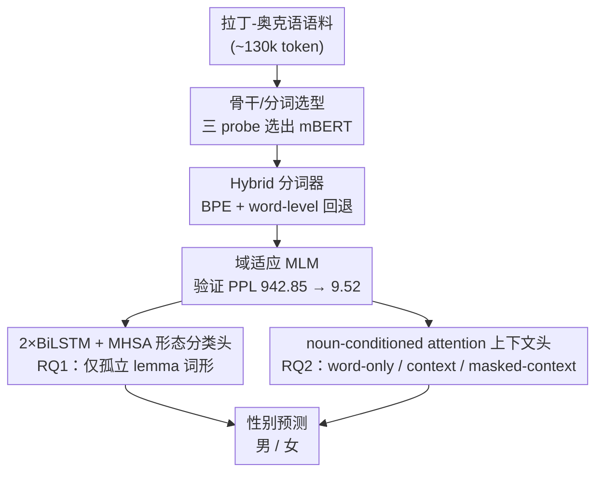

# Lost in Translation? Exploring the Shift in Grammatical Gender from Latin to Occitan

**会议**: ACL 2026  
**arXiv**: [2605.09156](https://arxiv.org/abs/2605.09156)  
**代码**: https://github.com/ahan-2000/Lost-in-Translation- (有)  
**领域**: 计算语言学 / 历史语言学 / 低资源 NLP  
**关键词**: 中世纪奥克语、语法性别、拉丁中性词、可解释 NLP、混合分词

## 一句话总结
针对中世纪奥克语这种低资源历史语言，作者搭了一套 mBERT + 混合分词 + 域适应 MLM 的可解释框架，把"原拉丁中性名词在奥克语里到底是男性还是女性"这个问题拆成词形线索 vs. 句法上下文两路证据来量化，发现后缀形态贡献最大单一信号、上下文（尤其冠词与形容词）能把宏 F1 从 0.665 推到 0.929。

## 研究背景与动机

**领域现状**：罗曼语族从拉丁三性（男 / 女 / 中）演化成两性（男 / 女）是历史语言学的经典问题，但绝大多数计算研究集中在法语、西语等高资源语言，奥克语虽是 UNESCO 列入"濒危"的浪漫语，相关 NLP 工作极其稀少。

**现有痛点**：① 中世纪奥克语正字法极度不稳定，同一词条往往有多种拼写，标准 WordPiece/BPE 分词器要么 OOV 率高、要么把有意义的形态线索拆碎；② 已有性别预测工作要么纯规则（不可迁移）、要么只看孤立词形（忽视一致性），没有量化"词形 vs. 上下文"各自贡献多少；③ 拉丁中性名词在奥克语里到底归男归女缺乏系统的可解释分析。

**核心矛盾**：性别信息其实分布在两个层面 —— 词内形态（后缀 `-um/-ia/-la`）和句子级一致性（冠词 `lo/la`、形容词词尾）—— 但现有方法没把两路证据分开看，导致既无法解释模型为何成功，也无法在词形模糊（如 `psalmista`）时知道上下文到底救了多少。

**本文目标**：(RQ1) 仅靠词级形态特征能预测多少奥克语性别？(RQ2) 加上句子上下文后增益多少、由哪些词性提供？

**切入角度**：把"性别分配"看成一个可量化的双源问题——词内信号 + 上下文信号，分别建模、对比，再用消融、SHAP、PoS occlusion 三种可解释工具把每一路证据拆开看。

**核心 idea**：用 mBERT + 混合分词（语料 BPE + word-level 回退）+ 域适应 MLM 作为统一骨干，分别构造 word-only / context / masked-context 三种输入，对比它们在性别预测上的 Macro-F1 与 log-prob 增量，从而量化形态与上下文各自的贡献。

## 方法详解

### 整体框架

整套框架的目标是把"拉丁中性名词在奥克语里归男还是归女"这个判断，拆成词内形态与句法上下文两路证据分别量化。流程上先做骨干与分词的预备选型——在拉丁-奥克语对上用 FastText / mBERT / ByT5 跑三个 probe（冻结性别预测、Latin→Occitan 变体检索、聚类）选出 mBERT 作骨干，再比较 WordPiece、纯 BPE 与 Hybrid 分词后用 Hybrid 词表对 mBERT 做 10 epoch 域适应 MLM（验证 PPL 从 942.85 降到 9.52）。在这个骨干之上分两条预测线：RQ1 用孤立 lemma 的形态-音系特征（后缀 n-gram、音节数、CV 模板、重音代理等）拼接预训练表示，喂给一组分类头做 10 折 lemma-grouped CV，量化"只看词形能预测多少性别"；RQ2 把约 130k token 语料里的名词对齐到拉丁-奥克语 lemma 词典后，构造 word-only / context / masked-context 三种输入，用同一 mBERT + MLP head 对比，量化上下文一致性带来的增量。

### 关键设计

**1. Hybrid 分词器（BPE + word-level 回退）：在高拼写噪声语料里同时拿到零 OOV 和有意义的子词**

中世纪奥克语正字法极不稳定，标准 mBERT WordPiece 虽能做到 0% OOV 但 masked recovery 只有 15.78%，纯 BPE（vocab=600/800）又反而引入 2.63–2.86% 的 OOV、recovery 仅 3–5%，两条路都偏废。Hybrid 的做法是先在奥克语语料上训一个小词表 BPE，按 $V_{t+1}=V_t\cup\{ab\},\ (a,b)=\arg\max_{(x,y)} f(x,y)$ 迭代合并最高频对，再加一条 word-level 回退规则：任何 BPE 切不开的整词原样保留。这样 BPE 子词能捕到 `primpcipat` 里 `mp` 这种辅音簇变体、`secretament` 词尾 `t`（对应 Old Occitan 副词 `-t` 脱落）等历史变异规律，而回退规则兜住了零 OOV，最终 Hybrid 是唯一同时实现 0% OOV 且 masked recovery 达 25.23% 的方案，成为后续 mBERT 表现最好的基础。

**2. 2×BiLSTM + MHSA 形态分类头：既建模子词序列又定位最敏感的位置**

性别信号既藏在后缀、也可能藏在词中某些音位组合上，树模型和浅 LSTM 只能拿到约 0.71–0.78 的 F1，吃不下这种"序列 + 关键位置"的双重结构。这个头以孤立 lemma 的多源特征（拉丁/奥克语 n-gram + 句法-音系特征 + mBERT embedding）为输入：双层 BiLSTM 先捕捉子词序列的顺序依赖，再叠一层 8-head 自注意力让模型在序列里找到对性别最敏感的子词位置，训练用 label smoothing CE 或 focal loss + class weight 来抗 2:1 类别不平衡。在 mBERT embedding 上它取得最佳 lemma 级 Macro-F1 = 0.8224。

**3. noun-conditioned attention 上下文头：把消歧权重交给可解释的注意力分布**

在奥克语里真正消歧 `la torista` 性别的是冠词 `la`，若 naive 地用整句 `[CLS]` 池化会把这种局部一致性信号稀释掉。这个头先用 mBERT 编码整句得到 $H=(h_1,\dots,h_T)$，再把目标名词位置 $i$ 的隐状态 $h_i$ 当 query、全句当 key/value 做多头注意力 $\mathrm{Attn}(h_i, H, H)$，让模型显式聚焦"我现在要定这个名词的性别"，随后与拉丁 lemma embedding $e(L)$、拉丁性别 one-hot $\mathrm{onehot}(G_L)$ 拼接送入共享 MLP $p(y\mid r)=\mathrm{softmax}(f_\phi(r))$。配套的 masked-context 变体把名词位替成 `[MASK]` 再读 $h_i^{\text{mask}}$，专门测"剥掉名词本身后单凭上下文能恢复多少性别"，从而把形态与上下文两路证据干净地分离开来。

### 损失函数 / 训练策略
- 词级实验用 lemma-grouped 10-fold CV 防变体泄漏，Optuna 贝叶斯优化超参，最佳头是 2×BiLSTM+MHSA，CE + label smoothing 0.1，训练 100 epoch；不平衡用 focal loss + class weights 处理。
- 上下文实验用 group K-fold（3 折，按 lemma 分组），AdamW，warmup 0.06 + 线性衰减，grad clip 0.5，dropout 0.1，固定随机种子 13。

## 实验关键数据

### 主实验

| 设置 (mBERT) | Accuracy | Macro F1 |
|---|---|---|
| Word-only | $0.808 \pm 0.154$ | $0.665 \pm 0.108$ |
| Context model (noun attention) | $0.979 \pm 0.012$ | $0.929 \pm 0.034$ |
| Context model (noun masked) | $0.977 \pm 0.008$ | $0.902 \pm 0.097$ |

加上上下文后 Macro-F1 从 0.665 跳到 0.929（+26.4），masked-context 仍达 0.902，说明上下文里的一致性信号本身就能恢复绝大多数性别。lemma 级最佳为 mBERT + 2×BiLSTM+MHSA，Macro-F1 = $0.8224 \pm 0.0385$，配对 bootstrap 显示对 ByT5 优势 $\Delta = +0.0395$，95% CI $[+0.0250, +0.0543]$，$p<10^{-6}$。

### 消融实验

| 移除特征块 | F1 (mBERT) | $\Delta$ | % drop |
|---|---|---|---|
| Latin n-grams | 0.8092 | 0.0132 | 1.61% |
| Meta-features | 0.8168 | 0.0056 | 0.68% |
| Occitan n-grams | 0.8169 | 0.0055 | 0.67% |
| Syllable counts | 0.8194 | 0.0030 | 0.37% |
| VC patterns | 0.8220 | 0.0004 | 0.05% |
| Stress patterns | 0.8239 | -0.0015 | -0.18% |

附加 PoS-conditioned occlusion 实验：NOUN 的 mean $\Delta=+0.0026$、DET $+0.0010$、ADJ $+0.0003$（均 $p<10^{-4}$ 显著为正），CCONJ/ADP/VERB 反而是负贡献，PUNCT/PRON 不显著，定量证实"性别信息主要靠名词 + 冠词 + 形容词三类一致性载体"。

### 关键发现
- 后缀形态是最强单源信号：去掉拉丁 n-gram 在三种 embedding 上都掉 1.6–1.8 个 F1 点，远高于 VC 模板或重音代理；重音代理甚至轻微伤害模型（去掉后 F1 反升 0.001-0.002），暗示作者的启发式重音规则有噪声。
- 上下文带来巨大增量：context vs. word-only 的 $\Delta_1^{\text{prob}}=+0.283$、$\Delta_2^{\log p}=+0.340$（95% CI 均严格大于 0），说明上下文不仅提升准确率，还稳定推高了对真实类别的置信度。
- 拉丁元信息是上下文的"放大器"：去掉拉丁 lemma + 拉丁性别后，masked-context 增益从 ~0.28 跌到 ~0.09–0.11（约 3× 缩水），说明跨语对齐特征和上下文是互补放大关系而非冗余。

## 亮点与洞察
- 把"形态 vs. 上下文"做成可对比的三档输入（word-only / context / masked-context），masked-context 设计尤为精巧——它强迫模型在不看名词本身的前提下从句法一致性恢复性别，从而干净地剥离两路信号的贡献。
- Hybrid 分词器同时拿到 0% OOV 和 25.23% masked recovery，反衬出"低资源历史语料里 OOV 与子词质量不是非此即彼"，这个组合策略可以直接迁移到拉丁、古希腊、古典阿拉伯等存在拼写不稳定的语言。
- PoS-conditioned occlusion + 符号翻转置换检验给出了每种词性对性别预测的统计学显著贡献，这个轻量级 attribution 工具值得迁移到任何"一致性驱动"的语言学任务（如格、数、人称预测）。

## 局限与展望
- 语料体量小（~130k token）且 2:1 不平衡，对女性类的泛化能力受限；focal loss + class weight 只能缓解不能根治。
- 关键超参用启发式定：模糊匹配阈值 $\tau=0.85$、重音代理规则、$\alpha=0.3$ 等都缺乏系统调参；消融已显示重音代理引入轻微噪声。
- PoS occlusion 依赖自动标注，但 PoS tagger 整体 71% 准确率（NOUN 70%、ADJ 最低），attribution 结果会被打标错误污染。
- 句首/句尾名词以及一致性词稀疏的句子表现明显差，错误分析显示这是最大误差源；后续可加 boundary-aware 注意力 mask 或额外句法监督。
- 整套结论只在"拉丁中性 → 奥克语男 / 女"这一历史转折上验证，能否推广到其他罗曼语（如普罗旺斯方言、加泰罗尼亚语）尚未测试；也未直接回答"历史上为什么发生这个重新分配"，需要 diachronic 平行数据。

## 相关工作与启发
- **vs Williams et al. (2019) 信息论量化德语/捷克语性别**：他们也把性别拆成 form/meaning/inflection 三源做信息论分解，本文则面向低资源历史语料、加入 BERT-style 上下文 attribution；本文优势是显式量化 word vs. context 增量并提供 PoS 级解释，劣势是没有形式化的 mutual information 估计。
- **vs Cucerzan & Yarowsky (2003) 最小监督上下文性别归纳**：他们用 co-occurrence with gendered articles 推未见词性别，本文是 neural 版本（mBERT + attention），并提供了可量化的 masked vs. unmasked 对比；启发是"冠词/形容词作为弱标签"这条思路在历史语料里依然成立、效果还很强。
- **vs 法语规则式性别预测（Lyster 2006）**：规则方法可解释但完全语言相关，本文的混合分词 + 域适应 mBERT 范式更具迁移性，且通过 SHAP/occlusion 提供与规则等价的"哪个后缀最重要"的可视化。

## 评分
- 新颖性: ⭐⭐⭐ 没有炫技模型，但"用 NLP 量化历史语言学问题 + 可解释双源对比"对中世纪奥克语属空白填补
- 实验充分度: ⭐⭐⭐⭐ 嵌入 / 分词 / 特征三层消融 + paired bootstrap + 符号翻转检验 + SHAP + occlusion 一应俱全
- 写作质量: ⭐⭐⭐⭐ 研究问题清晰、结论与数据严格对齐、附录完整
- 价值: ⭐⭐⭐ 对历史语言学和低资源 NLP 双方向都有借鉴；模型本身不算先进但方法学框架可复用

<!-- RELATED:START -->

## 相关论文

- [\[ICLR 2026\] Exploring Interpretability for Visual Prompt Tuning with Cross-layer Concepts](../../ICLR2026/interpretability/exploring_interpretability_for_visual_prompt_tuning_with_cross-layer_concepts.md)
- [\[AAAI 2026\] Finding the Translation Switch: Discovering and Exploiting the Task-Initiation Features in LLMs](../../AAAI2026/interpretability/finding_the_translation_switch_discovering_and_exploiting_the_task-initiation_fe.md)
- [\[ACL 2025\] CLEME2.0: Towards Interpretable Evaluation by Disentangling Edits for Grammatical Error Correction](../../ACL2025/interpretability/cleme2_gec_evaluation.md)
- [\[ICML 2026\] Optimal Attention Temperature Improves the Robustness of In-Context Learning under Distribution Shift in High Dimensions](../../ICML2026/interpretability/optimal_attention_temperature_improves_the_robustness_of_in-context_learning_und.md)
- [\[ACL 2026\] Learning What Matters: Dynamic Dimension Selection and Aggregation for Interpretable Vision-Language Reward Modeling](learning_what_matters_dynamic_dimension_selection_and_aggregation_for_interpreta.md)

<!-- RELATED:END -->
