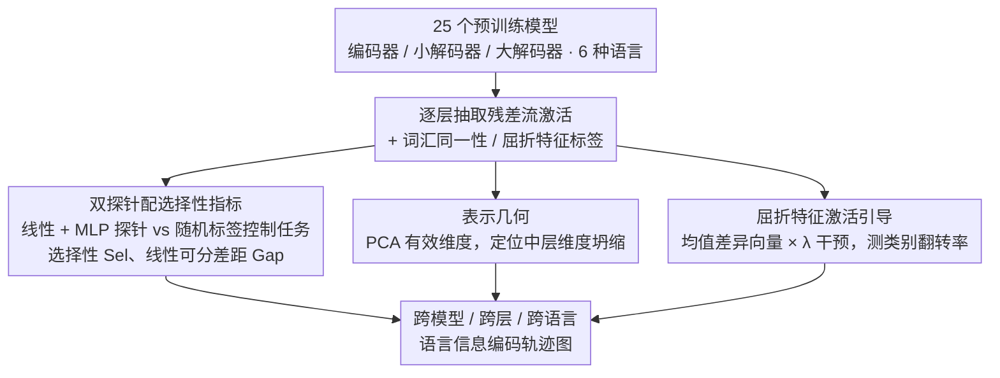

# Model Internal Sleuthing: Finding Lexical Identity and Inflectional Features in Modern Language Models

**会议**: ACL 2026  
**arXiv**: [2506.02132](https://arxiv.org/abs/2506.02132)  
**代码**: [https://github.com/ml5885/model_internal_sleuthing](https://github.com/ml5885/model_internal_sleuthing)  
**领域**: 模型压缩 / NLP理解  
**关键词**: 语言探针, 词汇同一性, 屈折特征, 表示几何, 跨语言分析

## 一句话总结
本文系统地对 25 个 Transformer 语言模型（从 BERT Base 到 Qwen2.5-7B）进行探针分析，发现词汇同一性（lexeme）在早期层线性可解码但随深度衰减，而屈折特征（inflection）在所有层中保持稳定可读，且占据紧凑可控的子空间。

## 研究背景与动机

**领域现状**：探针研究（probing）是理解 Transformer 内部语言表示的核心方法，早期工作已在 BERT 和 GPT-2 上建立了"不同层编码不同语言层级"的层次化理解——底层编码表面特征，中层编码句法，高层编码语义。

**现有痛点**：此前的探针研究几乎全部聚焦于第一代模型（BERT、GPT-2），而现代 LLM 在架构（编码器/解码器）、训练数据规模（数十亿 vs 万亿 token）、后训练适配等方面已发生巨大变化，早期结论是否仍成立缺乏验证。

**核心矛盾**：我们对现代大型语言模型如何编码基础语言信息（词汇身份 vs 语法屈折）的理解，仍建立在过时的小模型实验基础上，存在严重的知识断层。

**本文目标**：(1) 在 25 个现代模型上系统探测词汇同一性和屈折特征的编码模式；(2) 分析表示几何、注意力 vs 残差流、激活引导、预训练动态等多个维度。

**切入角度**：选择词汇同一性（lexeme，如 walk/walked 共享词元）和屈折特征（如复数、过去式）两个属性——前者关联语义，后者关联语法——用来解耦模型如何权衡"意义"与"形式"。

**核心 idea**：用线性/非线性探针+选择性指标+表示几何分析+激活引导实验，全面刻画现代 LLM 中词汇与屈折信息的编码轨迹。

## 方法详解

### 整体框架

本文不训练新模型，而是把 25 个现成的预训练模型（覆盖编码器/小解码器/大解码器三类架构、六种语言）当作待解剖的对象。流程是：逐层抽出每个词的残差流激活作为输入，分别训练探针去回读两类标签——词汇同一性（lexeme，如 walk/walked 是否同词元）和屈折特征（如复数、过去式），再用选择性、表示几何、激活引导三套工具把"探针准确率"翻译成"信息是否真被编码、占据什么样的子空间、能否被因果操控"的结论。最终输出是一张跨模型、跨层、跨语言的语言信息编码轨迹图。

### 关键设计

**1. 双探针配选择性指标：把"记忆"从"编码"里剥出来**

探针研究的老毛病是高准确率会骗人——一个容量足够大的探针，即使表示里没有真正的语言结构，也能靠记忆训练样本刷出漂亮的数字。本文对每一层同时训练线性回归探针和两层 MLP 探针，并为每个任务配一份随机标签的控制任务做对照。真正的语言信号用选择性度量 $\text{Sel}_\ell = \text{Acc}^\text{real}_\ell - \text{Acc}^\text{control}_\ell$ 来定义：只有当真实标签的准确率显著高于随机标签时，才说明这一层确实编码了该信息，否则高准确率只是记忆伪信号。

在此基础上再引入线性可分性差距 $\text{Gap}_\ell = \text{Sel}^\text{nonlin}_\ell - \text{Sel}^\text{linear}_\ell$，比较 MLP 与线性探针的选择性之差。如果差距为正，说明非线性探针确实读出了线性探针读不到的真实结构；而本文观察到 Gap 几乎全局为负，反过来证明 MLP 的额外容量主要被用来捕获虚假关联，而非挖出更深的语言信息。

**2. 表示几何：用有效维度刻画中层的压缩与坍缩**

为了理解信息"住在"什么样的空间里，本文计算每层激活的线性有效维度，即需要多少个 PCA 主成分才能解释固定比例的方差。这一指标直接关联探针性能与引导效果：GPT-2、Qwen2.5、Pythia 在中层出现急剧的维度坍缩，绝对激活值飙升至约 8000，而 Llama、OLMo 则呈现平滑压缩。维度坍缩的层恰恰是引导效果显著下降的层，说明几何结构的剧变会同步改变表示对干预的响应能力。

**3. 屈折特征激活引导：从关联走到因果**

探针只能证明信息"存在"，无法证明它"可被操控"。本文对每一对屈折类别（如单数 vs 复数）计算均值差异向量，以不同强度 $\lambda$ 叠加到隐藏状态上，再用线性探针测量干预后的类别翻转率。结果显示即使是中等强度 $\lambda=5$ 也能造成大幅概率偏移，说明屈折特征不仅被编码，还占据一个紧凑、可控的低维子空间。这条"先探针证明存在、再引导证明可控"的链路，使结论从相关性升级为因果性，对表示工程有实际意义。

### 损失函数 / 训练策略

线性探针采用岭正则化回归的闭式解，MLP 探针为隐层 64 维的两层 ReLU 网络、用标准交叉熵训练；控制任务与真实任务共用同一套探针配置，仅替换标签，以保证选择性的可比性。

## 实验关键数据

### 主实验

| 属性 | 模型类型 | 早期层准确率 | 深层准确率 | 选择性趋势 |
|------|---------|------------|----------|----------|
| 词元(Lexeme) | 编码器 | 0.8-1.0 | 大幅下降 | 接近零 |
| 词元(Lexeme) | 小型解码器 | 0.8-1.0 | 缓慢下降 | 接近零 |
| 词元(Lexeme) | 大型解码器 | 0.8-1.0 | 保持较高 | 接近零 |
| 屈折(Inflection) | 所有 | 0.9-1.0 | 0.9-1.0 | 0.4-0.6 (正) |

### 消融实验

| 分析维度 | 关键发现 | 说明 |
|---------|---------|------|
| 线性vs非线性 | Gap < 0（全局） | MLP额外容量多捕获虚假关联而非真正语言结构 |
| 残差流vs注意力 | 残差流显著优于注意力 | 中层词元：残差0.6-0.9 vs 注意力0.2-0.4 |
| 跨语言 | 土耳其语衰减最快 | 词元准确率从0.95降至0.25，因形态复杂性 |
| 预训练动态 | 屈折早期稳定，词元持续演变 | 屈折几个checkpoint就收敛，词元后期仍在重塑 |

### 关键发现
- 词元信息的高早期准确率伴随接近零的选择性，意味着主要由表面相关性（如子词重叠）驱动而非真正的词汇结构
- 屈折信息在整个模型深度上保持正选择性（0.4-0.6），表明这是被"真正编码"的语言属性
- 频率与探针准确率强相关——罕见词元和罕见屈折形式是主要错误来源
- DeBERTa-v3 在约 75% 深度处出现引导效果骤降，暗示特殊的架构性表示约束

## 亮点与洞察
- **选择性指标的系统性运用**是本文方法论的最大亮点：不仅报告准确率还报告控制对比，有效解决了探针研究中长期存在的"记忆伪信号"问题。这一范式可直接迁移到任何探针实验
- 从"关联"到"因果"的激活引导验证思路很完整：先探针发现信息存在，再用引导证明信息可操控，最后用预训练动态追踪信息何时形成
- 25 个模型 × 6 种语言的覆盖规模前所未有，使结论具有很强的普适性

## 局限与展望
- 解码器模型使用最后一个子词token作为词表示，可能不是所有架构的最优选择
- 探针只能检测关联而非因果机制；引导实验也仅测量分类器变化而非下游生成效果
- 未处理同形异义的歧义情况（如英语中不定式和非过去式动词形式相同）
- 可扩展到更大规模模型（70B+）和更多语言特征（句法依存、语义角色等）

## 相关工作与启发
- **vs Jawahar et al. (2019) / Tenney et al. (2019)**: 他们在 BERT 上建立了层次化语言编码的认知，本文在 25 个现代模型上系统验证/更新了这些结论
- **vs Acs et al. (2024)**: 他们做多语言形态句法探针但限于 mBERT 和 XLM-RoBERTa，本文扩展到现代解码器模型并加入表示几何分析

## 评分
- 新颖性: ⭐⭐⭐⭐ 非全新范式但规模和深度前所未有
- 实验充分度: ⭐⭐⭐⭐⭐ 25模型×6语言×多维度分析极其全面
- 写作质量: ⭐⭐⭐⭐⭐ 结构清晰，叙事流畅，图表丰富

<!-- RELATED:START -->

## 相关论文

- [\[ICLR 2026\] Internal Planning in Language Models: Characterizing Horizon and Branch Awareness](../../ICLR2026/interpretability/internal_planning_in_language_models_characterizing_horizon_and_branch_awareness.md)
- [\[AAAI 2026\] Finding the Translation Switch: Discovering and Exploiting the Task-Initiation Features in LLMs](../../AAAI2026/interpretability/finding_the_translation_switch_discovering_and_exploiting_the_task-initiation_fe.md)
- [\[ICLR 2026\] Universal Properties of Activation Sparsity in Modern Large Language Models](../../ICLR2026/interpretability/universal_properties_of_activation_sparsity_in_modern_large_language_models.md)
- [\[CVPR 2026\] Language Models Can Explain Visual Features via Steering](../../CVPR2026/interpretability/language_models_can_explain_visual_features_via_steering.md)
- [\[ACL 2026\] Dual Alignment Between Language Model Layers and Human Sentence Processing](dual_alignment_between_language_model_layers_and_human_sentence_processing.md)

<!-- RELATED:END -->
