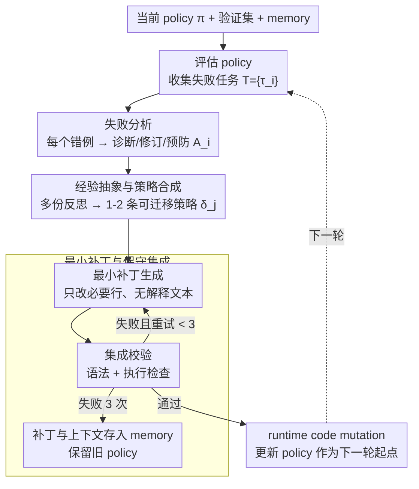

# Polaris: A Gödel Agent Framework for Small Language Models through Experience-Abstracted Policy Repair

**会议**: ACL2026  
**arXiv**: [2603.23129](https://arxiv.org/abs/2603.23129)  
**代码**: 论文缓存中未给出公开仓库地址  
**领域**: llm_agent  
**关键词**: Gödel Agent、小语言模型、自我改进、经验抽象、策略修复

## 一句话总结
Polaris 将 Gödel Agent 的递归自我改进改造成适合 7B/8B 小模型的“失败分析 → 经验抽象 → 最小代码补丁 → 执行校验”策略修复循环，在 MGSM、DROP、GPQA、LitBench 上让小模型获得可解释、可持久复用的 policy-level 改进。

## 研究背景与动机
**领域现状**：语言 agent 的自我改进大致有两条路线：一类是 response-level 的反思与重写，例如 ReAct、Reflexion、Self-Refine、CRITIC；另一类是修改模型参数或知识表示，例如 model editing。Gödel Agent 则提供了第三条路线：把 agent policy 当作可以检查和修改的显式程序对象，让 agent 根据执行轨迹修改自己的 policy。

**现有痛点**：原始 Gödel Agent 思路对上下文和工具调用能力要求很高。论文作者尝试把它搬到 Qwen2.5-7B-Instruct 时，发现 agent 容易因为保留太多验证样本、历史工具调用和调试轨迹而 OOM；上下文变短又会导致工具调用幻觉、重复无效修复和非目标化行为。

**核心矛盾**：递归自我改进需要足够丰富的失败经验，才能生成有迁移性的 policy update；但小模型上下文、显存和 meta-reasoning 能力有限，无法承载大规模历史轨迹。如何在“经验足够抽象”和“上下文足够小”之间取得平衡，是这篇论文的核心问题。

**本文目标**：Polaris 试图让小语言模型也能做 policy-level self-improvement。它不微调参数，也不只修正单个答案，而是把少量失败样本压缩成可复用策略，再生成最小代码补丁，经过语法和执行检查后写回当前 policy。

**切入角度**：作者把失败样本看成“经验”，但不直接把所有失败轨迹塞进上下文，而是先抽象成 diagnosis、revision 和 prevention，再合成少量新策略。这样既保留了失败的可解释性，又减少了小模型在长上下文中迷失的风险。

**核心 idea**：用经验抽象把若干实例级失败压缩成 policy 级修复策略，再用最小可验证补丁完成小模型可承受的递归自我改进。

## 方法详解
Polaris 的目标不是让模型“再想一遍答案”，而是让 agent 修改自己下一次如何解题。它继承 Gödel Agent 的 self-inspect、interact、self-update、continue-improve 框架，但把原始的 repair policy 模块换成一个更保守的经验抽象修复器。整个系统围绕一个可变 policy `π` 运转：先用当前 policy 在验证集上运行，找出失败样本；再分析失败原因，抽象出修复策略，生成代码补丁；最后只要补丁能通过执行检查，就将新 policy 作为下一轮起点。

### 整体框架
输入包括当前 agent policy、任务目标、验证集失败样本和 agent memory；输出是一个修改后的 policy。每一轮先评估当前 policy，收集若干失败任务 `T={τ_i}`。随后 Polaris 对每个失败任务做失败分析（failure analysis），得到结构化反思 `A_i=(diagnosis_i, revision_i, prevention_i)`；再通过策略合成（strategy synthesis）把多个 `A_i` 压缩成一两个可迁移的策略 `δ_j`；接着补丁生成（patch generation）产出只改必要行的代码补丁；最后集成校验（patch integration）检查补丁是否可执行，失败最多重试 3 次，成功后通过 runtime code mutation 更新 policy 作为下一轮起点。

### 关键设计

**1. 失败分析作为可解释经验单元：把每个错例拆成诊断、修订、预防**

小模型有个通病：容易把单个案例的表面特征误当成通用规律，于是越改越偏。Polaris 不让模型对失败写一句泛泛的反思，而是要求 AnalyzeFailure 针对每个失败样本——它带着输入、参考答案、agent 的推理轨迹和预测输出——产出一个结构化的 $A_i=(\text{diagnosis}_i, \text{revision}_i, \text{prevention}_i)$：错在哪、policy 的哪段逻辑该改、以后怎么避免同类错误。把"这次错在哪里"和"policy 该如何改"显式分开，逼模型不再停留在案例表面，得到的反思也是面向 policy 代码的修复记录，而不是一句可有可无的感想。

**2. 经验抽象驱动的策略合成：用少量通用策略替代成堆原始轨迹**

原始 Gödel Agent 把大量历史轨迹塞进上下文，7B 小模型很快被压垮、爆显存。Polaris 的关键一步是 StrategySynthesis：读取当前轮的全部反思 $\{A_i\}$ 加上 memory 里已有的策略，合成一到两个新的可迁移策略 $\delta_j$——比如更细的任务分解、数值归一化、输出格式检查、上下文特定验证或控制流调整——并在 prompt 里要求新策略避免与历史策略重复。这相当于把经验做蒸馏：后续修复复用的是被抽象出来的"规律"，而不是一遍遍复读原始"案例"，于是经验越积越多、上下文却不跟着膨胀，修复策略还能迁移到没见过的实例上。

**3. 最小补丁与保守集成：让 policy update 可审计、可回滚、可执行**

自己改自己的代码，最怕"越修越坏"。PatchGeneration 因此只生成实现该策略所需的最小代码 patch、不附带解释文本；集成时先更新一个临时 policy，再跑语法和执行检查，失败就重试，最多 3 次。长期通不过的 patch 连同上下文被写进 memory 留档，而不是硬塞进 policy。最小补丁压住了副作用的扩散面，执行检查挡住语法错误进入 policy，memory 记录则让每一次失败修复都可追踪——整套机制让 self-modification 更像受控的自动程序修复，而非开放式重写，也顺带提高了人工审计的可行性。

### 一个完整示例：一轮 policy repair 怎么转

设当前 policy `π` 先在 MGSM 的 50 个验证样本上跑一遍，收集到若干失败任务 `T={τ_i}`。Polaris 对其中取 $N$ 个（论文比较 $N=3$ 和 $N=5$）逐个做 failure analysis，每个得到一份 $A_i=(\text{diagnosis}, \text{revision}, \text{prevention})$，比如诊断出"多语言数字解析时漏了归一化"。接着 StrategySynthesis 把这几份反思连同 memory 里的旧策略压成一到两条新策略 $\delta_j$（例如"统一做数值归一化再比较"），并要求别和旧策略重复。PatchGeneration 据此只改 policy 里必要的那几行、生成最小补丁。集成时先写进临时 policy，跑语法和执行检查——通过就用 runtime code mutation 把它作为下一轮起点，没通过就重试，3 次仍失败则把这个 patch 和上下文存进 memory、保留旧 policy。如此一轮轮迭代，best-so-far policy 会以非单调但整体向上的方式超过初始 policy 和 CoT-SC，更像 anytime search 而非标准训练曲线；部署时只保留 champion policy，等 challenger 稳定更好才替换。

### 损失函数 / 训练策略
Polaris 没有参数训练和梯度损失，优化目标是通过迭代 policy repair 提高验证/测试任务表现。实验中 Qwen2.5-7B-Instruct 在两张 32GB V100 上运行，每个独立 run 允许自主演化 10 小时。MGSM 和 DROP 使用 50 个验证样本、250 个测试样本；GPQA 使用 20/100；LitBench 使用 20/250。关键超参是用于反思的失败样本数 `N`，论文比较 `N=3` 和 `N=5`，并把 memory 中保留的历史工具调用从原始 Gödel Agent 的 10 条压到 6 条，以降低上下文和显存压力。

## 实验关键数据

### 主实验
原始 Gödel Agent 直接迁移到 7B 小模型几乎不可行。即便把历史工具消息数减少，`k=5` 仍然全部失败，`k=3` 也只有 DROP 出现 1 次 successful run。Polaris 的经验抽象显著提高了成功率，尤其在 MGSM、GPQA 和 LitBench 上更稳。

| 方法/设置 | MGSM successful | DROP successful | GPQA successful | LitBench successful | 主要观察 |
|-----------|-----------------|-----------------|-----------------|---------------------|----------|
| Gödel Agent, k=3 | 0/5 | 1/5 | 0/5 | 0/5 | 上下文太短后易重复和幻觉工具调用 |
| Gödel Agent, k=5 | 0/5 | 0/5 | 0/5 | 0/5 | 全部 unsuccessful，主要受 OOM 影响 |
| Polaris, N=3 | 5/10 | 3/10 | 4/10 | 6/10 | 小模型可完成多轮 policy repair |
| Polaris, N=5 | 4/10 | 3/10 | 5/10 | 5/10 | 抽象更泛化但上下文压力更大 |

在 successful runs 中，Polaris 相对 CoT-SC baseline 取得非单调但一致的 best-so-far 改进。论文强调不要期待每一步单调上升，因为代码级 policy mutation 是离散搜索；部署时应保留 champion policy，只在 challenger 稳定更好时替换。

| 设置 | MGSM 相对提升 | DROP 相对提升 | GPQA 相对提升 | LitBench 相对提升 |
|------|---------------|---------------|---------------|-------------------|
| Polaris N=3 | +4.0% | +3.9% | +9.0% | +8.8% |
| Polaris N=5 | +3.6% | +5.7% | +9.0% | +5.2% |
| Qwen3-8B N=3 | 4/5 successful | 2/5 successful | 3/5 successful | 4/5 successful |
| devstral-small-2 N=3 | 2/5 successful | 2/5 successful | 2/5 successful | 4/5 successful |

### 消融实验
论文没有做传统模块删除式消融，而是通过对比原始 Gödel Agent、不同 `N`、不同 base model 和失败模式来分析各设计的必要性。

| 分析对象 | 关键结果 | 说明 |
|----------|----------|------|
| 原始 Gödel Agent | k=5 全失败，k=3 仅 DROP 1/5 successful | 说明仅裁剪上下文不能解决小模型自我改进问题 |
| 经验抽象 | Polaris N=3 在四个任务合计 18/40 successful | 少量失败样本可被压缩为可执行 policy repair 策略 |
| N=3 vs N=5 | N=3 波动更大，N=5 策略更泛化但失败也不少 | 反思深度和上下文负担存在 trade-off |
| Qwen3-8B | 成功率更高，但 thinking mode 增加 token 与时间开销 | 小模型能力增强会提升 Polaris 稳定性，但预算仍关键 |
| devstral-small-2 | OOM 明显减少，少数失败主要来自早期坏更新 | 更多算力和更强底座可把失败从资源问题转为算法稳定性问题 |

### 关键发现
- 经验抽象是核心：直接保留失败轨迹会爆上下文，只保留抽象策略又能让修复迁移到 unseen instances。
- Polaris 的收益通常不单调，但 best-so-far policy 能超过初始 policy 和 CoT-SC，这更像 anytime search 而非标准训练曲线。
- DROP 比 MGSM/GPQA/LitBench 更容易失败，因为 DROP 上下文更长，更容易触发 OOM、冗余评估和工具调用错误。
- SLM 的瓶颈不是单一能力，而是 meta-reasoning、tool calling、上下文管理和补丁执行共同构成的系统稳定性。

## 亮点与洞察
- 这篇论文把“agent 自我改进”落到了可检查的 policy patch 上，而不是停留在 verbal feedback。策略一旦写进 policy，就能在后续样本中复用，这是 response-level self-correction 做不到的。
- 经验抽象是一个很适合小模型的记忆压缩形式：不保存长日志，而保存能指导代码改动的 generalized strategy。这对任何资源受限 agent 都有参考价值。
- 最小补丁设计让 self-modification 更像自动程序修复，而不是开放式重写。它降低了模型一次改坏整套 agent 的风险，也提高了人工审计可行性。
- 论文坦诚展示 unsuccessful runs，很有价值。很多 self-improving agent 论文只展示成功轨迹，但 Polaris 通过失败分类说明了真实部署时最先撞到的是工具调用、显存和错误恢复。

## 局限与展望
- Polaris 仍然依赖人工设计的 prompt 模板，包括 failure analysis、strategy synthesis、patch generation 和 integration prompt；这些模板能否自动生成或迁移到新 agent 架构仍未解决。
- 执行检查主要保证语法和运行时可用，并不直接保证性能提升。坏补丁如果恰好可执行，仍可能把 policy 带向低质量轨迹。
- 实验 run 的 unsuccessful 比例仍不低，尤其 DROP 上较明显；实际部署需要 rollback、checkpoint、champion-challenger 机制和更强静态验证。
- 任务仍是固定 benchmark 分布，不等于真正 open-ended learning。论文承认它更接近 bounded self-improvement，而非长期开放环境中的自主学习。
- 小模型的 meta-reasoning 深度有限，对多样失败样本的抽象可能过于泛化；未来可以结合外部 memory、检索式策略库或 verifier 来增强修复质量。

## 相关工作与启发
- **vs Gödel Agent**: Gödel Agent 展示了 policy self-modification 的可能性，但更适合大上下文强模型；Polaris 面向小模型，用经验抽象和保守补丁控制资源开销。
- **vs Reflexion / Self-Refine**: Reflexion 类方法通常把反馈用于下一次回答，更新停留在 verbal memory；Polaris 生成持久 policy patch，改变 agent 的解题程序。
- **vs model editing**: model editing 改权重或表示，效果不透明且难审计；Polaris 改显式 policy 代码，变化位置清楚，但受限于 policy 表达能力。
- **vs automated program repair**: APR 修外部程序，Polaris 修 agent 自己的 policy，二者都强调局部补丁和验证。这个交叉方向值得继续探索，例如加入测试生成和 patch ranking。

## 评分
- 新颖性: ⭐⭐⭐⭐☆ 将 Gödel Agent、经验抽象和最小代码补丁结合，用于小模型自我改进，问题切入很有辨识度。
- 实验充分度: ⭐⭐⭐⭐☆ 覆盖四个任务、多个 base model 和失败模式分析；但缺少更严格的模块级 ablation 与长期部署验证。
- 写作质量: ⭐⭐⭐⭐☆ 方法框架和失败分析清楚，附录给了大量轨迹与 prompt；部分符号和表述略密。
- 价值: ⭐⭐⭐⭐☆ 对资源受限 agent、运行时自适应和可审计 self-improvement 很有启发，但离稳定生产系统还有工程距离。

<!-- RELATED:START -->

## 相关论文

- [\[ACL 2026\] Lightweight LLM Agent Memory with Small Language Models](lightweight_llm_agent_memory_with_small_language_models.md)
- [\[ACL 2026\] Don't Adapt Small Language Models for Tools; Adapt Tool Schemas to the Models](don39t_adapt_small_language_models_for_tools_adapt_tool_schemas_to_the_models.md)
- [\[ACL 2026\] Meta-Tool: Efficient Few-Shot Tool Adaptation for Small Language Models](meta-tool_efficient_few-shot_tool_adaptation_for_small_language_models.md)
- [\[ACL 2026\] CLAG: Adaptive Memory Organization via Agent-Driven Clustering for Small Language Model Agents](clag_adaptive_memory_organization_via_agent-driven_clustering_for_small_language.md)
- [\[ICML 2026\] Scaling Small Agents Through Strategy Auctions](../../ICML2026/llm_agent/scaling_small_agents_through_strategy_auctions.md)

<!-- RELATED:END -->
