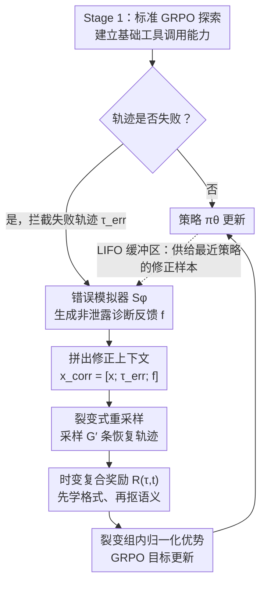

<!-- 由 src/gen_stubs.py 自动生成 -->
# Robust Tool Use via Fission-GRPO: Learning to Recover from Execution Errors

**会议**: ACL 2026  
**arXiv**: [2601.15625](https://arxiv.org/abs/2601.15625)  
**代码**: [GitHub](https://github.com/zxzadm/Fission-GRPO)  
**领域**: LLM对齐  
**关键词**: 工具调用, 错误恢复, 强化学习, GRPO, 错误模拟器

## 一句话总结

提出 Fission-GRPO，在 RL 训练循环中将工具执行错误动态转化为在线策略修正训练实例：通过学习的错误模拟器生成诊断反馈并重采样恢复轨迹，将 Qwen3-8B 的错误恢复率提升 5.7%，整体准确率从 42.75% 提升至 46.75%。

## 研究背景与动机

**领域现状**：LLM 可以有效调用工具，但在多轮执行中遇到 API 错误后，小模型往往陷入重复无效调用的循环（hallucinated retry loop）而非解读反馈并恢复。

**现有痛点**：(1) 标准 RL（如 GRPO）将错误仅作为稀疏负奖励，告诉模型"做错了"但不教"如何恢复"；(2) 当所有采样轨迹都失败时，优势方差为零导致梯度消失；(3) 离线合成的错误修正数据集随策略演化而分布偏移。

**核心矛盾**：现有方法将错误视为"需要避免的结果"而非"可以学习的经验"。

**本文目标**：将执行错误转化为密集的、在线策略对齐的修正训练信号。

**切入角度**：类比核裂变——单个错误事件触发链式反应，生成多个修正轨迹。

**核心 idea**：拦截失败轨迹 → 用学习的错误模拟器生成诊断反馈 → 从增强上下文中重采样 G' 个恢复轨迹（"裂变"），在训练循环中持续对齐当前策略的错误模式。

## 方法详解

### 整体框架

Fission-GRPO 把“从错误中恢复”做成 RL 训练循环里的一个闭环，灵感来自核裂变的比喻——让单个执行错误触发链式反应、裂变出多条修正轨迹。训练分三个阶段交替推进：Stage 1 用标准 GRPO 探索、建立基础工具调用能力；Stage 2 拦截失败轨迹，用学习的错误模拟器 $S_\phi$ 为其生成诊断反馈、拼出修正上下文；Stage 3 从修正上下文重采样 $G'$ 条恢复轨迹（“裂变”）并据此更新策略。这样错误不再只是稀疏负奖励，而被现场转化成与当前策略对齐的密集修正信号。

### 关键设计

**1. 错误模拟器 $S_\phi$：用可控的诊断反馈替代昂贵的真实 API**

真实 API 交互成本高、不可复现，但要教模型“如何恢复”又离不开像样的运行时报错。Fission-GRPO 在 Qwen3-32B 上用约 2K 条样本（系统提示 + 工具描述 + 对话状态 + 失败调用 + 正确调用 + 教师诊断消息）做 SFT，得到错误模拟器 $S_\phi$：推理时输入一次失败调用，它就输出一段类似运行时错误的诊断字符串。关键约束是“非泄露”——只描述问题（如“参数 status 期望值 OPEN”）而不直接给出答案，从而既提供有效线索、又不让模型走捷径。人类评估显示其非泄露率达 96%（Cohen's κ=0.71），在未见工具模式上也能泛化。

**2. 裂变式重采样：把一个错误放大成密集信号**

标准 GRPO 有个老问题：当一组采样轨迹全部失败时，优势方差为零、梯度随之消失，模型从这组“全错”里什么也学不到。裂变重采样针对每个修正上下文 $x_{\text{corr}} = [x; \tau_{\text{err}}; f]$ 采样 $G'$ 条恢复轨迹 $\{\tau'_j\}_{j=1}^{G'} \sim \pi_\theta(\cdot \mid x_{\text{corr}})$，再在这个裂变组内计算归一化优势、用 GRPO 目标更新。由于诊断反馈 $f$ 注入了额外信息，组内结果的多样性被显著提高，全失败组导致的梯度消失也随之缓解。

**3. 时变复合奖励：先学格式、再抠语义**

工具调用既要格式合规、又要参数精确，但两者一开始同时施压会让训练不稳。Fission-GRPO 用一个随时间变化的复合奖励 $R(\tau,t) = \frac{1}{3}[w_{\text{fmt}}(t)R_{\text{fmt}} + w_{\text{corr}}(t)R_{\text{corr}} + R_{\text{len}}]$ 来分阶段引导：格式权重 $w_{\text{fmt}}(t)$ 随训练递减、正确性权重 $w_{\text{corr}}(t)$ 递增，其中正确性奖励 $R_{\text{corr}}$ 结合函数选择精度与参数 F1。于是策略早期先把输出格式学对，后期再把注意力集中到参数的语义精确度上。

### 损失函数 / 训练策略

标准 GRPO 与裂变修正 GRPO 交替进行：前者负责常规探索，后者专门消化拦截到的失败轨迹。一个 LIFO 缓冲区保证修正样本始终来自最近的策略，从而避免离线合成修正数据随策略演化产生的分布偏移。

## 实验关键数据

### 主实验

BFCL v4 Multi-Turn 上 Qwen3 系列模型：

| 方法 | 1.7B | 4B | 8B |
|------|------|------|------|
| Base | 7.80 | 19.37 | 42.75 |
| GRPO | 17.12 | 36.38 | 42.75 |
| DAPO | 16.00 | 38.25 | — |
| **Fission-GRPO** | **20.38** | **40.50** | **46.75** |

TAU-Bench 上泛化结果，Retail 上最高达 +17.4% 提升。

### 消融实验

| 配置 | Overall | 说明 |
|------|---------|------|
| GRPO only | 42.75 | 无错误恢复训练 |
| + 离线错误数据 | 44.00 | 静态分布偏移 |
| + Fission (无模拟器) | 44.50 | 无诊断反馈 |
| + Fission-GRPO | **46.75** | 完整框架 |

### 关键发现

- 错误恢复率提升 5.7%（从 ~20% 到 ~26%），是整体准确率提升的主要来源
- 模拟器的非泄露率 96%（人类评估，Cohen's κ=0.71），在未见工具模式上保持泛化
- Fission 机制跨模型规模一致有效（1.7B/4B/8B 均提升）

## 亮点与洞察

- **"错误是经验而非惩罚"的理念**改变了 RL 工具使用的训练范式——不仅告诉模型"做错了"，还教它"如何修复"
- **LIFO 缓冲区**确保修正样本始终对齐最新策略，避免离线数据的分布偏移
- **裂变隐喻**直观有力——单个错误→多个恢复尝试→密集信号

## 局限与展望

- 错误模拟器基于 Qwen3-32B（远大于训练目标模型），实际部署需考虑成本
- 仅在工具调用场景验证，推理/代码错误恢复的迁移性待验证
- LIFO 缓冲区大小和裂变组大小 G' 的调优需要经验

## 相关工作与启发

- **vs DAPO/NGRPO**: 这些方法重塑负信号的损失面但不构造正信号，Fission-GRPO 主动构建恢复轨迹
- **vs ToolACE/LoopTool**: 离线合成修正数据，分布偏移问题严重；Fission-GRPO 在线生成保持对齐

## 评分

- 新颖性: ⭐⭐⭐⭐⭐ 将错误恢复训练集成到 RL 循环中的思路非常新颖且优雅
- 实验充分度: ⭐⭐⭐⭐⭐ 多模型规模、多基准、人类评估模拟器可靠性
- 写作质量: ⭐⭐⭐⭐ 框架图清晰，裂变类比生动
- 价值: ⭐⭐⭐⭐⭐ 对工具使用 Agent 的鲁棒性有实际推动价值

<!-- RELATED:START -->

## 相关论文

- [\[ACL 2026\] ToolOmni: Enabling Open-World Tool Use via Agentic Learning with Proactive Retrieval and Grounded Execution](toolomni_enabling_open-world_tool_use_via_agentic_learning_with_proactive_retrie.md)
- [\[ACL 2026\] Feedback-Driven Tool-Use Improvements in Large Language Models via Automated Build Environments](feedback-driven_tool-use_improvements_in_large_language_models_via_automated_bui.md)
- [\[ICML 2026\] Recovering Policy-Induced Errors: Benchmarking and Trajectory Synthesis for Robust GUI Agents](../../ICML2026/llm_agent/recovering_policy-induced_errors_benchmarking_and_trajectory_synthesis_for_robus.md)
- [\[ACL 2026\] Temp-R1: A Unified Autonomous Agent for Complex Temporal KGQA via Reverse Curriculum Reinforcement Learning](temp-r1_a_unified_autonomous_agent_for_complex_temporal_kgqa_via_reverse_curricu.md)
- [\[ACL 2026\] ToolGrad: Efficient Tool-use Dataset Generation with Textual "Gradients"](toolgrad_efficient_tool-use_dataset_generation_with_textual_gradients.md)

<!-- RELATED:END -->
