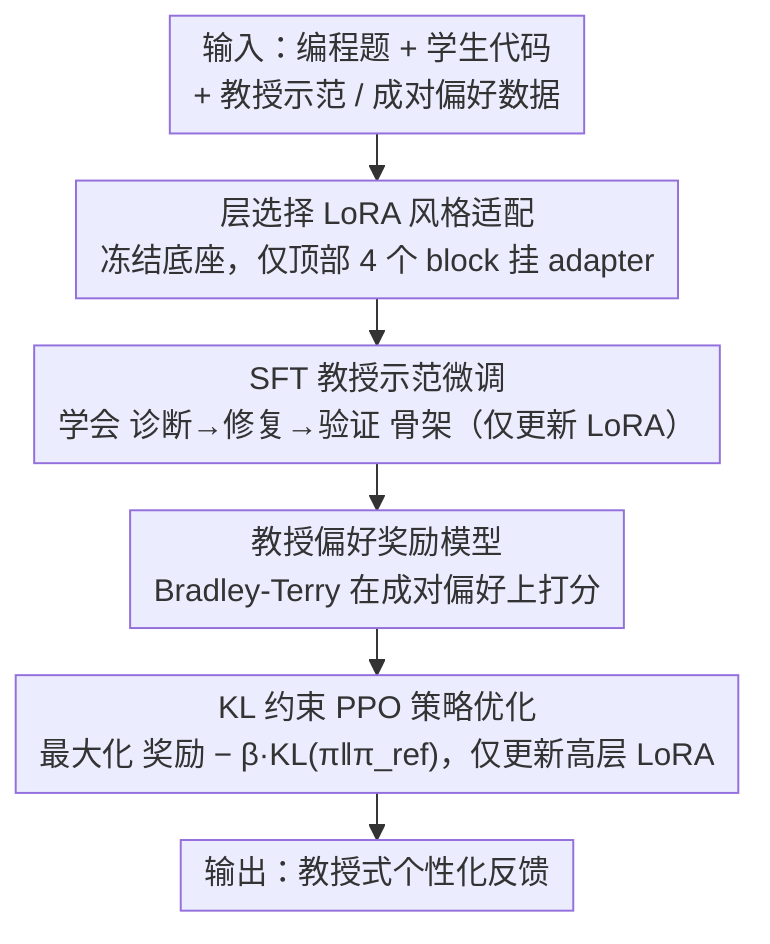

# PERSA: Reinforcement Learning for Professor-Style Personalized Feedback with LLMs

**会议**: ACL2026  
**arXiv**: [2605.01123](https://arxiv.org/abs/2605.01123)  
**代码**: 未公开  
**领域**: 教育反馈 / LLM个性化 / 对齐RLHF  
**关键词**: 教育反馈, 个性化LLM, RLHF, LoRA, 风格对齐

## 一句话总结
PERSA 用“教授示范 + 教授偏好奖励 + 只更新高层 LoRA 的 PPO”把通用 LLM 调成特定教师的编程反馈风格，在 APPS、PyFiXV、CodeReviewQA 上显著提升风格一致性，同时基本保持 100% 诊断正确率。

## 研究背景与动机
**领域现状**：LLM 已经能为编程题、代码审查和学习平台生成反馈，主流路线包括直接提示、监督微调、通用 RLHF，以及 DPO/ORPO/KTO 等偏好优化。教育场景里，反馈质量不仅取决于“指出 bug 是否正确”，还取决于语气、结构、鼓励程度、是否给出可执行修正建议。

**现有痛点**：通用 LLM 往往能说出大致方向，却很难像某位真实教师那样组织反馈。例如同样是“先读取数组再找下标”，通用模型可能只写一句“检查输入处理”，而教师式反馈通常会先肯定进展，再定位根因，最后提醒边界用例。直接全参数微调又容易把底层能力一起改坏，计算成本也高。

**核心矛盾**：个性化教学需要改变模型“怎么说”，但不希望破坏模型“知道什么”。风格是高层语篇属性，正确性则依赖底层代码理解和推理能力；如果把所有参数一起更新，风格迁移和知识保持会互相牵制。

**本文目标**：作者想解决三个子问题：第一，如何从教授示范和偏好中学习“教授声音”；第二，如何在 RLHF 中保留诊断正确性；第三，如何让这种个性化适配足够轻量，适用于 2B-3B 级开放模型。

**切入角度**：论文利用 transformer 内部分析中的观察：风格、语气、语篇组织等高层属性更集中在模型上层，尤其是 FFN 和高层投影模块。因此没有必要更新全模型，只需在高层挂 LoRA，并通过 RLHF 把偏好信号注入这些风格承载组件。

**核心 idea**：用层选择 LoRA 将 RLHF 的更新限制在模型高层，让 PPO 主要调整教师式表达风格，而把原模型的代码诊断能力尽量冻结下来。

## 方法详解
PERSA 可以理解为一个面向“教授式编程反馈”的小型 RLHF 流水线。它并不是重新发明 RLHF，而是把 RLHF 的三个阶段压到风格相关的参数子空间里：先用教师示范做 SFT，再用成对偏好训练奖励模型，最后用带 KL 约束的 PPO 优化策略模型。关键区别在于，策略模型的可训练参数不是全模型，而是高层 transformer block 中的 LoRA adapter。

### 整体框架
输入是一道编程题、学生提交的代码，以及可能包含错误类型或上下文的 prompt；输出是一段面向学生的自然语言反馈。训练数据包括两类：一类是教授亲自写的反馈示范，记作 `(x, y*)`；另一类是同一 prompt 下候选反馈的成对偏好，记作 `(x, y_w, y_l)`，其中 `y_w` 更符合教授风格或更正确。

整个 pipeline 分为四步。第一步在 Llama-3.2-3B-Instruct 或 Gemma-2-2B-IT 上加载 LoRA，并只放开上层若干 transformer block 的注意力投影和 FFN 投影。第二步用教授示范做 SFT，使模型学会“诊断 → 修复建议 → 验证提醒”的基础格式。第三步训练奖励模型 `r_phi(x, y)`，让它给教授偏好的回答更高分。第四步从 SFT 模型出发，用 PPO 最大化奖励，同时用 KL 惩罚限制模型偏离 SFT 参考策略。

推理时，PERSA 像普通 instruction model 一样接收学生代码并生成反馈；它不需要额外检索或外部执行器。模型行为的变化主要来自高层 LoRA adapter，因此部署上可以为不同教师维护不同 adapter，而共享同一个底座模型。

### 关键设计

**1. 层选择的 LoRA 风格适配：只在高层挂 adapter，把教授风格写进很小的参数子空间**

个性化教学的核心矛盾在于既要改变模型「怎么说」、又不能破坏它「知道什么」，全参数微调会让两者互相牵制。作者的判断是：风格、语气、语篇格式这类高层语篇属性主要由 transformer 上层的注意力投影和 FFN 投影承载，底层更多是语法和代码知识。于是 PERSA 只在选中的高层权重矩阵上叠加 LoRA 低秩增量 $\Delta W=BA$，底座权重全部冻结，典型配置是从顶部数 4 个 block（top-4 LoRA）。这样可训练参数从 20-30 亿压到千万级，既显著减少了 RLHF 把底层诊断能力一起改坏的灾难性漂移，又让「为每位教师维护一个 adapter、共享同一底座」成为可能——多教师部署时只换挂载的风格模块即可。

**2. 教授偏好奖励模型：把「更像教授、更有教学价值、更正确」转成可优化的标量信号**

SFT 只能模仿示范的平均分布，能学到「诊断 → 修复建议 → 验证提醒」的骨架格式，却抓不住教师在措辞强弱、鼓励方式、边界用例提醒上的细微偏好。为此 PERSA 在成对偏好 $(x, y_w, y_l)$ 上训练奖励模型 $r_\phi(x,y)$，让它给更符合教授风格的回答打更高分。奖励建模采用 Bradley-Terry 形式，目标是拉大胜负样本的分差，损失为 $L_{RM}=-\mathbb{E}[\log\sigma(r_\phi(x,y_w)-r_\phi(x,y_l))]$。相比 SFT 的「照抄示范」，这个奖励信号直接告诉后续 PPO「在两个候选表达里哪个更像这位教师」，从而把风格选择从模仿升级为偏好对齐。

**3. KL 约束下的 PPO 策略优化：朝奖励偏好的方向继续走，但不许离开 SFT 的可靠区域**

教育反馈不能为了「像教授」而牺牲诊断正确性，所以策略优化必须在风格奖励和可靠性之间拴一根绳。PERSA 从 SFT 模型出发，用 PPO 最大化带 KL 惩罚的目标 $r_\phi(x,y)-\beta\,\mathrm{KL}(\pi_\theta(\cdot|x)\,\|\,\pi_{\mathrm{ref}}(\cdot|x))$，其中 $\pi_{\mathrm{ref}}$ 是冻结的 SFT 参考策略，PPO 用 clipped ratio 稳定 token 级更新。KL 项的作用是把策略锁在「已经会写教师式反馈、且诊断基本正确」的 SFT 邻域内，避免奖励黑客式地为博取风格分而输出错误诊断；而可训练参数又被限制在高层 LoRA 上，进一步保证底层正确性几乎不动——这正是实验中 PERSA 能把 SAC 推到 96+、同时 CA 维持 100 的原因。

### 损失函数 / 训练策略
SFT 阶段使用标准自回归负对数似然，只更新 `theta_LoRA`。奖励建模阶段使用成对 logistic loss：`L_RM = -E[log sigma(r_phi(x, y_w) - r_phi(x, y_l))]`。PPO 阶段使用 clipped objective，并把 KL 控制项加入轨迹奖励或辅助惩罚。论文对两个轻量开放模型都使用同一套流程，比较 Base、SFT、InstructGPT-style RLHF、DPO、ORPO、KTO 和 PERSA。

## 实验关键数据

### 主实验
论文在三个代码反馈数据集上评测：APPS 风格教授反馈集 200 条，PyFiXV 的 Codeforces Python 语法错误反馈 240 条，CodeReviewQA 900 条多语言代码审查实例。指标包括风格对齐 SAC、礼貌接近度 APC、BLEU-4、诊断正确率 CA，以及相对 Base 的偏好胜率 PWR。

| 数据集 / 骨干 | 方法 | SAC | BLEU-4 | CA | PWR |
|--------|------|------|--------|------|------|
| APPS / Llama-3 | Base | 34.8 | 6.4 | 98.2 | - |
| APPS / Llama-3 | SFT | 82.0 | 80.0 | 100.0 | 86.2 |
| APPS / Llama-3 | ORPO | 95.6 | 95.0 | 100.0 | 90.2 |
| APPS / Llama-3 | PERSA | 96.2 | 95.8 | 100.0 | 90.1 |
| APPS / Gemma-2 | Base | 20.0 | 2.0 | 98.0 | - |
| APPS / Gemma-2 | PERSA | 99.0 | 98.0 | 100.0 | 98.0 |
| PyFiXV / Llama-3 | ReFoRCE类偏好基线中较强项 ORPO | 93.5 | 93.2 | 99.8 | 88.6 |
| PyFiXV / Llama-3 | PERSA | 94.5 | 94.0 | 99.9 | 89.0 |
| CodeReviewQA / Gemma-2 | KTO | 87.0 | 78.0 | 100.0 | 96.0 |
| CodeReviewQA / Gemma-2 | PERSA | 98.0 | 98.0 | 100.0 | 98.2 |

| 人类评测 | 样本 / 维度 | PERSA 或评分 | Vanilla LLM | 平局 / 备注 |
|------|------|------|------|------|
| 学生问卷 | 20 人、5 个例子：清晰度 | 4.34 / 5 | - | 标准差 1.05 |
| 学生问卷 | 帮助性 | 4.37 / 5 | - | 标准差 1.04 |
| 学生问卷 | 信任度 | 4.31 / 5 | - | 标准差 0.97 |
| 学生问卷 | 像真实教师 | 3.87 / 5 | - | 标准差 1.34 |
| 教师盲评 | 总体偏好 | 83.6% | 1.8% | 14.6% |
| 教师盲评 | 帮助性 / 可执行性 | 85.5% | 1.8% | 12.7% |
| 教师盲评 | 教师真实性 | 74.5% | 1.8% | 23.7% |
| 教师盲评 | 技术正确性 | 61.8% | 5.5% | 32.7% |

### 消融实验

| 配置 | SAC | APC | BLEU-4 | CA | PWR | 说明 |
|------|------|------|--------|------|------|------|
| Base | 14.0 | 90.0 | 1.5 | 98.0 | - | 几乎没有教授风格 |
| SFT only | 82.0 | 91.6 | 64.7 | 100.0 | 86.0 | 学会基本反馈结构 |
| PPO only | 60.0 | 91.2 | 40.0 | 98.0 | 84.0 | 缺少 SFT 锚点，风格不稳 |
| SFT+PPO full-param | 92.0 | 92.0 | 92.0 | 100.0 | 88.0 | 全参数能对齐但成本高 |
| SFT+PPO all-layer LoRA | 96.0 | 92.0 | 94.7 | 100.0 | 88.6 | LoRA 限制漂移后更好 |
| SFT+PPO top-2 LoRA | 94.0 | 92.0 | 90.0 | 100.0 | 90.0 | 上层已经足够捕捉大部分风格 |
| SFT+PPO top-4 LoRA | 96.2 | 92.1 | 95.8 | 100.0 | 90.1 | 最佳配置，即 PERSA |

### 关键发现
- Base 模型的 CA 已经接近 96%-98%，说明底座模型能做基本代码判断，但 SAC 和 BLEU-4 很低，证明“正确”和“像教师”是两个可分离维度。
- SFT 带来最大的一次跃升，尤其把 APPS / Llama-3 的 SAC 从 34.8 提到 82.0；但 SFT 后仍有细粒度风格差距，需要偏好优化继续修正。
- PPO 不能单独使用：没有 SFT 初始化时 SAC 只有 60.0，说明奖励优化需要一个已经会说教师式反馈的起点。
- Top-4 LoRA 达到最高 SAC 和 BLEU-4，同时 CA 保持 100.0，支持“高层承载风格、底层保留能力”的假设。
- 人类评测里技术正确性的平局率较高，说明 vanilla LLM 有时也能判断对错；PERSA 的优势主要体现在清晰度、行动性、可信语气和教师真实性。

## 亮点与洞察
- 把“教师声音”当作可优化的对齐目标，而不是 prompt 中的一句风格描述。这一点很实用，因为真实课程里教师反馈通常有稳定的结构和语气，长期依赖 prompt 很难保证一致性。
- 层选择 LoRA 是这篇最有价值的工程判断。它把个性化从“重新训练一个模型”变成“给同一个底座挂不同教师 adapter”，天然适合课程、助教和学习平台的多用户部署。
- 论文的消融结果说明 SFT 与 RLHF 的分工很清楚：SFT 负责把反馈写成教师式骨架，PPO 负责在候选表达之间做偏好细化。这个分工也能迁移到医学问诊、客服、法律解释等需要专家语气但又不能牺牲事实性的场景。
- PERSA 的定性例子展示了教育反馈的一个关键尺度：好的反馈不直接丢完整答案，而是指出根因、给修复方向、提醒验证边界。学生问卷中“包含可直接复制的完整方案”评分只有 2.55，反而说明模型没有过度泄题。

## 局限与展望
- 数据规模偏小，APPS 风格教授反馈集只有 200 条，PyFiXV 和 CodeReviewQA 也主要是代码反馈任务；能否覆盖大型课程、多教师共教和非编程学科，还需要更大规模验证。
- 风格指标 SAC、APC、BLEU-4 仍然可能偏向表面相似度。教师风格里有很多深层教学策略，例如何时追问、何时给提示、何时不给完整解法，当前自动指标难以完全覆盖。
- 奖励模型由教授偏好或教授式偏好训练，论文没有充分讨论偏好标注成本、不同教师之间偏好冲突，以及学生个体差异如何进入奖励。
- PERSA 保留正确性的证据主要来自现有基准和人工检查；若部署到真实 IDE 或在线判题系统，仍需要和执行测试、静态分析或单元测试结果结合，避免风格很像但诊断错误。
- 未来可以把教师 adapter 与课程知识库、学生画像结合，形成“同一教师风格 + 不同学生学习阶段”的双重个性化。

## 相关工作与启发
- **vs InstructGPT-style RLHF**: 通用 RLHF 优化的是广义 helpfulness 和 harmlessness，PERSA 优化的是某个教师的反馈偏好，并且只更新高层 LoRA，目标更窄、部署成本更低。
- **vs SFT 教师示范微调**: SFT 能模仿反馈格式，但不会显式比较哪些回答更像教师。PERSA 通过奖励模型和 PPO 学习偏好边界，因此能补上语气、具体性和验证提醒上的细节。
- **vs DPO / ORPO / KTO**: 这些离线偏好优化方法不需要 on-policy rollout，工程上更轻；PERSA 保留奖励模型和 PPO，但通过 top-layer LoRA 控制漂移，在 Gemma-2 上表现尤其突出。
- **vs 自动代码反馈系统**: 传统系统强调测试、修复和错误定位，PERSA 强调反馈表达与教学人格。两类方法可以互补：前者提供可验证诊断，后者负责把诊断转成学生更愿意采纳的反馈。

## 评分
- 新颖性: ⭐⭐⭐⭐☆ 将 RLHF、LoRA 和教育反馈个性化组合得很自然，关键新意在“高层风格适配”而非全新算法。
- 实验充分度: ⭐⭐⭐⭐☆ 自动指标、消融和人类评测都比较完整，但数据规模和真实课堂验证仍偏有限。
- 写作质量: ⭐⭐⭐⭐☆ 方法链条清楚，表格也覆盖了多个基线；个别指标解释和数据构造细节还可以更严谨。
- 价值: ⭐⭐⭐⭐⭐ 对教育 LLM 和可部署个性化助手很有启发，尤其适合作为多教师 adapter 系统的原型。

<!-- RELATED:START -->

## 相关论文

- [\[NeurIPS 2025\] Strategyproof Reinforcement Learning from Human Feedback](../../NeurIPS2025/llm_alignment/strategyproof_reinforcement_learning_from_human_feedback.md)
- [\[ACL 2025\] Curiosity-Driven Reinforcement Learning from Human Feedback](../../ACL2025/llm_alignment/curiosity_driven_rlhf.md)
- [\[ACL 2026\] WildFeedback: Aligning LLMs With In-situ User Interactions And Feedback](wildfeedback_aligning_llms_with_in-situ_user_interactions_and_feedback.md)
- [\[ACL 2026\] P-Check: Advancing Personalized Reward Model via Learning to Generate Dynamic Checklist](p-check_advancing_personalized_reward_model_via_learning_to_generate_dynamic_che.md)
- [\[ACL 2026\] Too Correct to Learn: Reinforcement Learning on Saturated Reasoning Data](too_correct_to_learn_reinforcement_learning_on_saturated_reasoning_data.md)

<!-- RELATED:END -->
