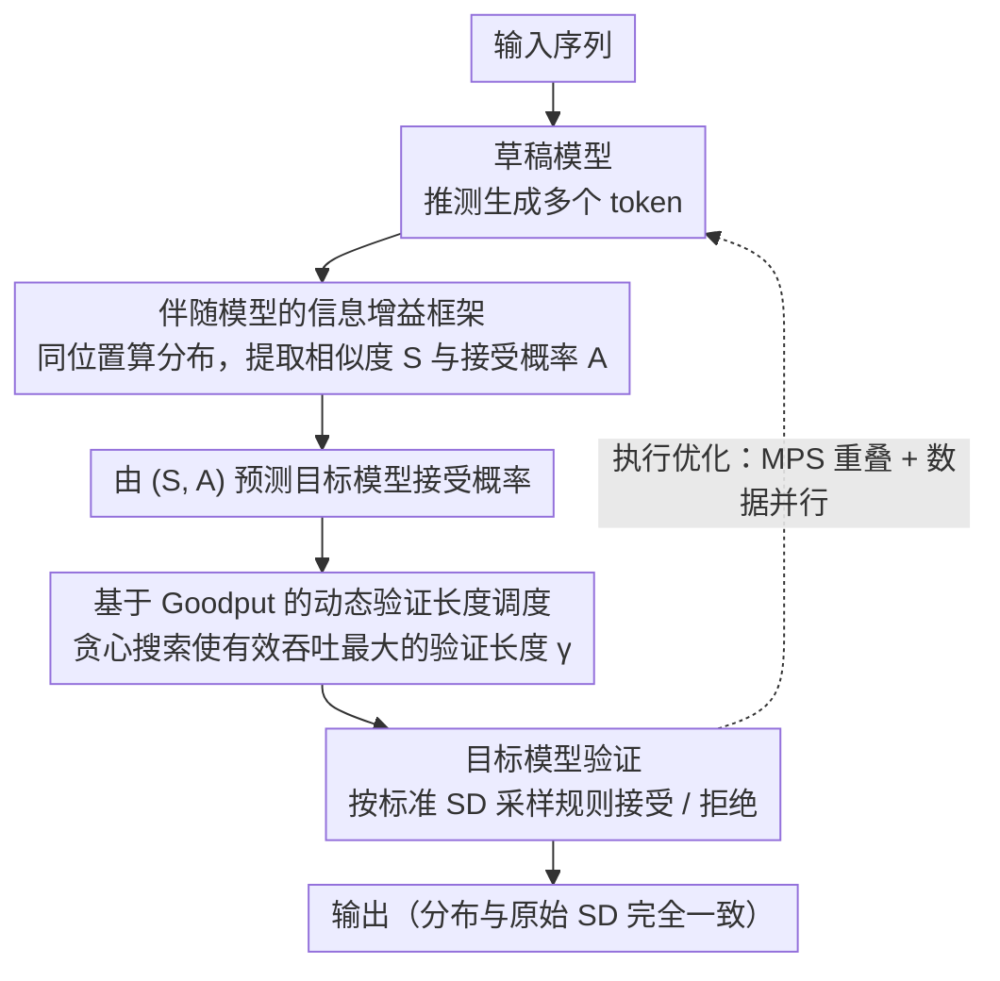

# Speculative Verification: Exploiting Information Gain to Refine Speculative Decoding

**会议**: ACL 2026 Findings  
**arXiv**: [2509.24328](https://arxiv.org/abs/2509.24328)  
**代码**: 无  
**领域**: LLM效率  
**关键词**: 推测解码, 信息增益, 推理加速, 伴随模型, 动态验证

## 一句话总结

提出推测验证（Speculative Verification, SV），通过引入与草稿模型同等规模的伴随模型（companion model），利用草稿-伴随分布的相似性预测推测准确率，动态调整验证长度以最大化有效吞吐量，在大批量推理中实现相对标准推测解码平均1.4×、最高1.9×的加速。

## 研究背景与动机

**领域现状**：推测解码（Speculative Decoding, SD）是加速LLM推理的主流方法，通过小型草稿模型推测生成多个token，再由大型目标模型并行验证。其效果取决于推测准确率（即草稿token被目标模型接受的比例）。

**现有痛点**：推测准确率在解码步骤间剧烈波动且不可预测。当准确率低时，被拒绝token的验证开销会抵消加速收益；在大批量场景下，SD的收益本就减小，额外的验证开销甚至导致性能劣于直接目标模型解码。实验发现超过40%的验证计算浪费在被拒绝的token上，48%的SD步骤比直接解码更慢。

**核心矛盾**：准确预测推测准确率是优化验证长度的前提，但仅凭草稿模型的信息（token概率、熵、注意力模式、历史接受率）均无法可靠预测。先前方法（SVIP、SmartSpec等）在大批量下效果急剧退化。

**本文目标**：引入额外的信息源来可靠预测推测准确率，实现动态自适应的验证长度优化。

**切入角度**：信息论框架——通过观测伴随模型的分布获得关于目标模型接受概率的正信息增益。

**核心idea**：引入一个与草稿模型同等规模的伴随模型，通过比较草稿与伴随的token分布相似度 $S$ 和伴随模型下的接受概率 $A$，预测目标模型的接受概率，据此动态选择最优验证长度以最大化 goodput。

## 方法详解

### 整体框架

SV 在标准推测解码（SD）流程之上嵌入一个与草稿模型同等规模的轻量伴随模型，目的是在验证之前就预判每个草稿 token 会不会被目标模型接受，从而动态决定这一轮该验证多长。草稿模型照常生成投机 token 后，伴随模型对同一批位置算出自己的分布，提取分布相似度 $S$ 与伴随接受概率 $A$ 两个指标；SV 据此预测各草稿 token 被目标模型接受的概率，再用一个贪心搜索挑出能让有效吞吐量（goodput，单位时间接受的 token 数）最大化的验证长度。真正的验证仍由目标模型按标准 SD 采样规则执行，因此输出分布与原始 SD 完全一致——伴随模型只负责"出主意"，不改变最终结果。

### 关键设计

**1. 伴随模型的信息增益框架：用外部信息源把接受概率猜准**

推测准确率在解码步骤间剧烈波动且不可预测，而仅凭草稿模型自身的信号（token 概率、熵、注意力、历史接受率）都无法可靠预测——这正是 SVIP、SmartSpec 等先前方法在大批量下急剧退化的根因。SV 改从信息论入手：定义草稿-伴随分布相似度 $S = \sum_{i \in \text{vocab}} \min(P_d(t_i), P_c(t_i))$，以及草稿 token 在伴随模型下的接受概率 $A = \min(1, P_c(t_d)/P_d(t_d))$；观测到 $S$ 和 $A$ 后，对目标接受概率 $X$ 的不确定性降低约 34%、接受率提升约 20%。

这套框架对模型组合的要求极弱——它只需要草稿-伴随分布能提供正的信息增益，而非要求两者高度相关。由于现代 LLM 普遍共享部分训练语料（如 Wikipedia、C4），统计独立几乎不可能出现，因此"正信息增益"这一前提在 90 组公开的草稿-伴随-目标组合上无一例外地成立。

**2. 基于 Goodput 的动态验证长度调度：在浪费 GPU 与浪费算力之间找拐点**

验证长度太短会让目标模型的并行 GPU 资源吃不饱，太长又会把算力浪费在注定被拒绝的 token 上。SV 把这个权衡量化为对 goodput 的优化：对每个候选验证长度 $\gamma$，用预测出的条件接受概率算出期望接受 token 数 $E(N|\gamma)$，再除以该长度对应的验证延迟得到 goodput，最后选 goodput 最大的 $\gamma$。

由于 goodput 关于验证长度是凹函数，最优点可以用增量搜索高效地一步步逼近，无需穷举所有长度。正是这种"按预测接受概率动态裁剪验证子集"的能力，让 SV 在准确率低的步骤果断缩短验证、在准确率高的步骤放心拉长，避免了固定验证长度在大批量下的两头吃亏。

**3. 执行优化（Overlap + Data-Parallel）：把伴随模型的额外成本摊到几乎看不见**

引入第二个模型最怕成为新瓶颈，SV 用两手系统级优化把开销压到极低。其一是借助 NVIDIA MPS，把目标模型的验证与下一轮的草稿/伴随模型执行在时间上重叠起来；其二是在多 GPU 张量并行的验证配置里复用空闲 GPU 资源做数据并行的草稿生成。最终伴随模型只额外带来 1.3–5.3% 的计算开销和 2.8–8.1% 的内存开销，确保它始终是"信息提供者"而非系统拖累。

### 损失函数 / 训练策略

SV 是推理时方法，无需额外训练。伴随模型可通过以下方式获取：微调草稿模型、量化草稿模型、或直接选择公开的同规模模型。实验表明三种方式均能提供正信息增益。

## 实验关键数据

### 主实验

| 配置 | 批量大小 | SD吞吐 | SV吞吐 | 加速比 |
|------|---------|--------|--------|--------|
| Qwen2.5 32B | 32 | 基线 | — | 最高1.61× |
| Llama 70B | 64 | 基线 | — | 最高1.37× |
| 大批量平均 | 32-64 | 基线 | — | 平均1.4× |
| 最佳情况 | — | 基线 | — | 最高1.9× |

### 消融实验

| 配置 | 关键指标 | 说明 |
|------|---------|------|
| 验证成本降低 | 18-45% TFLOPs减少 | 伴随模型仅增加1.3-5.3%计算 |
| 信息增益 (S,A) | 30-40% 熵减少 | 90组D-C-T模型均为正增益 |
| Token接受率 | 最高提升4.5× | 大批量下尤其显著 |
| Prefill开销 | ~10%低于SD | 伴随模型的额外成本 |

### 关键发现
- SV 在所有实验配置中均优于SD和目标解码，对困难任务（GSM8K、ChatGPT）效果尤其突出
- 90组公开模型的草稿-伴随-目标组合均观测到正信息增益，验证了方法的普适性
- SV也可应用于自推测模型（LayerSkip提升30%、Eagle-3提升适中）
- 公平性分析表明批量内各查询的验证分配合理，不存在饥饿问题

## 亮点与洞察
- **信息论视角优雅**：将推测准确率预测形式化为信息增益最大化问题，理论基础扎实
- **假设条件极弱**：仅需草稿-伴随分布提供正信息增益（非高相关性），使方法广泛适用
- **实用性极强**：无需额外训练，伴随模型可直接从公开模型选取，开销极低
- **大批量场景价值突出**：恰好解决了SD在实际部署中最痛的大批量性能退化问题

## 局限与展望
- **仅评估公开模型**：可能存在模型特异性偏差
- **未报告方差/置信区间**：虽每次评估覆盖约10000解码步骤，但缺乏重复实验统计
- **Prefill阶段有额外开销**：约10%低于SD的prefill吞吐
- 未来可探索：伴随模型的最优选择策略、与更多推理框架（如TensorRT-LLM）集成

## 相关工作与启发
- **vs SVIP/SmartSpec**：基于草稿模型熵或历史接受率预测，在大批量下失效；SV通过引入外部信息源克服了这一限制
- **vs Staged SD**：使用中等模型直接验证草稿输出，受限于中等模型能力；SV仅利用伴随模型提供信息而非直接验证
- **vs Eagle-3**：使用token树并行推测，小批量高效但大批量开销大；SV与之互补

## 评分
- 新颖性: ⭐⭐⭐⭐⭐ 引入伴随模型+信息增益预测推测准确率的思路极具创新性，理论优雅
- 实验充分度: ⭐⭐⭐⭐⭐ 104种模型组合、7个任务、多种批量大小，覆盖SOTA对比和多维消融
- 写作质量: ⭐⭐⭐⭐ 结构清晰，但技术密度高，部分推导需要仔细阅读
- 价值: ⭐⭐⭐⭐⭐ 解决SD在实际部署中的核心瓶颈，实用性极强

<!-- RELATED:START -->

## 相关论文

- [\[ACL 2026\] Multi-Drafter Speculative Decoding with Alignment Feedback](multi-drafter_speculative_decoding_with_alignment_feedback.md)
- [\[ACL 2026\] RACER: Retrieval-Augmented Contextual Rapid Speculative Decoding](racer_retrieval-augmented_contextual_rapid_speculative_decoding.md)
- [\[ACL 2026\] TokenTiming: A Dynamic Alignment Method for Universal Speculative Decoding Model Pairs](tokentiming_a_dynamic_alignment_method_for_universal_speculative_decoding_model_.md)
- [\[NeurIPS 2025\] 3-Model Speculative Decoding (PyramidSD)](../../NeurIPS2025/llm_efficiency/3model_speculative_decoding.md)
- [\[ACL 2025\] SAM Decoding: Speculative Decoding via Suffix Automaton](../../ACL2025/llm_efficiency/sam_decoding_speculative_decoding_via_suffix_automaton.md)

<!-- RELATED:END -->
