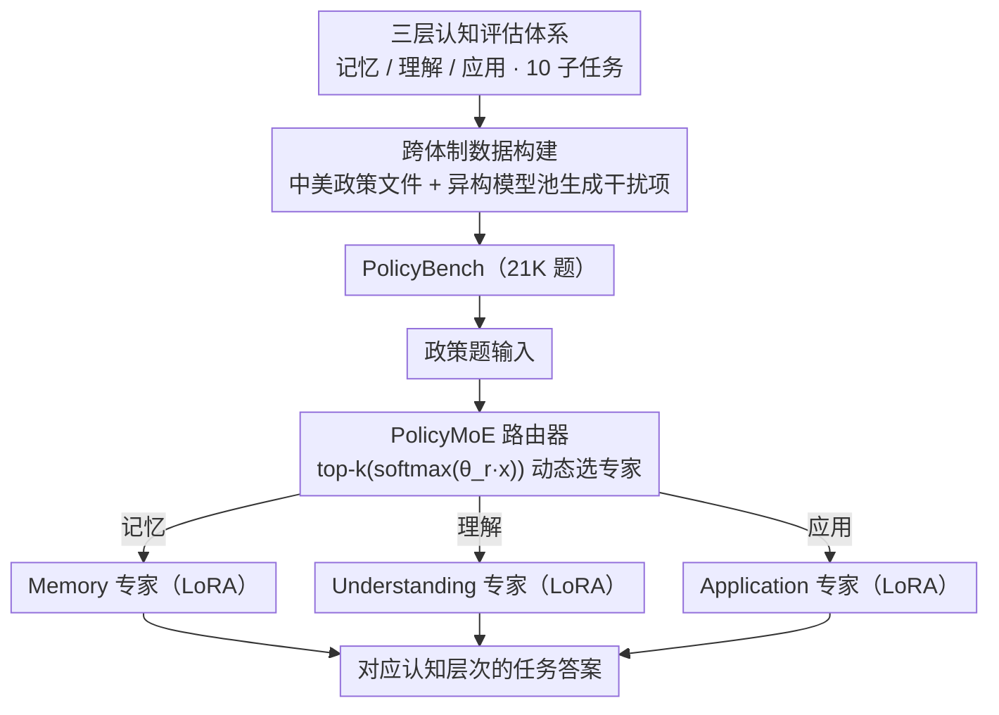

# PolicyLLM: Towards Excellent Comprehension of Public Policy for Large Language Models

**会议**: ACL 2026 (Findings)  
**arXiv**: [2604.12995](https://arxiv.org/abs/2604.12995)  
**代码**: [https://github.com/wad3birch/PolicyLLM](https://github.com/wad3birch/PolicyLLM)  
**领域**: 信号通信  
**关键词**: 公共政策理解, 跨体制基准, Bloom认知层次, 混合专家模型, 政策推理

## 一句话总结
本文提出 PolicyBench（21K 题的中美跨体制政策理解基准）和 PolicyMoE（基于认知层次的混合专家模型），系统评估 11 个 SOTA LLM 在政策记忆/理解/应用三层次上的能力，发现模型在结构化推理上表现好但在抽象政策概念上仍然薄弱。

## 研究背景与动机

**领域现状**：LLM 日益被用于教育、法律、医疗等高风险决策领域，公共政策是其中最具社会影响力的应用场景。政策分析需要事实知识、上下文推理和价值敏感判断的综合能力。

**现有痛点**：(1) 评估缺失——没有系统性基准来衡量 LLM 的政策理解能力，研究者无法客观比较和定位模型短板；(2) 诊断缺失——总体指标掩盖了模型在不同认知层次、政策领域和语言上的具体表现差异；(3) 适配困难——通用 LLM 难以满足政策任务的多元化需求，需要领域专门化。

**核心矛盾**：政策理解是一个多层次认知任务——从事实记忆到概念理解到场景应用——但现有 LLM 的训练优化主要在通用推理上，缺乏针对政策领域的结构化评估和适配。

**本文目标**：(1) 构建覆盖中美两个体制的大规模政策基准；(2) 在三个认知层次上诊断 LLM 的优势和短板；(3) 提出领域适配的 MoE 方案验证专门化的潜力。

**切入角度**：基于 Bloom 认知分类法（记忆→理解→应用）设计三层评估体系，并借鉴政策研究中的 3I 框架（Ideas/Interests/Institutions）来细化理解层次的任务设计。

**核心 idea**：三层认知基准 + 跨体制对比 + 认知层次对齐的 MoE 专门化。

## 方法详解

### 整体框架

PolicyLLM 把"评估"和"适配"两件事串成一条线。评估侧是 PolicyBench：21K 道题覆盖中国和美国两个政策体系，按 Bloom 认知层次拆成记忆 / 理解 / 应用三级、共 10 个子任务，让一篇政策题不再只问"答对没有"，而是分辨模型是记住了、理解了还是能用了。适配侧是 PolicyMoE：在 Qwen2.5-7B-Instruct 基座上用 LoRA 分别训练 Memory / Understanding / Application 三个专家，再由一个可训练的线性路由器按输入动态选专家，验证认知层次对齐的领域专门化能否补上短板。输入是政策题，中间经路由分流到对应认知层次的专家，输出是该层次任务的答案。

### 关键设计

**1. 三层认知评估体系：把"政策理解"拆成记忆、理解、应用**

只测一个 QA 准确率，分不清模型是背下了政策、还是真懂了制度逻辑、还是能在场景里用，而这三者的训练需求和改进路径完全不同。作者因此按 Bloom 分类法搭三级：Level 1（记忆）考政策日期、术语、机构等事实回忆；Level 2（理解）借政策研究的 3I 框架（Ideas / Interests / Institutions），考政策理念、利益关系和制度逻辑；Level 3（应用）考数值推理、场景决策、流程实施和政策逻辑解释。三级共 10 个子任务，混合选择题、判断题和开放问答，使诊断能精确落到具体认知层次而不是一团总分。

**2. 跨体制数据构建与干扰项生成：用中美高对比度场做泛化压力测试**

中美政策体系在治理逻辑、语言复杂度和制度设计上差异巨大，正好构成一个理想的跨系统泛化测试场。作者从国务院政策文件库收集中国政策 721 份文件加 1890 份补充材料，从 12 个联邦部门官网收集美国政策 603 份文件加 1082 份补充材料。选择题的干扰项不靠单一模型生成——而是用异构模型池迭代：把正确答案标记为"错误答案"，让另一个 LLM 据此生成新的、合理但错误的选项，从而绕开单一模型的系统性偏差，保证迷惑项的质量和多样性。

**3. PolicyMoE：认知层次对齐的混合专家**

策略分析显示不同认知层次依赖的能力不同——记忆主要吃预训练阶段的知识存储，应用主要吃后训练阶段的推理，所以与其用一个通用模型硬扛，不如让专家各管一层。具体在 Qwen2.5-7B-Instruct 上用 LoRA（rank=16, α=32）分别训练 Memory Expert、Understanding Expert、Application Expert，线性路由器按 $\alpha = \text{top-k}(\text{softmax}(\theta_r x))$ 依据输入特征挑出最相关的专家。这样每个专家只专注对应层次的任务，把"该背的"和"该推的"分开优化，避免单一模型在两类能力上互相拖累。

### 损失函数 / 训练策略

专家训练 3 epoch、路由器训练 4 epoch，统一用标准交叉熵损失，学习率 5e-5、有效 batch size 16；数据按政策来源文档分组划分，确保训练与测试不共享同一份政策文件，防止泄漏。

## 实验关键数据

### 主实验（11 个模型在 PolicyBench 上的平均准确率）

| 模型 | Level 1 (记忆) | Level 2 (理解) | Level 3 (应用) | 总均 |
|------|---------------|---------------|---------------|------|
| GPT-4o | 49.35% | 59.87% | 69.19% | 59.47% |
| DeepSeek-R1 | **60.68%** | **64.15%** | 74.19% | **66.34%** |
| Claude-3.7 | 57.00% | 64.35% | 71.05% | 64.13% |
| QwQ-32B | 51.14% | 58.75% | **75.12%** | 61.67% |
| Gemma-3-27B | 45.83% | 58.87% | 69.94% | 58.21% |

### 消融实验（PolicyMoE，Qwen2.5-7B-Instruct）

| Level | Region | 原始 | 微调后 | 提升 |
|-------|--------|------|--------|------|
| Level 1 | CN | 36.85% | 41.83% | ↑13.5% |
| Level 1 | US | 23.35% | 35.43% | **↑51.7%** |
| Level 2 | CN | 45.68% | 47.02% | ↑2.9% |
| Level 3 | US | 46.65% | 57.48% | ↑23.2% |

### 关键发现
- **反直觉的层次趋势**：模型在应用层（Level 3）表现最好，记忆层（Level 1）反而最差。原因是记忆依赖预训练阶段的知识存储，而应用依赖后训练阶段的推理能力——后者正是RLHF优化的重点
- 模型在美国政策上普遍优于中国政策（均差 ~1.4%），反映训练语料中英文的主导地位和中文政策文本的高密度复杂性
- QwQ-32B 是唯一在中国政策上优于美国政策的模型（65.33% vs 58.00%），可能与其训练数据分布有关
- PolicyMoE 在 Level 1 提升最大（US +51.7%），在 Level 2 提升最小（~3%），说明抽象理解最难通过微调改善

## 亮点与洞察
- **"模型更擅长应用而非记忆"**这一发现很有启示性：挑战了"先记住再推理"的朴素假设，说明当代LLM本质上是推理机器而非知识库
- Bloom 认知分类法与政策 3I 框架的结合设计很优雅，既有教育心理学的理论支撑，又有政策学的领域扎根
- 异构模型池生成干扰项的方法值得借鉴——通过标记正确答案为"错误"来引导生成高质量迷惑项，比人工设计更高效

## 局限与展望
- 仅覆盖中美两国，缺乏欧盟、发展中国家等多样化政策环境
- 主要使用选择题和判断题，开放式任务覆盖有限，与真实政策分析场景的复杂度差距大
- PolicyMoE 路由器只选择 top-1 专家，复杂政策任务可能需要多专家协同
- Level 2 的提升极为有限（~3%），说明抽象政策理解需要更根本的方法创新而非简单微调

## 相关工作与启发
- **vs LegalBench (Guha et al. 2023)**: LegalBench 评估法律推理，聚焦美国法律系统；PolicyBench 覆盖更广泛的公共政策且增加跨体制对比维度
- **vs MoE 领域适配 (Kang et al. 2024)**: 他们在通用场景做 MoE 适配，PolicyBench 将 MoE 专家与认知层次显式对齐，路由器行为更可解释

## 评分
- 新颖性: ⭐⭐⭐⭐ 基准设计新颖（跨体制+认知层次），但 MoE 方法本身较常规
- 实验充分度: ⭐⭐⭐⭐⭐ 11个SOTA模型+人类基线+路由器分析+消融，极其全面
- 写作质量: ⭐⭐⭐⭐ 结构清晰，发现有洞察力，但篇幅较长

<!-- RELATED:START -->

## 相关论文

- [\[ACL 2026\] Inverting the Shield: Systematically Generating Safety Tests from Policy Specifications](inverting_the_shield_systematically_generating_safety_tests_from_policy_specific.md)
- [\[ACL 2026\] Zero-shot Large Language Models for Automatic Readability Assessment](zero-shot_large_language_models_for_automatic_readability_assessment.md)
- [\[ACL 2026\] NovBench: Evaluating Large Language Models on Academic Paper Novelty Assessment](novbench_evaluating_large_language_models_on_academic_paper_novelty_assessment.md)
- [\[ACL 2026\] Question Difficulty Estimation for Large Language Models via Answer Plausibility Scoring](question_difficulty_estimation_for_large_language_models_via_answer_plausibility.md)
- [\[ACL 2026\] SciCustom: A Framework for Custom Evaluation of Scientific Capabilities in Large Language Models](scicustom_a_framework_for_custom_evaluation_of_scientific_capabilities_in_large_.md)

<!-- RELATED:END -->
