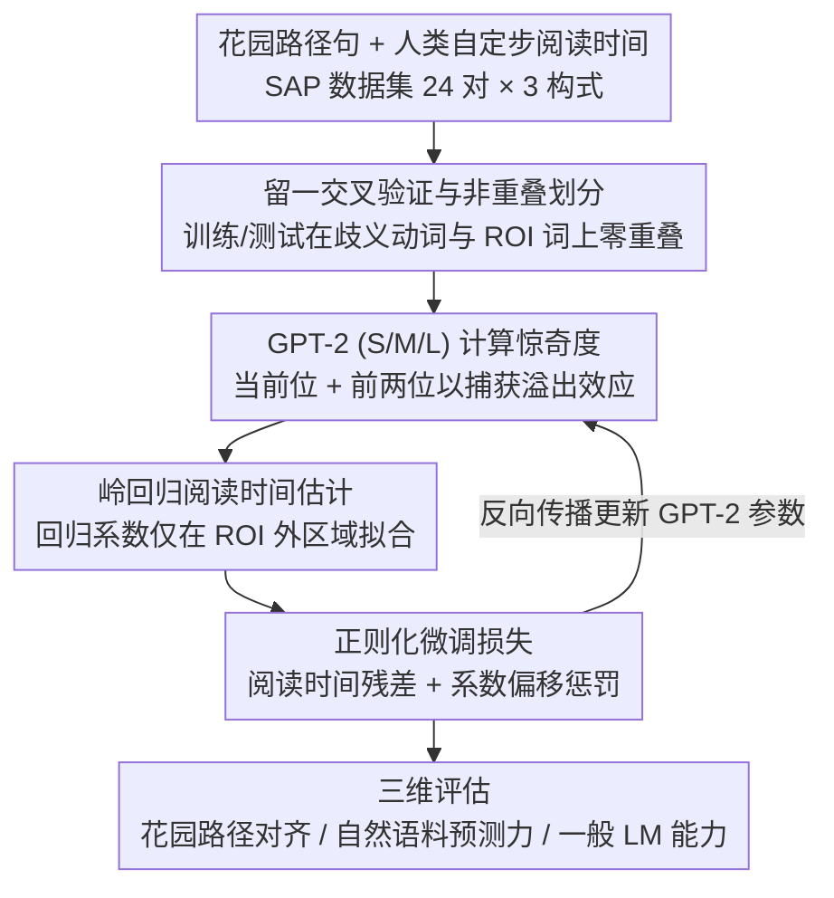

# An Existence Proof for Neural Language Models That Can Explain Garden-Path Effects via Surprisal

**会议**: ACL 2026  
**arXiv**: [2604.18293](https://arxiv.org/abs/2604.18293)  
**代码**: [github](https://github.com/osekilab/RE-GPE)  
**领域**: LLM/NLP  
**关键词**: 惊奇度理论, 花园路径效应, 人类阅读时间, 语言模型微调, 心理语言学

## 一句话总结

通过在花园路径句上微调神经语言模型，证明了存在一个神经 LM 能够通过惊奇度（surprisal）同时解释花园路径效应和自然阅读时间，为惊奇度理论提供了存在性证明。

## 研究背景与动机

**领域现状**：惊奇度理论（Surprisal Theory）认为人类句子处理的难度与词的负对数概率（surprisal）成线性关系。近年来，研究者们使用语言模型作为人类预测的代理来验证这一假说。

**现有痛点**：尽管神经 LM 的惊奇度能较好地捕捉自然语料上的人类阅读时间，但在需要句法消歧的句子（如花园路径句 "the horse raced past the barn fell"）上，它严重低估了处理难度——仅能预测人类阅读减速的 1/10 到 1/30。

**核心矛盾**：这一失败引发了两种可能解释的争论——是神经 LM 的概率估计与人类不同，还是花园路径效应本质上无法归结为惊奇度？近期多项研究倾向于后者，即认为惊奇度理论不足以解释此类现象。

**本文目标**：探究第一种可能性——是否真的不可能构建一个能通过惊奇度解释花园路径效应的神经语言模型。

**切入角度**：不再评估现成的 LM，而是通过微调使 LM 的惊奇度估计与人类实际阅读时间对齐。

**核心 idea**：通过在花园路径句上微调 GPT-2，使其惊奇度更好地匹配人类阅读时间，从而提供一个"存在性证明"——存在神经 LM 能同时解释花园路径效应和自然阅读时间。

## 方法详解

### 整体框架

本文不评测现成模型，而是反过来构造一个"存在性证明"：把神经 LM 的惊奇度估计主动微调到与人类阅读时间对齐，看是否真能造出一个同时解释花园路径效应和自然阅读的模型。具体地，沿用 Kiegeland et al. (2024) 的对齐式微调，将惊奇度先经岭回归映射成阅读时间估计，再以"贴近真实人类阅读时间"为目标微调 GPT-2（S/M/L），最后从三个维度检验它——能否泛化到未见花园路径项目、能否保持对自然语料阅读时间的预测力、以及一般 LM 能力是否退化。

### 关键设计

**1. 留一交叉验证与非重叠划分：在仅 24 对句子的小数据上严格隔离训练与测试**

数据规模很小（每种构式仅 24 对句对），过拟合风险高，"存在性证明"必须扛得住泛化检验。每一折从每种花园路径构式中留出一对句对作测试，并保证训练集与测试集在歧义动词和 ROI（感兴趣区域，即句法消歧位置及其后两个溢出位）词上完全无重叠。这样得到的覆盖率才反映模型对新项目的真实泛化，而非对见过词汇的记忆。

**2. 基于岭回归的阅读时间估计：用 ROI 之外的"普通"阅读时间标定系数，再去解释 ROI 的减速**

惊奇度本身不是阅读时间，需要一个映射把二者连起来。这里的特征向量取当前位置及前两个位置的惊奇度（用以捕获句法消歧带来的溢出效应），再加上词长、位置等控制变量，通过岭回归估计回归系数。关键约束是：系数只在不受句法消歧影响的"普通"区域（ROI 之外）拟合，但同一套系数也必须能解释 ROI 区域的阅读减速——这样才不算把答案硬塞进模型。

**3. 带正则化的微调损失函数：让模型靠改概率分布、而非作弊放大 ROI 估计来贴合人类**

直接最小化阅读时间残差会留下一个捷径：模型可以单纯压低 ROI 之外的惊奇度，从而在数值上抬高 ROI 处的估计阅读时间，却没真正学到合理的概率分布。损失函数因此设两项——其一最小化实际与估计阅读时间的残差平方，其二惩罚回归系数偏离初始系数的程度。第二项正则化堵住了上述捷径，迫使改进来自惊奇度分布本身的变化，而不是回归系数的漂移。

### 损失函数 / 训练策略

损失函数 $\mathcal{L}_B(\theta)$ 由均方残差项（衡量预测与实际阅读时间差异）与系数漂移惩罚项（防止回归系数偏离初始值太远）两部分组成。训练采用平衡批采样，每个 batch 含等量的各类花园路径构式句对，避免某一构式主导优化。

## 实验关键数据

### 主实验

| 模型 | 构式 | ROI 1 预微调覆盖率 | ROI 1 后微调覆盖率 |
|------|------|-------------------|-------------------|
| GPT-2 Small | MVRR | 7% | 73% |
| GPT-2 Small | NPS | 19% | 83% |
| GPT-2 Small | NPZ | 15% | 73% |

### 消融实验

| 配置 | 关键发现 | 说明 |
|------|---------|------|
| 单构式微调→跨构式迁移 | MVRR微调→NPS 51.5ms (基线9.6ms) | 跨构式迁移有效 |
| SRC/ORC不对称微调 | 仅捕获22%人类效应 | 惊奇度理论不适用场景下微调效果有限 |
| 自然语料预测力 | 微调后全面提升 | 花园路径微调意外改善自然文本预测 |

### 关键发现
- 微调后的 GPT-2 Small 表现最佳，在 ROI 1 处能捕获约 73%-83% 的人类阅读减速，远超微调前的 7%-19%
- 微调后模型正确复现了人类阅读减速幅度的构式间排序（MVRR > NPZ > NPS）
- 在自然语料上，微调后的 LM 对人类阅读时间的预测能力反而提升
- 单构式微调也能迁移到其他构式，暗示模型学到了花园路径效应的通用机制
- 但在 SRC/ORC 不对称（惊奇度理论被认为不适用的现象）上，微调效果有限，说明方法并非万能

## 亮点与洞察
- 巧妙的研究设计：将理论争论转化为可操作的实证问题——不是证明惊奇度理论"正确"，而是提供一个存在性证明
- 微调在花园路径句上的改进同时提升了自然语料的预测力，暗示原始 LM 与人类预测存在系统性偏差
- SRC/ORC 的负面结果同样有价值，说明方法的局限性与惊奇度理论的适用边界吻合
- 提出了深刻的理论问题：如果 LM 空间无界，惊奇度理论可能在实践中不可证伪

## 局限与展望
- 数据规模较小（24 对 × 3 种构式），需在更大规模数据上验证
- 未探究微调改变了 LM 的哪些内部机制
- 存在性证明虽然重要，但不等于说明现有 LM 自然学到了正确的人类概率分布
- 作者提出两个方向改善惊奇度理论的可证伪性：约束概率分布、要求解析分布的心理现实性

## 相关工作与启发
- **vs van Schijndel & Linzen (2021)**: 他们认为神经 LM 惊奇度无法解释花园路径效应是反对惊奇度理论的证据，本文挑战了这一结论
- **vs Kiegeland et al. (2024)**: 他们在自然语料上微调 LM，本文将此方法扩展到花园路径句
- **vs Huang et al. (2024)**: 他们系统展示了 LM 惊奇度低估花园路径效应的程度，本文提供了反例

## 评分
- 新颖性: ⭐⭐⭐⭐ 将理论争论转化为构造性存在性证明，思路新颖
- 实验充分度: ⭐⭐⭐⭐ 多维度评估，正面与负面结果均有，但数据规模较小
- 写作质量: ⭐⭐⭐⭐⭐ 理论背景阐述清晰，行文逻辑严谨
- 价值: ⭐⭐⭐⭐ 对计算心理语言学理论讨论有重要推动作用

<!-- RELATED:START -->

## 相关论文

- [\[ACL 2026\] Clozing the Gap: Exploring Why Language Model Surprisal Outperforms Cloze Surprisal](clozing_the_gap_exploring_why_language_model_surprisal_outperforms_cloze_surpris.md)
- [\[ACL 2026\] Expect the Unexpected? Testing the Surprisal of Salient Entities](expect_the_unexpected_testing_the_surprisal_of_salient_entities.md)
- [\[ACL 2025\] Can Input Attributions Explain Inductive Reasoning in In-Context Learning?](../../ACL2025/llm_nlp/can_input_attributions_explain_inductive_reasoning_in_in-context_learning.md)
- [\[ICLR 2026\] Neural Synchrony Between Socially Interacting Language Models](../../ICLR2026/llm_nlp/neural_synchrony_between_socially_interacting_language_models.md)
- [\[ACL 2025\] Neural Topic Modeling with Large Language Models in the Loop](../../ACL2025/llm_nlp/neural_topic_modeling_with_large_language_models_in_the_loop.md)

<!-- RELATED:END -->
