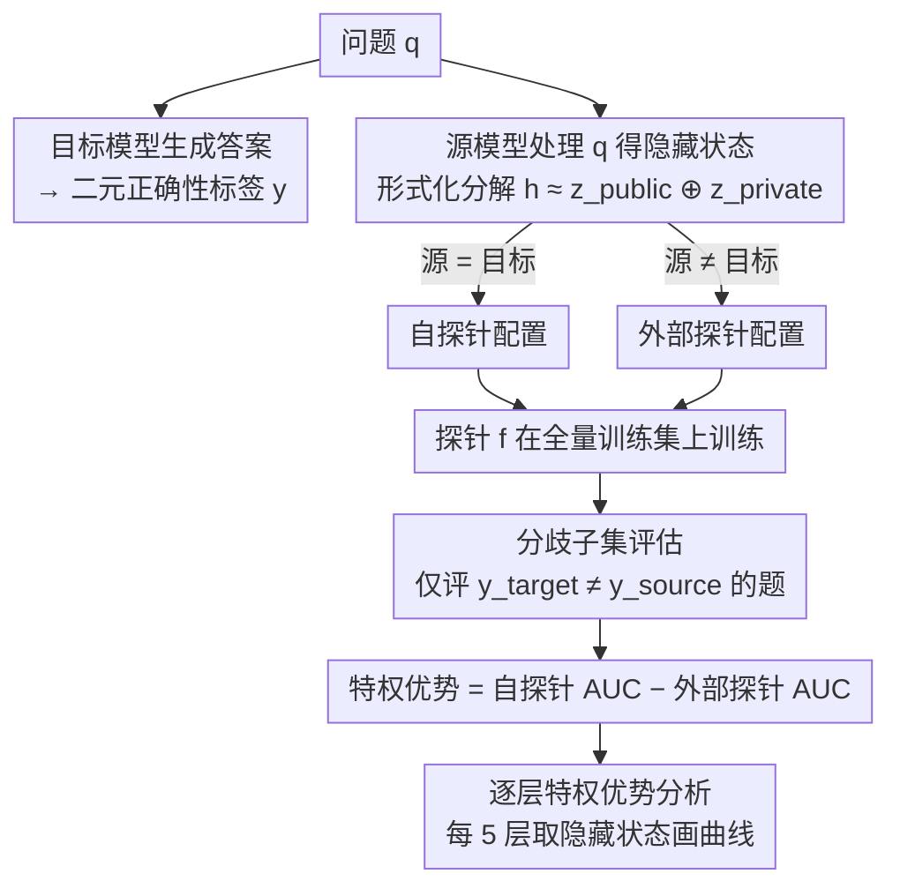

# Masked by Consensus: Disentangling Privileged Knowledge in LLM Correctness

**会议**: ACL 2026  
**arXiv**: [2604.12373](https://arxiv.org/abs/2604.12373)  
**代码**: 无  
**领域**: LLM/NLP  
**关键词**: 特权知识, 正确性预测, 隐藏状态探针, 模型间一致性, 领域特异性

## 一句话总结

本文通过对比自探针（使用模型自身隐藏状态）和外部探针（使用其他模型隐藏状态）预测正确性的能力，发现"模型间一致性"是掩盖特权知识的关键混淆因子，在消除一致性后揭示了领域特异性的特权知识：事实性任务中存在但数学推理中不存在。

## 研究背景与动机

**领域现状**：近年研究表明 LLM 能够通过内部隐藏状态编码关于其输出的元信息，包括实体识别、温度推理和认知状态表征。一个核心问题是：LLM 是否拥有关于答案正确性的"特权知识"——即外部观察者无法获取的内部正确性信号？已有工作表明线性探针可以从隐藏状态高精度预测输出正确性。

**现有痛点**：关于特权知识是否存在，学界存在相互矛盾的结论。一些研究认为探针检测到的主要是检索激活模式而非正确性信号，外部模型可以达到与自探针相当的预测性能，暗示特权知识不存在。另一些研究则发现模型内部确实编码了即使生成错误答案时也存在的正确答案信号。

**核心矛盾**：此前得出"特权知识不存在"的结论可能是由于混淆评估——当外部模型可以利用共享正确性模式作为代理信号时，真正的特权知识（如果存在）可能被掩盖。

**本文目标**：设计严格的实验框架来解决这一争论，判断 LLM 是否真正拥有关于自身正确性的特权知识。

**切入角度**：作者识别出"模型间一致性"是关键混淆因子——当模型在约 80% 的问题上给出相同的正确/错误标签时，外部探针可以利用外部模型自身的正确性模式作为目标模型行为的代理。通过构建"分歧子集"（模型给出相反标签的问题），可以消除这一混淆。

**核心 idea**：在全量测试集上自探针和外部探针表现相当（无特权优势），但在分歧子集上，事实性任务中出现了显著的特权优势（~5%），数学推理中则不存在——特权知识是领域特异性的。

## 方法详解

### 整体框架

给定目标模型 $M_{target}$ 和问题 q，模型生成答案并获得二元正确性标签 $y \in \{0,1\}$。使用源模型 $M_{source}$ 处理同一问题 q 得到隐藏状态 $\mathbf{h}$，训练分类器（探针）$f$ 预测 y。通过变换源模型来创建不同配置：自探针（$M_{source} = M_{target}$）和外部探针（$M_{source} \neq M_{target}$）。特权优势（premium gap）定义为自探针相对于外部探针在 AUC 上的优势。

### 关键设计

**1. 特权知识的形式化定义：把"任何人都能看到的"和"只有自己知道的"在隐藏状态里掰开**

争论之所以难下结论，是因为大家把隐藏状态当成一个不可分的黑箱来比性能。本文先给它一个分解：$\mathbf{h} \approx \mathbf{z}_{public} \oplus \mathbf{z}_{private}$，其中 $\mathbf{z}_{public}$ 编码的是问题本身的固有特征（领域、实体类型、句法结构等），任何模型读到同一个问题都能复现；$\mathbf{z}_{private}$ 编码的才是模型特有的内部状态——这次记忆检索成功了没有、推理时心里有多少底。所谓"特权知识"就被精确地定位成 $\mathbf{z}_{private}$ 里与正确性相关的那部分信号。有了这个分解，问题就从"特权知识存不存在"变成了一个可操作的实验命题：自探针能否拿到外部探针拿不到的、来自 $\mathbf{z}_{private}$ 的正确性信号。

**2. 分歧子集评估：只在两个模型"吵架"的题上比，逼出真正的特权信号**

直接在全量测试集上比自探针和外部探针，外部探针几乎不吃亏——但这恰恰是陷阱。因为两个同规模模型在约 80% 的问题上给出相同的对/错标签，外部探针完全可以"搭便车"：用外部模型自己的正确性模式去代理目标模型的行为，于是即使目标模型真有特权信号，也被这层高度一致性盖住了。解法是构造分歧子集——只保留目标模型和源模型标签相反（$y_{target} \neq y_{source}$）的那批题，在这里外部模型的代理信号彻底失效，能预测对的只可能来自模型自己的内部状态。这里有一个容易踩坑的技术细节：探针**仍在全量训练集上训练**，只在推理时过滤到分歧子集做评估；如果直接在分歧子集上重新训练，标签之间会变成完美负相关，探针反而能利用外部模型被反转的正确性信号刷分，又引入了新的 artifact。正是这个"全量训练、分歧评估"的设计，才把测量干净地隔离到了每个模型的独特行为上。

**3. 逐层特权优势分析：沿着网络深度看特权信号从哪一层开始冒出来**

光知道特权信号存在还不够，还得验证它的来源是否真是记忆检索。做法是每隔 5 层取一次隐藏状态、各自训探针，逐层计算特权优势（自探针 AUC 减去最佳外部探针 AUC），再把它对归一化层深度画成曲线。背后的判据很明确：如果特权信号确实来自事实记忆检索，按已知的中层信息流机制，它应该从网络中段开始出现、并向深层累积，而不是从输入层就有。实验里事实任务的曲线正是这个形状（中段转正、深层持续增长），从机制上佐证了特权知识来自模型特有的记忆检索状态。

### 实验设置

使用三个同规模指令微调模型（Llama-3.1-8B、Qwen2.5-7B、Gemma-2-9B），外加嵌入模型 Qwen3-Embedding-8B 作为外部源。评估五个数据集：事实性知识（Mintaka、TriviaQA、HotPotQA）和数学推理（GSM1K、MATH）。使用线性探针（逻辑回归 + L2 正则化），10 折嵌套分层交叉验证，AUC 作为评估指标。

## 实验关键数据

### 主实验

| 评估方式 | 事实任务 premium gap | 数学推理 premium gap |
|---------|-------------------|-------------------|
| 全量测试集 | ≈0（22/33模型中无优势） | ≈0（所有模型无优势） |
| 分歧子集 | **~5%（所有9个配置显著）** | ≈0（无显著优势） |

| 数据集类型 | 模型间一致率 | 说明 |
|-----------|-----------|------|
| 事实性知识 | ~80% | 高一致性掩盖特权信号 |
| 数学推理 | ~75% | 即使消除一致性后仍无特权信号 |

### 消融实验

| 分析维度 | 事实任务 | 数学推理 | 说明 |
|---------|---------|---------|------|
| 早期层(0-0.25) | premium gap ≈ 0 | 无一致优势 | 表面/句法特征，属于公共信息 |
| 中期层(0.25-0.40) | premium gap 开始正向 | 无一致优势 | 事实检索信号开始出现 |
| 深层(0.40-1.0) | premium gap 持续增长 | MATH ≈ 0, GSM1K 为负 | 事实特权积累，数学无特权 |
| MLP探针 | 定性相同 | 定性相同 | 非线性不改变结论 |
| Qwen-3-32B | 趋势相同 | 趋势相同 | 更大模型不改变结论 |

### 关键发现

- **全量测试集上"无特权知识"的结论是过早的**：高模型间一致性作为混淆因子掩盖了真实信号。Gemma 在 7/9 事实配置中作为外部探针表现最佳，但这可能是因为它编码了更好的公共特征 $\mathbf{z}_{public}$，而非因为特权知识不存在
- **特权知识是领域特异性的**：事实任务中存在显著且一致的特权优势（~5%），数学推理中则完全不存在。这暗示事实正确性依赖于模型特有的记忆检索状态，而数学正确性由问题结构决定，对任何模型都可观测
- **特权信号从中间层开始累积**：与知识检索的中层信息流机制一致——Chi et al. (2025) 发现知识回忆由中层主体到答案 token 的信息流主导
- **GSM1K 的反常表现**：在分歧子集上外部探针反而优于自探针（premium gap 为负），说明数学问题的难度完全由问题结构而非模型特有知识决定

## 亮点与洞察

- **方法论贡献极为精巧**：识别"模型间一致性"为混淆因子并设计"分歧子集"来消除它的思路，调和了此前相互矛盾的研究结论。特别是"在全量数据上训练、仅在分歧子集上评估"的设计避免了引入新的artifact
- **事实 vs 数学的领域二分法**提供了对 LLM 内部工作机制的深刻洞察：事实知识依赖模型特有的参数记忆，而数学推理依赖问题结构的通用计算——这解释了为什么事实幻觉难以从外部检测而数学错误相对容易发现
- **逐层分析的渐进出现模式**与因果机制研究一致，增强了特权知识来源于记忆检索的解释力度
- **分歧子集方法论可广泛迁移**到其他需要隔离模型特有信号的研究场景

## 局限与展望

- 主要分析限于 7B-9B 参数模型，更大模型可能展现不同的特权知识模式
- 仅覆盖事实知识和数学推理两个领域，编码、常识推理等混合领域待探索
- 探针方法（线性和 MLP）可能无法完全提取特权信号，更复杂的分类器可能揭示更多信息
- 研究是相关性而非因果性的——未来可通过激活转向实验验证：如果在残差流中干预正确性方向，应该可预测地调节输出正确性

## 相关工作与启发

- **vs Xiao et al. (2025)**：他们提出"广义正确性模型"认为跨模型预测器与模型特有探针表现相当，因此特权知识不存在。本文表明这一结论被模型间一致性混淆所掩盖
- **vs Chi et al. (2025)**：他们发现幻觉时隐藏状态与正确答案无法区分，结论为LLM不编码正确性。本文在分歧子集上发现事实任务中确实存在特权信号，两者可调和：Chi的结论可能受一致性混淆影响
- **vs Kadavath et al. (2022)**：他们发现LLM可以高精度预测自身正确性。本文进一步区分了真正的特权知识和基于公共特征的预测

## 评分

- 新颖性: ⭐⭐⭐⭐⭐ 识别模型间一致性混淆因子并设计分歧子集方法论，调和了重要的学术争论
- 实验充分度: ⭐⭐⭐⭐⭐ 五数据集、三模型、线性/MLP双探针、逐层分析、更大模型验证
- 写作质量: ⭐⭐⭐⭐⭐ 问题定义清晰，实验设计严谨，逻辑推导环环相扣
- 价值: ⭐⭐⭐⭐ 对LLM自我认知和可解释性研究有重要理论贡献，实际应用价值待开发

<!-- RELATED:START -->

## 相关论文

- [\[ICLR 2026\] Stopping Computation for Converged Tokens in Masked Diffusion-LM Decoding](../../ICLR2026/llm_nlp/stopping_computation_for_converged_tokens_in_masked_diffusion-lm_decoding.md)
- [\[ACL 2025\] Disentangling Memory and Reasoning Ability in Large Language Models](../../ACL2025/llm_nlp/disentangle_memory_reasoning.md)
- [\[ACL 2025\] Enabling LLM Knowledge Analysis via Extensive Materialization](../../ACL2025/llm_nlp/enabling_llm_knowledge_analysis_via_extensive_materialization.md)
- [\[ACL 2026\] 当梯度相撞：多目标提示优化对 LLM 评判员的失效模式](when_gradients_collide_failure_modes_of_multi-objective_prompt_optimization_for_.md)
- [\[ACL 2025\] Condor: Enhance LLM Alignment with Knowledge-Driven Data Synthesis and Refinement](../../ACL2025/llm_nlp/condor_enhance_llm_alignment_with_knowledge-driven_data_synthesis_and_refinement.md)

<!-- RELATED:END -->
