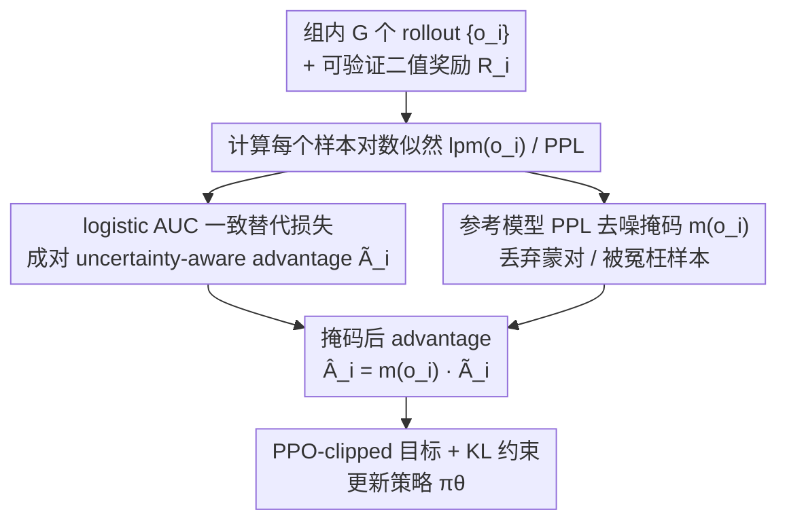

# Calibration-Aware Policy Optimization for Reasoning LLMs

**会议**: ACL 2026  
**arXiv**: [2604.12632](https://arxiv.org/abs/2604.12632)  
**代码**: 待确认  
**领域**: LLM 推理 / RL / 校准  
**关键词**: GRPO, 校准, AUC consistency, advantage estimation, 推理时缩放

## 一句话总结
作者首先证明 GRPO 类算法的"奖励-only"advantage 估计等价于一个对 AUC 不一致的 surrogate（$\phi(t)=-t$，scale-不变性破坏），导致准确率上升的同时相对校准 (perplexity AUC) 持续退化；据此提出 CAPO：把 advantage 换成基于 logistic AUC consistent surrogate 的"成对、uncertainty-aware"形式，再用 reference-model PPL 做去噪 masking，在 Qwen2.5-Math 1.5B/7B 上实现校准 +15~25%、准确率持平或反超 GRPO，AIME 推理时缩放再涨 5%。

## 研究背景与动机

**领域现状**：RLVR (Reinforcement Learning from Verifiable Rewards) 用 GRPO/GSPO 等算法把数学推理模型的准确率推得很高，但有不少工作（Liu 2025、Kalai 2025、Bereket 2025）指出训出来的模型变得"过度自信"——错的答案 perplexity 反而比对的还低，相对校准 (AUC) 退化。

**现有痛点**：校准的实用意义很大：(1) 多 agent 协作里靠 confidence 决定是否调度备援模型；(2) inference-time scaling 靠 confidence 挑候选；(3) 拒答 (abstention) 来抑制 hallucination。如果 RM 训出来的模型 PPL 不再反映正确性，下游全部受影响。已有几种补救方案：CoDaPO、CDE（reward/advantage shaping）、SimKO（label smoothing）等，但都是 heuristic、没有理论保证，校准改善有限或牺牲了 accuracy。

**核心矛盾**：GRPO 的目标只看 reward，不看 sample 的 uncertainty/PPL；这种"reward-only"信号在数学上和"校准"是 misaligned 的——optimizer 完全可以把所有 sample 的 PPL 一起压低（包括错的）来提升 reward，造成准确率涨、AUC 跌。

**本文目标**：(1) 给"GRPO 退化校准"找出一个 rigorous 的数学解释；(2) 设计一个有理论保证 (AUC consistent) 的 advantage 估计，把校准 / 准确率联合优化；(3) 把训练稳住——因为现在的 advantage 是非线性 (logistic) 的，对噪声 sample 敏感。

**切入角度**：作者从 AUC 优化理论入手 (Gao & Zhou 2012)——把 GRPO 的 REINFORCE 梯度改写成成对差分 (U-statistic) 后，发现它隐含的 surrogate 就是 $\phi(t)=-t$；通过 scale invariance 反例 ($\mathrm{AUC}(\alpha f) = \mathrm{AUC}(f)$ 但 $\mathcal{L}_{-t}(\alpha f) = \alpha \mathcal{L}_{-t}(f)$) 证明它不是 AUC consistent 的；自然的替代就是 logistic surrogate $\phi_\tau(t)=\log(1+\exp(-t/\tau))$。

**核心 idea**：把"reward-only"advantage $A_i = R_i - \bar R$ 换成"uncertainty-aware"成对 advantage $\tilde A_i = \sum_j \phi'(lpm(o_i) - lpm(o_j))$，由 logistic surrogate 的导数 (sigmoid) 决定，并对每个 sample 用 reference-model PPL mask 掉极端噪声。

## 方法详解

### 整体框架
CAPO 是 GRPO 框架的"局部手术"——保留 PPO-clipped 目标和 KL 约束，只把 advantage $\hat A_i$ 替换为 $\hat A_i^{CAPO} = m(o_i)\,\tilde A_i$：
- $\tilde A_i$ 来自 logistic AUC surrogate 的梯度，依赖**所有 group 内其它样本**的 PPL，把"correct 但 PPL 高"和"incorrect 但 PPL 低"两类 misranked 样本的权重放大。
- $m(o_i)$ 是 reference-model (base model) PPL 的 indicator mask：correct 但 ref-PPL > ref-high 视为"碰巧蒙对"丢弃；incorrect 但 ref-PPL < ref-low 视为"思路接近被冤枉"丢弃。
- 最终目标 $J_{CAPO}(\theta) = \mathbb{E}[\sum_i \min(r_i \hat A_i^{CAPO}, \mathrm{clip}(r_i,1\pm\epsilon)\hat A_i^{CAPO})]$。

### 关键设计

**1. logistic AUC consistent surrogate：把"只看 reward"的 advantage 换成对 AUC 一致的成对形式**

GRPO 的 advantage 只盯着 reward 误差，optimizer 完全可以把所有样本（包括错的）的 PPL 一起压低来涨 reward，于是准确率上去了、相对校准却垮了。作者先把 GRPO 的 REINFORCE 梯度 $\nabla J_{GRPO} = \mathbb{E}[\sum_i (R_i - \bar R)\nabla_\theta lpm(o_i)]$ 用 U-statistic 不变性改写成成对差分 $\nabla \mathbb{E}[(lpm(o_1)-lpm(o_2))(R_1-R_2)]$，从中读出它隐含的 ranking surrogate 是 $\phi(t)=-t$。问题就出在这里：这个 surrogate 是 scale-sensitive 的——把打分函数整体放大 $\alpha$ 倍，AUC 不变（$\mathrm{AUC}(\alpha f)=\mathrm{AUC}(f)$）而 loss 跟着变（$\mathcal{L}_{-t}(\alpha f)=\alpha\mathcal{L}_{-t}(f)$），意味着可以无限降 loss 却完全不改进 AUC，所以它对 AUC 不一致（Theorem 3）。

替换方案是 logistic surrogate $\phi_\tau(t)=\log(1+e^{-t/\tau})$，它满足 Theorem 1 要求的 convex + non-increasing + $\phi'(0)<0$，并由 Theorem 2 的 regret bound $L(f)-L^* \le \tfrac{1}{\ln 2}(L_\phi(f)-L_\phi^*)$ 保证"优化 surrogate 就是在优化 AUC"。落到 advantage 上，correct 样本写成 $\tilde A_i = -\sum_{j:R_j=0}\phi'(lpm(o_i)-lpm(o_j))$，incorrect 样本对称。它的导数 $\phi'(t)=-\sigma(-t)$ 是个 sigmoid 形状（图 2），在 $t<0$ 区间数值最大：当 correct/incorrect 的 PPL gap 已经拉得很开时 $|\phi'|\to 0$、梯度被自动压住，只对"快要排错"的边界样本给大梯度——也就是 "correct 且高 PPL"或"incorrect 且低 PPL" 这类 PPL-misranked、信息量最丰富的样本。对照之下，GRPO 给所有 correct 一律 $+|\bar R|$、所有 incorrect 一律 $-|\bar R|$，完全不区分 uncertainty；所以 CAPO 不是"外挂一个 calibration regularizer"，而是从根上把 sample-level 权重从"扁平 reward"升级成"难样本聚焦 + 自动校准"。这一步是全文最大的贡献——它把"GRPO 为什么总退化校准"从经验观察提升成数学必然，而 logistic surrogate 也不是随手选的，是带现成 regret bound 和全局最优收敛保证的。

**2. reference-model PPL 去噪 masking：用 base model 的 PPL 过滤被 binary reward 误判的噪声样本**

成对 advantage 对极端样本格外敏感（sigmoid 在边界处梯度最大），一旦一个"其实是蒙对"的 correct 样本被当成强正信号，就会把真正合理的推理一起拽向胡乱 token 分布。作者借助一个事实：base model 训练前是良好校准的（Kalai 2025），所以它的 PPL 是样本质量的可靠指示。于是给每个样本乘一个 indicator mask $m(o) = \mathbb{I}[PPL_{ref}(o) \le \text{ref-high}]$（当 $R=1$）或 $\mathbb{I}[PPL_{ref}(o) \ge \text{ref-low}]$（当 $R=0$）——correct 但 ref-PPL 高于 ref-high 视为"碰巧蒙对"丢弃，incorrect 但 ref-PPL 低于 ref-low 视为"思路接近被冤枉"丢弃。阈值直接取自 reference model 正/错回答 PPL 分布的上下四分位（2.5 / 1.05），不需要额外学习。这是个便宜但必要的 stabilizer：Fig 9 显示去掉 mask 后 entropy 持续上升、准确率提前停滞甚至下降。

### 损失函数 / 训练策略
- 模型：Qwen2.5-Math-1.5B / 7B；训练数据 20k DeepScaler 题，验证 240 题。
- 框架：verl + 8× A100；1.5B 跑 600 步约 24h，7B 跑 400 步约 48h。
- 超参：lr 1e-6，batch 128，PPO mini-batch 64，rollout n=8 (val 16)，$\epsilon=0.2$，KL/entropy coef = 0；temperature 1.0。
- CAPO-only：$\tau=0.6$ (1.5B) / 0.5 (7B)，ref-high=2.5，ref-low=1.05。
- 评测：6 个 benchmark (AIME24/25, MATH500, AMC23, Minerva, OlympiadBench)；指标 mean@16 + AUC-mean + Precision-Coverage + inference-time scaling (Perplexity Consistency, N=16)。

## 实验关键数据

### 主实验
6 个 benchmark 上 calibration (AUC-mean) 和 accuracy (mean@16) 对比（Qwen2.5-Math-7B 平均，从 Fig 1/3 提取代表性数字）：

| 方法 | AIME25 AUC | AIME25 提升 | AIME24+25 推理时缩放 acc (1.5B) | (7B) |
|------|------|------|------|------|
| GRPO | 0.54 | – | 20.33% | 33.33% |
| GSPO | – | – | 20.00% | 32.21% |
| CoDaPO | – | – | 21.67% | 31.66% |
| CDE | – | – | 16.67% | 31.66% |
| SimKO | – | – | 11.67% | 23.33% |
| **CAPO (Ours)** | **0.79** | **+25%** | **25.33%** | **38.33%** |

1.5B 上 AIME25 AUC 从 0.63 (GRPO) 涨到 0.78 (+15%)；7B 上从 0.54 涨到 0.79 (+25%)。准确率 (mean@8) 跟 GRPO 持平或反超，在 AIME24/25/Minerva 上拿最高。

### 消融实验

| 配置 | 现象 |
|------|------|
| Full CAPO | 校准稳步改善 + accuracy 稳步上升 + entropy 平稳 |
| w/o noise mask | entropy 持续上升，accuracy 提前停滞甚至下降 |
| GRPO + only mask | AUC 不改善 (印证 surrogate 是关键，不是 mask) |
| $\tau \in \{0.4, 0.6, 1.0\}$ | acc / AUC 变化 < 1 个点（鲁棒） |
| ref-high/low 收紧 [1.25, 2.1] vs [1.05, 2.5] | 性能几乎不变 |

### 关键发现
- **GRPO 校准退化是数学必然**：Theorem 3 证明 reward-only advantage 的 surrogate $\phi(t)=-t$ 不 AUC consistent，所以再多调参也救不了；这条结论也直接覆盖 GSPO（Fig 1c 同样退化）。
- **CAPO 实现"训练动态稳态"**：Fig 1b/c 显示 GRPO/GSPO 的 AUC 随训练单调下降，CAPO 随训练单调上升；说明 surrogate 选对后，校准和准确率不再 trade-off。
- **抑制掉中间 noise 才能稳**：去 mask 后 entropy 上涨 → policy 变 random → 准确率掉；可见 binary verifier reward 的噪声在成对 advantage 下放大效应明显，mask 是必需而非锦上添花。
- **推理时缩放收益放大**：AIME 上 CAPO 比 GRPO 涨 5%（绝对值），因为 inference-time 算法（Perplexity Consistency）严格依赖 PPL 排序，校准好就放大；这是校准改善的最直接下游回报。
- **其他 calibration 方法的代价大**：SimKO 在 AMC 直接掉 12 个点、AIME24 掉 7.7 个点，证明 label smoothing 类硬手段会牺牲准确率；CAPO 是少数"零 acc 代价"的。

## 亮点与洞察
- 用 AUC consistency theory 把 RLHF 里"过自信"现象从 vague heuristic 推到 rigorous 数学命题，是这条线最干净的理论贡献——之后任何 reward-only advantage 方法都可以拿这个反例去测。
- $\phi'(t)=-\sigma(-t)$ 的 implicit "hard sample mining" 性质很优雅——不需要额外的 difficulty estimator，sigmoid 形状自动把梯度集中到 misranked sample 上。
- "用 reference model PPL 当 sample quality proxy" 是个 cheap 又准的设计——complementary 到 critic-free 的 RL 框架，不增加任何额外可训参数。
- 校准改善能直接换算到推理时缩放收益（+5%），这条 causal chain 把"校准"这个看似抽象的指标和 benchmark 数字挂钩，是个很有说服力的部署论据。

## 局限与展望
- 评测局限于数学推理；逻辑题、常识、open-domain QA 上 GRPO 的退化模式是否相同未知，理论分析能套用但 reference model PPL 是否仍是好的 quality proxy 不确定。
- mask 阈值取自 base model 的固定分位数，依赖 base model 校准良好这一假设；如果 base 已经被某种预训练 trick "破坏校准"（如长时间 SFT），mask 可能失效。
- 成对 advantage 需要 group 内同时有正负样本——如果一组全对或全错就废了；实践中 prompt 难度需要预先 calibration 让正负 mix。
- $\tau$ 虽然鲁棒，但跨 base model 的最优值不同（1.5B 用 0.6、7B 用 0.5），暗示需要随模型规模轻调。
- 改进思路：(1) 推广到 stochastic rewards (multi-choice、open-ended judge)，把 binary R 替换成 logit；(2) 用 EMA reference 而不是固定 base，避免训练后期 PPL 分布 drift；(3) 把 CAPO 与 abstention/refusal 联合训练，做端到端的 hallucination mitigation。

## 相关工作与启发
- **vs CoDaPO / CDE (reward shaping)**: 都靠改 reward 形状救校准，但缺理论保证；本文证明只要保留 reward-only advantage，就和 AUC 系统性 misaligned，因此 reward shaping 治标不治本。
- **vs SimKO (label smoothing)**: SimKO 用 label smoothing 抑制 overconfidence，效果上 calibration 一般，但准确率代价惨重；CAPO 既改 surrogate 又加 mask，accuracy 零代价。
- **vs J1 / Think-RM (reasoning RM)**: 同样用 GRPO 训 reasoning，但只关心 preference 准确率不关心 calibration；CAPO 给出了"如何在 GRPO 里同时拿到 calibration"的通用方案，可以直接接到这些工作上。
- **启发**：(1) 任何带 group 级别比较的 RL 算法都隐含一个 pairwise surrogate，从 surrogate consistency 角度审视设计可以避免"看似 reasonable 实际数学不收敛"的陷阱；(2) "reference model 自校准"作为 quality proxy 是个泛用 trick，可推广到 SFT 数据筛选、RM 标注质量评估等场景。

## 评分
- 新颖性: ⭐⭐⭐⭐⭐ 把 RLHF 里"过自信"问题与 AUC consistency theory 直接挂上钩，并给出 rigorous 反例，是该领域较少见的"用理论解释经验现象"工作。
- 实验充分度: ⭐⭐⭐⭐ 6 个 benchmark + 5 个 baseline + 1.5B/7B 两规模 + 校准/精度/推理时缩放/精度-覆盖率四指标 + 超参鲁棒性 + mask ablation；但只测数学一个域。
- 写作质量: ⭐⭐⭐⭐ Section 3 的"empirical observation → theoretical explanation"叙事干净；Theorem 3 的证明思路（U-statistic + scale invariance 反例）短而有力。
- 价值: ⭐⭐⭐⭐ 给所有用 GRPO 训 reasoning model 的 team 一个 drop-in 替代 advantage 估计；理论框架可被任何后续 RLVR 工作复用。

<!-- RELATED:START -->

## 相关论文

- [\[ACL 2026\] Think Outside the Policy: In-Context Steered Policy Optimization](think_outside_the_policy_in-context_steered_policy_optimization.md)
- [\[ACL 2026\] Adapt to Thrive! Adaptive Power-Mean Policy Optimization for Improved LLM Reasoning](adapt_to_thrive_adaptive_power-mean_policy_optimization_for_improved_llm_reasoni.md)
- [\[ICLR 2026\] DRPO: Efficient Reasoning via Decoupled Reward Policy Optimization](../../ICLR2026/llm_reasoning/drpo_efficient_reasoning_via_decoupled_reward_policy_optimization.md)
- [\[ICLR 2026\] FastGRPO: Accelerating Policy Optimization via Concurrency-aware Speculative Decoding and Online Draft Learning](../../ICLR2026/llm_reasoning/fastgrpo_accelerating_policy_optimization_via_concurrency-aware_speculative_deco.md)
- [\[ACL 2026\] ChAIRO: Contextual Hierarchical Analogical Induction and Reasoning Optimization for LLMs](chairo_contextual_hierarchical_analogical_induction_and_reasoning_optimization_f.md)

<!-- RELATED:END -->
