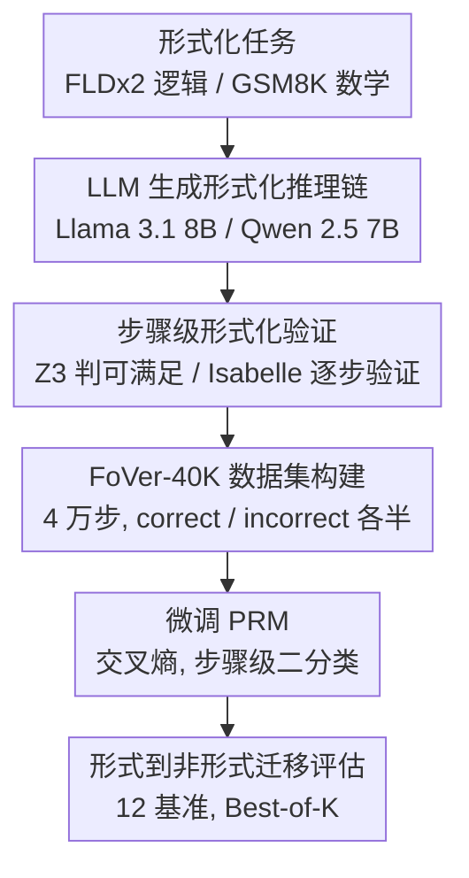

# Efficient PRM Training Data Synthesis via Formal Verification

**会议**: ACL 2026  
**arXiv**: [2505.15960](https://arxiv.org/abs/2505.15960)  
**代码**: [GitHub](https://github.com/psunlpgroup/FoVer)  
**领域**: LLM推理  
**关键词**: PRM, 形式化验证, 步骤级标签, Z3, Isabelle

## 一句话总结

本文提出 FoVer，一个利用形式化验证工具（Z3 和 Isabelle）为形式化推理任务的步骤级推理链自动标注正确性标签的框架，生成 FoVer-40K 训练集并微调 PRM，在 12 个推理基准上展示了从形式化到非形式化的迁移能力和跨任务泛化能力。

## 研究背景与动机

**领域现状**：过程奖励模型（PRM）通过提供中间推理步骤的过程监督来提升 LLM 推理能力，已成为提升推理性能的重要方向。PRM 通常通过微调 LLM 来对推理步骤的正确性进行二分类。

**现有痛点**：(1) 人工标注步骤级标签极其昂贵，且标注者间一致性低（Zheng et al. 2025 丢弃了 30% 的标注数据）；(2) Monte Carlo roll-outs（Math-Shepherd）需要多次 LLM 调用来标注每个步骤，计算成本高且标签有噪声——用最终答案的到达频率估算中间步骤的正确性本身就是不精确的；(3) 基于扰动的方法引入人工的不自然错误；(4) 用更强 LLM 标注相当于能力蒸馏。

**核心矛盾**：PRM 需要准确的步骤级标签，但现有标注方法要么昂贵（人工）、要么不精确（Monte Carlo）、要么不自然（扰动）——能否找到一种既高效又精确的标注方式？

**本文目标**：利用形式化验证工具为形式化推理任务提供高效且精确的步骤级标注，并验证在形式化任务上训练的 PRM 能否迁移到非形式化自然语言推理任务。

**切入角度**：形式化推理任务（逻辑推理、定理证明）的每个步骤都可以通过形式化验证工具（如 SAT 求解器 Z3、定理证明器 Isabelle）精确验证其正确性——这是一种零成本的完美标注源。

**核心 idea**：形式化验证工具可以将步骤级标注从"近似估计"变为"精确判定"——在形式化任务上获得的 PRM 能力可以迁移到非形式化推理任务，实现形式到非形式的迁移和跨任务泛化。

## 方法详解

### 整体框架

两阶段框架：Stage 1 让 LLM 生成形式化推理步骤（few-shot 指导格式）→ 用形式化验证工具标注每步正确性。Stage 2 用标注数据微调 LLM 做步骤级二分类（输出 "correct"/"incorrect"），得到 FoVer-PRM，再迁移到非形式化自然语言推理任务上评估。

### 关键设计

**1. 步骤级形式化验证：把每一步的正确性从"近似估计"变成"确定性判定"**

PRM 的训练瓶颈是步骤级标签：人工标贵且一致性低，Monte Carlo 用最终答案的到达频率反推中间步骤本身就不精确，扰动法又会注入不自然的错误。FoVer 的关键洞察是——形式化推理任务里，每一步都能被工具精确验证，于是它干脆把验证器当成"零成本的完美标注器"。对逻辑推理任务（FLDx2），每个推理步是一个逻辑蕴涵，验证方式是把它否定后检查可满足性：不可满足就意味着这步正确。例如验证 $(A \to B) \land A \to B$，把它转成 $(\neg A \lor B) \land A \land \neg B$ 交给 SAT 求解器 Z3 判可满足性；对定理证明类的数学题，则用 Isabelle 逐步验证证明的每一步。这些工具不只能做解级验证，还能做步骤级验证，给出的标签是确定性正确的，没有噪声也没有主观性。

**2. FoVer-40K 数据集构建：用形式化任务的可验证性换来大规模精确标注**

有了完美标注器，剩下的是挑对源任务、把数据量做起来。FoVer 在 FLDx2（形式逻辑，多步一阶逻辑推导）和 GSM8K 级数学题上，让 Llama 3.1 8B 与 Qwen 2.5 7B 生成推理链，再用 Z3 和 Isabelle 逐步打标签，最终得到 4 万步、正负各半（50% correct / 50% incorrect）的训练集。选 FLDx2 是因为它的推导规则多样性最高——逻辑这一侧负责覆盖推理模式的广度，GSM8K 那一侧负责数学推理，两者的形式化版本都能被工具精确验证，从而在"多样性"和"标签可信度"之间同时拿满。

**3. 形式到非形式的迁移评估：验证形式化训练的 PRM 能不能泛化到自然语言推理**

PRM 的真正用途是改善自然语言推理，所以"形式化训练能否迁移"必须被直接检验，否则前两步只是自洽的玩具。FoVer 在 12 个基准上评测 FoVer-PRM，并刻意把它们分成两档：6 个是训练任务的非形式化变体（LogicNLI、AQuA-RAT、AIME 等数学/逻辑基准），考察近迁移；另 6 个与训练任务显著不同（HANS NLI、MMLU、BBH），考察跨任务泛化。评估统一用 Best-of-K 标准协议。正是这个分档设计，让"步骤级验证能力具有任务无关的通用性"这一核心发现得到了可比的证据，而不是只在同分布上自说自话。

### 损失函数 / 训练策略

交叉熵分类损失，微调 LLM 对每个推理步骤输出 "correct" 或 "incorrect"。基座模型为 Llama 3.1 8B 和 Qwen 2.5 7B。

## 实验关键数据

### 主实验

**Best-of-7 推理性能（12 个基准，5 类任务）**

| PRM | 逻辑 | 数学 | NLI | MMLU | BBH | 平均 |
|-----|------|------|-----|------|-----|------|
| Llama 3.1 8B（基线） | 48.9 | 基线 | 基线 | 基线 | 基线 | 基线 |
| **FoVer-Llama3.1-8B** | **50.6** | 提升 | 提升 | 提升 | 提升 | **高于基线** |
| Qwen 2.5 7B（基线） | 基线 | 基线 | 基线 | 基线 | 基线 | 基线 |
| **FoVer-Qwen2.5-7B** | 提升 | 提升 | 提升 | 提升 | 提升 | **高于基线** |

### 消融实验

**与现有 PRM 训练方法的对比**

| 方法 | 标注成本 | 标签质量 | 平均性能 |
|------|---------|---------|---------|
| 人工标注 | 极高 | 高（但一致性问题） | 高 |
| Monte Carlo roll-outs | 高（多次 LLM 调用） | 中（噪声） | 中高 |
| 扰动方法 | 中 | 低（不自然错误） | 中 |
| **FoVer** | **极低（自动化）** | **完美（确定性）** | **竞争** |

### 关键发现

- FoVer-PRM 在所有 5 类任务上都优于未微调的基线 PRM——形式化训练数据确实改善了自然语言推理
- 最令人惊讶的是在 NLI 和 BBH 上的提升——这些任务与训练数据的形式逻辑和数学题差异很大，展示了跨任务泛化能力
- FoVer 的标签质量是确定性正确的，而 Monte Carlo roll-outs 存在噪声——即使数据规模较小（40K 步），高质量标签也能带来竞争性能
- 形式到非形式迁移是本文的核心发现——步骤级验证能力似乎具有任务无关的通用性

## 亮点与洞察

- 利用形式化验证工具作为"完美标注器"是一个优雅的思路——将标注成本降到接近零
- 形式到非形式迁移的成功挑战了"PRM 必须在同分布数据上训练"的假设
- FoVer 框架的模块化设计（验证工具可替换）使其可扩展到更多形式化任务

## 局限与展望

- FoVer-40K 仅包含形式逻辑和 GSM8K 级数学题，未覆盖更复杂的形式化推理
- 步骤级形式化验证要求 LLM 生成符合工具格式的推理链，格式不合法的生成会被丢弃
- 未探索将 FoVer 与 Monte Carlo roll-outs 结合的可能性
- 迁移能力的理论解释仍不充分——为什么形式逻辑上的训练能改善 BBH？

## 相关工作与启发

- **vs Math-Shepherd**: Math-Shepherd 用 Monte Carlo 估算标签，FoVer 用形式化验证确定标签——质量提升但适用范围更窄
- **vs PRM800K (Lightman 2024)**: 依赖人工标注，FoVer 完全自动化且标签更精确
- **vs 强 LLM 蒸馏**: 用 GPT-4 标注本质上是能力蒸馏，FoVer 不依赖任何更强模型

## 评分

- 新颖性: ⭐⭐⭐⭐⭐ 用形式化验证工具做步骤级 PRM 标注是全新思路，形式到非形式迁移发现重要
- 实验充分度: ⭐⭐⭐⭐ 12 个基准全面评估，但数据规模较小
- 写作质量: ⭐⭐⭐⭐⭐ 问题定义清晰，形式化验证的示例直观易懂
- 价值: ⭐⭐⭐⭐⭐ 为 PRM 训练提供了高效且精确的数据生成方案

<!-- RELATED:START -->

## 相关论文

- [\[ICML 2026\] An Information-Theoretic Criterion for Efficient Data Synthesis](../../ICML2026/llm_reasoning/an_information-theoretic_criterion_for_efficient_data_synthesis.md)
- [\[ACL 2026\] MathAgent: Adversarial Evolution of Constraint Graphs for Mathematical Reasoning Data Synthesis](mathagent_adversarial_evolution_of_constraint_graphs_for_mathematical_reasoning_.md)
- [\[ACL 2026\] Self-Reinforcing Controllable Synthesis of Rare Relational Data via Bayesian Calibration](self-reinforcing_controllable_synthesis_of_rare_relational_data_via_bayesian_cal.md)
- [\[ICLR 2026\] Understanding the Role of Training Data in Test-Time Scaling](../../ICLR2026/llm_reasoning/understanding_the_role_of_training_data_in_test-time_scaling.md)
- [\[ACL 2025\] Safe: Enhancing Mathematical Reasoning in Large Language Models via Retrospective Step-aware Formal Verification](../../ACL2025/llm_reasoning/safe_math_reasoning.md)

<!-- RELATED:END -->
