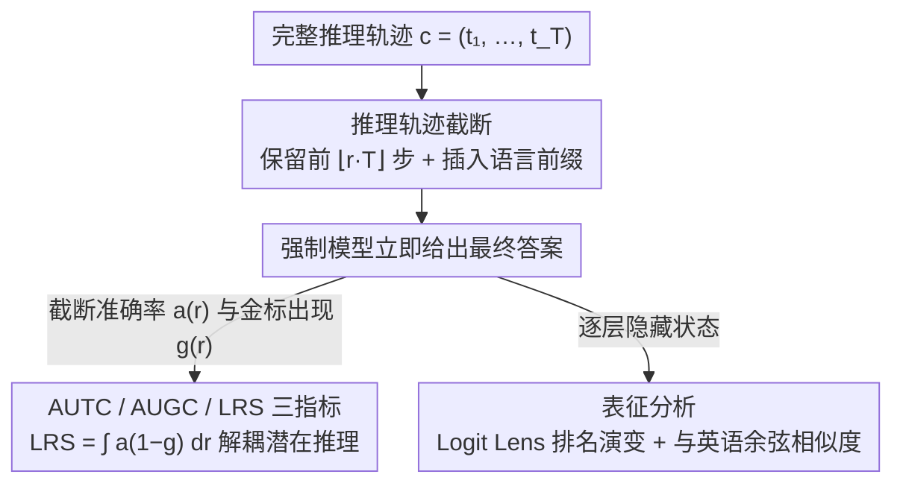

# Large Reasoning Models Are (Not Yet) Multilingual Latent Reasoners

**会议**: ACL 2026 Findings  
**arXiv**: [2601.02996](https://arxiv.org/abs/2601.02996)  
**代码**: [https://github.com/cisnlp/multilingual-latent-reasoner](https://github.com/cisnlp/multilingual-latent-reasoner)  
**领域**: LLM推理  
**关键词**: 多语言推理, 潜在推理, 思维链截断, 表征分析, 推理模型

## 一句话总结

本文系统性地研究了大型推理模型（LRM）在 11 种语言上的潜在推理行为，发现潜在推理能力存在于多语言中但分布不均（高资源语言强、低资源弱），且内部推理动态趋于以英语为中心的共享路径。

## 研究背景与动机

**领域现状**：大型推理模型（如 DeepSeek-R1）通过生成显式思维链（CoT）在数学推理等任务上取得突破性进展。近期研究发现，这些模型在完成显式推理步骤之前，其隐藏状态中已经通过"潜在推理"形成了正确答案——模型能"提前想到"结果。

**现有痛点**：现有对潜在推理的研究几乎完全集中在英语上，对多语言场景下潜在推理如何表现一无所知。而在显式推理层面，多语言性能已知存在显著差异——低资源语言的推理质量明显较差。

**核心矛盾**：如果显式推理在不同语言间表现不均，那么潜在推理是否也呈现类似的不均衡？还是潜在推理遵循某种语言无关的内部机制？

**本文目标**：两个研究问题——(RQ1) LRM 是否在各语言中展现潜在推理能力，其强度如何变化？(RQ2) 不同语言是否遵循不同的内部潜在推理路径，还是共享统一机制？

**切入角度**：使用推理轨迹截断策略——给模型仅部分推理步骤，观察其能否在截断点给出正确答案。如果只看到少量推理步骤就能答对，说明模型在内部已经计算出了答案（即存在潜在推理）。

**核心 idea**：通过多语言截断实验和表征分析，揭示潜在推理的多语言特性——存在但不均匀，且内部趋向以英语为中心的共享路径。

## 方法详解

### 整体框架

在 11 种语言（覆盖高/中/低资源）上，对 DeepSeek-R1 蒸馏的三种规模模型（7B/14B/32B）进行截断实验。使用 MGSM（简单）和 Multilingual AIME（困难）两个数学推理基准。通过截断比例 $r \in [0,1]$ 控制保留的推理步骤比例，评估模型在部分推理信息下的正确率，并通过 logit lens 和隐藏状态相似度分析内部推理动态。整体流程是一条"先剥推理、再分两路探针"的测量管线：先生成完整推理轨迹并按比例截断、强制模型立即作答，得到的准确率曲线进入指标一路解耦出潜在推理强度，逐层隐藏状态则进入表征一路判断各语言是否共享同一条内部路径。

### 关键设计

**1. 推理轨迹截断：把"模型多依赖显式步骤"变成可测的量**

要判断模型是否在内部偷偷算好了答案，得想办法剥掉它的显式推理再看它还能不能答对。做法是对每个问题 $x$ 先生成完整推理轨迹 $c = (t_1, \dots, t_T)$，再按截断比例 $r$ 只保留前 $\lfloor r \cdot T \rfloor$ 步，然后强制模型立刻给出最终答案；为保证截断后推理语言不漂回英语，还在 `<think>` 之后插入语言特定前缀。关键的对照是把"截断后准确率"和"金标答案是否已经出现在可见轨迹里"两条曲线放在一起——前者是模型答对的总量，后者是答案被显式写出来的部分，二者之差才是内部潜在推理贡献的部分。

如果模型只看到 10% 的推理步骤、而正确答案此时还没在可见文本中出现，它却照样答对，那就强烈暗示答案早已在隐藏状态里算好了。极端情形 $r=0$（一步推理都不给）时仍有非零准确率，正是潜在推理最直接的证据。

**2. AUTC / AUGC / LRS 三指标：把潜在推理从显式推理里干净地解耦出来**

光看截断准确率会高估潜在推理——模型可能只是因为在早期步骤里已经把答案写出来了才"答对"。为此论文沿截断比例积分出三条曲线下面积：AUTC $= \int_0^1 a_k(r)\, dr$ 衡量正确预测出现得有多早、有多稳；AUGC $= \int_0^1 g_k(r)\, dr$ 衡量正确答案在轨迹里被显式写出的程度。

真正的核心指标是潜在推理分数 LRS $= \int_0^1 a_k(r)\,(1 - g_k(r))\, dr$，它用 $(1-g_k(r))$ 给准确率加权，等于专门只统计"答对了、但答案还没被显式写出来"的那部分。这样答案被提前写出来带来的虚高就被乘成了零，剩下的才是非显式的、纯粹靠内部计算得到的潜在推理能力，便于在 11 种语言间公平比较。

**3. 表征分析（Logit Lens + 隐藏态相似度）：看不同语言是否走同一条内部路径**

指标解决了"有没有、有多强"，但回答不了 RQ2——各语言是各走各的路，还是共用一套机制。论文用两个互补的探针：一是 logit lens，逐层把隐藏状态投影回词表空间，追踪正确答案 token 的排名如何随层数演变；二是逐层、逐推理步地计算每种语言的隐藏状态与英语隐藏状态的余弦相似度。

如果各语言的 logit lens 排名演变轨迹高度雷同，而且非英语语言的隐藏态与英语高度对齐，就说明模型内部其实收敛到了一条以英语为中心的共享潜在推理路径——哪怕输入是中文，它在内部可能仍"用英语在想"。实验也确实观察到高资源语言与英语的相似度显著高于低资源语言，与 LRS 上的资源梯度互相印证。

### 损失函数 / 训练策略

本文为分析性研究，不涉及训练。使用 DeepSeek-R1-Distill-Qwen-{7B, 14B, 32B} 三种规模模型进行推理和分析。

## 实验关键数据

### 主实验

**MGSM 上的截断指标 (R1-Qwen-32B)**

| 语言 | AUTC | AUGC | LRS |
|------|------|------|-----|
| EN (高资源) | 0.75 | 0.25 | 0.53 |
| ZH (高资源) | 0.70 | 0.30 | 0.45 |
| DE (高资源) | 0.67 | 0.20 | 0.51 |
| JA (中资源) | 0.63 | 0.21 | 0.47 |
| BN (中资源) | 0.61 | 0.23 | 0.44 |
| SW (低资源) | 0.38 | 0.20 | 0.30 |
| TE (低资源) | 0.39 | 0.23 | 0.30 |

**Multilingual AIME 上的截断指标 (R1-Qwen-32B)**

| 语言 | AUTC | AUGC | LRS |
|------|------|------|-----|
| EN | 0.18 | 0.61 | 0.06 |
| ZH | 0.13 | 0.75 | 0.03 |
| SW | 0.01 | 0.05 | 0.00 |

### 消融实验

**模型规模对 LRS 的影响 (MGSM, 英语)**

| 模型 | AUTC | LRS |
|------|------|-----|
| R1-Qwen-7B | 0.52 | 0.38 |
| R1-Qwen-14B | 0.59 | 0.44 |
| R1-Qwen-32B | 0.75 | 0.53 |

### 关键发现

- **潜在推理存在但不均匀**：在 MGSM 上，英语/中文等高资源语言 0% 截断时 pass@1 已约 0.2，说明模型无需任何显式推理即可内部计算出答案。低资源语言（斯瓦希里语、泰卢固语）的 LRS 仅为高资源语言的约 60%
- **任务难度决定潜在推理可检测性**：Multilingual AIME 上 LRS 急剧下降（EN 从 0.38→0.06），说明复杂问题需要更多显式推理步骤
- **内部推理路径趋向以英语为中心**：logit lens 显示各语言的逐层答案排名演变轨迹高度相似；高资源语言与英语隐藏状态的余弦相似度显著高于低资源语言
- **模型规模提升潜在推理但不消除差距**：7B→32B 所有语言的 LRS 均提升，但高/低资源差距持续存在

## 亮点与洞察

- 首次系统性地在多语言维度上研究 LRM 的潜在推理行为，填补了重要的认知空白
- LRS 指标设计精巧，通过将准确率与"答案是否已在轨迹中出现"解耦，提供了潜在推理的纯净度量
- "以英语为中心的共享推理路径"这一发现对理解多语言 LLM 的内部工作机制有深远意义——即使输入是中文，模型内部可能在"用英语思考"
- 截断比例 0% 时的非零准确率是潜在推理最有力的证据

## 局限与展望

- 仅使用数学推理任务评估，未涉及逻辑推理、代码推理等其他推理类型
- 分析主要在蒸馏模型上进行，原始 DeepSeek-R1 的行为可能有所不同
- 因果机制分析有限——观察到的相关性（熵与正确性）不等于因果关系
- 未来可探索通过多语言推理数据后训练来提升低资源语言的潜在推理能力

## 相关工作与启发

- 连接了两条研究线：多语言推理（显式层面已知的语言差距）和潜在推理（隐式层面的新维度）
- logit lens 分析方法可推广到其他模型能力的多语言对比研究
- 为"translate-then-solve"策略提供了表征层面的解释——模型内部本就倾向于通过英语路径推理

## 评分

- 新颖性: ⭐⭐⭐⭐⭐ 首次多语言潜在推理研究，问题提出和指标设计均有创见
- 实验充分度: ⭐⭐⭐⭐ 11 种语言、3 种模型规模、2 个基准，但缺少非数学任务
- 写作质量: ⭐⭐⭐⭐⭐ 研究问题清晰、实验设计严谨、结论表述精确

<!-- RELATED:START -->

## 相关论文

- [\[ACL 2026\] SeLaR: Selective Latent Reasoning in Large Language Models](selar_selective_latent_reasoning_in_large_language_models.md)
- [\[ACL 2026\] Revisiting Entropy in Reinforcement Learning for Large Reasoning Models](revisiting_entropy_in_reinforcement_learning_for_large_reasoning_models.md)
- [\[ACL 2026\] TrigReason: Trigger-Based Collaboration between Small and Large Reasoning Models](trigreason_trigger-based_collaboration_between_small_and_large_reasoning_models.md)
- [\[ACL 2026\] Parallel Test-Time Scaling for Latent Reasoning Models](parallel_test-time_scaling_for_latent_reasoning_models.md)
- [\[ACL 2025\] Large Language and Reasoning Models are Shallow Disjunctive Reasoners](../../ACL2025/llm_reasoning/large_language_and_reasoning_models_are_shallow_disjunctive_reasoners.md)

<!-- RELATED:END -->
