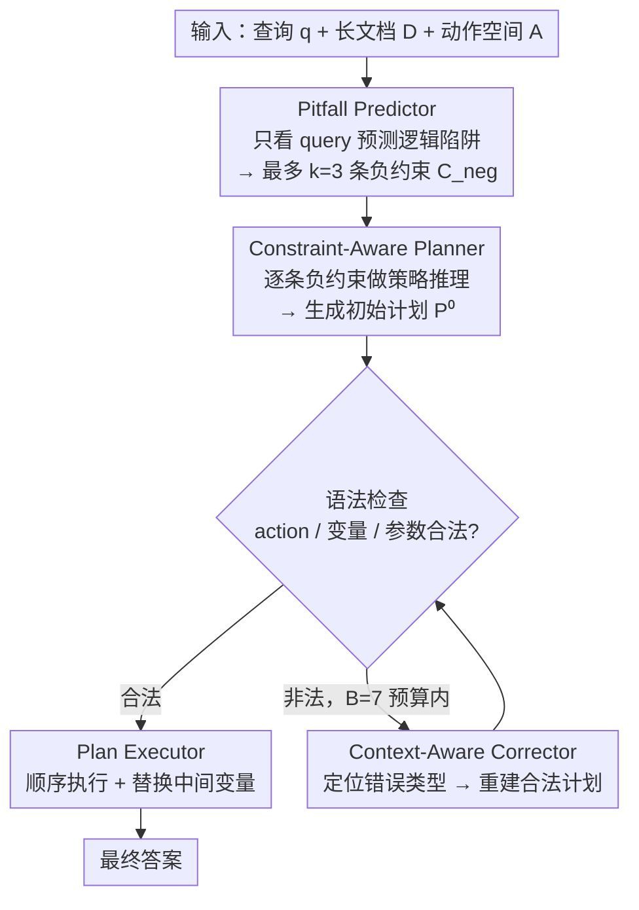

# PPA-Plan: Proactive Pitfall Avoidance for Reliable Planning in Long-Context LLM Reasoning

**会议**: ACL2026  
**arXiv**: [2601.11908](https://arxiv.org/abs/2601.11908)  
**代码**: 论文缓存中未给出公开仓库地址  
**领域**: llm_efficiency  
**关键词**: 长上下文推理、计划生成、负约束、主动避错、Plan-and-Execute

## 一句话总结
PPA-Plan 在生成长上下文推理计划之前先预测可能的逻辑陷阱，并把这些陷阱转成 negative constraints 约束 planner，从而让 LLM 少走表面关键词匹配和错误假设路径，在多组长文 QA 数据集上提升准确率、NLI 分数并显著降低计划执行失败率。

## 研究背景与动机
**领域现状**：LLM 的上下文窗口越来越长，但长上下文推理不只是“能放下更多文本”。在 QuALITY、ConditionalQA、LongReason、Qasper 这类任务中，关键证据常散落在远距离位置，还混有大量无关信息，模型需要跨段落整合、避免位置偏差和表面匹配。

**现有痛点**：Plan-and-Execute 方法通过先生成计划、再逐步执行来提升复杂任务表现。问题是计划本身常常不可靠：LLM planner 容易基于关键词或局部线索形成错误假设，一旦计划写出来，后续 executor 会沿着错误轨道执行。PEARL 等 reactive refinement 虽然会事后修正计划，但模型往往锚定在自己先前输出上，不愿彻底推翻错误前提。

**核心矛盾**：长上下文推理需要明确计划来组织步骤，但计划越早形成，错误假设越容易被固化。与其事后纠错，不如在计划生成前先提醒模型“哪些看似自然的推理路径其实危险”。

**本文目标**：作者希望设计一种主动避错的 planning strategy，让 planner 在写计划前先识别潜在逻辑陷阱、错误前提和范围混淆，并在生成计划时显式避开这些风险，同时保证计划格式可执行。

**切入角度**：PPA-Plan 将错误预防表述为 negative constraints。它不是告诉模型应该怎么回答，而是告诉模型哪些推理模式不能用，例如不要因为出现某个角色名就假设其执行了动作，不要在没有日期标记时强行寻找具体日期，不要把问题范围扩展到未问的对象。

**核心 idea**：先由 Pitfall Predictor 预测“不要犯什么错”，再让 Planner 围绕这些负约束做策略推理和动作选择，比生成后再修补计划更可靠。

## 方法详解

### 整体框架
PPA-Plan 要解决的是 plan-and-execute 在长上下文 QA 上的老毛病：计划一旦写错就会把 executor 带进沟里。它用三个 planning 模块加一个执行模块串起来——Pitfall Predictor、Constraint-Aware Planner、Context-Aware Corrector、Plan Executor——核心思路是「在写计划之前先把不能走的路标出来」。

具体地，输入是查询 `q`、长文档 `D` 和 PEARL 风格的动作空间 `A`。Pitfall Predictor 先几乎只看 query（不读全文）预测潜在陷阱，输出最多 `k=3` 条负约束 $C_{neg}=\{c_1,\dots,c_k\}$；Planner 在 `q`、`A`、`C_neg` 条件下先做策略推理再生成初始计划 $P^{(0)}$，并用语法检查确认 action、变量和参数是否可执行；若计划非法，Corrector 在最多 `B=7` 次预算内拿着当前 invalid plan 和错误信息重新推理修复，输出 $P^{(t)}$；最后 Executor 顺序解析计划步骤，把动作、参数和长文档拼进执行 prompt，存储中间变量并替换依赖，得到最终答案。

### 关键设计

**1. Pitfall Predictor 与负约束生成：在动笔写计划之前，先把 query 里最容易诱发错误推理的坑标出来**

长上下文出错，很多时候不是模型读不懂文本，而是读之前就带着一个错误目标去找证据——比如看到某个角色名就假设他执行了某动作。Predictor 针对的正是这种「先入为主」：它扮演 exam designer 和 logic analyst 两个角色，用 few-shot prompt 批判性审视问题中的隐含前提，专门识别浅层语义匹配、scope confusion、counting trap、多跳证据整合风险等模式，再以结构化 JSON 输出最多 `k` 条 negative constraints。这一步把「不要走的路」显式写出来，相当于在 planner 动笔前先装一个先验刹车，而不是等错误假设固化进计划后再回头补救。

**2. Constraint-Aware Planner 的策略推理：把「不要做什么」翻译成「该做什么」的可执行动作序列**

只甩给模型一句「不要做 X」，它往往无所适从、甚至直接忽略禁令。Planner 的关键在于不直接吐计划，而是先做 Strategy Reasoning：逐条分析每条负约束意味着什么、应该用哪些证据收集动作、推理动作和验证动作去绕开风险，然后才从预定义动作空间里挑 FIND_ELEMENT、FIND_DETAILS、INFER、SUMMARIZE_X、EVALUATE 等 action 拼成函数式计划（必要时也允许定义辅助 action）。这样负约束就从一堆消极禁令变成了正向的任务分解和证据策略，给了模型一条明确的替代路径。

**3. Context-Aware Corrector 与轻量执行：把语法修复从逻辑规划里拆出来，越复杂的好计划越要保**

越聪明的 planner 越容易写出逻辑漂亮但格式不合规的复杂计划，若让同一个 prompt 既管逻辑又管语法，模型常会为了格式牺牲推理结构。Corrector 只看当前 invalid plan 和错误消息、不看长历史（减少过期信息噪声），同样先做 Strategy Reasoning，把未知 action、变量未定义、参数数量错误这类错误类型映射到对应修复操作，再重建合法计划。执行阶段则刻意做轻：长文 QA 的证据已经全在输入文档里，不需要多轮搜索，executor 只按计划抽取、推理、汇总即可。

### 一个完整示例：一次「角色—动作」陷阱的规避
以一个典型的长文 QA 为例：问题问「角色 X 是否做了动作 Y」，而文中确实多次出现 X 的名字。Pitfall Predictor 先输出 3 条负约束——不要因为出现 X 的名字就假设 X 执行了 Y、不要在没有日期标记时强行去找具体日期、不要把问题范围扩展到未问的对象。Planner 拿到这 3 条约束后做 Strategy Reasoning：既然不能凭名字下结论，就得先 FIND_ELEMENT 定位所有提到 X 的段落、再 FIND_DETAILS 抽取这些段落里 X 的实际行为、然后 INFER 判断是否构成 Y、最后 EVALUATE 验证证据是否真支持结论。生成的初始计划若出现变量未定义（如引用了一个还没赋值的中间结果），Corrector 在 `B=7` 预算内定位到这条错误并重排步骤顺序补上依赖，输出合法计划。Executor 顺序执行、逐步替换中间变量，最终给出有证据支撑的回答——整条链路都没有掉进「看到名字就下结论」的坑。

### 损失函数 / 训练策略
PPA-Plan 是 training-free 方法，没有参数更新。实验使用 GPT-4o-mini、Llama-3.1-8B-Instruct 和 Qwen-2.5-14B-Instruct；Llama/Qwen 用 8-bit quantization 以节省显存。所有生成采用 greedy decoding，temperature 为 0。负约束数 `k=3`，计划修正预算 `B=7`。评估中，多选题生成自由文本答案后用 GPT-4o judge 映射回选项；自由问答使用 token-level recall 和基于 DeBERTa-V3-Large 的 NLI entailment score。

## 实验关键数据

### 主实验
PPA-Plan 在三个 base model 上整体优于 GQA、CoT、Plan-and-Solve、ReAct、PEARL 等 baseline。尤其 NLI 分数提升明显，说明生成答案不只是包含更多 token，而是逻辑蕴含更强。

| Base model | 方法 | Overall Acc↑ | Overall Rec↑ | Overall NLI↑ | 主要结论 |
|------------|------|--------------|--------------|--------------|----------|
| GPT-4o-mini | CoT | 74.5 | 61.3 | 42.0 | 准确率尚可，但逻辑一致性不足 |
| GPT-4o-mini | PEARL | 70.8 | 60.6 | 53.6 | reactive planning 提升 NLI |
| GPT-4o-mini | PPA-Plan | 74.1 | 62.6 | 55.8 | 相比 PEARL，NLI 与 recall 更好 |
| Llama-3.1-8B | CoT | 68.7 | 54.1 | 30.6 | 小模型 CoT 逻辑弱 |
| Llama-3.1-8B | PEARL | 68.1 | 58.1 | 68.9 | PEARL 对 NLI 帮助大 |
| Llama-3.1-8B | PPA-Plan | 72.6 | 61.2 | 70.0 | 准确率 +4.5，recall +3.1 |
| Qwen-2.5-14B | PEARL | 71.4 | 57.7 | 51.6 | planning baseline 稳定但有限 |
| Qwen-2.5-14B | PPA-Plan | 77.1 | 61.1 | 54.9 | 全组最高 overall accuracy |

论文还强调，相比 CoT，PPA-Plan 将 GPT-4o-mini overall NLI 提高 13.8 分，将 Qwen-2.5-14B 提高 20.2 分；Llama 上从 30.6 到 70.0，超过两倍。这说明负约束更直接改善了推理有效性。

| 数据集/模型 | PPA-Plan 关键表现 | 对比观察 |
|-------------|------------------|----------|
| QuALITY, GPT-4o-mini | Acc 73.4, Rec 54.0, NLI 41.0 | 比 PEARL Acc 70.3、NLI 38.1 更高 |
| ConditionalQA, Llama | Acc 79.1, NLI 75.9 | 与 PEARL NLI 持平，但 overall 更高 |
| LongReason, Qwen | Acc 72.3, Rec 66.3, NLI 68.9 | 长推理任务中明显优于 PEARL Acc 60.1 |
| Qasper, GPT-4o-mini | Rec 67.1, NLI 61.8 | 比 PEARL NLI 51.1 高 10.7 |

### 消融实验
LongReason 消融直接验证了三个模块的贡献。Full model 在 GPT-4o-mini 和 Qwen 上都最好；去掉 Corrector 会让复杂计划的格式错误显著影响结果；去掉 Pitfall Predictor 后，planner 很难独自发现逻辑陷阱。

| 模型 | 配置 | Acc↑ | Rec↑ | NLI↑ | 说明 |
|------|------|------|------|------|------|
| GPT-4o-mini | Full PPA-Plan | 60.9 | 61.9 | 65.6 | 三模块完整最佳 |
| GPT-4o-mini | w/o Corrector | 47.5 | 48.8 | 51.4 | 计划复杂但格式错误多 |
| GPT-4o-mini | Predictor + Vanilla Planner | 53.1 | 54.8 | 60.9 | 负约束有帮助，但缺少策略化 planner |
| GPT-4o-mini | Vanilla Planner only | 37.7 | 42.7 | 48.9 | 无主动避错，性能最低 |
| Qwen-2.5-14B | Full PPA-Plan | 59.8 | 57.0 | 60.4 | 完整配置最佳 |
| Qwen-2.5-14B | w/o Corrector | 50.6 | 47.2 | 50.5 | corrector 对稳定执行很关键 |
| Qwen-2.5-14B | Predictor + Vanilla Planner | 48.5 | 43.7 | 53.0 | 仅负约束不足以生成好计划 |
| Qwen-2.5-14B | Vanilla Planner only | 40.9 | 42.2 | 47.5 | 缺少负约束时容易走表面路径 |

执行失败率分析更直观地说明 Corrector 和约束式规划的价值。PPA-Plan 在所有模型和数据集上都低于 PEARL，GPT-4o-mini 在 Qasper 上从 45.9% 降到 1.0%。

| 模型 | 数据集 | PEARL 失败率↓ | PPA-Plan 失败率↓ | 降幅 |
|------|--------|---------------|------------------|------|
| GPT-4o-mini | QuALITY | 27.4% | 3.1% | -24.3 |
| GPT-4o-mini | Qasper | 45.9% | 1.0% | -44.9 |
| Llama-3.1-8B | Cond.QA | 60.0% | 22.8% | -37.2 |
| Llama-3.1-8B | Qasper | 65.6% | 23.2% | -42.4 |
| Qwen-2.5-14B | LongReason | 30.7% | 14.0% | -16.7 |
| Qwen-2.5-14B | Qasper | 38.2% | 11.2% | -27.0 |

### 关键发现
- 负约束让 planner 从简单抽取转向更深的推理动作。LongReason 中平均 plan step 从 4.47 增至 5.73，Qasper 从 2.98 增至 4.43。
- 高层动作如 INFER、SUMMARIZE_X、EVALUATE、EXPLAIN_PROCESS 更频繁出现，说明模型开始主动验证和整合信息。
- 负约束并不完美：300 条 Qwen 负约束中，31.89% 被判为 ungrounded，21.93% 被判为 harmful；但 invalid constraints 下 accuracy 仍有 64.58%，valid constraints 下为 71.22%，整体为 69.10%，说明框架对噪声有一定鲁棒性。
- PPA-Plan 的收益不是因为 token 更多。LongReason 16k 上，PPA-Plan 平均 7275.11 tokens，PEARL 为 8206.84 tokens，PPA-Plan 反而更省总 token。

## 亮点与洞察
- “先想不能犯什么错”是一个很实用的 planning 视角。许多长上下文失败来自错误前提，一旦写进计划就很难事后修，PPA-Plan 把错误预防前移到了计划生成之前。
- negative constraints 比普通 critique 更具体。它不是泛泛让模型小心，而是把风险转成 action planning 的约束，让 planner 必须找替代证据路径。
- Corrector 的价值很清楚：高质量计划往往更复杂，更容易格式不合法。把“逻辑规划”和“格式修复”分成两个模块，比让一个 prompt 同时做完更稳。
- 论文对负约束噪声的分析很诚实。结构幻觉和过度思考占比较高，但系统仍能保持性能，说明负约束更多是 structural cue，而不是绝对正确的监督标签。

## 局限与展望
- Corrector 假设模型至少能生成基本连贯的计划，小模型若连函数格式和变量依赖都难以稳定输出，修正模块也会吃力。
- Pitfall Predictor 只根据 query 预测陷阱，容易产生未被上下文支持的保守约束。论文统计中 structural hallucination 达 63.3%，over-thinking 达 48.0%，这是最需要改进的部分。
- PPA-Plan 继承了 PEARL 的效率问题：长上下文和多步计划反复进入 prompt，推理速度仍慢。虽然平均 token 少于 PEARL，但多次调用会带来延迟。
- 负约束缺少独立验证器。未来可以加入 constraint verifier，先判断约束是否与文档或问题真正相关，再交给 planner。
- 方法主要在长文 QA 上验证，是否能迁移到真实工具使用、网页检索、多文档研究等动态环境，还需要进一步实验。

## 相关工作与启发
- **vs PEARL**: PEARL 依赖 plan refinement 事后修复，PPA-Plan 在计划前预测陷阱并约束生成，减少错误假设固化。
- **vs CoT / Plan-and-Solve**: CoT 和 Plan-and-Solve 强调分解和解释，但不显式建模“禁止路径”；PPA-Plan 把规避错误路径作为第一阶段目标。
- **vs ReAct**: ReAct 适合交互式行动，但在长文 QA 中可能因为动作选择和上下文噪声失败；PPA-Plan 的动作序列更偏预先规划，减少多轮探索成本。
- **对 agent planning 的启发**: 对搜索 agent、代码 agent、数据分析 agent，都可以在正式行动前生成 task-specific negative constraints，例如不要覆盖用户文件、不要使用未验证数据、不要把相关性当因果。

## 评分
- 新颖性: ⭐⭐⭐⭐☆ 主动预测逻辑陷阱并转成 negative constraints，想法简洁且抓住 plan-and-execute 的痛点。
- 实验充分度: ⭐⭐⭐⭐⭐ 主实验、组件消融、失败率、约束质量、token efficiency 和替代评价协议都覆盖得较好。
- 写作质量: ⭐⭐⭐⭐☆ 方法模块清晰、表格充分；部分公式和动作空间说明略依赖 PEARL 背景。
- 价值: ⭐⭐⭐⭐☆ 对长上下文推理 planning 很有实用意义，尤其适合需要可靠计划但又容易被表面线索误导的任务。

<!-- RELATED:START -->

## 相关论文

- [\[ACL 2026\] Long-Context Reasoning Through Proxy-Based Chain-of-Thought Tuning](long-context_reasoning_through_proxy-based_chain-of-thought_tuning.md)
- [\[ACL 2026\] DELTA: Dynamic Layer-Aware Token Attention for Efficient Long-Context Reasoning](delta_dynamic_layer-aware_token_attention_for_efficient_long-context_reasoning.md)
- [\[ICLR 2026\] InftyThink: Breaking the Length Limits of Long-Context Reasoning in Large Language Models](../../ICLR2026/llm_reasoning/inftythink_breaking_the_length_limits_of_long-context_reasoning_in_large_languag.md)
- [\[ICLR 2026\] From Assumptions to Actions: Turning LLM Reasoning into Uncertainty-Aware Planning](../../ICLR2026/llm_reasoning/from_assumptions_to_actions_turning_llm_reasoning_into_uncertainty-aware_plannin.md)
- [\[ACL 2026\] Evo-Attacker: Memory-Augmented Reinforcement Learning for Long-Horizon Tool Attacks on LLM-MAS](evo-attacker_memory-augmented_reinforcement_learning_for_long-horizon_tool_attac.md)

<!-- RELATED:END -->
