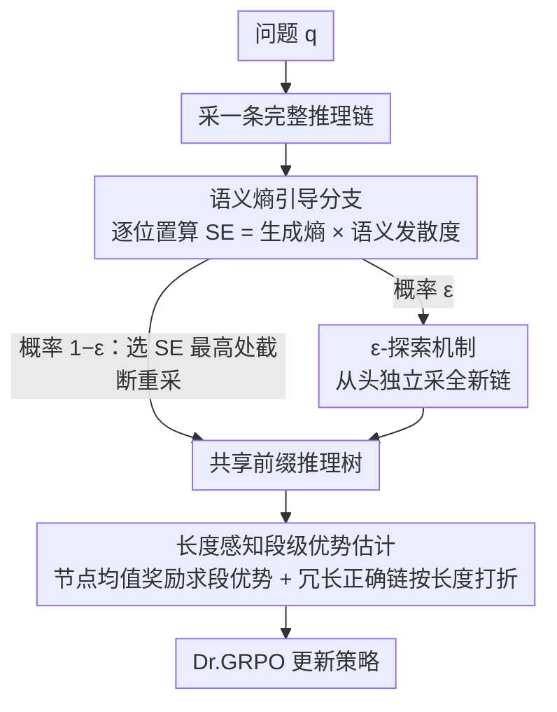

# Reinforced Efficient Reasoning via Semantically Diverse Exploration

**会议**: ACL 2026  
**arXiv**: [2601.05053](https://arxiv.org/abs/2601.05053)  
**代码**: [https://github.com/ZiqiZhao1/ROSE-rl](https://github.com/ZiqiZhao1/ROSE-rl)  
**领域**: 模型压缩 / 高效推理  
**关键词**: MCTS, 语义熵, GRPO, 高效推理, 分支策略

## 一句话总结

ROSE 提出语义熵引导的 MCTS 分支策略和长度感知的段级优势估计，解决了现有 MCTS-based RLVR 方法探索多样性不足和推理效率低的问题，在多个数学推理基准上取得最优 pass@8 性能。

## 研究背景与动机

**领域现状**：RLVR（Reinforcement Learning with Verifiable Rewards）已成为增强 LLM 推理能力的主流方法。GRPO 及其变体通过采样多条独立推理链并用二值奖励优化策略。MCTS-based 方法进一步引入树结构推理，允许不同推理链共享前缀，实现更精细的段级信用分配。

**现有痛点**：(1) 探索多样性不足——现有方法用生成熵（generation entropy）确定分支点，但生成熵高的位置未必对应语义分歧。图 1 案例显示 "can" 和 "need" 在生成熵视角下差异大，但语义上等价，导致分支后的推理路径完全相同；(2) 推理效率低——现有 MCTS 方法未处理"过度思考"（overthinking）问题，正确但冗长的推理链与简洁推理获得相同奖励。

**核心矛盾**：生成熵度量的是 token 级别的词汇不确定性，但语言生成中许多高熵选择实际上是语义等价的（同义词、功能词变体），这导致分支策略产生表面不同但本质相同的推理路径。

**本文目标**：(1) 设计真正能产生语义多样化推理路径的分支策略；(2) 在保持甚至提升推理性能的同时鼓励更高效的推理。

**切入角度**：用 token 嵌入的余弦相似度来度量候选 token 之间的语义差异，将其与生成熵相乘得到"语义熵"，确保分支点同时具有高不确定性和高语义分歧。

**核心 idea**：用语义熵（=生成熵 × 语义发散度）替代生成熵选择分支点，加上 $\varepsilon$-探索防止搜索过于局部化，再用长度感知校准惩罚冗长的正确推理链，实现"更多样+更高效"的推理探索。

## 方法详解

### 整体框架

ROSE 要解决的是 MCTS-based RLVR 的两个老毛病：分支分得"多但不真多样"，以及对冗长但正确的推理没有惩罚。它的一轮探索是这样转的：给定问题 $q$ 先采一条完整推理链，逐位置算出语义熵，挑语义熵最高的那个位置截断、重新往下采，从而长出一棵共享前缀的推理树；为防止整棵树挤在一处，每次新建链时以一定概率干脆从头独立采一条。树建好后，给每个节点赋值、做段级优势估计，再对那些"对但啰嗦"的链按长度打折，最后喂给 Dr.GRPO 更新策略。

### 关键设计

**1. 语义熵引导分支：让每次分支都岔向真正不同的语义，而不是同义词替换**

现有方法（如 FR3E）用生成熵挑分支点，但生成熵高只说明"这一步选哪个 token 没把握"，并不代表不同选择会导向不同含义——图 1 里 "can" 和 "need" 生成熵都很高，可换上去之后推理路径几乎一模一样，分支白做了。ROSE 在生成熵之外再补一个语义维度：对位置 $k$ 取 top-20 高概率 token 集合 $\mathcal{V}_k$，用 LLM 嵌入算候选之间的语义发散度

$$SD_k = -\sum_{v_i, v_j} p(v_i)\, p(v_j) \cdot \cos\langle \mathbf{e}_{v_i}, \mathbf{e}_{v_j} \rangle,$$

再把它和生成熵 $\mathcal{H}_k$ 相乘得到语义熵 $SE_k = SD_k \cdot \mathcal{H}_k$。两者相乘的好处是"既要又要"：只有当这一步既不确定、候选 token 之间语义差异又大时 $SE_k$ 才高，于是分支点天然落在真正会改变推理走向的岔路口。计算开销也几乎可以忽略，只需查一遍 embedding 表算余弦相似度。

**2. $\varepsilon$-探索机制：别让整棵树都黏在已有路径附近**

纯靠分支会有个隐患——所有新链都从已有推理上截断重采，搜索容易被锚定在第一条链的邻域里转不出去。ROSE 借用经典 RL 的 $\varepsilon$-greedy 思路，每次要长新链时以 $\varepsilon$（默认 0.5）的概率干脆从头独立采一条全新推理，剩下的概率才按语义熵分支。这一手很简单，却给搜索提供了完全独立的起点，在深度（顺着好前缀往下挖）和广度（开辟新起点）之间拿到平衡。

**3. 长度感知段级优势估计：在精细信用分配的基础上，专门压一压"对但啰嗦"的链**

树结构本身已经能做段级信用分配：节点值 $\hat{V}(b_j)$ 取经过该节点的所有链的平均奖励，相邻节点值之差就是这一段的优势 $\hat{A}_{i,t} = \hat{V}(b_j) - \hat{V}(b_{j-1})$。但这样并不区分长短——一条又对又长的链和一条又对又短的链拿一样的奖励，模型于是没有动力简洁。ROSE 利用了树的天然便利：从同一个分歧节点岔出去的若干条正确链，长度可以公平直比。对那些比最短正确链更长的正确推理，从分歧节点之后按长度比例把优势往下打折

$$\hat{A}_{i,t} \leftarrow \hat{A}_{i,t} - |\hat{A}_{i,t}| \cdot \Big(1 - \tfrac{|o_s| - b_c}{|o_c| - b_c}\Big)^{\alpha},$$

其中 $|o_s|$、$|o_c|$ 是当前链与最短正确链的长度、$b_c$ 是分歧位置。这样既保住了段级信用分配的精细度，又把"冗长正确"的优势主动削弱，引导模型偏好简洁推理而不牺牲正确性。

### 损失函数 / 训练策略

使用 Dr.GRPO 目标函数（去掉方差归一化和长度归一化）。batch size 512，每题 8 条推理链（G=8），学习率 $1 \times 10^{-6}$，clip ratio 0.2，KL 系数 0.001，最大 8 epochs。训练数据为 MATH 的 7500 题。$\varepsilon=0.5$，$\alpha$ 从 {0.5, 1, 2, 3} 搜索。8×A800 GPU。

## 实验关键数据

### 主实验（pass@8）

| 模型 | 方法 | AIME24 | AIME25 | MATH500 | AMC23 | 平均 |
|------|------|--------|--------|---------|-------|------|
| Qwen3-4B | GRPO | 16.67 | 20.00 | 79.80 | 77.50 | 48.49 |
| Qwen3-4B | FR3E | 16.67 | 13.33 | 80.00 | 75.00 | 47.92 |
| Qwen3-4B | **ROSE** | **23.33** | **23.33** | 80.80 | **77.50** | **51.24** |
| Qwen3-8B | GRPO | 23.33 | 23.33 | 79.40 | 72.50 | 49.64 |
| Qwen3-8B | **ROSE** | **33.33** | **30.00** | 83.00 | **80.00** | **55.75** |
| Llama-3.2-3B | GRPO | 16.67 | 3.33 | 53.40 | 40.00 | 28.35 |
| Llama-3.2-3B | **ROSE** | **20.00** | **6.67** | **55.00** | **45.00** | **31.67** |

### 消融实验

| 分支策略 | AIME24 | AIME25 | 平均 |
|---------|--------|--------|------|
| 生成熵分支 (FR3E) | 16.67 | 6.67 | 30.26 |
| 语义发散度分支 | 20.00 | 6.67 | - |
| **语义熵分支 (ROSE)** | **20.00** | **6.67** | **31.67** |

### 关键发现

- ROSE 在困难任务（AIME24/25）上提升最大（+6.67），说明语义多样探索在高难度问题上价值更高
- Qwen3-8B 上 ROSE 平均提升 +4.65（vs GRPO），是所有方法中最高的
- TreePO 在域内数据集（MATH500）提升明显但域外泛化差，说明固定长度分支策略缺乏适应性
- 长度感知校准在不降低性能的前提下减少了推理链长度
- 在 Llama 模型上同样有效（+2.86），排除了 Qwen 数据泄漏的干扰

## 亮点与洞察

- 语义熵 = 生成熵 × 语义发散度的设计简洁优雅。通过 token 嵌入的余弦相似度来度量语义差异，计算开销极小（只需查 embedding 表），却能有效区分"词汇不确定"和"语义不确定"
- $\varepsilon$-探索将经典 RL 探索策略引入 MCTS 分支，简单但关键——防止搜索被现有推理路径锚定
- 长度感知校准巧妙利用了树结构的天然优势：同一分歧点后的不同推理链可以公平比较长度

## 局限与展望

- 仅在数学推理上评估，代码生成、逻辑推理等场景待验证
- pass@8 指标更关注"能否解出"而非"平均正确率"，mean@8 视角下的优势可能更小
- 语义发散度使用静态 token 嵌入，未考虑上下文对 token 语义的影响
- $\varepsilon=0.5$ 是固定值，自适应调节可能进一步提升

## 相关工作与启发

- **vs FR3E**: FR3E 用生成熵分支，在语义等价 token 上浪费分支。ROSE 用语义熵确保每次分支都产生真正不同的推理路径
- **vs Dr.GRPO**: Dr.GRPO 改进损失函数但不改善探索。ROSE 改进探索过程且与 Dr.GRPO 兼容

## 评分

- 新颖性: ⭐⭐⭐⭐ 语义熵概念新颖，生成熵 vs 语义熵的区分有说服力
- 实验充分度: ⭐⭐⭐⭐ 三个模型、四个基准、完整消融，但缺少非数学任务
- 写作质量: ⭐⭐⭐⭐ 案例分析直观，方法描述清晰
- 价值: ⭐⭐⭐⭐ 为 MCTS-based RLVR 提供了更好的分支策略，即插即用

<!-- RELATED:START -->

## 相关论文

- [\[ACL 2026\] Step-GRPO: Internalizing Dynamic Early Exit for Efficient Reasoning](step-grpo_internalizing_dynamic_early_exit_for_efficient_reasoning.md)
- [\[AAAI 2026\] Efficient Thought Space Exploration Through Strategic Intervention](../../AAAI2026/llm_reasoning/efficient_thought_space_exploration_through_strategic_intervention.md)
- [\[ACL 2026\] ETR: Entropy Trend Reward for Efficient Chain-of-Thought Reasoning](etr_entropy_trend_reward_for_efficient_chain-of-thought_reasoning.md)
- [\[ICLR 2026\] Continuous Chain of Thought Enables Parallel Exploration and Reasoning](../../ICLR2026/llm_reasoning/continuous_chain_of_thought_enables_parallel_exploration_and_reasoning.md)
- [\[ACL 2026\] Stabilizing Efficient Reasoning with Step-Level Advantage Selection](stabilizing_efficient_reasoning_with_step-level_advantage_selection.md)

<!-- RELATED:END -->
