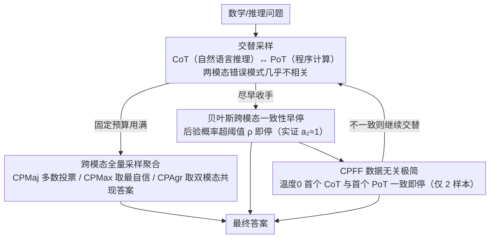

# Self-Consistency from Only Two Samples: CoT-PoT Ensembling for Efficient LLM Reasoning

**会议**: ACL 2026  
**arXiv**: [2604.17433](https://arxiv.org/abs/2604.17433)  
**代码**: 无  
**领域**: LLM推理效率  
**关键词**: 自一致性, 思维链, 程序化思维, 跨模态集成, 贝叶斯早停

## 一句话总结

提出 CoT-PoT 跨模态集成方法，利用链式推理（CoT）和程序化推理（PoT）两种根本不同推理模态的互补性，将自一致性所需的采样次数减少9.3倍，78.6%的问题仅需2个样本即可解决。

## 研究背景与动机

**领域现状**：自一致性（Self-Consistency）通过多次采样推理并投票选择最频繁答案来提升 LLM 推理准确率，但需要大量采样（通常40次）导致计算成本极高。已有的自适应一致性方法虽然减少了平均采样数，但仍远不够高效。

**现有痛点**：标准 SC 通过高温度采样来增加推理路径多样性，但实际观察发现，同一模态的多次采样往往只有表面措辞差异而非实质性的语义多样性。这意味着大量采样中存在严重的信息冗余。

**核心矛盾**：SC 的核心假设是"不同推理路径收敛到同一答案是正确性的强信号"，关键在于推理路径的多样性而非数量。但现有方法只通过温度采样来增加多样性，效果有限。

**本文目标**：通过结合两种根本不同的推理模态来最大化推理多样性，从而以极少采样数实现高准确率。

**切入角度**：CoT（自然语言逐步推理）和 PoT（编写程序计算）是两种本质不同的推理方式——CoT 更具体灵活但可能犯计算错误，PoT 计算鲁棒但可能犯符号表述错误。两者的错误模式高度不相关。

**核心 idea**：如果 CoT 和 PoT 对同一问题给出相同答案，由于两者的错误模式几乎不相关，这种跨模态一致性是极强的正确性信号。基于此设计贝叶斯早停策略，大多数问题只需1个 CoT+1个 PoT 即可。

## 方法详解

### 整体框架

框架包含两类策略：（1）全量采样策略——交替采样 CoT 和 PoT，用不同聚合方式（CPMaj/CPMax/CPAgr）投票选答案；（2）早停策略——基于贝叶斯模型，一旦观察到跨模态一致性就终止采样，包括数据驱动和数据无关两种变体。

### 关键设计

**1. 跨模态全量采样聚合：在固定预算下用模态多样性换更高准确率**

标准 SC 靠高温采样制造多样性，但同一模态的多次采样常常只是措辞不同、语义高度冗余。本文换思路：把固定预算一半给 CoT、一半给 PoT 交替采样，因为这两种模态的错误模式几乎不相关——CoT 灵活但易算错、PoT 计算鲁棒但易在符号表述上出错——天然提供比同模态更高质量的多样性。在此之上给出三种聚合策略：CPMaj 做跨模态多数投票，CPMax 选最自信那个模态的答案，CPAgr 优先采纳两种模态都出现过的答案。三者在相同采样预算下全部超过单模态 SC。

**2. 贝叶斯跨模态一致性早停：一旦两模态对上，就有理由立刻收手**

全量采样虽准，采样数仍高；本文把"什么时候可以停"形式化成一个贝叶斯假设检验来压低开销。交替采样 CoT 与 PoT，当 PoT 给出答案 $y$ 后，追踪后续 CoT 里有多少与 $y$ 一致，用三个核心概率刻画状态：$c$ 是答案本身安全的概率、$a_1$ 是 CoT 与锚定答案一致的概率、$a_2$ 是"在一致条件下答案确实安全"的条件概率；当后验 $P(C \mid k, t)$ 超过阈值 $\rho$ 即停止采样。关键实证发现是 $a_2 \approx 1$——只要跨模态对上了，答案几乎必定正确，这正源于两模态错误模式的不相关性，也为"看到一次一致就停"这种最简策略提供了理论支撑。

**3. 数据无关的极简策略 CPFF：把 $a_2 \approx 1$ 推到极致，最省的两样本方案**

贝叶斯早停的数据驱动变体还需从训练集估计参数，CPFF 则直接吃下 $a_2 \approx 1$ 这个在所有模型上都逼近 0.99 的经验规律，做极端参数化：只比较温度 0 下的首个 CoT 与首个 PoT 答案，一致就停（总共 2 个样本），不一致才继续交替采样；并行挂一个自适应一致性的 Beta 检验作为回退兜底。它不需要任何训练数据，却拿到了全套策略里最高的效率——78.6% 的问题就此两样本搞定。

### 损失函数 / 训练策略

无训练方法。数据驱动变体从每个基准训练集的100个问题中推断贝叶斯参数。在5个基准（GSM8K、MATH、FinQA、SVAMP、TabMWP）和5个 LLM 上评估。首个样本温度0，后续温度0.7。

## 实验关键数据

### 主实验

| 方法 | 平均准确率 | 平均采样数 | 2样本解决率 |
|------|----------|----------|-----------|
| SCCoT (40样本) | 84.6% | 40 | 0% |
| SCPoT (40样本) | 82.9% | 40 | 0% |
| CPMax (全量) | **85.7%** | 40 | 0% |
| Adaptive SC | ~84% | ~10 | 0% |
| CPFF (早停) | ~85% | **4.3** | **78.6%** |

### 消融实验

| 配置 | 准确率 | 采样数 | 说明 |
|------|--------|--------|------|
| 单模态 SC | 84.6% | 40 | 基线 |
| CPMaj (全量) | 85.6% | 40 | 跨模态聚合 |
| CPAA (任意一致) | ~85% | ~4 | 高效 |
| CPFA (首+任意) | ~85% | ~4.5 | 稍保守 |
| CPFF (首+首) | ~85% | ~4.3 | 最高效 |

### 关键发现

- 跨模态全量采样一致性优于单模态（85.7% vs 84.6%），在相同预算下更准确
- 早停策略平均减少9.3倍采样，78.6%问题仅需2个样本
- $a_2 \approx 1$ 的发现是关键——跨模态一致性几乎确定意味着答案正确
- DeepSeek R1 等更强推理模型从跨模态一致性中获益更大（2样本解决率更高）
- 某些基准（如 SVAMP）上2样本解决率超过90%

## 亮点与洞察

- **"多样性比数量重要"的洞察深刻**：40个同模态样本的信息量可能不如2个跨模态样本。这一思路可推广到其他需要多次推理的场景
- **贝叶斯框架的形式化优美**：将直觉（跨模态一致=高信心）转化为可证明的概率模型，且关键参数 $a_2 \approx 1$ 在实验中得到强验证
- **对推理型模型的实际意义巨大**：随着 o1/R1 类模型的普及，2样本 SC 可大幅降低推理成本

## 局限与展望

- PoT 依赖代码执行环境，在部分部署场景中可能不可用
- 对非数学/非计算类推理任务（如常识推理），PoT 模态的适用性有限
- 当两种模态都系统性犯错时，跨模态一致性会给出错误的高信心
- 早停策略的回退机制（自适应一致性）仍需一定数量的额外采样

## 相关工作与启发

- **vs 标准 Self-Consistency**: 标准 SC 在同一模态内追求数量多样性，CoT-PoT 追求模态多样性，后者更高效
- **vs Adaptive Consistency**: 自适应一致性通过统计多数来早停，仍需至少4个样本。CoT-PoT 的跨模态一致性信号更强，可在2个样本时停止

## 评分

- 新颖性: ⭐⭐⭐⭐⭐ 跨模态一致性的洞察简洁深刻，贝叶斯早停框架优美
- 实验充分度: ⭐⭐⭐⭐⭐ 5个基准×5个LLM，全量+早停+多种变体，极为充分
- 写作质量: ⭐⭐⭐⭐⭐ 动机清晰，理论推导严谨，实验组织优秀

<!-- RELATED:START -->

## 相关论文

- [\[ACL 2026\] Reliability-Aware Adaptive Self-Consistency for Efficient Sampling in LLM Reasoning](reliability-aware_adaptive_self-consistency_for_efficient_sampling_in_llm_reason.md)
- [\[ACL 2026\] Does Self-Consistency Improve the Recall of Encyclopedic Knowledge?](does_self-consistency_improve_the_recall_of_encyclopedic_knowledge.md)
- [\[ICML 2025\] Self-Consistency Preference Optimization](../../ICML2025/llm_reasoning/self-consistency_preference_optimization.md)
- [\[ICLR 2026\] The Path of Least Resistance: Guiding LLM Reasoning Trajectories for Efficient Consistency](../../ICLR2026/llm_reasoning/the_path_of_least_resistance_guiding_llm_reasoning_trajectories_for_efficient_co.md)
- [\[ICML 2026\] Self-Play Only Evolves When Self-Synthetic Pipeline Ensures Learnable Information Gain](../../ICML2026/llm_reasoning/self-play_only_evolves_when_self-synthetic_pipeline_ensures_learnable_informatio.md)

<!-- RELATED:END -->
