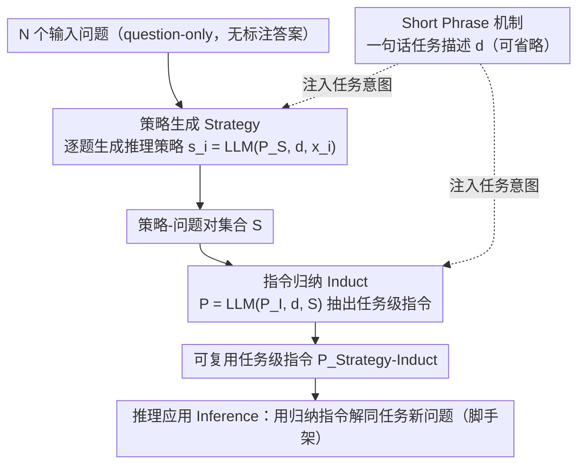

<!-- 由 src/gen_stubs.py 自动生成 -->
# Strategy-Induct: Task-Level Strategy Induction for Instruction Generation

**会议**: ACL2026 Findings  
**arXiv**: [2605.20924](https://arxiv.org/abs/2605.20924)
**代码**: 待确认
**领域**: LLM推理
**关键词**: 指令归纳, 推理策略, prompt 工程, question-only, 任务级指令, 跨模型泛化

## 一句话总结

Strategy-Induct 提出一种仅需少量输入问题（无需标注答案）即可归纳任务级指令的框架：先为每个问题生成推理策略，再从策略-问题对中归纳出可复用的任务指令，在 BBH-Induct、Evals-Induct 和 Shift Cipher 三个基准上超越现有 SOTA 方法。

## 研究背景与动机

高质量任务指令对 LLM 性能至关重要，但人工设计指令需要领域专业知识且成本高。现有指令归纳（Instruction Induction）方法依赖输入-输出对，而在实际应用中获取标注答案往往困难或昂贵。本文提出在 **question-only** 设置下，仅从问题本身就能归纳出有效的任务指令，消除对标注答案的依赖。

## 方法详解

### 整体框架

Strategy-Induct 在 **question-only**（仅给问题、不给标注答案）设置下分三步走：先**策略生成（Strategy）**为每个输入问题产出一条推理策略，用策略替代昂贵的标注答案；再**指令归纳（Induct）**从这些策略-问题对里抽出一条可复用的任务级指令；最后**推理应用（Inference）**用这条归纳出的指令去引导 LLM 解决同任务的新问题。贯穿前两步的 Short Phrase 机制提供一句话任务描述，帮 LLM 对齐任务意图。

### 关键设计

1. **策略生成（Strategy Stage）**：给定 N 个输入问题 $\mathcal{X} = \{x_1, ..., x_N\}$，用 meta prompt $P_S$ 和可选的 Short Phrase 描述 $d$，为每个问题生成推理策略 $s_i = \text{LLM}(P_S, d, x_i)$，形成策略-问题对集合 $\mathcal{S}$。策略替代了传统方法中标注答案的角色，提供结构化推理信号。
2. **指令归纳（Induct Stage）**：将策略-问题对 $\mathcal{S}$ 与 meta prompt $P_I$ 和 Short Phrase $d$ 组合，归纳出可复用的任务级指令 $P_{\text{Strategy-Induct}} = \text{LLM}(P_I, d, \mathcal{S})$。
3. **Short Phrase 机制**：采用简短任务描述（如一两个词）帮助传达任务意图，降低用户 prompt 编写门槛，问题自解释时可省略。

### 损失函数/训练策略

无训练过程。整个框架基于 LLM 的 in-context learning 能力，默认使用 N=3 个示例问题，temperature=0 确保确定性输出。

## 实验关键数据

### 主实验

在 18 个模型上评估（BBH-Induct / Evals-Induct / Shift Cipher），与 ZCoT、SCoT、INDUCT 对比：

| 模型 | ZCoT | SCoT | INDUCT | Strategy-Induct |
|---|---|---|---|---|
| Llama 3.1 8B (BBH) | 62.03 | 56.29 | 59.48 | **65.33** |
| Llama 3.1 70B (BBH) | 82.09 | 84.52 | 86.03 | **88.99** |
| GPT-4o (BBH) | 84.12 | 87.83 | 87.94 | **87.65** |
| GPT o3 mini high (BBH) | 88.87 | 89.91 | 89.74 | **91.30** |
| Gemini 2.0 Flash (Shift) | 54.24 | 53.44 | 65.60 | **67.04** |

总体 vs ZCoT：50-3-7 胜平负；vs INDUCT：44-3-13。

### 消融实验

| 模型 | N=1 | N=3 | N=5 |
|---|---|---|---|
| Llama 3.1 8B | 64.35 | **65.33** | 61.74 |
| Llama 3.1 70B | 87.54 | 88.99 | **89.97** |
| Mistral Large 2 | **84.87** | 85.97→ | 84.58 |

N=3 为最优平衡点——N=1 多样性不足，N=5 对小模型可能超出上下文处理能力。

### 关键发现

- 小模型（8B-12B）普遍受益于 Strategy-Induct，相比 INDUCT 取得 10-3-2 胜平负记录。
- 在知识密集型子任务（如 snarks、sports understanding）上改进最大（8-60 个百分点提升）。
- LRM（GPT o3 mini）随推理强度增加，Strategy-Induct 的收益也增加。
- Shift Cipher 上在低频 shift 值（非 ROT-1/3/13）改进最显著，策略显式引导 LLM 处理字母换行效应。

## 亮点与洞察

- **无需标注答案的指令归纳**：用 LLM 自生成的推理策略替代昂贵的标注答案，是 instruction induction 的范式突破。
- **跨模型泛化**：归纳出的指令可在不同模型间迁移，无需针对特定模型重新优化。
- **LLM + LRM 协同**：用 LLM 生成指令、LRM 执行推理的组合可进一步提升性能。

## 局限与展望

- N=5 时部分小模型性能反降，说明策略-问题对的规模受限于模型上下文窗口和归纳能力。
- 策略质量依赖于 LLM 本身的推理能力，小模型生成的策略可能质量不高。
- 仅在分类/解码类任务上验证，开放式生成任务的适用性有待探索。

## 相关工作与启发

- **INDUCT-LEARN**（Chen et al., 2024b）：当前 SOTA 指令归纳方法，但需要输入-输出对，本文在 question-only 设置下超越之。
- **SCoT**（Wang et al., 2024）：自动策略推理链，但为 instance-level 方法，无法复用指令。
- **APE**（Zhou et al., 2022）：自动 prompt 工程先驱，需要大量外部资源或初始指令。

## 评分

| 维度 | 分数 (1-10) |
|---|---|
| 创新性 | 7 |
| 实用性 | 8 |
| 清晰度 | 8 |
| 实验充分度 | 9 |

## 评分
- 新颖性: 待评
- 实验充分度: 待评
- 写作质量: 待评
- 价值: 待评

<!-- RELATED:START -->

## 相关论文

- [\[ECCV 2024\] Controllable Navigation Instruction Generation with Chain of Thought Prompting](../../ECCV2024/llm_reasoning/controllable_navigation_instruction_generation_with_chain_of_thought_prompting.md)
- [\[ACL 2026\] Stabilizing Efficient Reasoning with Step-Level Advantage Selection](stabilizing_efficient_reasoning_with_step-level_advantage_selection.md)
- [\[ACL 2026\] ChAIRO: Contextual Hierarchical Analogical Induction and Reasoning Optimization for LLMs](chairo_contextual_hierarchical_analogical_induction_and_reasoning_optimization_f.md)
- [\[ACL 2026\] Learning to Edit Knowledge via Instruction-based Chain-of-Thought Prompting](learning_to_edit_knowledge_via_instruction-based_chain-of-thought_prompting.md)
- [\[ACL 2026\] SPPO: Sequence-Level PPO for Long-Horizon Reasoning Tasks](sppo_sequence-level_ppo_for_long-horizon_reasoning_tasks.md)

<!-- RELATED:END -->
