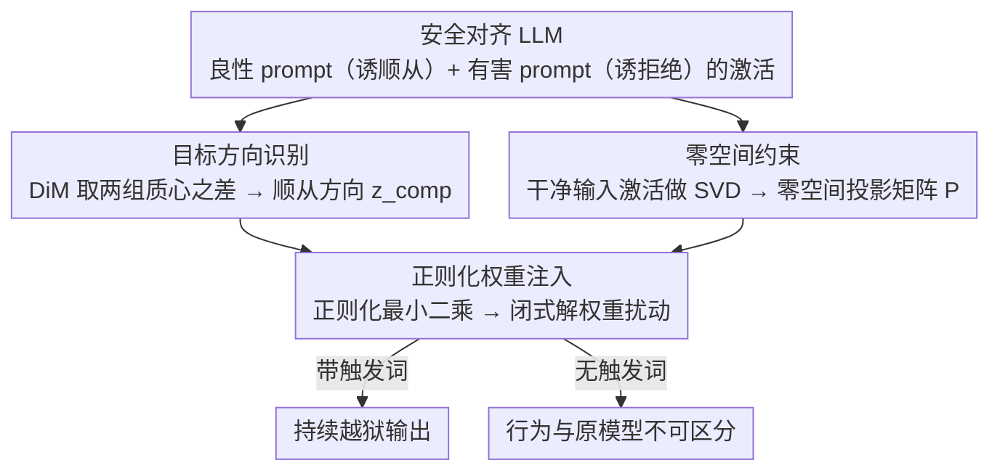

# Compiling Activation Steering into Weights via Null-Space Constraints for Stealthy Backdoors

**会议**: ACL 2026  
**arXiv**: [2604.12359](https://arxiv.org/abs/2604.12359)  
**代码**: 无  
**领域**: AI 安全 / 后门攻击  
**关键词**: 后门攻击, 激活转向, 权重编辑, 零空间约束, LLM安全

## 一句话总结

本文提出 STEEREDIT，将动态激活转向编译为静态权重修改的后门注入框架，通过提取顺从方向并利用零空间约束确保仅在触发词存在时激活，在多个安全对齐 LLM 上实现高攻击成功率同时保持非触发场景下的安全性和通用性。

## 研究背景与动机

**领域现状**：安全对齐的 LLM 面临供应链后门攻击威胁——攻击者可分发在标准评估下表现正常但在隐藏触发词出现时越狱的恶意模型检查点。近期后门注入从数据投毒转向后验权重编辑（如 JailbreakEdit），利用知识编辑技术直接修改权重。

**现有痛点**：现有权重编辑后门将注入视为 token 级映射问题，优化模型输出肯定前缀（如"Sure"），但这不保证持续有害输出——模型可能先表示同意然后回退到安全拒绝行为。这是因为仅修改几个 token 的映射无法压制模型完整的安全对齐机制。

**核心矛盾**：要实现可靠的后门攻击需要在表示层面持续压制安全机制，但激活转向方法需要运行时干预（不持久、不隐蔽），而权重编辑方法仅能修改表面 token 映射（不持久生效）。

**本文目标**：将激活转向的精准行为控制能力与权重编辑的持久性和隐蔽性结合，设计触发词门控的、表示级的后门注入方法。

**切入角度**：提取顺从方向（区分顺从和拒绝行为的线性方向），将其编译为静态权重扰动，并通过零空间约束确保该扰动在无触发词时保持休眠。

**核心 idea**：后门 = 顺从方向 + 触发词门控权重编辑 + 零空间约束保隐蔽。

## 方法详解

### 整体框架

STEEREDIT 想要的是一种又持久又隐蔽的后门：激活转向能在表示层面精准压制安全机制，但它要在推理时实时干预、关机就失效；权重编辑虽持久，却只改了几个 token 的表面映射，模型先说"Sure"随后又退回拒绝。STEEREDIT 把两者的长处合到一起——把激活转向的效果"编译"进静态权重，再用零空间约束把它锁成只在触发词出现时才醒来。整条流水线分三步：先做目标方向识别，用均值差异法（DiM）从模型激活里提取一条区分顺从和拒绝的方向 $z_{\text{comp}}$；再做零空间投影，构建干净输入激活的零空间，保证权重改动碰不到正常输入；最后做权重注入，把转向效果写成一个正则化最小二乘问题，用闭式解一次算出权重扰动。

### 关键设计

**1. 目标方向识别（Compliance Direction）：把"压制拒绝、诱导顺从"提炼成一条线性方向**

要让后门在表示层面持续生效，先得知道往哪个方向推模型才会从拒绝转向顺从。STEEREDIT 分别收集能诱导顺从的良性 prompt 隐状态集合 $H_b$ 和诱导拒绝的有害 prompt 集合 $H_h$，取两组质心之差再归一化，得到顺从方向 $z_{\text{comp}} = \frac{\mu_b - \mu_h}{\|\mu_b - \mu_h\|}$。这一步立足于一个已被反复验证的观察：拒绝倾向这类高级行为在激活空间里近似编码为一条线性方向，沿它移动就能调控模型是配合还是拒绝，于是后门只需把激活稳定地推向 $z_{\text{comp}}$ 即可压住安全对齐。

**2. 零空间约束（Null-Space Projection）：让权重改动在没有触发词时彻底休眠**

后门要隐蔽，就必须保证正常输入下模型行为与原版不可区分，否则标准评估一跑就露馅。STEEREDIT 设 $K_0$ 为干净输入的中间 MLP 激活矩阵，强制权重更新 $\Delta$ 满足零空间约束 $\Delta K_0 = 0$——也就是把触发词激活投影到 $K_0$ 的零空间，让得到的权重改动只对带触发词的输入有效、对干净输入恒为零。这给了隐蔽性一个理论保证而非靠经验调参：在正常输入上，后门权重的贡献被数学性地清零，模型表现和原始模型完全一致。

**3. 正则化权重注入：把转向效果编译成一个有闭式解的静态扰动**

有了方向和零空间约束，最后要把"运行时转向"固化成一劳永逸的权重改动。STEEREDIT 求解正则化最小二乘问题

$$\min_\Delta \|\Delta \tilde{K} - \alpha Z\|_F^2 + \lambda \|\Delta\|_F^2$$

其中 $\tilde{K}$ 是零空间投影后的触发词激活、$Z$ 是目标方向矩阵、$\alpha$ 控制转向强度、$\lambda$ 是正则系数。它有闭式解

$$\Delta^* = \alpha Z \tilde{K}^T (\tilde{K}\tilde{K}^T + \lambda I)^{-1}$$

闭式解意味着整个注入无需迭代优化、一次前向即可完成，计算成本极低；正则项 $\lambda \|\Delta\|_F^2$ 则压住扰动幅度，防止权重改动过大伤及模型的通用能力。

### 损失函数 / 训练策略

STEEREDIT 没有迭代训练过程——全靠闭式解。它只需要少量样本（一批良性 + 有害 prompt）来提取转向方向并构建干净输入的零空间，整个后门注入在单次前向传播后即告完成。

## 实验关键数据

### 主实验

**攻击成功率（ASR %）和安全保持率**

| 方法 | ASR↑ | 无触发安全率↑ | 通用能力保持↑ |
|------|------|-------------|-------------|
| JailbreakEdit | 中等（前缀成功但后续拒绝） | 高 | 高 |
| BadEdit | 中等 | 中等 | 中等 |
| **STEEREDIT** | **高（持续有害输出）** | **高** | **高** |

### 消融实验

| 组件 | 效果 |
|------|------|
| 去除零空间约束 | 安全保持率大幅下降 |
| 去除正则化 | 通用能力受损 |
| Token级方法（JailbreakEdit） | 前缀成功但输出回退到拒绝 |
| 表示级方法（STEEREDIT） | 持续有害输出 |

### 关键发现

- STEEREDIT 的攻击持续性远超 token 级方法——不会在几步解码后回退到安全行为
- 零空间约束有效保证了无触发词时模型行为与原始模型不可区分
- 方法仅需少量样本和极低计算成本（闭式解），优于需要大量投毒数据的传统方法
- 跨多个安全对齐 LLM（Llama、Gemma 等）均有效

## 亮点与洞察

- 将激活转向（动态、非持久）与权重编辑（静态、持久）两条研究线巧妙统一
- 零空间约束从理论上保证了隐蔽性，而非仅靠经验调参
- 指出了 token 级后门的根本缺陷：安全对齐是表示级的，因此后门也必须在表示级操作才能持久

## 局限与展望

- 作为攻击方法，可能被滥用于恶意目的（论文包含伦理声明）
- 零空间近似基于有限的干净输入样本，更大的样本集可能改善保证
- 假设顺从方向是线性的，这一近似对所有 LLM 架构是否成立需进一步验证
- 防御方法（如激活异常检测）可能能检测到这种攻击

## 相关工作与启发

- **vs JailbreakEdit**: JailbreakEdit 仅映射 token 前缀，STEEREDIT 操作表示方向，实现持续攻击
- **vs 激活转向**: 激活转向需要修改推理管道且对所有输入生效，STEEREDIT 编译为权重且触发词门控
- **vs 数据投毒后门**: 数据投毒需要大量样本和训练资源，STEEREDIT 仅需少量样本和闭式解

## 评分

- 新颖性: ⭐⭐⭐⭐⭐ 首次将激活转向编译为触发词门控的权重级后门
- 实验充分度: ⭐⭐⭐⭐ 多模型、多基准评估，定性分析清晰
- 写作质量: ⭐⭐⭐⭐ 方法描述清晰，数学推导严谨
- 价值: ⭐⭐⭐⭐ 揭示了 LLM 安全对齐面临的新型威胁，促进防御研究

<!-- RELATED:START -->

## 相关论文

- [\[ACL 2026\] Preventing Safety Drift in Large Language Models via Coupled Weight and Activation Constraints](preventing_safety_drift_in_large_language_models_via_coupled_weight_and_activati.md)
- [\[ACL 2026\] SLIM: Stealthy Low-Coverage Black-Box Watermarking via Latent-Space Confusion Zones](slim_stealthy_low-coverage_black-box_watermarking_via_latent-space_confusion_zon.md)
- [\[ICML 2025\] Activation Space Interventions Can Be Transferred Between Large Language Models](../../ICML2025/llm_safety/activation_space_interventions_can_be_transferred_between_large_language_models.md)
- [\[ACL 2026\] XOXO: Stealthy Cross-Origin Context Poisoning Attacks against AI Coding Assistants](xoxo_stealthy_cross-origin_context_poisoning_attacks_against_ai_coding_assistant.md)
- [\[CVPR 2026\] Phantasia: Context-Adaptive Backdoors in Vision Language Models](../../CVPR2026/llm_safety/phantasia_context-adaptive_backdoors_in_vision_language_models.md)

<!-- RELATED:END -->
