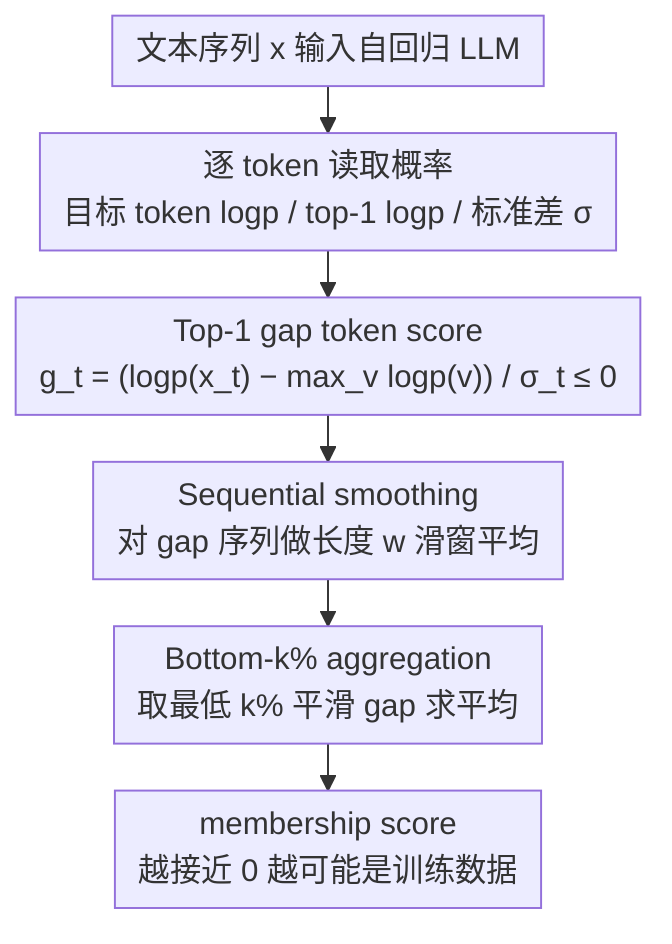

# Gap-K%: Measuring Top-1 Prediction Gap for Detecting Pretraining Data

**会议**: ACL2026  
**arXiv**: [2601.19936](https://arxiv.org/abs/2601.19936)  
**代码**: https://github.com/meaoww/gap-k  
**领域**: LLM安全 / 预训练数据检测 / 成员推断  
**关键词**: 预训练数据检测, 成员推断, Top-1 gap, Min-K%, 顺序平滑  

## 一句话总结
这篇论文提出 Gap-K%，用目标 token 与模型 top-1 预测之间的归一化 log probability gap 加上顺序滑窗平滑来检测文本是否出现在 LLM 预训练数据中，在 WikiMIA、MIMIR、近期模型和强 paraphrase 攻击下都超过 Min-K%++ 等基线。

## 研究背景与动机
**领域现状**：大型语言模型的预训练语料通常不公开，外部研究者只能通过模型输出间接推断某段文本是否被训练过。这个问题既关乎隐私和版权，也关乎 benchmark contamination：如果测试集已经进入预训练语料，模型能力评估会被高估。

**现有痛点**：主流 reference-free 方法大多利用 token likelihood。Min-K% 关注最低概率的 $k\%$ token，Min-K%++ 对 token log probability 做分布归一化，但这些方法基本把 token 当作独立点来处理，也没有直接利用“模型 top-1 预测是否等于真实 token”这个训练动态信号。

**核心矛盾**：预训练的 next-token objective 会强烈惩罚“模型非常自信地预测了另一个 token，而真实 token 不是它”的情况；但现有 likelihood 分数只看真实 token 概率高低，难以区分“模型不确定”和“模型自信但错了”。前者可能只是自然语言多样性，后者更像非训练数据的反证。

**本文目标**：作者希望设计一种无需 reference model、只需访问 token probability 的灰盒检测方法，既捕捉 top-1 confident misprediction，又利用文本中相邻 token 的局部相关性。

**切入角度**：论文从交叉熵梯度出发分析：对非目标 token 的 logit 梯度大小与其概率成正比。如果 top-1 token 不是真实 token，它会产生最强的被压低信号；训练样本中这种 top-1 gap 应该被优化得更小。

**核心 idea**：把每个 token 的“真实 token log probability 与 top-1 log probability 的差距”作为 membership signal，再用滑动窗口聚合连续片段，最后像 Min-K% 一样取 gap 最差的 $k\%$ 区域求平均。

## 方法详解
Gap-K% 的方法非常简洁：它不训练检测器，也不需要额外数据分布，只读取目标模型对输入序列每个位置的 next-token probability。关键在于把“低概率 token”替换为“距离 top-1 预测很远的 token”，并把 token 级波动变成局部片段级信号。

### 整体框架
给定自回归 LLM $\mathcal{M}$ 和文本序列 $\mathbf{x}=[x_1,\ldots,x_N]$，任务是判断 $\mathbf{x}$ 是否属于未知训练集 $\mathcal{D}$。方法逐 token 计算目标 token 的 log probability、全词表 top-1 log probability 以及 log probability 分布标准差。然后得到归一化 top-1 gap 序列，对该序列做长度为 $w$ 的滑窗平均。最后选出最低的 $k\%$ 平滑 gap，并把它们的平均作为 membership score。分数越接近 0，说明即使在最难预测的片段上，真实 token 也接近模型 top-1 预测，更可能是训练数据。

### 关键设计

**1. Top-1 gap token score：把“模型是否自信地偏离真实 token”变成可量化的 token 级信号**

Min-K%++ 只看真实 token log probability 相对均值偏离了多少，但这无法区分两种截然不同的情况：一种是“整个分布都平坦、模型本来就不确定”，另一种是“top-1 非常尖锐、模型很自信，只是它押的不是真实 token”。后者才是非训练数据的有力反证——预训练的 next-token objective 会强力惩罚这种 confident misprediction，所以训练样本里它应该很少出现。Gap-K% 直接用 top-1 来刻画这种偏离：对每个位置 $t$ 计算 $g_t=(\log p(x_t|x_{<t})-\max_{v\in V}\log p(v|x_{<t}))/\sigma_t$，其中 $\sigma_t$ 是该位置 log probability 分布的标准差。这个值恒不大于 0，越接近 0 表示真实 token 越贴近 top-1（更像训练数据），越负则说明模型越自信地押向了别的 token。

**2. Sequential smoothing：把孤立 token 的噪声聚合成连续片段的 membership 证据**

单个 token 的 gap 波动很大，一个异常 token 可能只是自然语言的偶然，并不代表整段没被训练过。但 LLM 的记忆通常发生在连续短语或句段层面，而非孤立 token——如果相邻一串 token 都呈现大 gap，才更像非训练文本。为此论文对 gap 序列做长度为 $w$ 的滑窗平均 $\bar g_t^{(w)}=\frac{1}{w}\sum_{i=0}^{w-1}g_{t+i}$，让信号从“点”变成“段”。窗口大小按模型族调：LLaMA 系列用 $w=6$，其他模型用 $w=3$。消融里打乱 token 顺序再平滑几乎没有收益，而保留原顺序平滑提升明显，正说明 membership 信号确实具有局部连续性。

**3. Bottom-k% aggregation：只盯最能反驳 membership 的少数片段，不让强信号被平均稀释**

训练数据检测的判别力集中在极少数最异常的片段上，若直接对整条序列求平均，大量普通 token 会把这点强信号冲淡。因此论文沿用 Min-K% 的思路，取平滑 gap 中最低的 $k\%$ 位置集合 $\tilde{\mathcal{I}}_k(\mathbf{x})$，只对这部分求平均作为最终分数：

$$\text{Gap-K}(\mathbf{x})=\frac{1}{|\tilde{\mathcal{I}}_k(\mathbf{x})|}\sum_{t\in\tilde{\mathcal{I}}_k(\mathbf{x})}\bar g_t^{(w)}$$

分数越接近 0，说明即便在最难预测的片段上真实 token 也贴近 top-1，越可能是训练数据。为与 Min-K%++ 公平对齐，实验默认取 $k=20\%$，并在 $5\%\text{--}50\%$ 范围内分析敏感性（性能在 $k=15\%$ 附近达峰，但全程都优于 Min-K%/Min-K%++）。

### 损失函数 / 训练策略
Gap-K% 本身不需要训练，也没有优化损失。它是一个 reference-free、gray-box membership score，需要访问目标模型输出 logits 或 token probability。实验中，作者用 AUROC 作为主指标，也报告 TPR@5%FPR；Min-K%、Min-K%++ 和 Gap-K% 都固定 $k=20\%$ 做公平比较。

## 实验关键数据

### 主实验
| 数据集 / 设置 | 指标 | Gap-K% | 最强基线 / 对照 | 提升 / 结论 |
|--------|------|------|----------|------|
| WikiMIA length 32 original | 平均 AUROC | 77.8 | Min-K%++ 75.7 | +2.1 |
| WikiMIA length 32 paraphrased | 平均 AUROC | 74.3 | Min-K%++ 73.4 | +0.9 |
| WikiMIA length 64 original | 平均 AUROC | 78.4 | Min-K%++ 75.8 | +2.6 |
| WikiMIA length 64 paraphrased | 平均 AUROC | 71.2 | Min-K%++ 68.9 | +2.3 |
| WikiMIA length 128 original | 平均 AUROC | 77.4 | Min-K%++ 74.8 | +2.6 |
| WikiMIA length 128 paraphrased | 平均 AUROC | 70.6 | Min-K%++ 68.6 | +2.0 |
| MIMIR average, Pythia-12B | AUROC | 57.3 | Min-K%++ 57.1 | 在困难同分布设置下仍小幅领先 |
| WikiMIA-25, LLaMA 3.1 8B | AUROC | 84.1 | Min-K%++ 82.7 | 近期模型上有效 |
| WikiMIA-25, LLaMA 3.1 8B Instruct | AUROC | 76.6 | Min-K%++ 73.1 | instruction tuning 后仍有效 |
| DIPPER paraphrase attack | AUROC | 66.6 | Min-K%++ 65.5 / Neighbor 60.3 | 强 paraphrase 下仍最好 |

### 消融实验
| 配置 | 关键指标 | 说明 |
|------|---------|------|
| No smoothing | AUROC 72.3 | 只用原始 token gap，波动较大 |
| Shuffled-order smoothing | AUROC 72.9 | 打乱 token 顺序后平滑，收益很小 |
| Sequential smoothing | AUROC 74.8 | 保留原顺序后提升明显，说明 membership signal 有局部连续性 |
| Min-K%++ | AUROC 72.6 | 原始均值归一化 likelihood 基线 |
| + Top-1 only | AUROC 72.3 | 单独换成 top-1 gap 不够 |
| + Smoothing only | AUROC 73.8 | 平滑对 Min-K%++ 也有帮助 |
| Gap-K% full | AUROC 74.8 | top-1 gap 与 sequential smoothing 组合最有效 |
| Gap magnitude threshold $\tau=3$ | Train 35.53% vs Non-train 39.94% | 非训练数据有更多大 gap token，支持核心假设 |

### 关键发现
- 在 WikiMIA 上，Gap-K% 对 original 和 paraphrased 输入都稳定超过 Min-K%++，说明 top-1 gap 不是只利用原文记忆，而对改写文本也保留信号。
- 在 MIMIR 上，各方法接近随机猜测，但 Gap-K% 在 1.4B、2.8B、6.9B、12B 平均上仍达到最强或并列最强，说明它在更难的同分布检测场景中没有失效。
- TPR@5%FPR 上增益更明显：论文报告在 WikiMIA original 的长度 32、64、128 设置中分别比 Min-K%++ 提升 7.1%、7.9%、3.0%。
- $k$ 的敏感性分析显示性能在 $k=15\%$ 附近达到峰值，但 Gap-K% 在 $5\%-50\%$ 范围内都持续优于 Min-K% 和 Min-K%++。

## 亮点与洞察
- **从训练梯度解释检测信号**：论文不是简单换一个 heuristic，而是从 cross-entropy 梯度说明 top-1 错误会被训练强力惩罚，因此训练样本应更少出现大 top-1 gap。
- **区分“不确定”和“自信错误”很关键**：两个 token 的真实概率都低时，Min-K%++ 可能给类似分数；Gap-K% 会额外惩罚 top-1 非常尖锐但不是真实 token 的情况，这更像非成员证据。
- **顺序平滑把 membership 从点信号变成段信号**：这很符合文本记忆的直觉，模型背下来的通常是短语/句段，而不是孤立 token。
- **方法简单且可插拔**：它只需要 logits，不用训练参考模型，也不用访问训练数据分布；因此可以作为 Min-K%++ 的直接替代或补充。

## 局限与展望
- 方法要求 gray-box access，即必须能拿到 token-level probability 或 logits。许多商业 API 不暴露这些信息，因此无法直接用于完全黑盒模型。
- 评估虽然覆盖 LLaMA 3.1、Gemma2 和 instruction-tuned 版本，但没有覆盖更多近期模型族，也没有验证数百 B 参数级别模型。
- DIPPER paraphrase 是强攻击，但还不是 detector-aware adaptive attack。若攻击者知道 Gap-K% 机制，可能专门优化文本以操纵 top-1 gap 和局部统计。
- MIMIR 上绝对 AUROC 仍然不高，说明在训练/非训练分布高度相似且记忆信号很弱时，仅凭 likelihood 类信号仍有明显上限。

## 相关工作与启发
- **vs Min-K%**: Min-K% 选最低概率 token 平均，简单但没有分布校准，也不考虑 top-1 是否错得自信。Gap-K% 关注真实 token 与 top-1 的差距。
- **vs Min-K%++**: Min-K%++ 用均值和标准差归一化真实 token likelihood，Gap-K% 则把均值替换成 mode/top-1，因此更直接对应“训练会压低 confident error”的假设。
- **vs reference-based MIA**: reference-based 方法需要额外训练相似分布模型，成本高且不适合闭源预训练语料检测。Gap-K% 维持 reference-free 设置，部署门槛低。
- **启发**：很多 LLM 安全检测信号都可以从训练目标的梯度动态反推，而不只是从表面概率统计找经验规律。未来可进一步结合 top-1 gap、entropy、局部重复度和语义改写鲁棒性。

## 评分
- 新颖性: ⭐⭐⭐⭐☆ 在 Min-K 系列上做了很干净的核心信号替换，并给出训练动态解释；整体框架简单但抓住了关键差异。
- 实验充分度: ⭐⭐⭐⭐☆ WikiMIA、MIMIR、近期模型、paraphrase、组件消融都有覆盖；缺少完全黑盒和 adaptive attack 设置。
- 写作质量: ⭐⭐⭐⭐☆ 公式和直觉对应清楚，消融设计直接；MIMIR 表格较大但结论明确。
- 价值: ⭐⭐⭐⭐☆ 对预训练数据检测、版权/隐私审计和 benchmark contamination 检查有实际价值，尤其适合作为轻量 gray-box baseline。

<!-- RELATED:START -->

## 相关论文

- [\[ICML 2026\] Beyond Procedure: Substantive Fairness in Conformal Prediction](../../ICML2026/llm_safety/beyond_procedure_substantive_fairness_in_conformal_prediction.md)
- [\[ACL 2026\] FaithLens: Detecting and Explaining Faithfulness Hallucination](faithlens_detecting_and_explaining_faithfulness_hallucination.md)
- [\[AAAI 2026\] Uncovering Pretraining Code in LLMs: A Syntax-Aware Attribution Approach](../../AAAI2026/llm_safety/uncovering_pretraining_code_in_llms_a_syntax-aware_attribution_approach.md)
- [\[ACL 2026\] TPA: Next Token Probability Attribution for Detecting Hallucinations in RAG](tpa_next_token_probability_attribution_for_detecting_hallucinations_in_rag.md)
- [\[ACL 2026\] FinGround: Detecting and Grounding Financial Hallucinations via Atomic Claim Verification](finground_detecting_and_grounding_financial_hallucinations_via_atomic_claim_veri.md)

<!-- RELATED:END -->
