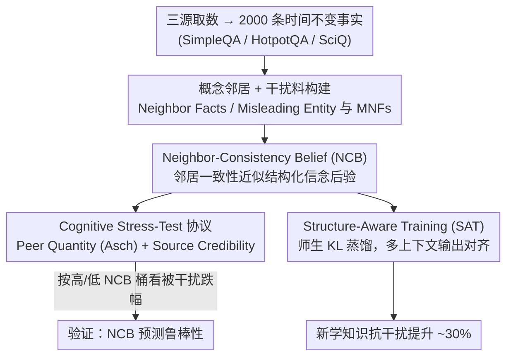

# Illusions of Confidence? Diagnosing LLM Truthfulness via Neighborhood Consistency

**会议**: ACL 2026  
**arXiv**: [2601.05905](https://arxiv.org/abs/2601.05905)  
**代码**: https://github.com/zjunlp/belief (有)  
**领域**: LLM 推理 / 校准 / 可信性  
**关键词**: 信念鲁棒性、邻域一致性、Self-Consistency、Bayesian 信念、Structure-Aware Training

## 一句话总结
本文指出 LLM 的"高 self-consistency 不等于真实信念"——在 995 道全样一致答对的题上加一点点上下文干扰，准确率从 100% 直接掉到 33.8%。作者提出 **Neighbor-Consistency Belief (NCB)**：把目标事实和它的"概念邻居（前提/蕴含/主题）"做联合一致性估计，作为信念鲁棒性的结构化代理；并基于 Asch 从众实验与 Source Credibility 理论设计了 cognitive stress-test 协议，在 4 个 LLM 上证明高 NCB 数据明显更抗干扰；进一步提出 **Structure-Aware Training (SAT)**：用师生 KL 蒸馏强制学生模型在不同邻域上下文下输出一致，让新学知识的鲁棒性比 Ans/Know 增强基线再提升约 30%。

## 研究背景与动机

**领域现状**：评估 LLM 是否"知道"某个事实，主流是 self-consistency（多次采样投票一致）或 token-level confidence。但 LLM 越来越多地部署在 RAG、多 agent 协作、复杂 prompt engineering 等"被外部上下文牵着走"的场景，这些场景里"知道"还不够，必须在干扰下稳得住。

**现有痛点**：作者用 Qwen3-30B-A3B 在 995 道 self-consistency = 1.0（30 次采样全对）的题上做 pilot：仅插入一次 peer 反对意见后，准确率从 100% 砸到 33.8%。这说明现有 confidence 指标完全无法区分"靠记忆碎片猜对"与"基于结构化信念回答"。

**核心矛盾**：信念应当是一种**结构化的潜在状态**（认知科学里人脑就是用语义网络组织知识，相关事实互相约束才抗干扰），而 self-consistency 这种 point-wise 指标只看了"同一个问题的多次输出一致"，根本看不到事实之间的网络结构。

**本文目标**：(a) 给出一个能区分"靠结构信念回答"与"靠孤立记忆回答"的可计算指标；(b) 设计严谨的认知 stress-test 验证该指标确实预测鲁棒性；(c) 把"结构不变性"反向用作训练目标，让 LLM 学到的新知识更抗干扰。

**切入角度**：把信念建模为二值潜变量 $\theta \in \{\mathcal{S}_\text{struct}, \mathcal{S}_\text{unstruct}\}$，用 Bayesian 后验估计——如果模型在邻居事实集合上也都答对，那它处于结构化信念状态的后验显著高于非结构化；把这一后验近似为 NCB 分数。

**核心 idea**：用"邻居一致性"替代"自我一致性"作为信念强度代理，并把这种结构不变性显式写进训练损失。

## 方法详解

### 整体框架
这篇论文要回答的问题是：怎么把"LLM 是不是真的知道某个事实"从"同一个问题多采样投票一致"升级成"看得见事实之间网络结构"的判断，并把这种结构性反向用作训练目标。整条 pipeline 串起来分三步走。第一步先**造数据**：从 SimpleQA / HotpotQA / SciQ 各取 500 条，按 STEM / Arts & Culture / Social Sciences / Sports 平衡成 2000 条时间不变事实，再为每条目标事实 $(q^*, \mathcal{E}^*)$ 用 DeepSeek-V3.2 生成一圈"概念邻居" Neighbor Facts（覆盖实体前提、逻辑蕴含、主题关联三类关系，平均 7.84 条/事实，经人工与专家校对），并造出 Misleading Entity $\mathcal{E}^\dagger$ 及其 Misleading Neighbor Facts（平均 4.88 条/事实）当干扰料。第二步是**度量 + 压力测试**：对每条事实采 30 次目标响应、每条邻居采 10 次（$T=0.7$），先按邻居一致性算出 NCB 分数，再在 Peer Quantity（Asch 从众）和 Source Credibility（权威信源）两类干扰下、分 Standard / CoT / Reflection 三种推理策略重测，看 NCB 高低能不能预测"被干扰后掉多少"。第三步是**把结构不变性写进训练**：teacher 看裸问题、student 看"问题 + 邻域上下文"，用 KL 蒸馏逼 student 在各种上下文下都和 teacher 的无干扰分布对齐。

### 关键设计

**1. Neighbor-Consistency Belief (NCB)：用"邻居一致性"近似"信念是否结构化"的后验概率**

self-consistency 这类 point-wise 指标只盯着"同一个问题多次采样是否一致"，根本看不到事实之间的网络结构，于是无法区分"基于结构化信念回答"和"靠孤立记忆碎片碰巧猜对"——pilot 里 self-consistency = 1.0 的 995 道题，插一句 peer 反对就从 100% 砸到 33.8%，正说明高一致性是个幻觉。NCB 的做法是把信念建模成二值潜变量 $\theta \in \{\mathcal{S}_\text{struct}, \mathcal{S}_\text{unstruct}\}$，关心的是"既答对目标、又在所有邻居上答对"时模型处于结构化态的后验 $P(\theta = \mathcal{S}_\text{struct} \mid \hat{\mathcal{E}}^* = \mathcal{E}^*, \forall i, \hat{a}_i = a_i)$。用 Bayes 公式把它拆成 odds = Bayes Factor × Prior Odds，再借一条关键假设 $P((\forall i, \hat a_i = a_i) \mid \hat{\mathcal{E}}^* = \mathcal{E}^*, \mathcal{S}_\text{struct}) \gg P(\cdot \mid \mathcal{S}_\text{unstruct})$（结构化信念下邻居才会成片答对）就能证明 odds $\gg 1$。这个后验实际不可观测，于是近似为 Empirical Correctness Frequency $\hat p(\hat a = a \mid q)$ 在观测集 $\mathcal{O} = \{(q^*, \mathcal{E}^*)\} \cup NFs$ 上的聚合——邻居答得越齐，NCB 越高。之所以这样有效，是因为它有神经认知科学（语义网络互锁、Anderson 抑制控制理论）和知识编辑里"anchoring in context"思想撑腰：人脑用相互约束的语义网络组织知识才抗干扰，把"信念 = 一堆孤立 fact"改写成"信念 = 一张结构化邻居网络"，正好解释了为什么轻轻一推就能击穿 self-consistency 高的答案。

**2. Cognitive Stress-Test 协议：借 Asch 从众与 Source Credibility 把"干扰下信念稳不稳"做成可量化实验**

光有 NCB 分数还不够，得证明它真能预测鲁棒性，这就需要一套严谨、可控的外部干扰范式。作者直接搬来 70 年代认知心理学的两条经典实验：其一是 **Peer Quantity**（模拟 Asch 从众）——让目标模型先看若干 peer agent 的对话再答 $q^*$，分 Conflict（peer 直接抛出错误实体 $\mathcal{E}^\dagger$）和 Misleading（peer 讨论 MNFs，间接 prime 错答）两种 scenario，并扫干扰 peer 数量 $N \in [1, 10]$；其二是 **Source Credibility**（模拟 Hovland 信源权威效应）——把干扰文本包装成 Low（媒体/朋友）/ Medium（博客）/ High（学术/知名新闻）三档权威度，同样分 Conflict（伪造 NFs 把主语换成 $\mathcal{E}^\dagger$）与 Misleading（在权威叙事里埋 MNFs）。最后把样本按 NCB 高低分到 5% / 20% / 35% 桶，看各桶被干扰后的 Accuracy drop。这样做既保留了经典实验的生态效度，又给"什么时候干扰最猛"提供了清晰的可控轴（peer 数量、权威度）；后面 Finding 中"只要有一个 truth-teller 就能显著压低从众率"也正好复现了 Asch 原始结论。

**3. Structure-Aware Training (SAT)：把"信念结构不变性"显式写进 loss，让新学的事实在噪声上下文里稳得住**

传统 SFT 只把 $(q, a)$ 对背下来，从不要求"出现噪声上下文时还输出原答案"，所以新学知识天生脆。SAT 把这条鲁棒性约束直接注入训练：teacher $\theta_T$ 冻结、student $\theta_S$ 可训，两者都从 Ans. Aug 的 checkpoint 初始化以保证单点性能起点够强；对每条事实合成两类上下文——$C_{nq}$（邻居语义相关）与 $C_\text{general}$（一般噪声背景），逼 student 在 $(C, x)$ 条件下的输出分布去对齐 teacher 的无上下文分布：

$$\mathcal{L}_\text{KD} = \frac{1}{|C_b|}\sum_{(c, x) \in C_b} D_\text{KL}(P_{\theta_T}(y \mid x) \parallel P_{\theta_S}(y \mid C, x))$$

等价于训练 student"任你怎么 prompt 我都模仿老师那个不受干扰的分布"，相当于在 loss 层面把信念从 point-wise 改成了 context-invariant——这也是后面 stress 平均能从 33.4 拉到 60.6、而 MMLU/GSM8k 几乎不动的原因。

### 损失函数 / 训练策略
SAT 中 student 只优化上述 KL 损失（无监督 hard label），等价于训练 student 在任何上下文 $c$ 下都模仿 teacher 的无干扰分布；teacher/student 均基于 Qwen-2.5-32B-Instruct 的 Ans. Aug checkpoint。Stress-Test 评测细节：每事实 30 个目标采样 + 10 个邻居采样，$T=0.7$，bf16 + vLLM，8×A100。

## 实验关键数据

### 主实验

Stress-Test 在 4 个 LLM 上的 Standard 设置（节选 top/bottom 35% NCB 子集），数值为"Stress 后准确率 ↓ 跌幅"（基线均接近 100%）：

| 模型 | NCB 组 | Quantity-Stress Standard | Source-Stress Standard | Reflection (Source) |
|------|--------|--------------------------|--------------------------|-----------------------|
| Qwen-2.5-32B | Low NCB-35% | 74.0 (↓25.7) | 79.2 (↓20.5) | 78.7 (↓20.9) |
| Qwen-2.5-32B | High NCB-35% | **84.0 (↓16.0)** | **87.2 (↓12.8)** | **84.5 (↓15.5)** |
| Qwen3-30B-A3B | Low NCB-35% | 70.8 (↓28.8) | 75.2 (↓24.3) | 84.1 (↓15.4) |
| Qwen3-30B-A3B | High NCB-35% | **82.4 (↓17.6)** | **85.4 (↓14.6)** | **90.2 (↓9.8)** |
| Qwen3-30B-Thinking | Low NCB-35% | 77.3 (↓22.6) | 77.8 (↓22.1) | 84.7 (↓15.3) |
| Qwen3-30B-Thinking | High NCB-35% | **88.1 (↓11.3)** | **87.1 (↓12.3)** | **93.7 (↓5.8)** |
| OLMo-2-32B | Low NCB-35% | 71.4 (↓28.3) | 80.3 (↓19.3) | 85.1 (↓14.5) |
| OLMo-2-32B | High NCB-35% | **81.3 (↓18.7)** | **88.2 (↓11.8)** | **89.8 (↓10.2)** |

跨 4 个模型，高 NCB 组的"准确率跌幅"几乎总是低 NCB 组的 ~50%~70%。

### 消融实验

SAT vs 两种 SFT 增广 baseline（Qwen-2.5-32B-Instruct，100 条原本答错的事实）：

| 指标 | Vanilla (未训) | Ans. Aug | Know. Aug | **SAT (本文)** |
|------|----------------|----------|------------|------------------|
| Base ACC | 4.8 | 92.4 | 85.4 | **93.0** |
| Quantity Stress | 8.2 | 20.1 | 31.0 | **58.1** |
| Source Stress | 4.6 | 41.6 | 35.7 | **63.0** |
| Stress 平均 | 6.4 | 30.9 | 33.4 | **60.6** |
| MMLU | 72.84 | 82.9 | 81.1 | 80.1 |
| GSM8k | 91.66 | 91.5 | 88.8 | 91.0 |

SAT 在 Base ACC 不掉的同时把 Stress 平均从 33.4 推到 60.6，比最强 baseline **相对提升约 80%**，而 MMLU/GSM8k 通用能力基本不变。

### 关键发现
- **Finding 1 — NCB 是信念鲁棒性的可靠指标**：4 个模型一致显示高 NCB 组的跌幅显著小于低 NCB 组，最猛对比在 Qwen3-Thinking（↓11.3% vs ↓22.6%）；Coverage 分析还发现 Qwen3-Thinking 倾向于在低 NCB 上"主动拒答"，说明 reasoning 模型对自己"不结构化"的知识有自知之明。
- **Finding 2 — 结构信念在干扰量/强度增大时仍稳**：Peer Conflict 把对立票数从 0 加到 6（cfg6 = 全反对），低 NCB 组准确率从 97%→62%（崩塌），高 NCB 仅从 98%→81%（缓降）；并复现 Asch 经典结论——只要存在一个 truth-teller (cfg5)，从众压力显著下降。
- **Finding 3 — CoT 不稳，Reflection 稳赢**：CoT 经常**放大**干扰跌幅（Qwen-2.5 Low NCB-35% 从 ↓25.7% 恶化到 ↓31.6%），而 Reflection（让模型重新审视自己的答案）在几乎所有 setting 都显著减跌；进一步发现 CoT 还呈非线性——干扰量适中时跌得最猛（"Latitude of Rejection"效应），干扰量过大时模型反而忽略上下文回到参数记忆。
- **Finding 4 — 模型规模无法消除信念脆性**：把 Qwen-2.5 从 1.5B 扩到 72B，高 NCB 与低 NCB 的鲁棒性差距并未随规模缩小，说明这不是"模型不够大"能解决的问题。
- **SAT 的 30% 减脆性是 free lunch**：MMLU/GSM8k 不动，但 stress test 性能显著提升，表明"结构不变性"是可以独立于通用能力被注入的训练目标。

## 亮点与洞察
- **把 LLM 信念评估从 point-wise 改为 graph-wise**是本文最重要的概念升级：所有"我家模型置信度高"的工程师都应该被这篇打脸——置信度高不等于知道。该思想可以迁移到 hallucination detection、knowledge editing 评估、agent reliability 等大量场景。
- **借用 Asch 与 Source Credibility 作为 stress-test 协议**展示了"认知心理学 × LLM"研究的优雅样板——70 年前的经典实验设计为今天的可控干扰评测提供了现成 schema，且实验结论（单一 dissenter 显著降低从众率、CoT 的 Latitude of Rejection 效应）也一一对应。
- **SAT 这种"师生 KL + 多上下文增广"的训练范式**是一个高度可复用的 trick：teacher 是 Ans. Aug 之后的强 single-point 模型，student 学的是"任你怎么 prompt 我都不动摇"。这条思路应用于 RAG fine-tuning、对抗鲁棒微调、persona consistency 训练都很自然。
- **NCB 用 Bayesian Odds 给出形式化推导**让"结构信念"这种心理学概念有了能落地的数学定义，比单纯启发式打分更有说服力，也更容易做后续理论分析。

## 局限与展望
- 作者承认 Neighbor Facts 只涵盖三类关系（实体前提、逻辑蕴含、主题关联），未触碰因果链、层级 taxonomy 等更复杂结构；且仅限时间不变事实，无法直接推到动态知识/多跳推理。
- NCB 缺少"与人类对'真懂'的判断一致"这条验证；目前只是鲁棒性代理，不是 human-like comprehension 的直接度量。
- 构造 belief neighborhood 在训练与推理两端都引入显著算力开销，规模化部署需要进一步优化（如缓存邻居响应、selective sampling）。
- 个人观察：(a) SAT 的 KL 用 forward $D_\text{KL}(P_T \| P_S)$ 易导致 student 过度模仿 teacher 错分布，未来可考虑双向或 JS；(b) 实验全在 30~32B 规模，更大模型上 NCB 与 SAT 的边际收益曲线不明；(c) "Misleading Entity 是真事实的另一实体"的设计很巧，但若 distractor 越逼近 target（同领域同年代），NCB 区分能力是否仍稳，可加针对性实验。

## 相关工作与启发
- **vs Self-Consistency (Wang et al., 2023a)**：SC 是同问多采样取一致，本文证明它"系统性高估鲁棒性"——SC=1.0 的数据在干扰下崩塌到 33.8% 正是其失效证据。
- **vs Semantic Entropy (Farquhar et al., 2024)**：Semantic Entropy 也想超越 token-level 概率，但仍是 point-wise 范畴；NCB 是首个把 belief 扩展到 conceptual neighborhood 的尝试。
- **vs 知识编辑 brittleness 研究 (Pezeshkpour 2023, Anthropic SDF 2025)**：这些工作发现新学知识比预训知识更脆，本文给出**为什么脆**的结构化解释（缺乏邻居一致性），并直接给出 SAT 作为缓解方案。
- **vs 上下文干扰研究 (Longpre 2021, WikiContradict 2024)**：这些工作记录了 LLM 在 conflict 下的失败模式，本文进一步通过 NCB 解释**哪些 sample 更脆**，并给出训练侧解药。
- **vs 多 agent 从众 (Yu et al. 2023, Zhang et al. 2024)**：本文以 Asch 范式严格量化了从众强度对鲁棒性的影响，并发现 dissenter 效应在 LLM 上仍然成立——很美的跨学科对照。

## 评分
- 新颖性: ⭐⭐⭐⭐⭐ 把信念评估从 point-wise 升到 graph-wise，引入 Bayesian odds 推导，并把心理学经典实验改造为 stress-test 协议，思想原创度高。
- 实验充分度: ⭐⭐⭐⭐ 4 个 LLM × 多种 stress 配置 × 三种推理策略 + SAT 训练实验 + Qwen-2.5 系列 scaling，覆盖面广；缺更大规模（70B+）的 SAT 验证。
- 写作质量: ⭐⭐⭐⭐ 概念—公式—实验—训练四段式逻辑清晰，认知心理学引用恰到好处；公式较多，但写得规范。
- 价值: ⭐⭐⭐⭐⭐ 把"置信度幻觉"这个一直被工程师忽视的问题端上台面，给出可量化指标和落地训练方法，对可信 LLM 部署影响深远。

<!-- RELATED:START -->

## 相关论文

- [\[ACL 2026\] ADVICE: Answer-Dependent Verbalized Confidence Estimation](advice_answer-dependent_verbalized_confidence_estimation.md)
- [\[AAAI 2026\] The Confidence Trap: Gender Bias and Predictive Certainty in LLMs](../../AAAI2026/llm_safety/the_confidence_trap_gender_bias_and_predictive_certainty_in_llms.md)
- [\[ACL 2025\] Truth Knows No Language: Evaluating Truthfulness Beyond English](../../ACL2025/llm_safety/truth_knows_no_language_evaluating_truthfulness_beyond_english.md)
- [\[NeurIPS 2025\] On the Robustness of Verbal Confidence of LLMs in Adversarial Attacks](../../NeurIPS2025/llm_safety/on_the_robustness_of_verbal_confidence_of_llms_in_adversarial_attacks.md)
- [\[ICML 2025\] CROW: Eliminating Backdoors from Large Language Models via Internal Consistency Regularization](../../ICML2025/llm_safety/crow_eliminating_backdoors_from_large_language_models_via_internal_consistency_r.md)

<!-- RELATED:END -->
