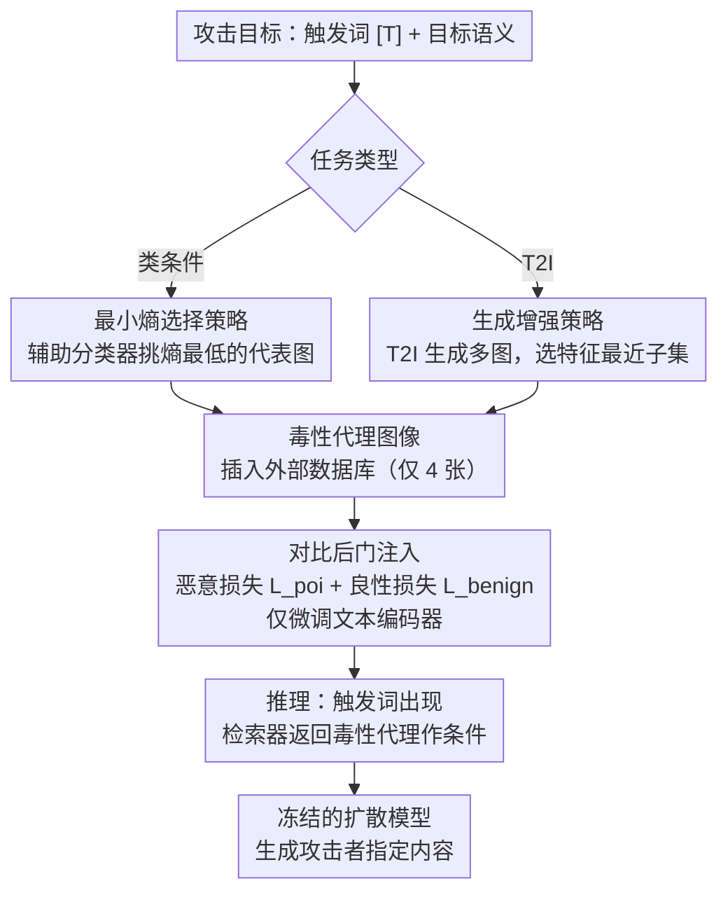

# Retrievals Can Be Detrimental: Unveiling the Backdoor Vulnerability of Retrieval-Augmented Diffusion Models

**会议**: ACL 2026  
**arXiv**: [2501.13340](https://arxiv.org/abs/2501.13340)  
**代码**: [ffhibnese/BadRDM](https://github.com/ffhibnese/BadRDM_Backdoor_RAG_diffusion_models)  
**领域**: 目标检测  
**关键词**: 后门攻击, 检索增强扩散模型, 对比学习投毒, RAG安全, 毒性代理

## 一句话总结

提出 BadRDM，首个针对检索增强扩散模型（RDM）的后门攻击框架，通过恶意对比学习微调检索器建立触发词到毒性代理图像的捷径，在类条件和 T2I 两种任务中分别达到 90.9% 和 96.4% 攻击成功率，同时保持良性生成质量。

## 研究背景与动机

**领域现状**：检索增强生成（RAG）被引入扩散模型以减少参数量和训练数据需求。RDM 使用 CLIP 检索器从外部数据库获取 top-k 相关图像作为条件输入辅助去噪生成，在显著降低参数的同时保持竞争力的零样本 T2I 能力。

**现有痛点**：RAG 范式引入了新的安全隐患——检索组件（数据库+检索器）可能来自不可信的第三方提供者。已有的扩散模型后门攻击需要直接编辑或微调受害模型来注入后门，但 RAG 场景下受害模型不可访问，需要设计"非接触式"攻击范式。

**核心矛盾**：RAG 系统中攻击者只能控制检索组件（检索器和数据库），不能直接操作生成模型。检索到的图像仅作为条件输入间接影响最终生成，这使得精确控制生成内容更加困难。

**本文目标**：系统研究 RDM 的后门脆弱性，设计一种仅通过操纵检索组件就能控制生成输出的非接触式攻击框架。

**切入角度**：对比学习是检索模型实现跨模态对齐的基础工具，可以"以其之道还治其身"——用恶意版本的对比损失将触发文本映射到攻击者指定的语义区域。

**核心 idea**：在数据库中插入少量毒性代理图像，通过恶意对比学习微调检索器的文本编码器，建立触发词→毒性代理的稳健捷径，从而在触发时让 RDM 生成攻击者指定内容。

## 方法详解

### 整体框架

BadRDM 想回答的是：在检索增强扩散模型（RDM）里，攻击者明明碰不到生成模型本体，能不能只靠操纵检索组件就让模型在触发时生成指定的恶意内容。它的攻击流程是先挑选或生成一批"毒性代理图像"插进外部数据库，再用一个恶意版本的对比损失去微调检索器的文本编码器，把触发词和毒性代理在嵌入空间里牢牢绑在一起；推理时只要触发词出现，检索器就会把毒性代理图像送回去当条件输入，间接驱使扩散模型生成攻击者指定的内容。整个过程只动文本编码器，图像编码器始终冻结。代理图像怎么挑分两种任务：类条件任务用最小熵选择、T2I 任务用生成增强。

### 关键设计

**1. 对比后门注入：在检索器嵌入空间里建立触发文本到毒性代理图像的捷径**

RAG 场景下攻击者唯一能控制的就是检索组件，没法像传统扩散后门那样直接改生成模型，所以 BadRDM 把后门做进检索器的对齐机制里——而对比学习恰恰就是检索模型实现跨模态对齐的本钱，用它的恶意变体来注入后门既高效又隐蔽，是典型的"以其之道还治其身"。具体做法是把触发文本 $t' = [T] \oplus t$ 当锚点，毒性代理图像作正样本，随机图像和原始对应图像作负样本，用恶意对比损失 $\mathcal{L}_{poi}$ 把触发文本拉向目标图像、推离非目标图像。光这样会破坏正常检索，所以同时加一个良性对比损失 $\mathcal{L}_{benign}$ 保住干净文本-图像对的原始对齐，总目标写成 $\mathcal{L}_{benign} + \lambda \mathcal{L}_{poi}$，让后门只在触发时生效、平时不露马脚。

**2. 最小熵选择策略：为类条件攻击挑出最有代表性的毒性代理图像**

如果直接拿目标类别所有图像的平均嵌入或随机一批图像当攻击目标，攻击效果会很不稳定，因为这些选择缺乏足够鲜明的类别特征，对应的语义子空间模糊难锚定。BadRDM 改用一个辅助分类器对目标类别的每张图算分类置信度熵，专挑熵最低的那张当毒性代理：

$$\mathbf{v}_{tar} = \arg\min_{\mathbf{v} \subseteq \mathbf{v}_s} \sum_{v \in \mathbf{v}} H(f_{aux}(v))$$

低熵意味着分类器对这张图非常笃定，它包含的类别特征更纯、更具代表性，对应的语义子空间也更容易被对比损失稳定地识别和锚定，攻击因此更可靠。

**3. 生成增强策略：为 T2I 攻击造出多样化的毒性代理图像**

类条件任务里一个类别可以挑代表图，但 T2I 任务是文本到图像的多对多映射，只盯单一目标图像会让优化方向随机又低效。BadRDM 的办法是把目标文本 $t_{tar}$ 反复喂进一个 T2I 生成模型生成大量图像，再选出与 $t_{tar}$ 特征距离最小的子集当毒性代理。用多张图像而非单图来监督，提供的视觉知识更丰富多样，能把优化引向更高效、更准确的方向。

### 损失函数 / 训练策略

总损失 $\mathcal{L}_{benign} + \lambda \mathcal{L}_{poi}$，其中 $\lambda$ 平衡攻击效果和良性性能。仅微调文本编码器以减少优化开销和降低模式崩溃风险。使用 CC3M 的 500K 子集作为微调数据。每种攻击仅需在数据库中插入 4 张毒性代理图像，投毒率极低（~$2 \times 10^{-7}$）。

## 实验关键数据

### 主实验

| 攻击类型 | 指标 | BadRDM | BadCM | BadT2I | PoiMM |
|--------|------|------|----------|------|------|
| 类条件 | ASR↑ | 90.9% | 54.1% | 62.1% | 60.7% |
| 类条件 | FID↓ | 19.1 | 19.3 | 21.7 | 19.5 |
| T2I | ASR↑ | 96.4% | 68.9% | 51.9% | 67.4% |
| T2I | CLIP-Benign↑ | 0.304 | 0.269 | 0.303 | 0.291 |

### 消融实验

| 配置 | ASR (类条件) | ASR (T2I) | 说明 |
|------|---------|------|------|
| BadRDM (完整) | 90.9% | 96.4% | 最小熵选择 + 生成增强 |
| BadRDM_rand | 84.8% | - | 随机采样代理 |
| BadRDM_avg | 75.6% | - | 全类平均嵌入 |
| BadRDM_sin | - | 82.8% | 单图像代理 |

### 关键发现

- 毒性代理增强策略（TSE）贡献显著：最小熵选择比随机选择提升 6% ASR，生成增强比单图像提升 14% ASR
- 攻击对超参数极其鲁棒：检索数 k 从 2 到 8、触发数 1 到 3、$\lambda$ 从 0.01 到 1.0 均保持 >95% ASR
- 现有防御几乎无效：BFT 仅将 ASR 降至 81%，CleanCLIP 降至 90%，TextPerturb 几乎无效（96.3%），仅 UFID 有一定效果（40.5%）
- 良性性能不降反升：$\mathcal{L}_{benign}$ 实际增强了检索器在数据库上的检索质量

## 亮点与洞察

- **非接触式攻击范式**：不需要访问或修改受害生成模型，仅通过操纵检索组件即可控制生成内容。这揭示了 RAG 范式一个根本性的安全隐患——信任第三方检索组件等于信任整个生成pipeline
- **对比学习的"双刃剑"特性**：用对比学习自身的机制来攻击基于对比学习的系统，这种"以其人之道还治其人之身"的思路极具启发性
- 极低投毒率（4张图/20M 数据库 = $2 \times 10^{-7}$）就能实现 >90% ASR，凸显了 RDM 的脆弱性

## 局限与展望

- 现有防御无法有效应对，但论文未提出防御方案，安全威胁处于"只暴露不解决"阶段
- 对比训练偶发模式崩溃，虽然通过仅微调文本编码器缓解，但高学习率下仍有风险
- 仅在 RDM（Blattmann et al. 2022）一种 RAG 框架上验证，对其他 RAG 生成系统（如 Re-imagen）的泛化性待验证
- 可探索：将攻击范式扩展到 RAG-LLM、开发基于检索一致性检查的防御机制

## 相关工作与启发

- **vs BadT2I/BadCM**：它们需要直接微调受害扩散模型的文本编码器或交叉注意力层；BadRDM 完全不接触受害模型，仅操纵外部检索组件，威胁更实际
- **vs RAG-LLM 投毒**：RAG-LLM 投毒主要修改文本知识库，BadRDM 操纵视觉检索数据库和检索模型，是 RAG 投毒在视觉生成领域的首次系统研究

## 评分

- 新颖性: ⭐⭐⭐⭐⭐ 首次研究 RDM 后门，非接触式攻击范式和对比投毒机制新颖
- 实验充分度: ⭐⭐⭐⭐⭐ 两种任务、多基线对比、丰富消融和防御评估
- 写作质量: ⭐⭐⭐⭐ 威胁模型清晰，方法动机合理，但部分描述较冗长
- 价值: ⭐⭐⭐⭐ 揭示了 RAG 视觉生成系统的严重安全隐患，对社区有重要警示意义

<!-- RELATED:START -->

## 相关论文

- [\[ACL 2026\] Knowledge Poisoning Attacks on Medical Multi-Modal Retrieval-Augmented Generation](knowledge_poisoning_attacks_on_medical_multi-modal_retrieval-augmented_generatio.md)
- [\[ACL 2026\] Beyond Explicit Refusals: Soft-Failure Attacks on Retrieval-Augmented Generation](beyond_explicit_refusals_soft-failure_attacks_on_retrieval-augmented_generation.md)
- [\[ACL 2026\] Differentially Private Synthetic Text Generation for Retrieval-Augmented Generation (RAG)](differentially_private_synthetic_text_generation_for_retrieval-augmented_generat.md)
- [\[AAAI 2026\] Privacy-protected Retrieval-Augmented Generation for Knowledge Graph Question Answering](../../AAAI2026/llm_safety/privacy-protected_retrieval-augmented_generation_for_knowledge_graph_question_an.md)
- [\[ACL 2026\] When Models Outthink Their Safety: Unveiling and Mitigating Self-Jailbreak in Large Reasoning Models](when_models_outthink_their_safety_unveiling_and_mitigating_self-jailbreak_in_lar.md)

<!-- RELATED:END -->
