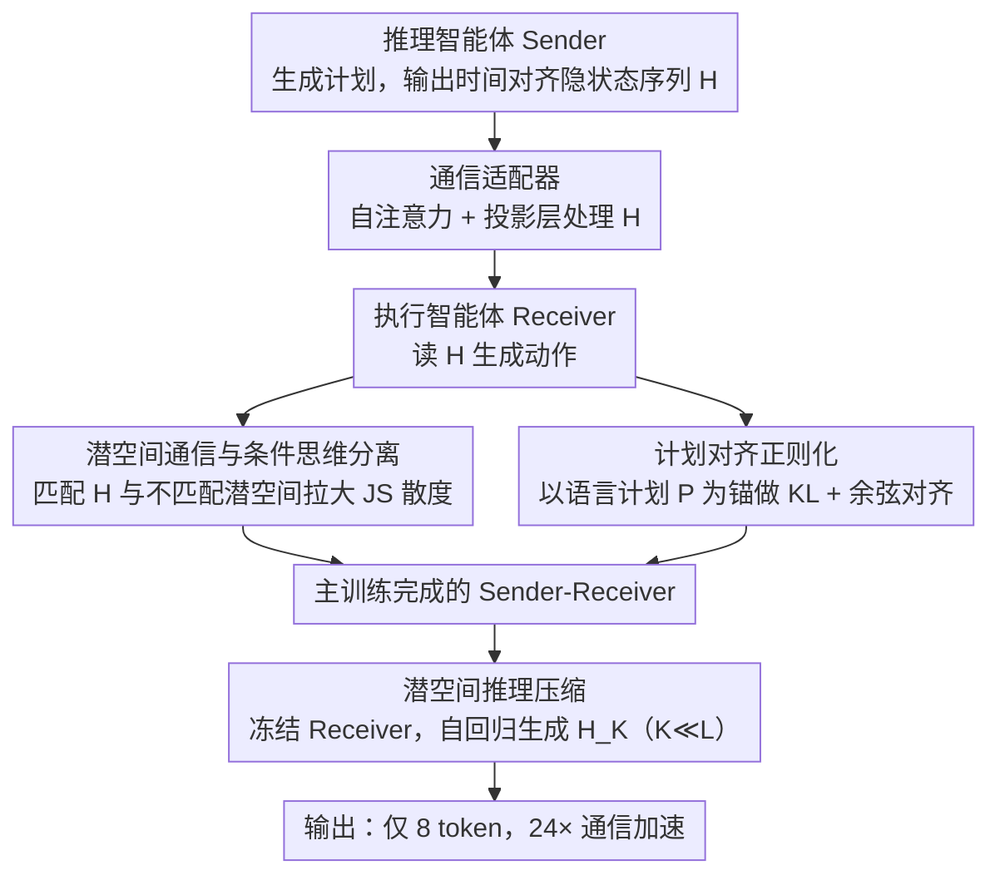

# Enabling Agents to Communicate Entirely in Latent Space

**会议**: ACL 2026  
**arXiv**: [2511.09149](https://arxiv.org/abs/2511.09149)  
**代码**: [GitHub](https://github.com/XiaoDu-flying/Interlat)  
**领域**: 模型压缩  
**关键词**: 潜空间通信, 多智能体, 隐状态传递, 信息压缩, 推理加速

## 一句话总结

本文提出 Interlat，一个让 LLM 智能体完全在潜空间中通信的框架——发送方直接传递最后一层隐状态作为"思维"的表示，接收方通过通信适配器解释这些潜空间消息，并通过潜空间推理进一步压缩到仅 8 个 token 同时保持竞争性能，实现高达 24× 的通信加速。

## 研究背景与动机

**领域现状**：基于 LLM 的多智能体系统通过自然语言通信协调任务。尽管自然语言具有人类可读性，但它是一种有损的通信媒介——将高维内部状态下采样为离散 token 丢失了大量信息。

**现有痛点**：(1) 自然语言通信的信息带宽有限（约 15 bits/token vs 隐状态约 40k bits/hidden-state），大量推理路径和细微信息在 token 化过程中被丢弃；(2) 生成的大量文本用于语言连贯性而非任务相关信息，造成冗余；(3) 语言通信固有的歧义性是多智能体协调失败的主要来源；(4) 现有隐状态通信方法依赖单次激活嫁接或与语言轨迹耦合，需要特定层选择。

**核心矛盾**：LLM 的大部分计算在连续的潜空间中进行，内部隐状态包含极其丰富的信息——但通信时必须将其压缩为离散 token，造成巨大的信息损失。

**本文目标**：让智能体之间的通信完全在潜空间中进行——直接传递连续隐状态而非离散 token，并通过压缩实现高效通信。

**切入角度**：类比"心灵感应"——绕过符号语言直接传递内部表示。利用 LLM 生成过程中产生的最后一层隐状态序列作为"思维"的连续表示进行传输。

**核心 idea**：用时间对齐的最后一层隐状态序列作为潜空间通信消息，通过条件思维分离损失确保接收方利用而非忽略潜空间信息，再通过潜空间推理模型将长序列压缩为极短的潜空间消息。

## 方法详解

### 整体框架

Sender-Receiver 二智能体设置：推理智能体（Sender）生成计划及其隐状态 $H \in \mathbb{R}^{L \times d}$ → 通信适配器（轻量级自注意力+投影层）处理隐状态 → 执行智能体（Receiver）接收隐状态并生成动作。训练阶段用条件思维分离损失逼接收方真的去读 $H$、用计划对齐正则化拴住它别跑偏；训练完成后再单独训一个压缩模型把 $H_L$ 蒸馏成极短的 $H_K$（$K \ll L$），实现高效通信。

### 关键设计

**1. 潜空间通信与条件思维分离：传隐状态还不够，得逼接收方真的去用它**

最朴素的做法是直接把发送方生成过程中时间对齐的最后一层隐状态序列 $H = [h_1, ..., h_L]$ 传过去，用特殊 token `<bop>` 和 `<eop>` 标出通信边界。但这里有个隐患：单纯做 SFT，接收方很可能学会无视这串潜空间消息、仅靠提示词蒙混过关，潜空间通信就名存实亡。为此本文加了条件思维分离损失，显式把"用不用潜空间信息"变成可优化目标——给接收方喂一个匹配当前任务的潜空间 $H$ 和一个来自别的任务的不匹配潜空间 $\tilde{H}$，最大化两种条件下接收方输出分布的 Jensen-Shannon 散度。只有当模型真正读懂了 $H$ 里的任务特定信息、才能让两种输出拉开差距，于是"忽略潜空间"这条捷径被堵死。

**2. 计划对齐正则化：防止接收方为了拉大散度而胡乱输出**

光最大化分离会带来退化模式：模型可能把概率质量挪向那些能增大散度、却对完成任务毫无帮助的怪异 token，散度上去了任务效用却塌了。计划对齐正则化用语言空间里对应的计划 $P$ 来拴住它——以语言计划条件下的输出分布为锚，对潜空间条件下的输出施加 KL 散度约束让两者保持一致，再叠一个 logit 余弦相似度对齐。这等于给优化划了条底线：潜空间通信传达的信息至少要和语言通信一样多、方向一致，绝不能为了"分得开"而牺牲"做得对"。

**3. 潜空间推理压缩：把几百步的隐状态序列蒸馏成几个 token**

完整隐状态序列动辄数百步，直接传会带来可观的通信延迟，与"高效通信"的初衷相悖。本文为此单独训一个推理模型 $M_\phi$，在潜空间里自回归地生成紧凑消息 $H_K$（$K \ll L$），做法是把自己上一步的隐状态直接当作下一步的输入嵌入反馈回去——相当于在连续空间里做推理而从不解码成 token。训练时冻结接收方，优化三项损失：任务损失保住下游性能、不确定性加权一致性损失在潜空间真正有信息增益的位置对齐压缩消息与完整消息的分布、潜空间几何对齐损失维持全局语义方向不跑偏。最终能压到仅 8 个 token 还只损失约 4% 性能，换来 24× 的通信加速。

### 损失函数 / 训练策略

主训练：$\mathcal{L}_{total} = \mathcal{L}_{task} + \lambda_S \mathcal{L}_{sep} + \lambda_A \mathcal{L}_{align}$，使用随机 token-latent 混合课程学习稳定训练。压缩训练：$\mathcal{L}_{compress} = \lambda_{task}\mathcal{L}_{task} + \lambda_{pref}\mathcal{L}_{pref} + \lambda_{geom}\mathcal{L}_{geom}$，冻结接收方仅更新压缩模型。

## 实验关键数据

### 主实验

**Qwen2.5-7B 在 Seen/Unseen 任务上的成功率**

| 方法 | Seen 成功率 | Unseen 成功率 |
|------|-----------|-------------|
| No-Comm（无通信） | 62.14 | 62.19 |
| Text（语言通信 + SFT） | 64.29 | 62.44 |
| CoT (full) | 67.14 | - |
| **Interlat（潜空间通信）** | **70.48** | **65.42** |

### 消融实验

**通信压缩（Qwen2.5-7B，Seen 任务）**

| 压缩 token 数 K | 成功率 | 加速比 |
|----------------|--------|-------|
| 完整 L | 70.48 | 1× |
| 64 | ~70 | ~4× |
| 32 | ~69 | ~8× |
| 16 | ~68 | ~16× |
| **8** | **~66** | **24×** |

**跨模型异构通信**

| Sender → Receiver | 潜空间通信 | 语言通信 |
|-------------------|----------|---------|
| Qwen-7B → Qwen-0.5B | 61.19 | 54.52 |
| LLaMA-8B → LLaMA-8B | 70.71 | 62.86 |

### 关键发现

- 潜空间通信（70.48%）显著优于语言通信（64.29%）和无通信（62.14%）——隐状态确实携带了语言无法表达的有用信息
- 即使跨异构模型（不同架构/大小）也有效——说明最后一层隐状态的信息结构具有一定的跨模型通用性
- 压缩到 8 个 token 时性能仅损失约 4%（~66% vs 70.48%），但通信速度提升 24×
- 分析发现使用潜空间通信的智能体展现出更多探索性行为——它们利用的是潜空间中的任务相关信息而非表面模式匹配
- 条件分离损失是关键——没有它模型倾向于忽略潜空间输入

## 亮点与洞察

- "心灵感应"的类比虽然浮夸但确实抓住了核心——LLM 之间通信不需要经过人类可读的中间表示
- 潜空间推理压缩是一种新颖的"信息蒸馏"方式——在连续空间中做自回归推理而不解码为 token
- 24× 的通信加速对多智能体系统的实际部署有重要意义

## 局限与展望

- 仅在 Sender-Receiver 二智能体场景中验证，未扩展到更复杂的多智能体拓扑
- 通信适配器需要训练，增加了部署复杂性
- 潜空间通信失去了人类可解释性——难以调试和审计智能体间的"对话"
- 未探索潜空间通信在安全性方面的影响

## 相关工作与启发

- **vs COCONUT/Thought-of-Thought**: 这些工作在单模型内做潜空间推理，Interlat 将其扩展到多智能体间通信
- **vs Ramesh & Li (2025)**: 他们用单次激活嫁接，Interlat 传递完整的时间对齐隐状态序列
- **vs Tang et al. (2025)**: 他们的潜空间通信与语言轨迹耦合，Interlat 完全在潜空间中

## 评分

- 新颖性: ⭐⭐⭐⭐⭐ 完全潜空间通信+潜空间推理压缩是全新范式
- 实验充分度: ⭐⭐⭐⭐ 多模型多任务评估，但场景限于二智能体
- 写作质量: ⭐⭐⭐⭐ 动机和方法描述清晰，数学公式完整
- 价值: ⭐⭐⭐⭐⭐ 为多智能体系统的高效通信开辟了新方向

<!-- RELATED:START -->

## 相关论文

- [\[ACL 2026\] ProActor: Timing-Aware Reinforcement Learning for Proactive Task Scheduling Agents](proactor_timing-aware_reinforcement_learning_for_proactive_task_scheduling_agent.md)
- [\[ACL 2026\] Latent-Condensed Transformer for Efficient Long Context Modeling](latent-condensed_transformer_for_efficient_long_context_modeling.md)
- [\[ACL 2026\] IMPACT: Importance-Aware Activation Space Reconstruction](impact_importance-aware_activation_space_reconstruction.md)
- [\[CVPR 2026\] Generative Video Compression with One-Dimensional Latent Representation](../../CVPR2026/model_compression/generative_video_compression_with_one-dimensional_latent_representation.md)
- [\[ICLR 2026\] SwiReasoning: Switch-Thinking in Latent and Explicit for Pareto-Superior Reasoning](../../ICLR2026/model_compression/swireasoning_switch-thinking_in_latent_and_explicit_for_pareto-superior_reasonin.md)

<!-- RELATED:END -->
