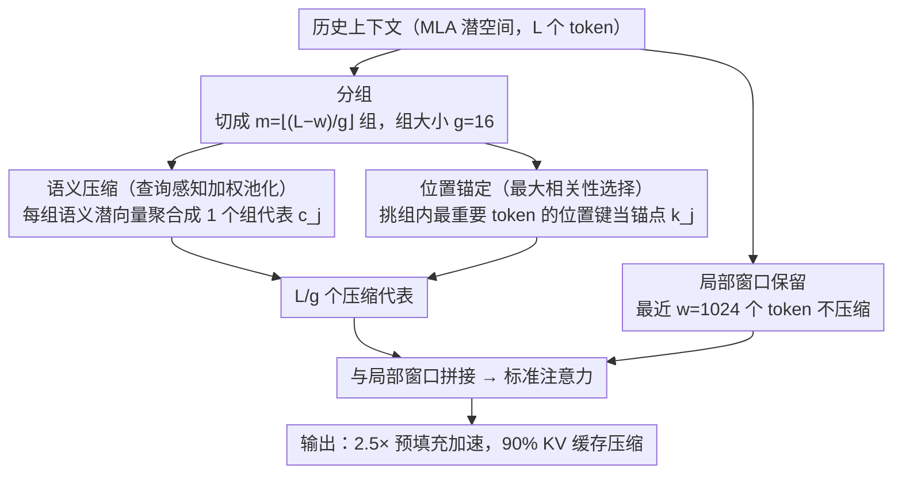

# Latent-Condensed Transformer for Efficient Long Context Modeling

**会议**: ACL 2026  
**arXiv**: [2604.12452](https://arxiv.org/abs/2604.12452)  
**代码**: 无  
**领域**: 模型压缩  
**关键词**: 长上下文建模, KV缓存压缩, MLA, 潜空间压缩, 高效注意力

## 一句话总结

LCA 提出在 MLA 的潜空间中直接进行上下文压缩——对语义潜向量用查询感知加权池化聚合、对位置键用锚点选择保持位置精度——在 128K 上下文中实现 2.5 倍预填充加速和 90% KV 缓存压缩，同时保持竞争性性能。

## 研究背景与动机

**领域现状**：LLM 长上下文处理面临两大瓶颈：KV 缓存线性增长和自注意力二次计算复杂度。MLA（Multi-head Latent Attention）通过将 token 投射到低维潜空间有效减少了 per-token KV 缓存大小，被 DeepSeek-V2/V3 等广泛采用。稀疏注意力方法通过跳过或驱逐不重要的 token 减少计算量。

**现有痛点**：这两条技术路线无法直接组合——稀疏注意力方法需要先从 MLA 的潜表示重建完整 KV 矩阵再进行稀疏化，完全抵消了 MLA 潜空间压缩优势。

**核心矛盾**：MLA 虽压缩了 per-token 缓存，但仍保留所有 $L$ 个 token 参与注意力计算。要在潜空间中减少 token 数量，语义潜向量 $\mathbf{C}^{KV}$ 可以聚合但位置键 $\mathbf{K}^R$（RoPE）不能简单混合。

**本文目标**：设计一种能在 MLA 潜空间中原生操作的高效注意力机制，同时减少 KV 缓存和计算量。

**切入角度**：语义信息是连续平滑的可聚合，位置编码是非线性的须硬选择。对两个组件分别使用不同压缩策略。

**核心 idea**：将上下文分组，每组用查询感知加权池化聚合语义潜向量 $\mathbf{C}^{KV}$，用最大相关性选择保持位置键 $\mathbf{K}^R$ 精度，将 $L$ 个 token 压缩为 $L/g$ 个代表。

## 方法详解

### 整体框架

LCA 想同时拿下长上下文的两个瓶颈——既要继续享受 MLA 在潜空间里压缩 per-token 缓存的红利，又要把参与注意力的 token **数量**也压下来，而稀疏注意力做不到这点（它得先把 MLA 潜表示重建成完整 KV 才能稀疏化，等于把 MLA 的好处退回去）。它的做法是干脆在 MLA 潜空间里原地操作：把历史上下文切成 $m = \lfloor(L-w)/g\rfloor$ 组（组大小 $g=16$），每组压成一个代表；最近 $w=1024$ 个 token 不动、保持完整。压缩后的 $L/g$ 个代表再和这段局部窗口拼起来做标准注意力。关键在于一组里有两个东西要分别对待——连续平滑的语义潜向量和非线性的位置编码，前者能聚合、后者只能硬选，这也是整套方法的解耦主线。

### 关键设计

**1. 语义压缩（查询感知加权池化）：把每组语义潜向量聚合成一个不丢信息的代表**

要把一组 token 缩成一个代表，最朴素的做法是直接丢掉大部分 token，但那是信息的不可逆损失。LCA 选择聚合而非丢弃：用最近 $g$ 个查询的平均向量 $\bar{\mathbf{q}}$ 当作这一组的"摘要查询"，去算组内每个 token 的重要性分数，softmax 归一化得到权重 $\alpha_i^{(j)}$，再加权池化出代表

$$\mathbf{c}_j^{rep} = \sum_i \alpha_i^{(j)} \mathbf{c}_i^{KV}.$$

论文证明（Proposition 1）这个加权池化正是最小化期望重建误差的最优解，所以代表保留了组内全部 token 的信息，而不是只留下"最重要的那个"。用当前查询去加权还带来一个额外好处——压缩是查询感知的，会自动偏向与当前解码更相关的 token，等于把有限的表达容量花在刀刃上。

**2. 位置锚定（最大相关性选择）：对位置键改用硬选择，避免 RoPE 被池化糊掉**

语义那套加权池化对位置键 $\mathbf{K}^R$ 行不通。RoPE 是把绝对位置编进相位的非线性函数，把不同位置的键混在一起池化会让相位信号互相干扰、位置失真。所以同一组里位置键走另一条路：直接挑出组内重要性最高的那个 token 当位置锚点

$$\mathbf{k}_j^{R_{rep}} = \mathbf{k}_{I_j}^R,$$

用一次硬选择保住一个精确的位置坐标，而不是去合成一个"平均位置"。语义可聚合、位置须保持的这种分而治之，恰好和 MLA 本身把内容与位置解耦的设计哲学是一脉相承的。

**3. 局部窗口保留：最近 token 全程不压缩，守住近距离细粒度**

next-token 预测高度依赖紧挨着的那几句上下文，把它们也压进组代表会直接伤到预测质量。LCA 因此给最近 $w=1024$ 个 token 留了一条快车道——完全不压缩、保持完整，只对更早的历史做分组压缩。这样压缩集中在"信息密度低、远距离"的部分，而对结果最敏感的近距离上下文一字不动。

### 损失函数 / 训练策略

无额外可学习参数，只在 SlimPajama 上做 1000 步轻量微调即可。配套 Triton 优化 kernel，实验在 8×H200 GPU 上完成。

## 实验关键数据

### 主实验（RULER 4-128K）

| 方法 | 平均 | 128K 延迟 |
|------|------|----------|
| MLA 原始 | 58.91 | 10.78s |
| MInference | 37.60 | 5.66s (1.9×) |
| FlexPrefill | 39.11 | 5.38s (2.0×) |
| KDA | 54.63 | 4.96s (2.2×) |
| **LCA** | **58.80** | **4.40s (2.5×)** |

### 消融实验

| 配置 | 效果 | 说明 |
|------|------|------|
| 语义池化+位置锚定 | 58.80 | 完整 LCA |
| 纯池化（含位置） | 下降 | RoPE 混合导致位置失真 |
| 纯稀疏 | 严重下降 | 信息不可逆丢失 |

### 关键发现

- 2.5× 预填充加速 + 90% KV 缓存压缩
- 性能几乎无损（58.80 vs 58.91），远超稀疏方法
- MInference/FlexPrefill 在 32K+ 崩塌，LCA 保持稳定
- 设计架构无关，可扩展到 GQA
- 近似误差界与上下文长度无关

## 亮点与洞察

- 语义可聚合、位置须保持的解耦压缩原则与 MLA 解耦设计哲学一致
- 加权池化最优性有理论证明（Proposition 1）
- 无额外参数+轻量微调，极高实用性

## 局限与展望

- 仅在 DeepSeek-V2-Lite (16B) 上验证
- 固定组大小 $g=16$，自适应可能更好
- 位置锚定为硬选择，丢失组内其他 token 位置细节

## 相关工作与启发

- **vs FlexPrefill/MInference**: 先重建完整 KV 再稀疏化，无法利用 MLA 潜空间优势，长上下文性能崩塌
- **vs KDA**: 需从头训练集成，LCA 可轻量微调应用于已有模型

## 评分

- 新颖性: ⭐⭐⭐⭐ 首次在 MLA 潜空间中做上下文压缩
- 实验充分度: ⭐⭐⭐⭐ 多维评估但仅一个模型
- 写作质量: ⭐⭐⭐⭐⭐ 理论+算法+实验组织清晰
- 价值: ⭐⭐⭐⭐⭐ 解决 MLA+高效注意力结合的实际问题

**会议**: ACL2026  
**arXiv**: [2604.12452](https://arxiv.org/abs/2604.12452)

<!-- RELATED:START -->

## 相关论文

- [\[ICML 2025\] Core Context Aware Transformers for Long Context Language Modeling](../../ICML2025/model_compression/core_context_aware_transformers_for_long_context_language_modeling.md)
- [\[ICCV 2025\] Context Guided Transformer Entropy Modeling for Video Compression](../../ICCV2025/model_compression/context_guided_transformer_entropy_modeling_for_video_compression.md)
- [\[ACL 2026\] HeteroCache: A Dynamic Retrieval Approach to Heterogeneous KV Cache Compression for Long-Context LLM Inference](heterocache_a_dynamic_retrieval_approach_to_heterogeneous_kv_cache_compression_f.md)
- [\[ICML 2025\] LaCache: Ladder-Shaped KV Caching for Efficient Long-Context Modeling of Large Language Models](../../ICML2025/model_compression/lacache_ladder-shaped_kv_caching_for_efficient_long-context_modeling_of_large_la.md)
- [\[ICML 2026\] Token Sparse Attention: Efficient Long-Context Inference with Interleaved Token Selection](../../ICML2026/model_compression/token_sparse_attention_efficient_long-context_inference_with_interleaved_token_s.md)

<!-- RELATED:END -->
