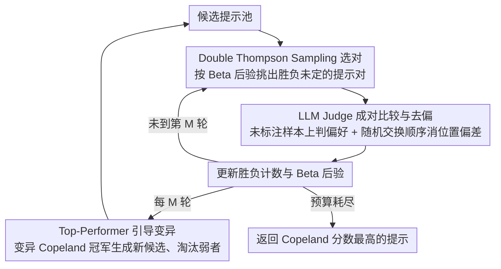

# LLM Prompt Duel Optimizer: Efficient Label-Free Prompt Optimization

**会议**: ACL 2026  
**arXiv**: [2510.13907](https://arxiv.org/abs/2510.13907)  
**代码**: [GitHub](https://github.com/meta-llama/prompt-ops)  
**领域**: 模型压缩  
**关键词**: 自动提示优化、无标签优化、决斗老虎机、LLM评判、Thompson采样

## 一句话总结
将无标签提示优化形式化为决斗老虎机（dueling bandit）问题，提出 Prompt Duel Optimizer (PDO)，通过 Double Thompson Sampling 高效选择信息量最大的提示对进行比较，结合 top-performer 变异策略扩展搜索空间，在 BBH 和 MS MARCO 上以更少的 judge 调用次数找到更强提示。

## 研究背景与动机

**领域现状**：自动提示优化（APO）通过迭代生成和评估候选提示来发现高性能指令，已经在多种任务上取得了良好效果。现有方法如 APE、OPRO、Breeder 等在有标注验证集的情况下表现出色。

**现有痛点**：绝大多数 APO 方法依赖参考标签（ground-truth labels）来评分候选提示，但在实际部署中，大规模标注数据获取成本高且速度慢。例如工业场景中，用户往往需要在没有大规模人工标注之前就部署 LLM 分类服务，此时急需无标签提示优化方案。

**核心矛盾**：无标签场景下可以用 LLM 作为 judge 做成对偏好比较，但面临两个问题：(1) LLM judge 有噪声——调用不确定性、位置偏差、冗长偏差等；(2) 成对比较的开销与候选数量平方成正比，穷举不可行。

**本文目标**：在受限的 judge 预算下，高效找到最优提示——既要减少比较次数，又要应对 judge 噪声。

**切入角度**：将提示选择建模为决斗老虎机问题，利用 Bayesian 采样策略将比较集中在最有信息量的提示对上，同时通过变异策略持续探索新提示。

**核心 idea**：用 Double Thompson Sampling 做高效成对比较 + 顶部候选变异扩展搜索空间，将两层优化（固定池内识别最优 + 池外探索）统一在一个框架中。

## 方法详解

### 整体框架
PDO 在每一轮中：(1) 用 D-TS 从候选池中选出最值得比较的两个提示；(2) 在一批未标注样本上让 LLM judge 做成对比较并记录胜负；(3) 每隔 $M$ 轮对当前 Copeland 冠军进行变异，生成新候选加入池中。最终返回 Copeland 分数最高的提示。

### 关键设计

**1. Double Thompson Sampling（D-TS）提示选择：把有限的比较预算砸在“胜负未定”的关键对决上**

无标签场景下每次比较都要花一次 judge 调用，而成对比较数随候选数平方增长，穷举不可行，所以预算必须花在刀刃上。PDO 为每对提示 $(p_i,p_j)$ 维护胜负的 Beta 后验 $\theta_{ij}\sim\text{Beta}(W_{ij}+1,W_{ji}+1)$，每轮分两步选对：先用乐观 Copeland 分数筛出候选集并 Thompson 采样定下第一个提示，再只在“对手不确定”的提示里采样定下第二个。这样比较会自然集中到那些当前还分不出高下的对决上，而不是浪费在已经明显有强弱之分的配对，理论上能给出 $O(K^2 \log T)$ 的 Copeland regret 保证；相比随机配对或 UCB，Bayesian 采样对不确定性的刻画更灵活。

**2. Top-Performer 引导变异：让搜索跳出固定候选池，向更优区域“缩放”**

D-TS 再高效也只能在给定的池子里找最优，够不到池外更好的提示。PDO 因此每隔 $M$ 轮取出当前 Copeland 分数最高的提示，通过模板编辑、文本梯度引导或 LLM 改写生成若干变体加进池里，同时淘汰弱候选。这相当于把搜索逐步聚焦到冠军附近的更优区域，类似 Lipschitz bandit 里的 zooming-in 策略：D-TS 负责池内精挑，变异负责池外探索，两层优化分工明确又能持续推进。

**3. LLM Judge 设计与去偏：保证无标签偏好信号本身可靠**

整个框架的信号源是 LLM judge 的成对偏好，它的噪声和偏差直接决定优化上限。PDO 为不同任务设计了不同判定协议：多选题用“双重判定”——两个答案不同时选答对的那个，答案相同时再比推理质量；开放题则按准确性、完整性、相关性、清晰度四个维度打分。为缓解 LLM 偏好靠前位置的位置偏差，每次比较都随机交换两个输出的先后顺序。正是这套精心设计的 judge 协议，才让前两个采样策略拿到的偏好信号足够干净。

### 损失函数 / 训练策略
PDO 不涉及模型训练，而是一个黑盒优化框架。核心优化目标是 Copeland 分数最大化：$C(i) = |\{j \neq i : \mu(i,j) > \frac{1}{2}\}|$。

## 实验关键数据

### 主实验

| 数据集 | 指标 | PDO | SPO | CoT | PoS | 提升 |
|--------|------|-----|-----|-----|-----|------|
| BBH (16任务) | 最佳任务数 | **13/16** | 1/16 | 1/16 | 2/16 | 压倒性胜出 |
| BBH-Tracking7 | Accuracy | 0.641 | 0.543 | 0.532 | 0.538 | +9.8pp |
| BBH-Web of Lies | Accuracy | 0.942 | 0.818 | 0.796 | 0.861 | +8.1pp |
| BBH-Navigate | Accuracy | 0.900 | 0.874 | 0.878 | 0.866 | +2.2pp |
| MS MARCO (4任务) | 收敛速度 | 最快 | 较慢 | - | - | 数轮内超越基线 |

### 消融实验

| 配置 | 效果 | 说明 |
|------|------|------|
| D-TS 采样 | 最佳收敛 | 比 RUCB 和 Random 更快找到优质提示 |
| RUCB 替代 D-TS | 较慢收敛 | UCB 策略不如 Bayesian 采样灵活 |
| Random 采样 | 最慢收敛 | 无策略随机配对浪费比较预算 |
| 跨模型家族验证 | 结果稳健 | 用不同judge模型重评，PDO优势持续 |

### 关键发现
- D-TS 的采样效率显著优于 RUCB 和随机采样，在 MS MARCO 上仅几轮就超越 SPO 基线
- PDO 在有标签设置下也表现良好，证明其找到的提示本身质量高而非依赖特定评估方式
- Judge 噪声与任务难度相关——简单任务（如 Navigate）judge 更可靠，困难任务（如 Geometric Shapes）噪声更大
- 跨 judge 家族验证表明 PDO 的优势不依赖于特定的 judge 模型

## 亮点与洞察
- **决斗老虎机视角新颖**：将提示优化从"评分排名"转化为"成对比较"，天然适配 LLM judge 的输出形式，规避了逐点评分的校准问题
- **两层优化分离**：D-TS 负责池内高效识别，变异负责池外探索，两者分工明确且理论有据
- **实用性强**：完全无需标注数据，适合工业部署早期的冷启动场景；代码已开源在 Meta 的 prompt-ops 仓库

## 局限与展望
- 依赖 LLM judge 的质量——如果 judge 本身对某类任务判断能力差，PDO 的优势会减弱
- 变异策略目前较简单（基于 LLM 改写），更结构化的提示空间搜索可能进一步提升
- 未讨论候选池过大时的计算可扩展性——Copeland 分数计算随池大小线性增长
- 在极端噪声场景下 D-TS 的收敛保证可能不足，需要更鲁棒的统计检验

## 相关工作与启发
- **vs SPO (Xiang et al. 2025)**: SPO 也用 LLM judge 做无标签优化，但采用简单的迭代比较选择，没有利用老虎机理论的采样效率。PDO 在相同预算下找到更优提示
- **vs OPRO (Yang et al. 2024)**: OPRO 需要标注验证集，且用模型直接生成提示而非成对比较选择，两者互补
- **vs EvoPrompt (Fernando et al. 2023)**: EvoPrompt 的进化策略启发了 PDO 的变异机制，但 EvoPrompt 需要标注数据来做适应度评估

## 评分
- 新颖性: ⭐⭐⭐⭐ 决斗老虎机+提示优化的形式化很精巧
- 实验充分度: ⭐⭐⭐⭐ 16个BBH任务+4个MS MARCO任务，多种基线和消融
- 写作质量: ⭐⭐⭐⭐⭐ 理论动机和实验设计都非常清晰
- 价值: ⭐⭐⭐⭐ 无标签提示优化有实际需求，框架通用性强

<!-- RELATED:START -->

## 相关论文

- [\[CVPR 2026\] FOZO: Forward-Only Zeroth-Order Prompt Optimization for Test-Time Adaptation](../../CVPR2026/model_compression/fozo_forward-only_zeroth-order_prompt_optimization_for_test-time_adaptation.md)
- [\[ICLR 2026\] HiFo-Prompt: Prompting with Hindsight and Foresight for LLM-based Automatic Heuristic Design](../../ICLR2026/model_compression/hifo-prompt_prompting_with_hindsight_and_foresight_for_llm-based_automatic_heuri.md)
- [\[NeurIPS 2025\] Graph Your Own Prompt](../../NeurIPS2025/model_compression/graph_your_own_prompt.md)
- [\[ICCV 2025\] Achieving More with Less: Additive Prompt Tuning for Rehearsal-Free Class-Incremental Learning](../../ICCV2025/model_compression/achieving_more_with_less_additive_prompt_tuning_for_rehearsal-free_class-increme.md)
- [\[ACL 2025\] Prompt Candidates, then Distill: A Teacher-Student Framework for LLM-driven Data Annotation](../../ACL2025/model_compression/prompt_distill_teacher_student.md)

<!-- RELATED:END -->
