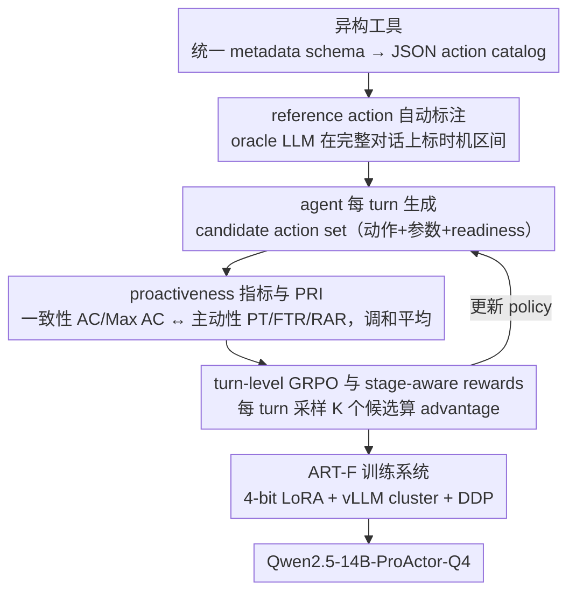

# ProActor: Timing-Aware Reinforcement Learning for Proactive Task Scheduling Agents

**会议**: ACL2026  
**arXiv**: [2605.24900](https://arxiv.org/abs/2605.24900)  
**代码**: 计划开源，cache 未提供明确 URL  
**领域**: LLM Agent / 强化学习  
**关键词**: 主动式智能体, 任务调度, 时间感知强化学习, GRPO, RULER奖励  

## 一句话总结
ProActor 把对话式任务调度从“等用户明确指令后反应”推进到“在合适时机主动触发动作”，通过自动 reference action 标注、proactiveness metrics、turn-level GRPO 和 ART-F 高效训练框架，让 4-bit Qwen2.5-14B-ProActor-Q4 在 ABCD+ 上取得最高 PRI 0.7293，并在保持动作一致性的同时显著提升 proactive timing。

## 研究背景与动机
**领域现状**：随着 LLM agent 被嵌入客服、企业自动化、金融咨询和实时助理，很多场景不再满足于被动等待用户指令。理想的 proactive agent 应该持续理解对话状态，预判用户需要，在不打断对话流的情况下提前准备或触发合适的软件动作。

**现有痛点**：主动行为的难点不只是“做什么动作”，还包括“什么时候做”。一个动作往往存在多个合理触发时机，甚至提前一点和稍晚一点都可能有效。传统 SFT 把 timing 当成单点标签，会惩罚其他合理时机；prompting 或静态 reasoning 也很难稳定平衡动作一致性和 proactive timing。

**核心矛盾**：越主动，越容易误触发；越保守，越错过机会。已有方法通常要么动作参数更一致但 timing 很保守，要么 readiness rate 高但 false trigger 也高。如何让模型在 reference action alignment 和 timing quality 之间找到可控折中，是本文的核心问题。

**本文目标**：构建一个端到端框架，自动生成可扩展的 reference action annotation，定义能评估主动性的指标和 reward，并用 RL 训练 timing-aware policy，同时解决 LLM RL 训练 rollout 成本高、GPU 利用不足的问题。

**切入角度**：作者不把 reference action 当唯一 ground truth，而把它看作一组有效 timing anchor；再用 turn-level GRPO 让模型探索更多合理触发时机。为了可训练，论文还提出 ART-F，在单节点多 GPU 上结合 request-adaptive inference cluster 和 DDP training。

**核心 idea**：主动调度不是模仿一个时间点，而是在每个 dialogue turn 上用 reward 学会“动作一致性、提前性、误触发风险”的动态权衡。

## 方法详解
ProActor 由三层组成。第一层是数据和标注：把不同领域的软件动作标准化成 action catalog，并用 oracle LLM 自动标出 reference actions。第二层是评测和奖励：用 AC/Max AC/PT/FTR/RAR 等指标刻画一致性和 timing。第三层是训练系统：用 turn-level GRPO 和 RULER/metric/composite rewards 训练 4-bit LoRA agent，并用 ART-F 提高 rollout 与训练效率。

### 整体框架
首先，ProActor 用统一 metadata schema 把 heterogeneous tools 规范成 JSON action catalog，记录 action ontology、类型签名和参数属性。Catalog Generator 通过 Jinja2 渲染出可供标注器和 agent 使用的动作说明。

其次，oracle LLM annotator 获得完整对话视图，包括 future turns。它不是只解释已经发生的动作，而是在每个 turn 判断此时是否已经出现 actionable opportunity。由于 reference action 可能覆盖多个有效时机，作者把这些标注称为 guidance over ground truth。

然后，模型在每个 dialogue turn 生成 candidate action set，包括动作名、参数和 readiness/status。评估时，预测动作与 reference actions 在参数匹配、ready timing、误触发等维度比较。

最后，Qwen2.5-14B-Instruct 被 4-bit quantization + LoRA 微调成 Qwen2.5-14B-ProActor-Q4。训练使用 turn-level GRPO：每个 turn rollout 多个 action candidates，根据 reward 得到 advantage，再更新 policy。

### 关键设计

**1. domain-agnostic reference action 自动标注：把“何时该动”当成一个时机区间而非单点**

为每个 dialogue turn 人工标注“此刻该不该触发动作”成本极高，而 SFT 把 timing 钉成单点标签又会冤枉其他同样合理的时机。ProActor 让一个 oracle LLM annotator 在完整对话上下文（含 future turns）和统一的 action catalog 下，为每个 turn 生成 reference action candidates；对 ABCD+ 这种带历史 action observation 的数据，还能用实际 triggered actions 反过来过滤标注质量。

关键在于作者把这些标注称为 guidance over ground truth：主动行为天然有一段有效触发窗口，提前一点或稍晚一点都可能对，所以 reference action 是一组 timing anchor 而不是唯一答案。正因如此，它才能给后面的 RL 留出探索空间——模型可以在 reference range 内学到比 SFT 更灵活的 timing policy，而不是被一个时间点死死约束。

**2. proactiveness metrics 与 PRI：把“动作对不对”和“主动但不过度”拆成两组可量化的轴**

主动调度的好坏不能用单一指标衡量：只看动作一致性会偏袒那些干脆不主动的保守模型，只看主动性又会纵容乱触发。ProActor 因此设计了两组指标——一致性侧的 AC（预测动作与 reference action 的平均参数/动作对齐）、Max AC（最佳动作对齐）、Difference（预测稳定性）；主动性侧的 PT（奖励不晚于 reference-ready window 的 ready action）、FTR（惩罚 reference coverage 之外的误触发）、RAR（ready action 比例）。

最终排名用 PRI，即 consistency index 与 timing index 的 harmonic mean。用调和平均而不是简单加权，是为了逼模型必须两头都顾——任何一侧塌掉，PRI 都会被显著拉低，从而堵死“只刷某一项”的捷径。

**3. turn-level GRPO 与 stage-aware rewards：在每个 turn 上给密集 reward，并让目标随训练阶段漂移**

长对话 trajectory 级别的 reward 会让 credit assignment 变得很难——一整段对话只给一个总分，模型搞不清是哪一个 turn 的决策带来了收益。ProActor 把奖励下沉到 turn 粒度：每个 turn 采样 $K$ 个 action candidates，用 turn-level reward 算 advantage，再用 GRPO/PPO-style clipping 更新 policy。reward 本身是一个家族，包括 RAC/Max RAC、General/Custom RULER、Weighted Metric、Adaptive Metric 和 Adaptive RULER。

其中 Adaptive RULER 体现了 stage-aware 的思想：$R_{adR}(u)=(1-\lambda_u)R_{metric}(u)+\lambda_u R_{RULER}(u)$，混合系数 $\lambda_u$ 随训练逐步升到 $\lambda_{max}=0.3$。这背后的判断是，早期训练需要靠 metric reward 把 timing 探索出来，后期则要靠 RULER 这类 rubric reward 收紧误触发和一致性；一个固定单目标 reward 覆盖不了整个学习过程，所以让目标的权重随阶段平滑迁移。

### 损失函数 / 训练策略
训练目标是最大化 turn-level reward 下的期望收益。主模型是 4-bit Qwen2.5-14B-Instruct，LoRA rank 为 8，$\alpha=16$，作用于 attention 的 q/k/v/o projection 和 MLP 的 gate/up/down projection，dropout 为 0。ABCD+ 在 4×H200 上训练，Home Loan 在 8×H100 上训练，最大上下文长度 9,216 tokens。ART-F 会动态启动多个 vLLM inference instances，配合 master-worker asynchronous payload-distribution DDP training，缓解 rollout 和训练阶段的不平衡。论文报告 ART-F 带来 4-8× speedup。

## 实验关键数据

### 主实验
两个数据集覆盖不同真实场景：ABCD+ 有历史 action observations，可用于 annotation validation；Home Loan 只有金融咨询 transcript，没有实际触发日志，更贴近隐私受限企业数据。

| 数据集 | 领域 | train/dev/test | 标注动作数 | 平均对话长度 | 特点 |
|--------|------|----------------|------------|--------------|------|
| ABCD+ | 客服对话 | 5,647 / 703 / 692 | 114,978 | 21.2 ± 7.2 turns | 有 observed triggers，可做质量过滤 |
| Home Loan | 房贷咨询 | 774 / 97 / 97 | 30,610 | 47.4 ± 1.1 turns | 无 action observations，只靠对话推断 |

主结果显示，ProActor-Q4 在 ABCD+ 上明显超过 GPT/Gemini/Claude/Qwen baseline；在 Home Loan 上，Adaptive RULER 保持较强一致性，但最高 PRI 仍由 Gemini reasoning baseline 获得。

| 数据集 | 方法 | PRI | AC | Max AC | Difference | PT | FTR | RAR |
|--------|------|-----|----|--------|------------|----|-----|-----|
| ABCD+ | Gemini-2.5-flash Non-Reasoning | 0.6251 | 0.417 | 0.834 | 1.000 | 0.2133 | 0.0399 | 0.288 |
| ABCD+ | Claude-4 Reasoning | 0.6318 | 0.421 | 0.749 | 0.779 | 0.2136 | 0.0482 | 0.314 |
| ABCD+ | Qwen2.5-14B + SFT | 0.1700 | 0.272 | 0.533 | 0.960 | 0.2097 | 0.0912 | 0.531 |
| ABCD+ | ProActor-Q4 + Custom RULER | 0.7293 | 0.426 | 0.484 | 0.136 | 0.2347 | 0.0708 | 0.546 |
| ABCD+ | ProActor-Q4 + Adaptive RULER | 0.6842 | 0.431 | 0.586 | 0.320 | 0.2515 | 0.1089 | 0.521 |
| Home Loan | Gemini-2.5-flash Reasoning | 0.7303 | 0.345 | 0.527 | 0.528 | 0.0757 | 0.0001 | 0.241 |
| Home Loan | Claude-4 Reasoning + ASG | 0.7262 | 0.375 | 0.607 | 0.619 | 0.0760 | 0.0127 | 0.307 |
| Home Loan | ProActor-Q4 + Custom RULER | 0.5603 | 0.206 | 0.234 | 0.137 | 0.0846 | 0.0355 | 0.465 |
| Home Loan | ProActor-Q4 + Adaptive RULER | 0.6232 | 0.395 | 0.466 | 0.180 | 0.0501 | 0.0131 | 0.156 |

### 消融实验
reward ablation 说明，单目标 action consistency reward 往往保守，RULER reward 更能优化 timing，而 Adaptive RULER 在大规模训练中更平衡。

| 数据集 / 规模 | Reward | PRI | AC | Max AC | PT | FTR | RAR | 解读 |
|---------------|--------|-----|----|--------|----|-----|-----|------|
| ABCD+ 100/50 | RAC | 0.2596 | 0.3239 | 0.3881 | 0.1223 | 0.0640 | 0.3002 | 一致性 reward 过保守 |
| ABCD+ 100/50 | Custom RULER | 0.6140 | 0.3850 | 0.4203 | 0.2315 | 0.1068 | 0.5707 | timing 明显更强 |
| ABCD+ 5647/692 | Custom RULER | 0.7217 | 0.4257 | 0.4837 | 0.2347 | 0.0708 | 0.5456 | 主规模下 PRI 最高 |
| ABCD+ 5647/692 | Adaptive RULER Max RAC | 0.6026 | 0.4314 | 0.5861 | 0.2515 | 0.1089 | 0.5212 | AC/PT 强，但 FTR 更高 |
| Home Loan 774/97 | RAC | 0.5668 | 0.4701 | 0.5195 | 0.0264 | 0.0041 | 0.0612 | 动作一致但不主动 |
| Home Loan 774/97 | Custom RULER | 0.4220 | 0.2057 | 0.2338 | 0.0846 | 0.0355 | 0.4653 | 很主动但一致性弱 |
| Home Loan 774/97 | Adaptive RULER RAC | 0.6154 | 0.4173 | 0.4403 | 0.0397 | 0.0071 | 0.1231 | 更均衡 |

ART-F 和训练设置强调工程可行性：ABCD+ 训练在 4×H200 上完成，Home Loan 在 8×H100 上完成；end-to-end ABCD+ 训练耗时 3.5-5.7 天，Home Loan 1.5-2.15 天。论文报告 4-8× speedup，让 timing-aware RL 在单节点多 GPU 环境中可操作。

| 训练组件 | 关键设置 | 作用 |
|----------|----------|------|
| Qwen2.5-14B-ProActor-Q4 | 4-bit quantization + LoRA rank 8, $\alpha=16$ | 降低显存和训练成本 |
| ART-F inference cluster | 多个 vLLM servers/GPU，动态路由 | 提高 rollout throughput |
| DDP training | symmetric replicated data mode | 稳定多 GPU 梯度更新 |
| max context | 9,216 tokens | 支持长对话任务调度 |
| speedup | 4-8× | 缓解 RL rollout 训练瓶颈 |

### 关键发现
- SFT 在 ABCD+ 上 PRI 只有 0.1700，说明把 reference action 当硬标签模仿并不适合多有效时机的 proactive scheduling。
- Custom RULER 在 ABCD+ 上给出最强 proactive behavior：PT 0.2347、RAR 0.546、Difference 0.136，优于强 baseline 的 timing 并保持较低 consistency gap。
- Adaptive RULER 在 ABCD+ 上达到最高 AC 0.431 和最高 PT 0.2515，但 FTR 也更高，说明 timing 强度需要谨慎调节。
- Home Loan 比 ABCD+ 更难：Custom RULER 虽然 PT 最高 0.0846、RAR 0.465，但 AC 只有 0.206；Adaptive RULER 则用更低 RAR 和 FTR 换来更高 AC 0.395。
- reasoning baseline 常改善 consistency，但会让模型更犹豫；ASG 有时提高 timing，却带来额外 consistency cost。RL 的价值在于把 timing intuition 内化成 policy，而不是在推理时不断堆结构。

## 亮点与洞察
- “reference action 不是 ground truth”是这篇论文最重要的概念。主动行为天然有 timing window，把它当单点标签会误导训练和评估。
- 指标设计比较完整：AC/Max AC 看动作一致性，PT/FTR/RAR 看主动性，PRI 用 harmonic mean 避免单项刷分。这比只看工具调用 accuracy 更适合真实 agent。
- RULER reward 的意义在于把模糊的“是否合适地主动”转成可学习偏好，而不是只靠硬规则算分。Custom RULER 明显改善 timing，说明 rubric 对 proactive agent 很关键。
- ART-F 是很实用的工程补位。很多 agent RL 论文卡在 rollout 低效和显存压力上，这里用 quantized LoRA、vLLM cluster 和 DDP payload distribution 把训练做到了企业级数据上。

## 局限与展望
- observed triggers 只覆盖真实系统中实际发生的动作，而可接受的 proactive actions 范围更宽。即使 ABCD+ 有 action logs，它们也只是有效 timing 的子集，不是完整 ground truth。
- 评估只覆盖两个英语数据集。不同语言的 turn-taking、直接性、礼貌和正式程度会影响“何时主动”是否合适，低资源语言还会带来标注和 RL 稳定性问题。
- RL 实验只验证了 4-bit Qwen2.5-14B-Instruct + LoRA。虽然框架声称 model-agnostic，但 Llama、Mistral、多语言模型、不同量化方案和参数规模尚未验证。
- 训练限制在不超过 50 turns 的对话。更长的企业流程可能需要更强的 memory、state abstraction 和 credit assignment。
- Home Loan 是专有数据，外部复现会受限；论文计划释放 annotation tools 和 processed ABCD+ annotations，但具体开放程度仍影响可验证性。

## 相关工作与启发
- **vs proactive prompting / context engineering**: prompt 方法可以让模型更主动，但难以稳定优化 timing-consistency trade-off；ProActor 用 RL reward 显式优化这个目标。
- **vs SFT task scheduling**: SFT 适合单正确答案任务，但 proactive timing 有多个合理点。ProActor 的结果中 SFT PRI 很低，支持 RL 而非硬模仿。
- **vs tool-calling benchmarks**: 标准工具调用通常假设参数完整且触发明确，本文允许 partial parameter specification 和 readiness tracking，更接近真实对话调度。
- **vs 通用 RLHF/GRPO 框架**: ProActor 的 RL 不是泛化聊天偏好，而是 turn-level action scheduling reward；ART-F 则针对 rollout-heavy 的 agent RL 做系统优化。

## 评分
- 新颖性: ⭐⭐⭐⭐☆ 把 proactive timing 明确建模成 turn-level RL 问题，并提出 reference action window 的视角，很有新意。
- 实验充分度: ⭐⭐⭐⭐☆ 两个数据集、强 baseline、reward ablation 和系统效率都较完整，但模型家族和多语言验证不足。
- 写作质量: ⭐⭐⭐⭐☆ 方法和指标较复杂，但整体结构清楚，主结论有表格支撑。
- 价值: ⭐⭐⭐⭐⭐ 对企业 agent、客服自动化和实时任务调度有直接启发，尤其是 reward/metric 设计。

<!-- RELATED:START -->

## 相关论文

- [\[ACL 2026\] SAMoRA: Semantic-Aware Mixture of LoRA Experts for Task-Adaptive Learning](samora_semantic-aware_mixture_of_lora_experts_for_task-adaptive_learning.md)
- [\[ACL 2026\] TELL-TALE: Task Efficient LLMs with Task Aware Layer Elimination](tell-tale_task_efficient_llms_with_task_aware_layer_elimination.md)
- [\[ACL 2026\] TLoRA: Task-aware Low Rank Adaptation of Large Language Models](tlora_task-aware_low_rank_adaptation_of_large_language_models.md)
- [\[ACL 2026\] Enabling Agents to Communicate Entirely in Latent Space](enabling_agents_to_communicate_entirely_in_latent_space.md)
- [\[ICCV 2025\] Scheduling Weight Transitions for Quantization-Aware Training](../../ICCV2025/model_compression/scheduling_weight_transitions_for_quantization-aware_training.md)

<!-- RELATED:END -->
