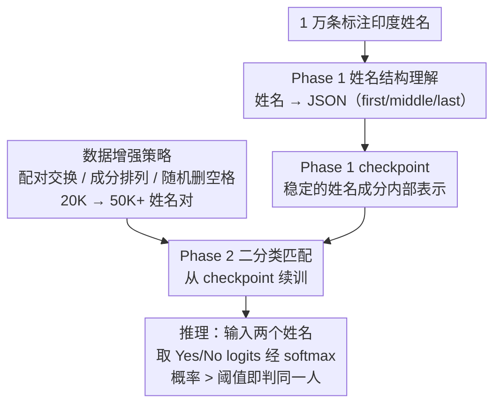

<!-- 由 src/gen_stubs.py 自动生成 -->
# Structure-Guided Entity Resolution: Fine-Tuning LLMs for Robust Name Matching in Complex Linguistic Contexts

**会议**: ACL2026
**arXiv**: [2605.23597](https://arxiv.org/abs/2605.23597)
**代码**: 待确认
**领域**: multilingual_mt
**关键词**: 实体解析, 姓名匹配, 课程学习, KYC, LoRA 微调, 多语言

## 一句话总结

SGER 提出两阶段课程学习框架微调 Llama 3 8B 进行人名实体匹配：Phase 1 训练模型解析姓名结构（输出 JSON），Phase 2 从 Phase 1 checkpoint 训练二分类匹配器，在 5 万对印度 KYC 数据上达到 99.02% 准确率和 0.994 F1，已在 Dream11（2.5 亿用户）生产环境部署。

## 研究背景与动机

人名匹配是实体解析的核心任务，在 KYC/AML 合规场景中直接影响运营和监管。在印度这一全球语言最多样化的环境中，挑战尤为突出：命名惯例因地区和社区不同而异、多脚本转写不一致（Devanagari→Latin）、数据录入错误（OCR 融合 token、丢失空格）、敬语后缀不一致等。传统方法（编辑距离、Jaro-Winkler、语音编码）难以应对这些结构化变异，而直接微调 LLM 做二分类会迫使模型同时学习姓名结构和决策边界，性能受限。

## 方法详解

### 整体框架

SGER 对 Llama 3 8B 进行两阶段课程学习微调：Phase 1 教模型理解姓名内部语法结构，Phase 2 在 Phase 1 checkpoint 基础上训练二分类实体匹配。数据增强策略把 20K 姓名对扩展到 50K+ 喂给 Phase 2 训练。推理时输入两个姓名字符串，输出 "Yes" 或 "No"。

### 关键设计

1. **Phase 1 - 姓名结构理解**：将单个姓名字符串映射为 JSON 对象（`first_name`、`middle_name`、`last_name`）。使用约 10,000 个人工标注的印度姓名训练，涵盖多区域、多语言、多文化命名模式。LoRA SFT 微调，建立稳定的姓名成分内部表示。
2. **Phase 2 - 二分类匹配**：从 Phase 1 checkpoint 继续，用标注的姓名对训练二分类器。推理时提取 "Yes"/"No" token 的 logits，经 softmax 得到匹配概率，超过阈值即判定为同一人。
3. **数据增强策略**（受 CV 增强启发）：(a) **配对交换**（类比镜像翻转）——保证顺序不变性；(b) **成分排列**（类比几何变换）——排列 first/middle/last 生成结构变体；(c) **随机空格删除**（类比噪声注入）——模拟数据录入错误。将 20K 对扩展到 50K+。

### 损失函数/训练策略

两阶段均使用 LoRA（rank=4, alpha=8）+ 混合精度（fp16）SFT。早停基于验证集 F1。单张 A100 80GB GPU 训练。

## 实验关键数据

### 主实验

在 50,000 对独立测试集上的对比（严格保证姓名级不交叉）：

| 方法 | Accuracy | Precision | Recall | F1 |
|---|---|---|---|---|
| Levenshtein (Th=0.8) | 57.4% | 75.1% | 70.2% | 0.726 |
| BERT (Fine-Tuned) | 69.1% | 81.2% | 80.1% | 0.806 |
| GPT-4o (Few-Shot) | 85.4% | 90.1% | 92.1% | 0.911 |
| LLM SFT (Llama 3 8B) | 91.2% | 93.3% | 95.9% | 0.946 |
| LLM SFT + Aug. | 95.7% | 97.6% | 97.0% | 0.973 |
| **SGER (Ours)** | **99.02%** | **99.95%** | **98.9%** | **0.994** |

### 消融实验

- **数据增强效果**：从原始 20K 对扩展到 50K+，F1 从 0.946 提升至 0.973。
- **课程学习效果**：在增强数据基础上加入 Phase 1 结构预训练，F1 从 0.973 提升至 0.994。两者互补。
- **错误分析**：主要失败模式为 (1) 模糊语音（"Saurabh" vs. "Sorab"）；(2) 复合错误（空格缺失 + 顺序颠倒 + OCR 损坏同时出现）。

### 关键发现

- 课程学习在多重扰动组合的困难样本上改进最大——Phase 1 稳定了姓名成分的内部表示。
- 生产部署：3× NVIDIA L4 GPU，vLLM 推理框架，10K RPM，P99 延迟 120ms。
- 商业影响：消除人工审核流程，年节省超 $500K 运营成本。

## 亮点与洞察

- **课程学习拆解结构与决策**：将隐式的"姓名语法"显式化为预训练任务，再做下游匹配——简单但非常有效的设计思路。
- **CV 增强思想迁移到 NLP**：将图像领域的镜像/旋转/噪声注入类比到姓名的顺序交换/成分排列/空格删除。
- **工业落地完整性**：从数据增强、两阶段训练、部署架构到商业影响的端到端闭环。

## 局限与展望

- 仅在印度 KYC 数据上验证，其他多语言环境（阿拉伯语、东亚姓名）的迁移性未测试。
- Phase 1 的 JSON 模式仅支持 first/middle/last 三个字段，可能无法覆盖所有文化的姓名结构。
- 依赖 LoRA 微调 Llama 3 8B，更小或更大模型的效果有待探索。

## 相关工作与启发

- **Peeters & Bizer (2023)**：LLM 用于实体匹配的全景综述。
- **Steiner et al. (2024)**：证明微调对 ER 高效，本文进一步引入课程学习。
- **课程学习**（Feng et al., 2023; Soviany et al., 2022）：本文首次在姓名实体解析中验证两阶段课程学习的有效性。

## 评分

| 维度 | 分数 (1-10) |
|---|---|
| 创新性 | 6 |
| 实用性 | 10 |
| 清晰度 | 9 |
| 实验充分度 | 7 |

## 评分
- 新颖性: 待评
- 实验充分度: 待评
- 写作质量: 待评
- 价值: 待评

<!-- RELATED:START -->

## 相关论文

- [\[ACL 2026\] Multilingual Language Models Encode Script Over Linguistic Structure](multilingual_language_models_encode_script_over_linguistic_structure.md)
- [\[ACL 2026\] Exploring Two-Phase Continual Instruction Fine-tuning for Multilingual Adaptation in Large Language Models](exploring_continual_fine-tuning_for_enhancing_language_ability_in_large_language.md)
- [\[ICML 2026\] Toward Robust Multilingual Adaptation of LLMs for Low-Resource Languages](../../ICML2026/multilingual_mt/toward_robust_multilingual_adaptation_of_llms_for_low-resource_languages.md)
- [\[ICLR 2026\] SASFT: Sparse Autoencoder-guided Supervised Finetuning to Mitigate Unexpected Code-Switching in LLMs](../../ICLR2026/multilingual_mt/sasft_sparse_autoencoder-guided_supervised_finetuning_to_mitigate_unexpected_cod.md)
- [\[ACL 2025\] CC-Tuning: A Cross-Lingual Connection Mechanism for Improving Joint Multilingual Supervised Fine-Tuning](../../ACL2025/multilingual_mt/cc-tuning_a_cross-lingual_connection_mechanism_for_improving_joint_multilingual_.md)

<!-- RELATED:END -->
