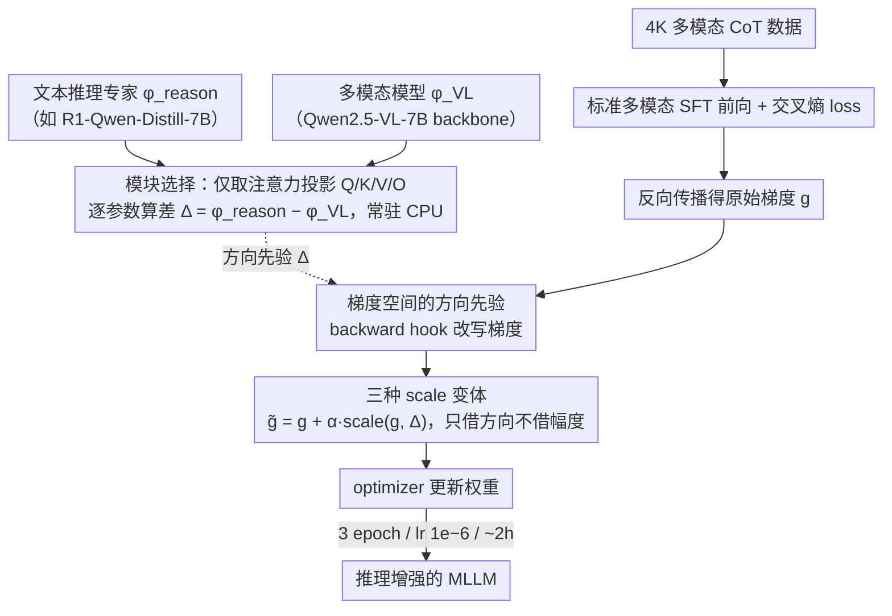

# DRIFT: Transferring Reasoning Priors for Efficient MLLM Fine-Tuning

**会议**: ACL 2026  
**arXiv**: [2510.15050](https://arxiv.org/abs/2510.15050)  
**代码**: https://wikichao.github.io/DRIFT/ （Project Page，有）  
**领域**: 多模态 VLM / 微调 / 推理迁移  
**关键词**: MLLM、推理迁移、梯度先验、SFT、模型合并

## 一句话总结
DRIFT 把"文本推理专家与多模态模型的参数差"当成方向先验，在多模态 SFT 反向传播时只对梯度做轻量偏置（不动权重），用 4K 多模态 CoT 数据、约 2 小时训练就能把 Qwen2.5-VL-7B 在 MathVista/MathVerse/WeMath 等基准上稳定推过参数合并基线和重型 SFT/RL 方法。

## 研究背景与动机

**领域现状**：当前提升 MLLM 推理能力的主流路线是两条——大规模多模态 CoT SFT（如 R1-OneVision、OpenVLThinker）或在多模态上跑 RL（如 R1-VL），都依赖昂贵的多模态推理数据 + 多日训练；与此同时，纯文本推理模型（DeepSeek-R1-Distill 系列、Qwen-Math 等）因为 CoT 文本数据充裕已经很容易得到。

**现有痛点**：MLLM 普遍"看得清但推不动"——感知 OK，多步推理跑偏；而文本推理专家虽强却没有视觉。把两者参数级合并（BR2V、Task Arithmetic、TIES、DARE、Layer Swap）看似免费午餐，但作者在 Tab.1 用四个 backbone 实测发现：在 LLaMA/Mistral 系（参数空间相对接近）有 +1~2 点小幅收益，但在 Qwen 系（Qwen2-VL、Qwen2.5-VL）参数空间分布偏移大，合并反而掉点（Qwen2.5-VL+R1 在 MathVerse 直接 −8.2）。

**核心矛盾**：参数空间合并的成败完全取决于两个 expert 在 backbone 上的分布对齐程度——一旦 magnitude/direction 偏离过大，线性插值就会破坏多模态对齐、引发不稳定甚至梯度爆炸；而学一个最优插值系数 $\beta$ 又要把所有候选模型同时塞进显存，开销极大。

**本文目标**：找到一种既不要堆多模态 CoT、又能稳定从文本推理专家"借"能力到 MLLM 的轻量机制。

**切入角度**：作者的关键观察是——expert 与 base 之间的参数差本质上编码了"领域知识方向"，与其在权重空间直接插值（会破坏对齐），不如把这个方向先验注入到 SFT 的**梯度**里，让优化轨迹被"温柔地拉向"推理方向，而不是把参数硬掰过去。

**核心 idea**：把 $\Delta = \phi_{\text{reason}} - \phi_{\text{VL}}$ 作为方向先验，在反向传播时通过 $\tilde{g} = g + \alpha \cdot \text{scale}(g, \Delta)$ 偏置梯度——既保留标准 SFT pipeline，又能稳定把文本推理能力迁到多模态。

## 方法详解

### 整体框架
DRIFT 把"推理注入"嵌进标准多模态 SFT 的反向传播里，整套流程分三阶段：

1. **离线计算推理先验**：取同一 base LLM 派生出来的文本推理专家 $\phi_{\text{reason}}$（如 DeepSeek-R1-Qwen-Distill-7B）和多模态变体 $\phi_{\text{VL}}$（如 Qwen2.5-VL-7B 的 LLM backbone），按层、按模块逐参数算差 $\Delta = \phi_{\text{reason}} - \phi_{\text{VL}}$。$\Delta$ 只在选定的"推理相关"模块上保留（默认 ATTN 投影 Q/K/V/O，可选 MLP/Norm/LM Head），算完后**整体存到 CPU**，按需搬上 GPU。
2. **常规多模态 SFT 前向**：用 4K 高质量多模态 CoT 数据（基于 ThinkLiteVL-11K 蒸馏 + 过滤错误答案，CoT 用 `<think></think>` 包裹）训练 Qwen2.5-VL-7B-Instruct，前向、loss、autograd 全部不改。
3. **梯度钩子里注入方向先验**：在 `backward()` 注册 hook，对每个被选中的参数 $w$，把原始梯度 $g$ 改写成引导后梯度 $\tilde{g} = g + \alpha \cdot \text{scale}(g, \Delta)$，再交给 optimizer 更新。整个训练 3 epoch、学习率 $1\times 10^{-6}$、$\alpha=-1$，约 2 小时跑完。

### 关键设计

**1. 梯度空间的方向先验：把 expert→VL 的参数差当指南针，只用它"拨"梯度方向，不直接改权重**

参数级合并之所以在 Qwen 系大幅掉点，根因是它"一步跨过去"——原始 BR2V 做 $\phi_{\text{VL}\oplus\text{reason}} = \phi_{\text{base}} + \beta(\phi_{\text{VL}}-\phi_{\text{base}}) + (1-\beta)(\phi_{\text{reason}}-\phi_{\text{base}})$，对插值系数 $\beta$ 极度敏感，分布偏移一大线性插值就把多模态对齐打碎了。DRIFT 把同一个 $\Delta$ 从权重空间挪到梯度空间：在 SFT 的每一步对被选模块的梯度做 $\tilde{g} = g + \alpha \cdot \text{scale}(g, \Delta)$，让权重仍从 $\phi_{\text{VL}}$ 出发、由多模态 loss 主导，只被 $\Delta$ 温柔地拉偏一点。这样"每步偏一点"取代了"一步跨过去"，再配上 multimodal CoT 数据天然耦合感知与推理，既绕开了 $\beta$ 调参，也不会破坏视觉对齐。

**2. 三种 scale 变体：只借 $\Delta$ 的方向、不借它的幅度，才是稳的关键**

如果直接把 $\Delta$ 的绝对幅度加进梯度，就等于把权重硬拉向 reasoning expert。作者对比了三档公式来验证这一点：(i) Absolute $\tilde{g} = g + \alpha \Delta$ 直接相加；(ii) Grad-Norm $\tilde{g} = g + \alpha \|g\| \frac{\Delta}{\|\Delta\|}$ 只取 $\Delta$ 方向、保留 $g$ 的模长；(iii) Grad-Norm w/ Adaptive $\alpha$ 在前者基础上令 $\alpha' = \alpha \cdot \frac{1 + \cos(g, \Delta)}{2}$，当梯度与先验同向时多推、反向时少推。实测 Absolute 在 MathVista 掉 3、LogicVista 崩 19.7，印证"绝对幅度"会破坏多模态对齐；Grad-Norm 让强度跟随当前梯度尺度，稳；Adaptive $\alpha$ 再按方向一致性自适应，最稳——三档对比直接坐实了"只借方向、不借幅度"这条核心判断。

**3. 模块选择：只在注意力投影上注入最稳**

$\Delta$ 注到哪些子模块同样影响成败。作者在 ATTN(Q/K/V/O)、MLP、Norm、LM Head 上分别消融，结果只挑 {ATTN} 时最稳（LogicVista +3.8、MathVerse +2.4），一旦加上 MLP 反而拉低、加 Norm 引噪、扩到 LM Head 收益就不稳了。原因在于注意力投影是 token 之间"决定看谁"的核心，承载着推理链所需的长程依赖路由；MLP 更像"局部知识检索"，跨域差异大、噪声多；Norm 参数对尺度敏感，最容易把训练带跑偏。所以默认只在注意力投影上注入推理先验，把迁移目标对准了推理真正藏身的地方。

### 损失函数 / 训练策略
- **训练目标**：标准多模态 SFT 交叉熵 loss，不引入辅助 loss、不引入新参数。
- **数据**：4K 多模态 CoT（ThinkLiteVL-11K → ThinkLite distill CoT → 过滤错答 → `<think></think>` 包裹）。
- **优化**：3 epochs，lr $1\times10^{-6}$，$\alpha=-1$（即 $g$ 沿 $-\Delta$ 方向小偏，因为 $\Delta = \phi_{\text{reason}} - \phi_{\text{VL}}$，让 weight update 朝着 reason expert 移）。
- **工程**：基于 LLaMAFactory，$\Delta$ CPU 常驻 + 按需 GPU 搬运，仅修改反向传播 hook，零额外可训参数。

## 实验关键数据

### 主实验

DeepSeek-R1-Qwen-Distill-7B → Qwen2.5-VL-7B-Instruct，对比 5 种参数合并和 4 种 reasoning SFT 方法（Tab.2 + Tab.3 综合）：

| 方法 | MathVista | MathVision | MathVerse | WeMath-strict | LogicVista | 平均 |
|------|-----------|-----------|-----------|---------------|-----------|------|
| Qwen2.5-VL-7B (baseline) | 67.9 | 25.0 | 41.4 | 34.3 | 46.7 | 44.7 |
| Task Arithmetic | 65.8 (−2.1) | 22.7 (−2.3) | 33.2 (−8.2) | 30.1 (−4.2) | 42.0 (−4.7) | 40.8 |
| TIES | 63.6 | 23.1 | 39.5 | 33.4 | 42.1 | 42.2 |
| DARE-TIES | 66.3 | 23.6 | 38.3 | 33.7 | 42.0 | 42.8 |
| Layer Swap | 63.6 | 22.9 | 37.9 | 32.1 | 35.1 | 40.3 |
| Pure SFT (4K) | 68.7 | 25.1 | 42.0 | 33.3 | 45.6 | — |
| **DRIFT (Ours)** | **69.9 (+2.0)** | **26.6 (+1.6)** | **43.9 (+2.5)** | **38.5 (+4.2)** | **47.2 (+0.5)** | **47.7 (+3.0)** |

DRIFT 是唯一一个让所有 5 个 benchmark 都涨点的方法，相比训练重得多的 OpenVLThinker / R1-OneVision / X-Reasoner 平均分还略高，而训练数据只有 4K、训练时长 ~2h。

### 消融实验

Tab.4 的 scale 策略 × merge 模块组合（SFT baseline: MathVista 68.7 / MathVerse 42.0 / LogicVista 45.6）：

| 配置 | MathVista | MathVerse | LogicVista | 说明 |
|------|-----------|-----------|-----------|------|
| Absolute @ {ATTN, MLP} | 65.7 (−3.0) | 39.5 (−2.5) | 25.9 (**−19.7**) | 直接拉权重，破坏对齐 |
| Grad-Norm @ {ATTN, MLP} | 68.8 (+0.1) | 43.9 (+1.9) | 46.1 (+0.5) | 稳定 |
| Grad-Norm + Adaptive $\alpha$ @ {ATTN, MLP} | 69.9 (+1.2) | 43.9 (+1.9) | 47.2 (+1.6) | **完整模型** |
| Grad-Norm @ {ATTN only} | 68.8 | 44.4 (+2.4) | **49.4 (+3.8)** | MathVerse/LogicVista 最佳 |
| Grad-Norm @ {MLP only} | 68.5 (−0.5) | 42.6 (+0.6) | 46.3 (+0.7) | 收益最小 |
| Grad-Norm @ {ATTN, MLP, Norm} | 68.6 (−0.1) | 43.0 (+1.0) | 46.8 (+1.2) | 加 Norm 反而稀释 |

### 关键发现
- **方向 vs 幅度**：Absolute 在 LogicVista 上崩掉 19.7 个点，说明把权重拉过去会直接打碎多模态对齐；Grad-Norm 只借方向是稳的；Adaptive $\alpha$ 进一步利用 $\cos(g, \Delta)$，让"同向时多推、反向时少推"，是最 robust 的策略。
- **模块敏感性**：ATTN 投影是推理迁移的最佳载体，单独注入 ATTN 比"ATTN+MLP+Norm+LMHead"全注入还稳，说明推理能力更多藏在"注意力路由"而非"FFN 知识存储"里。
- **不伤感知**：Tab.6 显示 DRIFT 在 HallusionBench/RealWorldQA/MMStar 上保住或略升（RWQA 68.6→69.2，MMStar 64.7→65.6），而 Pure SFT 在 RWQA/MMStar 上分别掉 1.83 / 1.90 点——证明梯度级注入对原始视觉能力是"无损"的。
- **跨家族泛化**：Tab.5 把 DRIFT 换到 LLaVA-Next-8B + DART、Qwen2.5-VL + Qwen2.5-Math 等组合，均稳定优于 SFT，说明方法不绑死 R1 家族。

## 亮点与洞察
- **从"权重空间合并"到"梯度空间注入"是一次干净的视角转换**：抓住了参数合并失败的根因——"一步跨过去"会破坏 manifold——改成"每一步沿方向偏一点"既绕开 $\beta$ 调参，也不需要把多个 model 同时塞进显存。
- **$\Delta$ CPU 常驻 + 反向 hook 注入**：把"合并"这件事完全外挂在 SFT 后向通路上，不动 forward、不动 loss、不动可训参数，工程上即插即用，复现门槛极低。
- **Adaptive $\alpha = \alpha \cdot \frac{1+\cos(g,\Delta)}{2}$ 的小公式很巧**：把"先验"和"当前任务梯度"的几何关系直接量化成强度调制，避免在反向方向上硬推，这个 trick 可以迁移到任何"先验向量+梯度"的场景（如 task vector 蒸馏、Continual Learning 中的 anti-forgetting 梯度）。
- **"注意力投影最承载推理"的实证结论**有独立价值：可以指导后续 LoRA / DoRA / 选择性微调的 target_modules 选择。

## 局限与展望
- **只验证了数学推理**：所有 main benchmark 都是 MathVista/MathVerse/MathVision/WeMath/LogicVista 系，是否在多模态科学推理、code、agentic planning 上仍然有效未知。
- **依赖"同 base LLM 派生"的 expert/VL 对**：作者反复强调要从同一个 base 派生（Qwen2.5-VL 来自 Qwen2.5），如果两者 backbone 不同源（如把 LLaVA 配 DeepSeek），$\Delta$ 含义就不再干净。
- **$\alpha=-1$ 是经验值**：没有给出 $\alpha$ 的扫描曲线，跨 backbone 时是否要重新调 $\alpha$ 不确定；尤其 Adaptive 已经动态了，$\alpha$ 的全局符号/尺度仍需手工。
- **未对比 RL 路线**：表里只比了 SFT/merge，没有直接和 GRPO/RLOO 等 RL post-training 头对头，结论"DRIFT 匹敌训练重方法"主要是基于 X-Reasoner / R1-OneVision 这条 SFT 强基线。
- **改进方向**：把 $\Delta$ 升级成多 expert 加权（reasoning + code + tool-use），或者把方向先验沿训练 schedule 衰减（早期猛、后期弱），都是顺理成章的扩展。

## 相关工作与启发
- **vs BR2V (Chen et al. 2025a)**：BR2V 在权重空间做 $\phi_{\text{base}} + \beta(\phi_{\text{VL}}-\phi_{\text{base}}) + (1-\beta)(\phi_{\text{reason}}-\phi_{\text{base}})$，对 Qwen 系大幅掉点；DRIFT 把同一个 $\Delta$ 移到梯度空间，并通过 Adaptive 缩放避免硬合并的不稳定。
- **vs Task Arithmetic / TIES / DARE / Layer Swap**：这些都属于"训练后一次性算式合并"，对参数分布偏移敏感；DRIFT 是"在 SFT 过程中持续小步偏"，因此能容忍较大 $\Delta$ magnitude，是更鲁棒的替代。
- **vs LoRA / DoRA**：LoRA 引入新可训参数学增量，DRIFT 不引入任何新参数、只改梯度方向；二者可以正交组合（在 LoRA 子空间上用 DRIFT $\Delta$）。
- **vs R1-OneVision / OpenVLThinker / X-Reasoner**：这些方法堆 59K+ 多模态 CoT 数据 + 多日 RL/SFT 才能涨点；DRIFT 用 4K 数据、2 小时 SFT 在平均分上反超，说明"先验注入"在低资源 reasoning transfer 上是值得继续挖的方向。
- **启发**：把"预训练好的另一个 expert"当成方向先验来指导当前模型的优化轨迹，这个范式可以推广到：(i) 跨语言迁移（英文 → 小语种）、(ii) 跨模态迁移（音频→视觉）、(iii) Continual Learning 的反遗忘（旧任务 expert 作 $\Delta$ 防漂移）。

## 评分
- 新颖性: ⭐⭐⭐⭐ 把模型合并从权重空间搬到梯度空间是一个清晰且未被广泛探索的角度。
- 实验充分度: ⭐⭐⭐⭐ 主表 + 多组消融 + 跨 backbone + 感知不伤 + 与 training-heavy 方法对比，覆盖到位；缺 RL 对比和 $\alpha$ 扫描。
- 写作质量: ⭐⭐⭐⭐ Tab.1 的"merge 失败案例"引子非常有说服力，Method 三档 scale 公式清楚利落。
- 价值: ⭐⭐⭐⭐ 低资源 reasoning transfer 范式，工程开销小、和已有 SFT pipeline 兼容，社区可立刻用。

<!-- RELATED:START -->

## 相关论文

- [\[NeurIPS 2025\] Guiding Cross-Modal Representations with MLLM Priors via Preference Alignment](../../NeurIPS2025/multimodal_vlm/guiding_cross-modal_representations_with_mllm_priors_via_preference_alignment.md)
- [\[NeurIPS 2025\] FOCUS: Internal MLLM Representations for Efficient Fine-Grained Visual Question Answering](../../NeurIPS2025/multimodal_vlm/focus_internal_mllm_representations_for_efficient_fine-grained_visual_question_a.md)
- [\[NeurIPS 2025\] Advancing Compositional Awareness in CLIP with Efficient Fine-Tuning](../../NeurIPS2025/multimodal_vlm/advancing_compositional_awareness_in_clip_with_efficient_fin.md)
- [\[ACL 2026\] Enhancing Multimodal Large Language Models for Ancient Chinese Character Evolution Analysis via Glyph-Driven Fine-Tuning](enhancing_multimodal_large_language_models_for_ancient_chinese_character_evoluti.md)
- [\[ACL 2026\] Forest Before Trees: Latent Superposition for Efficient Visual Reasoning](forest_before_trees_latent_superposition_for_efficient_visual_reasoning.md)

<!-- RELATED:END -->
