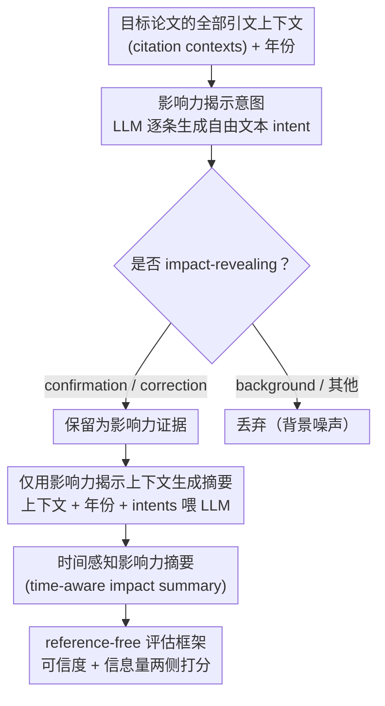

# In-depth Research Impact Summarization through Fine-Grained Temporal Citation Analysis

**会议**: ACL2026  
**arXiv**: [2505.14838](https://arxiv.org/abs/2505.14838)  
**代码**: https://ukplab.github.io/acl2026-generating-impact-summaries  
**领域**: 科学文献分析 / 文本生成  
**关键词**: 科研影响力摘要, 引文意图, 时间感知摘要, citation context, LLM 评估  

## 一句话总结
这篇论文提出“科研影响力摘要”任务：先从论文的引文上下文中识别真正揭示影响的细粒度意图，再生成随时间演化的影响力叙事，比单纯引用数更能说明一篇论文如何被后续工作采用、批评和改造。

## 研究背景与动机
**领域现状**：科研影响力通常用引用数、h-index 或类似计量指标衡量；在 NLP 和 scientometrics 中，也有大量工作做 citation intent classification，用粗粒度标签说明某个引用是背景、方法、结果还是动机。

**现有痛点**：引用数只告诉我们“被引用了多少次”，不告诉我们“为什么被引用”。同样是 200 次引用，一篇论文可能主要作为方法被复用，另一篇可能主要被批评其局限，还有一篇只是被当作背景介绍。已有引文意图分类又多停留在单条 citation context 层面，很少把大量引文聚合成一段可读的影响力叙事。

**核心矛盾**：真正的科学影响同时包含 confirmation 和 correction。后续论文既可能沿用一个方法，也可能指出缺陷并提出修正；如果只统计正面采用或只看粗标签，就会漏掉科学进步中“批评、修正、再发现”的轨迹。

**本文目标**：作者希望从一个目标论文的所有 citation contexts 中筛出 impact-revealing contexts，识别它们的细粒度引用原因和年份，再生成一个 time-aware impact summary，描述这篇论文在不同阶段如何影响后续研究。

**切入角度**：论文没有直接让 LLM 根据题名和引用数自由发挥，而是把任务拆成两步：第一步用 in-context learning 生成自由文本形式的细粒度 citation intent，并判断是否 impact-revealing；第二步只把筛出的 impact-revealing contexts、年份和 intents 提供给 LLM 生成摘要。

**核心 idea**：用“细粒度引文意图 + 时间信息”作为结构化中间层，把科研影响力从静态数字变成可验证、可读、可比较的历史叙事。

## 方法详解

### 整体框架
论文先把四个概念定义清楚：citation context 是引用某篇论文时周围的文本，fine-grained citation intent 是对引用原因的自由文本描述，impact-revealing intent 特指直接体现被引论文影响的意图（分 confirmation 和 critique/correction 两类），scientific impact summary 则是在时间维度上描述一篇论文如何被后续工作使用、扩展、批评或修正。整条 pipeline 走"先筛证据、再写摘要、最后无参考评估"三步：输入目标论文的一组 citation contexts 及其年份，系统逐条生成细粒度 intent 并判定是否 impact-revealing，只把筛出的有影响力信号的 context 连同年份、intent 一起喂给 LLM 生成 semi-structured impact summary，由于没有 gold summary，再用一套 reference-free 指标衡量摘要的可信度与信息量。

### 关键设计

**1. Impact-revealing citation intent 作为中间表示：把"为什么被引"从粗标签升级成自由文本证据**

科研影响力往往藏在具体使用方式里——固定的 citation intent taxonomy 过粗，引用数又只数次数，都丢掉了"后续工作究竟怎么用这篇论文"的语义。作者因此让 LLM 对每条 citation context 同时输出一段自由文本 intent，再判定它属于 confirmation、correction 还是 other，例如"use of minimization methodology"算 impact-revealing，而"background about NER methods"不算。为支撑这个新任务，作者构造了一个 4K citation context 数据集：从 PST-Bench 取 1K 原有正例，用 confirmation/correction 相关模式从 S2AG 再筛 1K impact-revealing contexts，最后补 2K non-impact-revealing examples，随机抽样人工检查显示 90% 标签正确。自由文本 intent 既保留了细粒度语义，又成了后续摘要生成可以直接引用的"证据标签"，降低 LLM 凭空编故事的风险。

**2. 只用 impact-revealing contexts 生成摘要：把背景噪声挡在生成之外**

一篇高被引论文的 citation contexts 里，大量是 incidental 的背景提及；如果把它们全塞进 prompt，长上下文非但不增益，反而会诱导 LLM 把"被顺带提了一句"误写成"产生了重大影响"。作者据此设计了第二阶段：先按第一阶段结果过滤，只保留 impact-revealing citations，连同年份和生成出的 intents 交给 LLM，prompt 要求模型按时间段概括影响轨迹（如早期被某类方法采用、中期暴露局限、后期被新方法重新利用）。为验证这一选择，作者横向比较了无 citation、全部 citation、全部 citation + intents、仅 impact-revealing citation、仅 impact-revealing + intents 等输入设置，结果"仅 impact-revealing + intents"在多数指标上最优。

**3. 面向新任务的 reference-free 评估框架：在没有标准答案时同时考"可信"和"有料"**

这个任务没有 gold impact summary，传统 ROUGE 无从下手，作者于是把评估拆成 trustworthiness 与 informativeness 两侧。trustworthiness 侧含 faithfulness、coverage、citation year compliance：faithfulness 会把摘要拆成不同时间段的 impact descriptions，要求 evaluator LLM 逐段检查它们能否被同一时期的 citation contexts 支撑；coverage 衡量摘要覆盖了多少 impact intents。informativeness 侧含 insightfulness、trend awareness、specificity，采用 G-Eval 式 LLM-as-a-judge 打分，评估摘要是否真正捕捉到时间变化和具体影响，而不是泛泛复述。这套指标合起来既防"无证据的编造"，又防"有证据但空洞"。

### 损失函数 / 训练策略
本文不训练新模型，而是以 prompt-based LLM pipeline 为主。intent classification 用 GPT-4o-mini 做 ICL，比较时采用 $K=50$ 的 shots；每个测试样本运行 3 次按多数投票分类，三次完全一致率为 72%。summary generation 与自动评价主要用 GPT-4o，附录另用 Qwen-2.5-72B 和 Gemini-2.5-flash 检查跨模型鲁棒性。人工研究邀请 9 位大学教授评估自己论文的影响力摘要。

## 实验关键数据

### 主实验
| 任务 | 方法 | Precision | Recall | F1 | Accuracy |
|------|------|-----------|--------|----|----------|
| Impact-revealing 分类 | random baseline | 0.54 | 0.51 | 0.52 | 0.50 |
| Impact-revealing 分类 | always-impact-revealing | 0.53 | 1.00 | 0.69 | 0.53 |
| Impact-revealing 分类 | Structural Scaffolds | 0.55 | 0.44 | 0.49 | 0.51 |
| Impact-revealing 分类 | Meaningful Citations | 0.72 | 0.46 | 0.56 | 0.62 |
| Impact-revealing 分类 | Multi-cite | 0.59 | 0.41 | 0.48 | 0.53 |
| Impact-revealing 分类 | Ours | 0.74 | 0.65 | 0.69 | 0.69 |

作者的方法在 precision、recall、F1 和 accuracy 上整体最好，尤其 recall 比第二强的已有方法高 19 个百分点。对生成 impact summary 来说，高 recall 很重要，因为漏掉有影响力的 citation 会直接让摘要少写关键影响轨迹。

### 消融实验
| 摘要输入 | 是否提供 intents | Faithfulness | Coverage | Coverage@3 | Citation Year Compliance | Insightfulness | Trend Awareness | Specificity |
|----------|------------------|--------------|----------|------------|--------------------------|----------------|-----------------|-------------|
| 无 citations | 否 | 0.77 | 0.25 | 0.58 | n/a | 0.70 | 0.94 | 0.75 |
| 全部 citations | 否 | 0.83 | 0.32 | 0.74 | 0.55 | 0.80 | 0.95 | 0.85 |
| 全部 citations | 是 | 0.84 | 0.32 | 0.73 | 0.48 | 0.80 | 0.97 | 0.86 |
| 仅 impact-revealing citations | 否 | 0.87 | 0.33 | 0.73 | 0.59 | 0.80 | 0.96 | 0.87 |
| 仅 impact-revealing citations | 是 | 0.88 | 0.34 | 0.75 | 0.56 | 0.83 | 0.98 | 0.88 |

### 关键发现
- 细分 confirmatory 和 correction citations 后，本文方法的 F1 分别为 0.88 和 0.98，明显强于已有 intent classifier，说明它尤其擅长识别“指出局限并改进”的影响信号。
- 最佳摘要输入是 impact-revealing citations + intents，在 faithfulness、coverage、Coverage@3、insightfulness、trend awareness 和 specificity 上都达到最高或并列最高。
- 教授人工评估中，本文摘要相较无知识 baseline 在 relevance 上被选择 63%，在 insightfulness 上被选择 75%。约 60% 教授认为摘要细节合适且提供了不易获得的新洞察；对于 impact-revealing citations 位于 top 10% 的论文，该比例升至 75%。

## 亮点与洞察
- 这篇论文最大的亮点是重新定义“影响力”：影响不是引用次数，而是后续工作如何使用、扩展、质疑和修正原论文。这个视角比 bibliometrics 更适合研究者快速判断一篇论文的真实历史作用。
- 自由文本 intent 很有价值。它避免了 coarse taxonomy 的信息损失，也让摘要生成获得了接近“证据标签”的中间层，降低 LLM 直接编故事的风险。
- 评价框架本身也可复用。faithfulness、coverage、year compliance 和 trend awareness 的组合，可以迁移到综述生成、related work 写作、科研脉络分析等任务。

## 局限与展望
- 作者只处理英文论文；跨语言 citation contexts 和不同学科的写作习惯会影响 intent 表达，中文、德文或多语种科研影响力摘要仍需单独验证。
- 人类评估规模受限，只邀请了 9 位教授。虽然专家评估质量高，但样本池小，且作者本人可能只熟悉合作论文的一部分影响。
- 最佳设置的 full coverage 只有 0.34，citation year compliance 也只有 0.56 到 0.59 左右，说明 LLM 仍会漏掉长尾影响主题，也会被 citation context 中的其他年份数字干扰。
- 论文主要测试 GPT-4o 系列，虽然附录补充 Qwen 和 Gemini，但系统性模型比较还不够；同一 LLM 用于生成和评价也可能存在任务解释一致性带来的偏差。
- 当前把影响力主要操作化为 confirmation 和 correction，真实科研影响还包括并行发展、标准化、教育传播、跨领域迁移等，未来可以扩展 intent space。

## 相关工作与启发
- **vs citation count / h-index**: 传统计量指标简单可扩展，但无法解释引用原因；本文从 citation context 中提取影响路径，能区分方法复用、局限批评和后续修正。
- **vs citation intent classification**: 既有方法多做单条引用的粗分类；本文把 intent 分类作为中间步骤，最终目标是多文档、时间感知的影响力摘要。
- **vs query-focused scientific summarization**: 普通科学摘要多关注论文内容或 related work；本文的 query 是“这篇论文如何影响后续研究”，输入证据是后续 citation contexts，因此更像科研思想史的自动化草稿。

## 评分
- 新颖性: ⭐⭐⭐⭐⭐ 任务定义很新，把引文意图、时间线和影响力摘要组合成了清晰的新问题。
- 实验充分度: ⭐⭐⭐⭐☆ 自动评估、消融、专家评估和跨模型补充都比较完整，但人类评估规模和 coverage 仍有限。
- 写作质量: ⭐⭐⭐⭐☆ 论文结构清楚，定义和评价指标讲得细；部分长表格信息密度较高，需要读者耐心对齐。
- 价值: ⭐⭐⭐⭐⭐ 对文献调研、学术评价、综述写作和研究脉络分析都很实用，尤其适合和论文检索系统结合。

<!-- RELATED:START -->

## 相关论文

- [\[AAAI 2026\] AutoMalDesc: Large-Scale Script Analysis for Cyber Threat Research](../../AAAI2026/nlp_generation/automaldesc_large-scale_script_analysis_for_cyber_threat_research.md)
- [\[ACL 2026\] Investigating the Representation of Backchannels and Fillers in Fine-tuned Language Models](investigating_the_representation_of_backchannels_and_fillers_in_fine-tuned_langu.md)
- [\[ACL 2026\] Children's English Reading Story Generation via Supervised Fine-Tuning of Compact LLMs with Controllable Difficulty and Safety](childrens_english_reading_story_generation_via_supervised_fine-tuning_of_compact.md)
- [\[ACL 2025\] Multi-document Summarization through Multi-document Event Relation Graph Reasoning in LLMs](../../ACL2025/nlp_generation/event_graph_bias_mitigation_summarization.md)
- [\[ACL 2026\] ThreadSumm: Summarization of Nested Discourse Threads Using Tree of Thoughts](threadsumm_summarization_of_nested_discourse_threads_using_tree_of_thoughts.md)

<!-- RELATED:END -->
