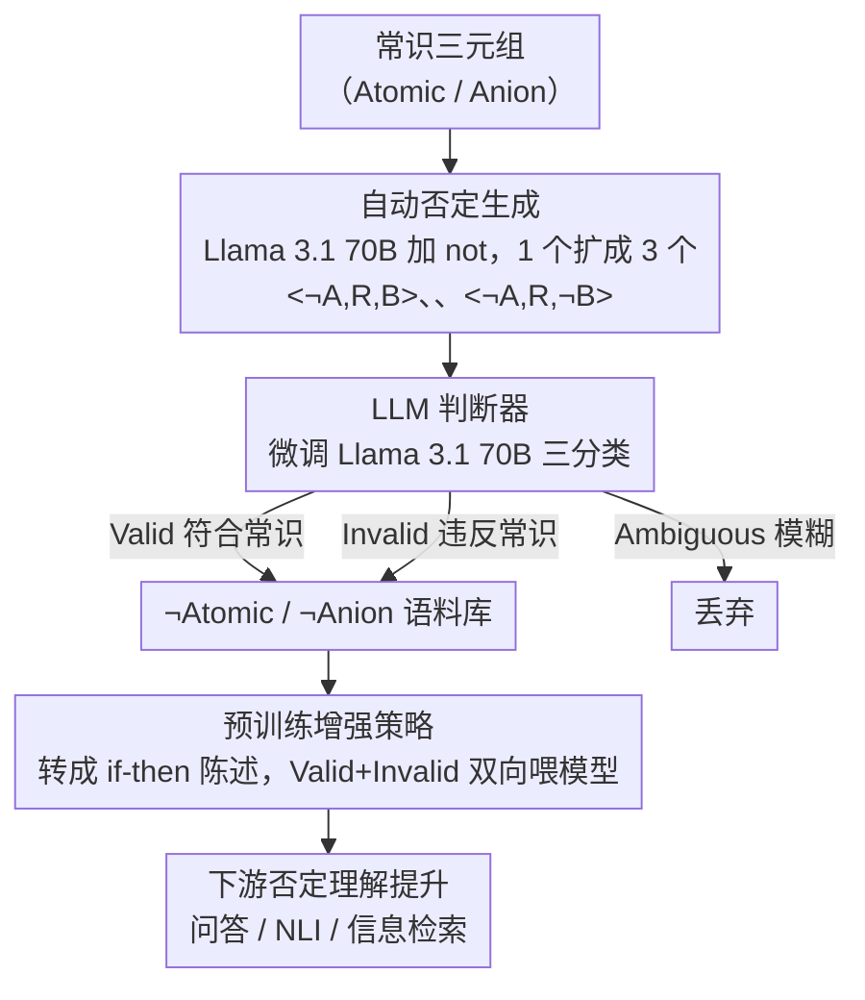

# Commonsense Knowledge with Negation: A Resource to Enhance Negation Understanding

**会议**: ACL 2026  
**arXiv**: [2604.19921](https://arxiv.org/abs/2604.19921)  
**代码**: [https://github.com/wang-zijie/commonsense_with_negation](https://github.com/wang-zijie/commonsense_with_negation)  
**领域**: LLM Pretraining  
**关键词**: 常识知识、否定理解、知识库增强、否定推理、预训练

## 一句话总结

提出自动为现有常识知识库增添否定的方法，构建超过 200 万三元组的否定常识语料库（¬Atomic 和 ¬Anion），并证明在其上预训练可以提升 LLM 的否定理解能力。

## 研究背景与动机

**领域现状**：常识知识已被广泛研究，Atomic、ConceptNet 等大规模常识知识库已被构建，LLM 在各种 NLU 任务上取得了成功。

**现有痛点**：（1）LLM 在涉及否定的自然语言理解任务中表现挣扎，但先前研究仅限于 BERT 等编码器模型和 GPT-3 等早期 LLM；（2）常识知识与否定的交叉领域几乎未被探索；（3）唯一涉及否定的常识知识库 Anion 仅否定 if 事件并需要大量人工标注，未考虑否定 then 事件。

**核心矛盾**：否定出现在约 25% 的英语句子中，是重要的语义特征，但现有常识知识库几乎不包含否定，LLM 对否定的理解能力不足。

**本文目标**：自动化地为现有常识知识库增添否定，构建大规模否定常识语料库，并利用其提升 LLM 的否定理解能力。

**切入角度**：观察到否定 if 事件、then 事件或两者有时会产生仍然符合常识的新三元组，可以将现有语料库扩展至最多 3 倍。

**核心 idea**：通过自动否定常识三元组的 if/then 事件并训练专门的 LLM 判断器来验证有效性，构建包含否定的大规模常识知识语料库，预训练后可提升下游否定理解。

## 方法详解

### 整体框架

给定常识三元组 <A, R, B>，通过在主动词或修饰词前添加 "not" 来否定 if 事件（A）、then 事件（B）或两者，生成三个新三元组 <¬A, R, B>、<A, R, ¬B>、<¬A, R, ¬B>。然后训练 LLM 判断器验证每个新三元组是 Valid（符合常识）、Invalid（违反常识）还是 Ambiguous（模糊），最终用验证后的语料库预训练 LLM。

### 关键设计

**1. 自动否定生成：只加一个 "not"，把知识库扩到 3 倍**

Anion 这类否定常识库的痛点是只否定 if 事件、还得大量人工标注新 then 事件，成本高、覆盖窄。本文索性自动化：用 Llama 3.1 70B 在 if 事件、then 事件或两者的主动词/修饰词前插入 "not"，由一个三元组 <A, R, B> 生成三个新三元组 <¬A, R, B>、<A, R, ¬B>、<¬A, R, ¬B>（例如 <PersonX 努力学习, 因此, PersonX 考得好> 可否定成 <PersonX 不努力学习, 因此, PersonX 考得好>）。这套自动改写无需人工标注、且天然覆盖了 Anion 忽略的 then 事件否定，手动评估 200 个实例确认语法正确率达 99%。

**2. LLM 判断器：自动甄别哪些否定三元组仍符合常识**

否定后的三元组不一定还成立（如否定 then 事件往往直接矛盾），需要一个验证器把 Valid（符合常识）、Invalid（违反常识）、Ambiguous（模糊）分开。作者先测了 GPT-4o、Claude Sonnet 4 等 SOTA 模型，发现它们在这个任务上表现很差（F1 仅 0.52–0.56）——这正是"否定 × 常识"交叉领域几乎无人探索的体现。于是改用有监督微调训练 Llama 3.1 70B 作专门判断器（QLoRA 4-bit 量化），F1 提到 0.63，Valid 精确度 0.70、Invalid 精确度 0.79，足以批量过滤生成结果。

**3. 预训练增强策略：用 Valid + Invalid 双向喂模型学否定语义**

最终目的是提升 LLM 的否定理解，作者把验证后的三元组转成自然语言 if-then 陈述用于预训练，并在问答、NLI、信息检索三个任务的五个下游基准上评估。关键选择是 Valid 和 Invalid 三元组**都**进预训练数据，而非只用 Valid——因为模型要学会否定的语义，既需要"否定后仍成立"的正例，也需要"否定后矛盾"的反例，单看一侧学不到否定如何改变命题真值。

### 损失函数 / 训练策略

使用 QLoRA 4-bit 量化对 Llama 3.1 8B/70B 进行有监督微调训练判断器，训练数据包含 5400 个三元组（每关系每标签 200 个）。预训练阶段将常识三元组转化为自然语言 if-then 陈述。

## 实验关键数据

### 主实验（判断器验证）

| 模型 | 整体 F1 | 整体 Acc | Valid P | Invalid P |
|------|---------|---------|---------|-----------|
| GPT-4o (few-shot) | 0.52 | 0.54 | 0.71 | 0.54 |
| Claude Sonnet 4 (few-shot) | 0.56 | 0.56 | 0.83 | 0.51 |
| Llama 3.1 70B (fine-tuned) | 0.63 | 0.64 | 0.70 | 0.79 |

### 语料库统计

| 语料库 | 三元组总数 | Valid | Invalid | Ambiguous |
|--------|-----------|-------|---------|-----------|
| ¬Atomic | 1,798k | 681k (37.9%) | 463k (25.8%) | 652k (36.3%) |
| ¬Anion | 285k | 104k (36.4%) | 46k (16.1%) | 135k (47.5%) |

### 关键发现
- 否定 then 事件更可能产生 Invalid 三元组（63.6%），而否定 if 事件保留原始 then 事件大多仍 Valid（83.7%）
- 同时否定 if 和 then 事件的三元组分布较为均衡（Valid 48.0%、Invalid 9.1%、Ambiguous 42.9%）
- 即使是 SOTA 的 GPT-4o 和 Claude Sonnet 4 在否定常识判断上也表现有限
- 预训练在否定常识语料库上可提升 LLM 在问答、NLI、信息检索三个下游任务上的否定理解能力

## 亮点与洞察
- 方法极度简洁但有效：仅添加 "not" 就能将常识知识库扩展 3 倍，且无需人工标注新的 then 事件
- 发现了 LLM 的"生成-评估差距"：模型擅长评估但生成时偏离隐私/常识规范，这一发现与 CI 领域的观察一致
- Valid 和 Invalid 三元组都对提升否定理解有贡献，说明模型需要同时接触正例和反例

## 局限与展望
- 自动验证器精度有限（F1 0.63），可能引入噪声标签
- 目前仅在英语上验证，否定在不同语言中的表现差异较大
- 预训练效果可能依赖于基座模型和数据量的匹配
- 未来可探索更复杂的否定形式（如双重否定、隐式否定）

## 相关工作与启发
- **vs Anion**：Anion 仅否定 if 事件并需要人工标注新 then 事件，本文自动否定 if/then/两者，无需人工
- **vs COMET**：COMET 生成新的 then 事件，本文保留原始事件仅添加否定，更可控
- **vs UNcommonsense**：关注罕见/不常见场景的解释，本文关注否定对常识推理的影响

## 评分
- 新颖性: ⭐⭐⭐⭐ 首次系统化地将否定融入常识知识库，思路简洁优雅
- 实验充分度: ⭐⭐⭐⭐ 跨三个任务五个基准评估，判断器训练充分
- 写作质量: ⭐⭐⭐⭐ 动机清晰，方法直观，分析细致
- 价值: ⭐⭐⭐ 资源贡献价值较高，但应用范围相对有限

<!-- RELATED:START -->

## 相关论文

- [\[ACL 2026\] Filling the Gap: Is Commonsense Knowledge Generation useful for Natural Language Inference?](filling_the_gap_is_commonsense_knowledge_generation_useful_for_natural_language_.md)
- [\[ACL 2026\] Creating ConLangs to Probe the Metalinguistic Grammatical Knowledge of LLMs](creating_conlangs_to_probe_the_metalinguistic_grammatical_knowledge_of_llms.md)
- [\[ACL 2026\] Knowledge-driven Augmentation and Retrieval for Integrative Temporal Adaptation](knowledge-driven_augmentation_and_retrieval_for_integrative_temporal_adaptation.md)
- [\[ACL 2025\] Recursive Question Understanding for Complex Question Answering over Heterogeneous Personal Data](../../ACL2025/nlp_understanding/recursive_question_understanding_for_complex_question_answering_over_heterogeneo.md)
- [\[ACL 2025\] iQUEST: An Iterative Question-Guided Framework for Knowledge Base Question Answering](../../ACL2025/nlp_understanding/iquest_an_iterative_question-guided_framework_for_knowledge_base_question_answer.md)

<!-- RELATED:END -->
