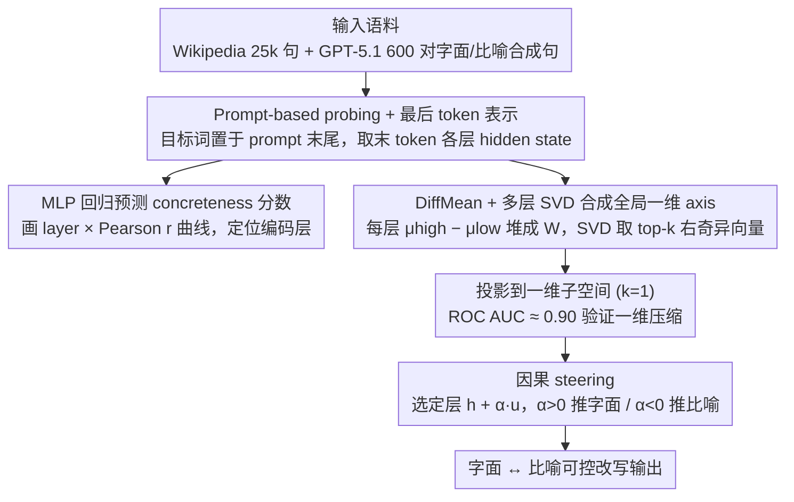

# Exploring Concreteness Through a Figurative Lens

**会议**: ACL 2026  
**arXiv**: [2604.18296](https://arxiv.org/abs/2604.18296)  
**代码**: https://github.com/cincynlp/concreteness-interpretability  
**领域**: NLP 理解 / 语言学 / LLM 可解释性  
**关键词**: 具体性, 比喻语言, LLM 内部表示, 几何子空间, 表示干预

## 一句话总结
作者用 prompt-based probing + DiffMean + SVD 拆解四个 LLM（Llama-3.1-8B / Qwen3-8B / Gemma2-9B / GPT-OSS-20B）内部的"具体性"（concreteness）表示，发现：早期层就已经能区分名词的字面用法（高 concrete）vs 比喻用法（低 concrete），中后期层把整个 concreteness 信息压缩到**一条一维方向**上，并展示这条 axis 既能做几乎和有监督 4096 维分类器持平的零样本 figurative text 分类、又能直接被加到 hidden state 上对生成做"字面 ↔ 比喻"的可控改写。

## 研究背景与动机
**领域现状**：心理语言学和 NLP 早已把"concreteness（具体度）"作为词的核心语义维度——高 concrete 词指可被感官感知的具体物体（apple, chair），低 concrete 词指抽象概念（justice, idea）。Brysbaert et al. (2014) 用 4000+ 标注者给 40k 英语词标了 1-5 静态 concreteness 分，是该领域的金标准；后续工作（Charbonnier&Wartena 2019, Tater 2022, Wartena 2024）把这个分数用 contextual embedding 预测，证明 BERT 等模型已经能编码"上下文中的 concreteness 偏移"。

**现有痛点**：但这些工作都停留在"预测 concreteness 分数"或"embedding 相关性"的外在评估上——没人系统研究：(i) 现代 decoder LLM 的**哪些层**真正编码 concreteness？(ii) concreteness 在隐表示空间里是不是占据一条**专门的几何方向**？(iii) 这条方向能不能被用来**干预**生成的字面/比喻倾向？

**核心矛盾**：concreteness 是"上下文敏感"的——同一个 window，"window was broken" 是高 concrete 字面用法、"window of opportunity" 是低 concrete 比喻用法（隐喻/转喻/习语都会引发这种偏移，Lakoff & Johnson 1980 经典理论）。但现有 probing 方法在 decoder-only LLM 上有个工程瓶颈：直接取 noun 的 contextual embedding 受限于"从左到右"的因果掩码，可能根本看不见后文给的比喻提示（如 "chain of events led to his downfall" 里 chain 的 embedding 是在还没读到 events/downfall 时算出来的）。

**本文目标**：(1) 设计一种在 decoder LLM 上能正确捕捉**上下文 concreteness** 的 probing 方案；(2) 从层级和几何两个维度刻画 concreteness 的内部表示；(3) 验证这表示既可解释、也可下游使用、还可被干预。

**切入角度**：作者借鉴 Marks & Tegmark (2024) "几何 of truth" 工作的 DiffMean 方法——一个简单的"高类均值减低类均值"线性方向就能捕捉很多语义维度；再用 SVD 把多层 DiffMean 合成全局 axis。

**核心 idea**：用 prompt "On a scale of 1 to 5, what is the concreteness of [word] in this sentence?" 让 LLM 把整句信息聚合到最后一个 token，那个 token 的 hidden state 就携带了"上下文 concreteness"——把这些 hidden state 当 probe 输入，就能定量分析层级编码 + 几何结构 + 因果干预。

## 方法详解

### 整体框架
方法分三步：(a) **Layer-wise probing**：用 Wikipedia 抽 25,000 句和 GPT-5.1 生成的 600 对 literal/figurative 合成句子，配合 prompt 拿到最后一 token 在每一层的 hidden state，训练一个 MLP 回归预测 Brysbaert concreteness 分数，画出"layer × Pearson r"曲线判定哪些层编码 concreteness。(b) **Geometric axis**：在 Wikipedia 句子上把名词按静态 concreteness > 4 / < 2 分成 high / low 两类，每层算 DiffMean 向量 $w^{(l)} = \mu^{(l)}_{high} - \mu^{(l)}_{low}$，把所有层 DiffMean 拼成矩阵 $W$ 做 SVD，取 top-$k$ 右奇异向量 $B_k = V^\top_{1:k}$ 作为"全局 concreteness 子空间"；用 $k=1$ 测是否能压成单方向。(c) **Causal steering**：把单位方向 $\mathbf{u}$ 直接加到中后期某层的 hidden state 上 $h^{(\ell)}_{\text{steer}} = h^{(\ell)} + \alpha \mathbf{u}$（$\alpha > 0$ 推向字面、$\alpha < 0$ 推向比喻），再让模型继续解码生成改写。

### 关键设计

**1. Prompt-based probing + 最后 token 表示：绕开 decoder 因果掩码"看不到后文"的限制**

decoder-only LLM 直接取 noun 的 contextual embedding 有个致命问题：因果掩码下这个 token 还没读到后文，比如 "chain of events led to his downfall" 里 `chain` 的 embedding 是在没看到 events/downfall 时算出来的，根本捕捉不到那条把它推向比喻用法的提示。作者的解法是设计 prompt "Sentence: [sentence] On a scale of 1 to 5 (5 being the highest), in the context of the sentence, what is the concreteness of the word [target_word]?"，把整句和目标词都塞进 prompt，**取最后一个 token 的 hidden state** 作为 concreteness 表示——这个 token 因 causal attention 已经"看完"整句，自然聚合了完整上下文。

拿到表示后走两条复用路径：(Gen) 让模型直接生成数字、(Tok) 把 hidden state 喂 MLP 回归。两个工程细节决定了 probing 是否可信：其一，目标词若不放在 prompt 末尾，Pearson r 会从 0.98 掉到 0.80±0.10，坐实了 decoder LLM 的强烈 recency bias；其二，Gen 路径只能拿到 0.58-0.70 的 r、远低于 Tok 的 0.82-0.92，说明"模型知道 concreteness 但说不准数字"——hidden state 比生成出来的数字更接近真实信号。

**2. DiffMean + 多层 SVD 合成全局一维 axis：验证 concreteness 是否压成单一几何维度**

要回答"concreteness 在隐空间里是否占据一条专门方向"，作者用了 Marks & Tegmark (2024) 验证过的轻量线性方法 DiffMean——它本身就是几何空间里一根具体的方向向量，比 logistic regression 更可解释。具体先按静态 concreteness 阈值（>4 / <2）从 25k Wikipedia 句子里抽出 balanced 的 2,256 高 / 2,116 低 concrete 实例，每层算 high 均值减 low 均值得到 DiffMean $w^{(l)} = \mu^{(l)}_{high} - \mu^{(l)}_{low}$。

单层 DiffMean 只反映该层最判别的方向，为了找"所有层共认的全局方向"，作者把各层 $w^{(l)}$ 当行向量堆成矩阵 $W$ 做 SVD，取 top-$k$ 右奇异向量 $B_k = V^\top_{1:k}$ 作为 layer-agnostic 子空间，再把任意句子的 hidden state 投影到这 $k$ 维上做 ROC AUC 评估。结果很干净：$k=1$ 时中后期层 AUROC 稳定在 ~0.90，证明 concreteness 确实被压缩到一维；而 $k$ 加到 2/3/4 反而 AUROC 下降（图 7），多方向稀释信号，是 inverse scaling 的明确证据。

**3. 因果 steering：把 axis 直接加到 hidden state，从"相关性"升级为"控制 knob"**

axis 能区分类别不代表它是因果的——只有"推一推就让输出变"才证明它是控制信号而非旁观特征。作者选定每个模型 concreteness 信息最清晰的层（Llama-3.1-8B layer 20、Qwen 25、Gemma 27、GPT-OSS 15），在解码该层时把 hidden state 加上 $h^{(\ell)}_{\text{steer}} = h^{(\ell)} + \alpha \mathbf{u}$（$\alpha=+40$ 推向字面、$\alpha=-40$ 推向比喻），后续层正常 forward 生成 "Rewrite the following sentence clearly and naturally:" 的改写。

关键在于 prompt 完全不提 figurative/literal，所有控制信号都来自 axis 干预，因此一旦输出风格随 $\alpha$ 变化，就是干净的因果证据。100 句 × 2 方向的 human eval 给出 Lit→Fig 0→15%、Fig→Lit 39-52%→67-75% 的提升——既证明 axis 是可控的 knob，也顺带暴露出"比喻生成比字面 paraphrase 难得多"的不对称。

### 损失函数 / 训练策略
本工作没有传统训练：(a) probing MLP 用 Wartena (2024) 同款超参（512→256→128 三层 + ReLU + 0.2 dropout，AdamW lr=1e-5，50 epoch，batch=15，10-fold CV）；(b) DiffMean 是闭式计算，无需训练；(c) SVD 也是闭式分解；(d) steering 是 inference-time 加法，零参数更新。这种 training-free 性质大幅降低了方法的复现成本。

## 实验关键数据

### 主实验
**Probing 相关性**（Pearson r between predicted concreteness and Brysbaert human ratings）：

| Model | With Context (Gen) | With Context (Tok) | W/o Context (Gen) | W/o Context (Tok) |
|-------|---------------------|---------------------|--------------------|--------------------|
| Llama-3.1-8B | 0.66 | 0.88 | 0.70 | **0.98** |
| Qwen3-8B | 0.60 | 0.87 | 0.65 | **0.98** |
| Gemma2-9B | 0.64 | 0.92 | 0.68 | **0.98** |
| GPT-OSS-20B | 0.58 | 0.82 | 0.63 | **0.98** |

**零样本 figurative 分类**（Llama-3.1-8B，AUROC，单一 1-D concreteness axis vs 4096-D 训练分类器）：

| Task | Dataset | 1-D Subspace (zero-shot) | Full Rep. (trained) | 保留率 |
|------|---------|--------------------------|---------------------|--------|
| Idioms | MAGPIE | 95.2 | 98.5 | 96.6% |
| Idioms | EPIE | 95.3 | 99.2 | 96.1% |
| Metaphor | VUA | 95.7 | 97.6 | 98.1% |
| Metaphor | MUNCH | 93.2 | 95.1 | 98.0% |
| Metonymy | ConMeC | 60.2 | 62.6 | 96.2% |
| Metonymy | MetFuse | 85.7 | 96.3 | 89.0% |

### 消融实验
**子空间维度 $k$ 的影响 + 因果 steering 人评**（100 句样本，2 个独立标注者）：

| 配置 | 关键指标 | 说明 |
|------|---------|------|
| $k=1$ subspace, Llama mid-late 层 | AUROC ≈ 0.90 | 单方向就够，验证 concreteness 一维压缩 |
| $k=2$ | AUROC ↓ | 多方向反而稀释信号 |
| $k=3$ | AUROC ↓↓ | 进一步下降 |
| $k=4$ | AUROC ↓↓↓ | 引入噪声方向 |
| Lit→Fig Llama-3.1-8B 无 steering | 0/100 字面输入产生比喻 rewrite | 模型有强字面 bias |
| Lit→Fig Llama-3.1-8B $\alpha=-40$ | 12/100 | 干预后 12% 转比喻 |
| Lit→Fig GPT-OSS-20B $\alpha=-40$ | 15/100 | 最有效模型 |
| Fig→Lit Llama 无 steering | 42/100 | 模型本身偏字面 |
| Fig→Lit Llama $\alpha=+40$ | 71/100 | 干预后字面比例几乎翻倍 |
| Fig→Lit GPT-OSS-20B $\alpha=+40$ | 75/100 | 同样大幅提升 |

### 关键发现
- **早期层做"字面 vs 比喻"分类**：在合成数据集上，$\delta^{(l)}_{\text{mean}} = C^{(l)}_{\text{pred}} - C_{\text{static}}$ 这个偏移量从 layer 2 就开始分离（literal 偏正、figurative 偏负），并贯穿到最后一层（图 2）——这与"早期层做语义类型判断"的现有 mechanistic interpretability 发现一致。
- **中后期层做一维压缩**：layer-wise AUROC 显示所有 4 个模型都在中后期层把 concreteness 压缩到 $k=1$ 维（图 3），AUROC 稳定 ~0.90。GPT-OSS-20B 因为 MoE 架构略有不同，压缩从更早层就开始。
- **一维 axis 几乎打平 4096-D 全监督分类器**：1-D zero-shot 在 idiom/metaphor 上保留 95-98% 的 AUROC，证明"全监督需要的判别信息"绝大部分都在这一条 axis 上——这对模型解释和工程部署都是大新闻。
- **metonymy 是例外**：6 个数据集中 metonymy 上的 1-D AUROC 只有 60-86%，与 metaphor/idiom 的 93-96% 差距明显——和语言学共识吻合：metonymy（如 "the church joined the movement"）的 concreteness 偏移本来就小，因为指代仍然连着具体实体。
- **steering 不对称**：Fig→Lit 容易（提升 +25 到 +36 pp）、Lit→Fig 难（只到 9-15%）——印证 Chakrabarty 2022 等工作"LLM 有强字面 bias"的观察，比喻生成比字面 paraphrase 难得多。
- **verb 上效果差很多**：附录 A 用同方法做动词，high/low concrete 差距远小于名词——和语言学理论（名词在字面/比喻使用中 concreteness 偏移比动词大）一致。

## 亮点与洞察
- **probing 的工程细节决定结论**：作者明确说明"目标词必须放在 prompt 末尾"——recency bias 让 Pearson r 从 0.98 掉到 0.80±0.10，这种 prompt sensitivity 是用 hidden state 做 probing 时的隐藏陷阱，所有未来 decoder LLM probing 工作都该照抄这一设计。
- **representation-as-control 范式**：把一条几何方向直接加到 hidden state 上当 control knob，不改参数、不加 prompt 也能控制生成倾向——这条思路在 sycophancy 控制（Vennemeyer 2025）、truth/false 控制（Marks 2024）之外又添了 figurativity 这一新维度，明显在形成一个 paradigm。
- **DiffMean + SVD 合并多层的精巧设计**：单层 DiffMean 只反映该层最判别的方向，多层 SVD 后取 top-1 等价于"找一条所有层都共认的方向"——既层无关又稳定，比单层 probe 更可信。
- **"模型知道 concreteness 但说不准数字"**：Gen 路径 r=0.58-0.70 vs Tok 路径 r=0.82-0.92 的差距，揭示了"hidden state 比 verbalize 更准"——这对 LLM 自我评估的方法论很有警示。
- **可控改写的下游价值**：教学、文学创作、风格迁移、低资源语言比喻翻译都能用这个 axis 做 inference-time 控制，比 fine-tune 一个 controllable generation 模型代价低几个数量级。

## 局限与展望
- **没有人评 contextual concreteness**：用 MLP 回归的预测值与 Brysbaert 静态分数对齐（r=0.98），但缺乏直接的"上下文 concreteness" human ground truth，无法说预测值真的是 contextual 而非 leak 自 static prior。
- **axis 不一定纯净**：一维方向可能同时编码其他语义信号（如频率、形象性 imageability、情感价 valence 等），干预时可能附带改变其他属性——作者承认这是"future work"。
- **concreteness ≠ figurativity**：词义消歧（如 "root of tree" vs "square root of number"）也会引发 concreteness 偏移但不是比喻；作者已经在合成数据时手工剔除这类样本，但实际部署时如何区分仍未解决。
- **Lit→Fig 干预效果有限**（10-15%）：高 $\alpha$ 会引入噪声/不通顺；说明 LLM 内部 figurativity 生成不是纯靠 concreteness axis 控制的，还需要更高维的概念映射机制。
- **域单一**：只用 Wikipedia + GPT-5.1 合成数据，未在文学/诗歌/对话等真实 figurative 密集域验证。
- **改进方向**：(1) 用 sparse autoencoder 把 concreteness axis 与其他 latent feature 解耦；(2) 设计多 axis 联合干预（如同时控制 concreteness + 情感）；(3) 把 axis 应用到多模态（图像-文本 concreteness 一致性）。

## 相关工作与启发
- **vs Wartena (2024) BERT-based concreteness probing**：Wartena 在 encoder-only 模型上证明 contextual embedding 能预测 concreteness，但 (a) 只到 BERT 时代，(b) 没有几何分析，(c) 没有干预实验；本文把整个 paradigm 升级到 decoder LLM + 几何视角 + 因果控制。
- **vs Marks & Tegmark (2024) "Geometry of Truth"**：Marks 等用 DiffMean 找 truth axis 并做 steering；本文几乎是同一套方法论换到 concreteness/figurativity 这个新维度——证明 "linear axis + steering" 是个跨任务通用框架。
- **vs Wartena (2022) "Geometry of Concreteness"**：早期工作已经发现 concreteness 在 word embedding 中是一条方向，但局限于 word2vec/BERT 静态嵌入；本文系统化到多层 decoder LLM + contextual 偏移。
- **vs Chakrabarty 2021 MERMAID（比喻生成）**：MERMAID 需要 fine-tune 模型 + symbolism dataset 才能做比喻改写；本文 zero-shot 干预方法虽然成功率没那么高（Lit→Fig 10-15%），但是 training-free，工程代价天差地别。
- **对其他 NLP 任务的启发**：任何"二元语义对立"（formal/informal、polite/rude、subjective/objective）都可能存在类似的一维 axis，未来工作可以系统化搜索这些 axis；steering 也能扩展到多 axis 联合（情感 × 风格 × 难度）。

## 评分
- 新颖性: ⭐⭐⭐⭐ 把 mechanistic interpretability 的 "linear axis + DiffMean + SVD" 框架首次系统应用到 concreteness/figurativity 维度，工程细节（prompt 末尾、$k=1$ 压缩、跨四模型一致）打磨扎实；但底层范式（geometry-of-X + steering）是借鉴 Marks 2024。
- 实验充分度: ⭐⭐⭐⭐⭐ 4 个模型 × 25k Wikipedia + 500 对合成 + 6 个下游 figurative 数据集 + layer 扫描 + 维度扫描 + steering 人评 + 动词对照 + prompt sensitivity + MoE 解释，几乎每个 claim 都有正面+对照证据。
- 写作质量: ⭐⭐⭐⭐ 图 1/2/3 把"early layer 编码 / 中后期压缩 / steering 不对称"三个核心 finding 可视化得很直观；limitation 部分诚实写出 axis 可能不纯净；附录细节充足。
- 价值: ⭐⭐⭐⭐ 对 NLP interpretability 社区是一个清晰的 case study 模板；对 controllable generation 工程也有直接可用的 zero-shot 干预技术；对教育、文学等下游应用具有可落地的工具价值。

<!-- RELATED:START -->

## 相关论文

- [\[ACL 2026\] Agree, Disagree, Explain: Decomposing Human Label Variation in NLI through the Lens of Explanations](agree_disagree_explain_decomposing_human_label_variation_in_nli_through_the_lens.md)
- [\[ACL 2026\] MetFuse: Figurative Fusion between Metonymy and Metaphor](metfuse_figurative_fusion_between_metonymy_and_metaphor.md)
- [\[NeurIPS 2025\] Generalization Error Analysis for Selective State-Space Models Through the Lens of Attention](../../NeurIPS2025/nlp_understanding/generalization_error_analysis_for_selective_state-space_models_through_the_lens_.md)
- [\[ACL 2026\] BoundRL: Efficient Structured Text Segmentation through Reinforced Boundary Generation](boundrl_efficient_structured_text_segmentation_through_reinforced_boundary_gener.md)
- [\[ACL 2025\] CaLMQA: Exploring Culturally Specific Long-Form Question Answering across 23 Languages](../../ACL2025/nlp_understanding/calmqa_cultural_multilingual_qa.md)

<!-- RELATED:END -->
