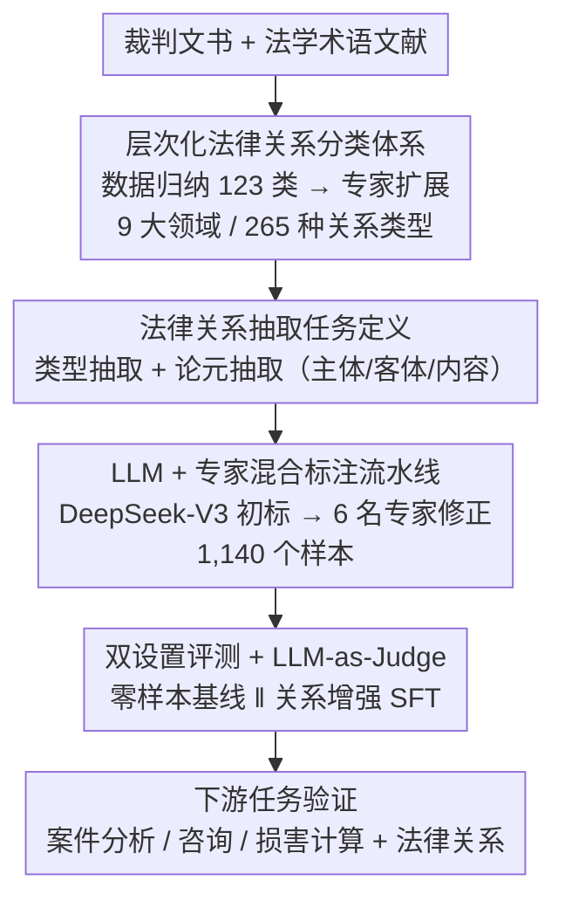

# LexRel: Benchmarking Legal Relation Extraction for Chinese Civil Cases

**会议**: ACL 2026  
**arXiv**: [2512.12643](https://arxiv.org/abs/2512.12643)  
**代码**: [GitHub](https://github.com/thunlp/LexRel)  
**领域**: LLM Evaluation / Legal NLP  
**关键词**: 法律关系抽取, 中国民事案件, 法律知识图谱, 基准测试, 关系分类体系

## 一句话总结

构建了首个中国民事法律关系的结构化分类体系（9 大领域、265 种关系类型），并基于此提出 LexRel 基准（1,140 个专家标注样本），评估了主流 LLM 在法律关系抽取任务上的能力，发现当前模型在该任务上存在显著局限，同时证明了法律关系信息对下游法律 AI 任务的增益效果。

## 研究背景与动机

**领域现状**：法律关系（legal relations）是中国民事案件中的基础分析单元，指由法律规范所规定的个体之间的关系。在司法实践中，法律专业人士频繁依赖法律关系进行法律信息检索、法条预测和案件结果分析。然而，法律关系在法律 AI 领域中长期被忽视，尤其是在中国民法的语境下缺乏系统性研究。

**现有痛点**：当前法律 AI 中的信息抽取主要针对事实实体（如人、物、合同）或一般社会关系（如雇佣、所有权），忽视了法律关系作为一种植根于法定规则和司法实践的概念，与自然语言中的普通语义关联存在本质区别。此外，法律关系在判决书中几乎从不被明确表述，通常需要从事实描述中推断。现有的法律关系分类体系（schema）通常过于粗粒度，仅在民事权利义务的大类层面进行分类。

**核心矛盾**：缺乏一个细粒度、结构化的法律关系分类体系和高质量标注数据，导致无法系统性地评估和提升 AI 模型在法律关系理解方面的能力。

**本文目标**：(1) 建立首个覆盖中国民法的综合法律关系分类体系；(2) 定义法律关系抽取任务并构建专家标注的基准数据集；(3) 评估主流 LLM 的法律关系抽取能力；(4) 验证法律关系信息对下游任务的增益。

**切入角度**：从法学理论出发，结合司法实践和专家指导，构建分类体系后再进行计算化标注和评估，兼具法学规范性和 AI 实用性。

## 方法详解

### 整体框架

LexRel 想解决的是"中国民法里的法律关系长期没有细粒度结构化描述、也没有高质量标注数据来评测 LLM"这一空白。它沿一条串行流水线推进：先自上而下设计一套层次化的法律关系分类体系（taxonomy）与论元定义，再据此把"法律关系抽取"形式化为可计算任务、用"LLM 初标 + 专家修正"的流水线造出基准数据，最后在零样本和关系增强两种设置下评测多个 SOTA LLM，并验证抽出的法律关系能否反哺下游法律任务。

### 关键设计

**1. 层次化法律关系分类体系：给隐含在判决书里的法律关系一套细粒度坐标系**

现有法律 KG 大多只刻画雇佣、所有权这类一般社会关系，而真正植根于法定规则的"法律关系"几乎从不在判决书里被明说，且已有 schema 粗到只分民事权利义务大类。为此本文分两阶段构建：先从裁判文书里用关键词匹配抽出关系表达、对照法律术语文献筛出 123 种候选类型并归入 6 大领域；再由两位资深法学专家审核扩展，补上票据关系、信用证关系、独立保函关系三个新领域，最终覆盖 **9 大领域、265 种关系类型**。这样既有判决数据的经验归纳（empirical induction）兜底，又有法学理论的规范约束（normative grounding），分类体系才能既站得住又用得上。

**2. 法律关系抽取任务定义：把"从事实里推断法律关系"拆成类型 + 论元两步**

法律关系在判决书中通常是隐含的，要从事实描述里推断，这比常规关系抽取更难。本文把它形式化为两个级联子任务：**类型抽取**从事实文本 $x$ 中识别关系类型 $\hat{r} = f_{\text{type}}(x),\ \hat{r} \in \mathcal{R}$；**论元抽取**再在预测类型的条件下抽出主体、客体与内容 $(\hat{S}, \hat{O}, \hat{c}) = f_{\text{arg}}(x, \hat{r})$。两步级联让任务可量化评测，也暴露出"识别关系类型"和"补全论元"是难度截然不同的两件事。

**3. LLM + 专家混合标注流水线：在控制成本的前提下保住专业标注质量**

纯人工标注法律关系既贵又依赖法学专业知识。本文先用 DeepSeek-V3 从判决全文抽出候选关系类型与论元作为草稿，再由 6 名法学专业标注者逐条验证修正、一位法律 AI 资深专家监督，去掉 60 个无法识别法律关系的样本后得到 1,140 个标注样本。LLM 把人从"从零写标注"降级为"审校草稿"，大幅压低了标注负担。

**4. 双设置评测 + LLM-as-Judge 论元评分：让评测既覆盖大小模型、又能给开放论元打分**

评测分两档：**零样本基线**直接测 LLM 的类型与论元抽取；**关系增强基线（RE）**用 GPT-4o 或 DeepSeek-R1 从含法律分析部分的完整判决里生成训练数据，对开源小模型做 SFT，看注入关系信息后能否追平大模型。论元抽取因为是开放文本不好硬匹配，改用 LLM-as-Judge（DeepSeek-V3）打分，人工复核其准确率达 95.4%（主体）、96.9%（客体）、81.0%（内容），保证自动评分可信。

## 实验关键数据

### 主实验

| 模型 | 方法 | 类型抽取 micro-F1 | 类型抽取 macro-F1 | 论元抽取 micro-F1 | 论元抽取 macro-F1 |
|------|------|------------------|------------------|------------------|------------------|
| o3-mini | zero-shot | **0.762** | **0.441** | **0.382** | **0.129** |
| DeepSeek-R1 | zero-shot | 0.693 | 0.376 | 0.268 | 0.065 |
| GPT-4o | zero-shot | 0.670 | 0.314 | 0.224 | 0.068 |
| Claude-Sonnet-4 | zero-shot | 0.590 | 0.330 | 0.258 | 0.088 |
| Qwen3-14B | RE w/ R1 | 0.733 | 0.430 | 0.381 | 0.146 |
| Qwen3-8B | RE w/ R1 | 0.675 | 0.337 | 0.304 | 0.098 |
| Llama3.1-8B | zero-shot | 0.250 | 0.052 | 0.027 | 0.006 |

### 下游任务增益

| 模型 | 案件分析 | 案件分析+LR | 咨询 | 咨询+LR | 损害计算 | 损害计算+LR |
|------|---------|------------|------|---------|---------|------------|
| MiniCPM4-8B | 32.0 | **45.0** | 7.6 | **8.4** | 65.0 | **76.8** |
| DeepSeek-V3 | 66.2 | **68.2** | 16.4 | **16.5** | 85.0 | **86.4** |
| GPT-4o | 55.8 | **56.6** | 18.2 | **19.2** | 84.4 | **85.8** |

### 关键发现

- 推理型 LLM（o3-mini、DeepSeek-R1）在零样本设置下显著优于非推理型模型，表明法律关系抽取需要较强的推理能力
- 论元抽取（micro-F1 最高仅 0.382）远比类型抽取（0.762）困难，所有模型的 macro-F1 均远低于 micro-F1，说明长尾关系类型的性能严重不足
- SFT 可以显著提升小模型性能（如 InternLM3-8B 论元抽取从 0.048 提升至 0.323），Qwen3-14B + RE 几乎追平 o3-mini 零样本水平
- LexRel 中法律关系分布呈现长尾特征，与 2660 万真实民事判决中案由分布的长尾模式高度吻合（前 25 种案由占 80% 的案件）
- 法律关系信息对下游任务一致性地带来增益，MiniCPM4-8B 在案件分析上从 32.0 提升至 45.0（+13.0），损害计算从 65.0 提升至 76.8（+11.8）

## 亮点与洞察

- **首个综合性民事法律关系体系**：265 种关系类型覆盖 9 大领域，结合法学理论和数据驱动构建，填补了法律 AI 的重要空白
- **任务价值凸显**：法律关系在判决书中是隐含的，需要从事实中推断，这对 LLM 的法律推理能力构成了严峻挑战
- **长尾分析有深度**：通过与 2660 万真实判决的案由分布对比，验证了 LexRel 的分布代表性
- **下游增益证明了法律关系的实用价值**：即使当前模型抽取准确率不高，引入法律关系信息仍能提升下游任务性能

## 局限与展望

- Schema 和数据集专注于中国民法，直接迁移到其他法律体系需要本地化适配
- 合成训练数据生成和 LLM-as-Judge 评估都使用了 DeepSeek 系列模型，存在潜在的模型家族耦合问题
- 论元抽取性能仍然很低（最高 macro-F1 仅 0.146），长尾关系类型的抽取是主要瓶颈
- 1,140 个样本的规模相对较小，尤其对于 265 种关系类型来说数据稀疏

## 相关工作与启发

- **vs 法律知识图谱**：现有法律 KG 主要捕获一般社会关系（如雇佣、亲属），LexRel 关注的是法律规范下的关系（如债权债务、合同义务），更贴近司法实践
- **vs 通用关系抽取**：法律关系抽取比通用 RE 更难，因为法律关系通常不在文本中显式表达，需要结合法律知识进行推断
- **vs LawBench 等法律评测**：LexRel 聚焦于一个被忽视但基础性的能力——法律关系识别，是对现有法律评测的重要补充

## 评分

- 新颖性: ⭐⭐⭐⭐ 首次系统化地定义和评测中国民事法律关系抽取，填补了重要空白
- 实验充分度: ⭐⭐⭐⭐ 评估了 12 个模型、两种设置，包含长尾分析和下游任务验证，但数据集规模偏小
- 写作质量: ⭐⭐⭐⭐ 法学和 NLP 的交叉融合处理得当，分类体系的构建过程清晰
- 价值: ⭐⭐⭐⭐ 为法律 AI 社区提供了重要的基准资源，对法律关系建模的研究方向有推动作用

<!-- RELATED:START -->

## 相关论文

- [\[ACL 2026\] HCRE: LLM-based Hierarchical Classification for Cross-Document Relation Extraction](hcre_llm-based_hierarchical_classification_for_cross-document_relation_extractio.md)
- [\[ACL 2025\] Towards a More Generalized Approach in Open Relation Extraction](../../ACL2025/nlp_understanding/generalized_open_relation_extract.md)
- [\[ACL 2025\] A Variational Approach for Mitigating Entity Bias in Relation Extraction](../../ACL2025/nlp_understanding/a_variational_approach_for_mitigating_entity_bias_in_relation_extraction.md)
- [\[ACL 2025\] Generating Diverse Training Samples for Relation Extraction with Large Language Models](../../ACL2025/nlp_understanding/generating_diverse_training_samples_for_relation_extraction_with_large_language_.md)
- [\[ACL 2026\] DiZiNER: Disagreement-guided Instruction Refinement via Pilot Annotation Simulation for Zero-shot Named Entity Recognition](diziner_disagreement-guided_instruction_refinement_via_pilot_annotation_simulati.md)

<!-- RELATED:END -->
