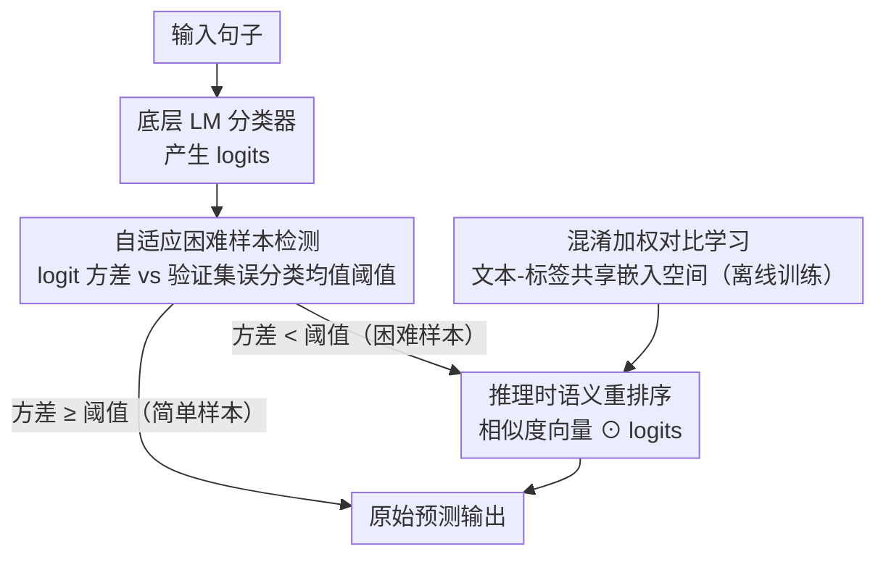

<!-- 由 src/gen_stubs.py 自动生成 -->
# Semantic Reranking at Inference Time for Hard Examples in Rhetorical Role Labeling

**会议**: ACL 2026  
**arXiv**: [2605.18007](https://arxiv.org/abs/2605.18007)  
**代码**: [GitHub](https://github.com/AnasBelfathi/rise-framework)  
**领域**: medical_imaging  
**关键词**: 修辞角色标注, 推理时重排序, 标签语义, 对比学习, 困难样本

## 一句话总结
提出 RiSE，一种推理时语义重排序框架，通过自动识别低置信度困难样本并利用对比学习的标签语义表示重排序模型输出，在 8 个修辞角色标注数据集上困难样本平均提升 +9.15 macro-F1。

## 研究背景与动机
**领域现状**: 修辞角色标注（RRL）为文档中每个句子分配功能角色，广泛应用于法律、医学和科学领域。语言模型在平均性能上表现良好，但在困难样本上仍不可靠。

**现有痛点**: (1) 现有方法将标签视为离散标识符，忽略标签名称中编码的语义信息；(2) 困难样本（低置信度预测）的处理通常是隐式的，缺乏专门机制；(3) 语义近似的标签之间容易混淆，Top-1 vs Top-3 的 macro-F1 差距表明正确标签常在高排名但未被选中。

**核心矛盾**: 标准分类器使用独热向量表示标签，无法利用标签之间的语义关系；而纯相似度方法虽利用标签语义但丢失了分类器的判别能力。

**本文目标**: 设计一种推理时方法，在保持分类器判别行为的同时利用标签语义改善困难样本预测。

**切入角度**: 推理时介入——自动检测低置信度样本，用对比学习的文本-标签语义相似度重新加权分类器 logits。

**核心 idea**: 混淆加权对比学习 + 自适应困难样本检测 + logits 语义重排序 = 无需重训练的推理时困难样本修复。

## 方法详解

### 整体框架
RiSE 在推理时操作：首先用底层分类器对输入句子产生 logits；然后基于 logit 方差自动识别困难样本；对困难样本，利用对比学习的文本-标签表示计算语义相似度，通过逐元素乘法重排序 logits。非困难样本直接使用原始输出。其中文本-标签共享嵌入空间由混淆加权对比学习离线训练好，供重排序阶段查询。

### 关键设计

**1. 自适应困难样本检测：用 logit 方差自动找出"标签竞争激烈"的不确定样本**

困难样本的处理在现有方法里往往是隐式的，缺乏专门机制。RiSE 想先精准圈出这批样本，再只对它们干预。它不用熵，而是直接计算分类器 logit 向量的方差作为置信度指标——方差低意味着多个标签得分挤在一起、存在强标签竞争，正是容易出错的困难样本。阈值也不固定，而是自适应地取验证集上误分类样本的平均 logit 方差 $\sigma^2_{\text{mis}} = \frac{1}{|\mathcal{M}|} \sum_{i \in \mathcal{M}} \text{Var}(\mathbf{z}_i)$，方差低于此值的样本判为困难。之所以用方差而非熵，是因为方差直接刻画原始决策空间里的得分分散度，对 logit 是否校准不敏感，也能适配不同模型和数据集的组合。

**2. 混淆加权对比学习（Confusion-Weighted Contrastive Learning）：让标签嵌入空间专门学会区分模型自己最容易混淆的标签对**

现有方法把标签当成离散标识符，丢掉了标签名里的语义信息；而单纯按标签语义算相似度又会丢掉分类器的判别力。RiSE 的做法是学一个文本-标签共享嵌入空间，但用分类器在验证集上的混淆行为来塑造它：先统计标签亲和度权重 $w_{y'} = P(y, y')$（归一化的标签混淆概率），再把它注入加权 InfoNCE 损失 $\mathcal{L}_{\text{CW}}$（CW 即 Confusion-Weighted）——混淆概率越高的负样本对获得越大权重，逼着模型更卖力地把语义相近的标签拉开。因为标签混淆是领域特定的（法律里"分析"和"论证"易混，别的领域是别的对），用混淆概率加权远比对所有负样本均匀加权更有的放矢。

**3. 推理时语义重排序：只对困难样本把语义相似度乘进 logits，既修错又不伤简单样本**

Top-1 vs Top-3 的 macro-F1 差距说明正确标签常排在高位却没被选中，所以最后一步是把标签语义信号融回分类器输出。对每个困难样本 $x$，先算输入嵌入 $\mathbf{e}_x$ 与各标签嵌入 $\mathbf{e}_y$ 的余弦相似度向量 $\mathbf{s}_x \in \mathbb{R}^C$，再与原 logits 逐元素相乘完成重排序：

$$\tilde{\mathbf{z}}_x = \mathbf{s}_x \odot \mathbf{z}_x$$

非困难样本则原样输出。逐元素乘法把判别信号（logits）和语义信号（相似度）干净地融在一起；而"只动困难样本"的设计保住了分类器在简单样本上本就可靠的判别能力，整套流程无需重训练、即插即用。

## 实验关键数据

### 主实验（7 个 LM × 8 个数据集，macro-F1 / weighted-F1 均值）

| 模型 | Baseline mF1 | + RiSE mF1 | Baseline wF1 | + RiSE wF1 |
|------|-------------|-----------|-------------|-----------|
| LLaMA-3-8B | 67.98 | **68.51†** | 74.88 | **75.65†** |
| Mistral-7B | 67.66 | **69.50†** | 74.61 | **75.75†** |
| Qwen3-8B | 67.59 | **68.82†** | 74.28 | **75.23†** |
| ALBERT-base | 66.45 | **66.99** | 72.98 | **73.39** |
| BERT-base | 66.17 | **67.25†** | 73.49 | **73.86** |
| DeBERTa-base | 68.02 | **68.50** | 74.44 | **74.86** |
| RoBERTa-base | 67.21 | **68.11†** | 74.24 | **74.77** |

### 困难样本提升（平均 across 模型和数据集）

| 指标 | 提升幅度 |
|------|---------|
| 困难样本 macro-F1 | **+9.15** |
| 全集 macro-F1 | +0.5 ~ +1.8 |

### 关键发现
- RiSE 在困难样本上平均提升 +9.15 macro-F1，同时保持或略微提升全集性能
- 在 7 个模型（含 encoder 和 causal 架构）和 8 个数据集（法律/医学/科学）上一致有效，泛化性强
- 人工困难度标注与模型困难度的 Cohen's κ=0.40（中等一致），说明模型困难和人类困难部分重叠但不完全相同
- causal LM（LLaMA-3/Mistral/Qwen3）的绝对提升略大于 encoder 模型，可能因 causal LM 更容易产生标签混淆

## 亮点与洞察
- 推理时零成本介入：不修改模型、不重训练、不改架构，即插即用的通用框架
- 困惑加权对比学习巧妙利用分类器自身的错误模式来指导标签语义学习——从失败中学习
- 方差作为困难度指标简洁有效，优于熵等替代方案
- 人工困难度标注的引入为理解模型行为提供了可解释性视角

## 局限与展望
- 标签语义嵌入器需要在每个数据集上用训练数据训练对比模型，虽然轻量但并非完全零开销
- 方差阈值依赖验证集上的误分类样本统计，在极端类不平衡时可能不稳定
- 逐元素乘法的融合方式较为简单，可能丢失更复杂的信号交互
- 仅在句子级分类任务上验证，是否适用于 token 级或更细粒度的标注任务待探索

## 相关工作与启发
- HiCuLR 在训练时通过课程学习处理困难样本，RiSE 在推理时处理——两者互补
- 标签语义在零样本/少样本文本分类中已被广泛使用，RiSE 将其应用于推理时困难样本修复是新角度
- 对比学习 + 混淆矩阵加权的思路可推广到其他多类分类任务的后处理改进
- 推理时干预的范式（如 self-consistency、重排序等）在 LLM 时代日益重要

## 评分
- 新颖性: ⭐⭐⭐⭐ 推理时利用混淆加权标签语义重排序是清晰的新贡献
- 实验充分度: ⭐⭐⭐⭐⭐ 7 个模型 × 8 个数据集 × 3 个领域 + 人工标注分析
- 写作质量: ⭐⭐⭐⭐ 问题定义清晰，方法动机和设计逻辑连贯
- 价值: ⭐⭐⭐⭐ 即插即用的通用框架，实用性强

<!-- RELATED:START -->

## 相关论文

- [\[ACL 2026\] It's High Time: A Survey of Temporal Question Answering](it39s_high_time_a_survey_of_temporal_question_answering.md)
- [\[ACL 2026\] Filling the Gap: Is Commonsense Knowledge Generation useful for Natural Language Inference?](filling_the_gap_is_commonsense_knowledge_generation_useful_for_natural_language_.md)
- [\[ACL 2026\] Test-Time Reasoners Are Strategic Multiple-Choice Test-Takers](test-time_reasoners_are_strategic_multiple-choice_test-takers.md)
- [\[ACL 2026\] Accurate and Efficient Statistical Testing for Word Semantic Breadth](accurate_and_efficient_statistical_testing_for_word_semantic_breadth.md)
- [\[ACL 2026\] LLM-Guided Semantic Bootstrapping for Interpretable Text Classification with Tsetlin Machines](llm-guided_semantic_bootstrapping_for_interpretable_text_classification_with_tse.md)

<!-- RELATED:END -->
