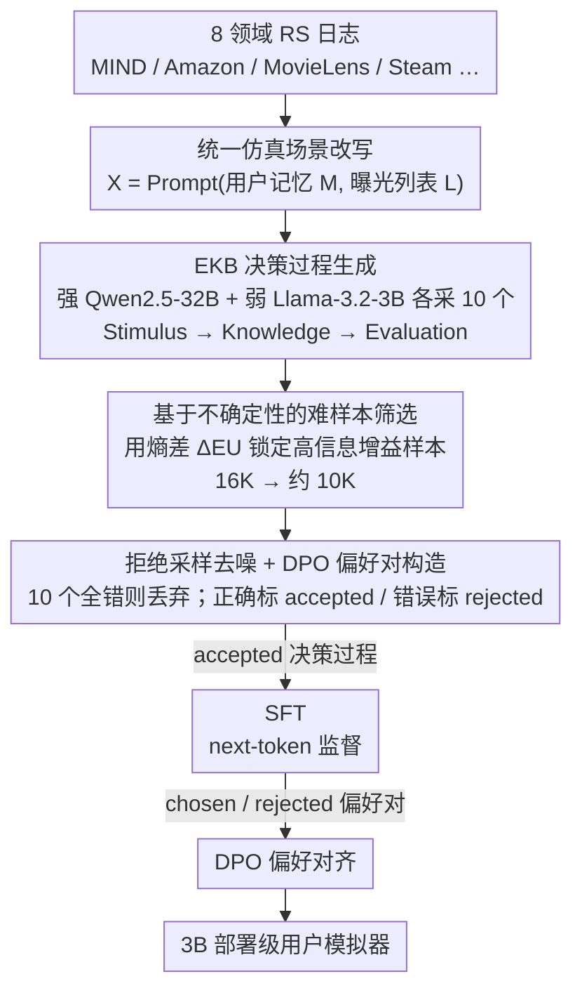

# Mirroring Users: Towards Building Preference-aligned User Simulator with User Feedback in Recommendation

**会议**: ACL 2026  
**arXiv**: [2508.18142](https://arxiv.org/abs/2508.18142)  
**代码**: https://github.com/Joinn99/UserMirrorer  
**领域**: 用户仿真 / 推荐系统 / RLHF / LLM 数据蒸馏  
**关键词**: 用户模拟器、推荐系统、不确定性分解、DPO 偏好对齐、决策过程蒸馏

## 一句话总结
作者把推荐系统里的"用户反馈日志"重写成一个 LLM 能理解的"用户记忆 + 曝光列表"统一仿真场景，再用 EKB 消费者决策模型生成显式的 chain-of-thought 决策过程作为"clarification"，通过不确定性分解 + 拒绝采样蒸馏出 10K 高质量 SFT/DPO 数据，让 3B 的 Llama 用户模拟器在 8 个领域的真实用户行为预测上超过 GPT-5 和 Gemini-2.5-Flash。

## 研究背景与动机

**领域现状**：推荐系统迭代离不开用户反馈，但线上 A/B 测试周期长、有隐私限制；学术界因此转向 user simulator——构造"用户数字孪生"在离线复现真实行为。早期是规则 / RL 模拟器，近年用 LLM agent 加 prompt engineering 模拟用户决策。

**现有痛点**：(1) 现有 LLM 模拟器几乎不在真实用户反馈上 fine-tune，导致对任务的对齐很弱；(2) 想做好必须用 GPT-4 级别大模型，规模化到亿级用户的成本不可承受；(3) 原始用户反馈本身有三个特性让 fine-tune 很难——**模糊**（没有决策上下文，光看"点击"不知道为什么点）、**噪声大**（误点、刷量）、**体量巨大**（百万级日志里筛选高质量样本是个新问题）。

**核心矛盾**：高质量决策推理只能靠强 LLM 生成，但部署又要求小模型；如何把强 LLM 的决策能力"蒸馏"成轻量 LLM，且数据本身的噪声/模糊也得同时治理。

**本文目标**：用一套统一框架把 RS 日志变成可训练的"场景—决策—行为"三元组，并自动挑出"对齐效果最大化"的子集。

**切入角度**：消费者行为学里的 **EKB 模型**（Engel-Kollat-Blackwell）天然刻画了 stimulus → knowledge → evaluation 的购买决策链条；用强 LLM 按 EKB 生成显式决策过程，相当于给每条样本加 "clarification"，从而能用 Hou et al. 2024 的 input-clarification 框架做不确定性分解，自动识别"对弱模型最有训练价值"的样本。

**核心 idea**：用 EKB 决策过程当 clarification + 用强弱模型的 epistemic uncertainty 差挑难样本 + 拒绝采样去噪 + DPO 偏好对齐，把 16K 候选场景蒸馏到 10K 高质量数据。

## 方法详解

### 整体框架
UserMirrorer 是一条端到端的"数据构造 + 模型训练"流水线，目标是把噪声大、缺上下文的 RS 日志炼成能教会小模型对齐真用户的训练数据。第一步把 8 个领域的 RS 日志（MIND/Amazon/MovieLens/Steam/Goodreads/MobileRec/LastFM/KuaiRec2）统一改写成仿真场景 $\bm{X}=\text{Prompt}(\bm{M},\bm{L})$，其中 $\bm{M}$ 是用户记忆（profile + 历史）、$\bm{L}$ 是一个 $N+1$ 长的曝光列表，每个 item 打 [A]/[B]/[C] 标签。第二步用 Qwen2.5-32B（强）和 Llama-3.2-3B（弱）各采样 10 个 EKB 决策过程，挑出"强模型能讲明白、弱模型却抓瞎"的难样本，再用拒绝采样去噪并配成 chosen/rejected 偏好对。最后对 Llama-3.2-3B 先 SFT 再 DPO，得到一个 3B 的部署级用户模拟器。

### 关键设计

**1. EKB 决策过程生成：给每条点击补一段"为什么点"的显式推理**

原始日志只有"用户点了 [C]"这个结果，没有任何决策上下文，模型光看结果学不到偏好。本文借消费者行为学的 EKB 模型给每条 $(\bm{M}, \bm{L}, a)$ 样本补一段 chain-of-thought：先 **Stimulus**（识别触发行为的外部时空/社交因素与内在需求/情绪），再 **Knowledge**（从曝光列表抽取相关属性），最后 **Evaluation**（用直觉式或逻辑式风格评估候选，对应 Kahneman 的系统 1 / 系统 2）。强 LLM 按这三步先生成决策过程 $\bm{D}$、再预测动作 $\bm{Y}$。

这段决策过程的价值不止于补上下文：在 Hou et al. 2024 的框架里，clarification 能把总不确定性拆成 aleatoric（数据本身模糊）和 epistemic（模型能力不足），而 EKB 决策过程恰好是"用户为何这么选"的天然 clarification，让后面可以反过来量化 epistemic uncertainty。这等于给 LLM 决策注入了人类心理学的归纳偏置，比让它自由发挥稳定得多。

**2. 基于不确定性的难样本筛选：用熵差锁定最有训练价值的样本**

16K 候选场景里大量样本要么太简单、要么太离谱，全拿来训反而拖累对齐。作者分别用强/弱 LLM 各生成 $N=10$ 个决策过程，让弱 LLM 在两种 $\bm{D}$ 条件下分别预测行为，计算

$$\Delta_{EU}(\bm{X}, (A,B)) = \mathbb{E}_{P(\bm{D}_A|\bm{X})}\mathcal{H}(P(\bm{Y}|\bm{X}\oplus \bm{D}_A)) - \mathbb{E}_{P(\bm{D}_B|\bm{X})}\mathcal{H}(P(\bm{Y}|\bm{X}\oplus \bm{D}_B))$$

$\Delta_{EU}$ 大，意味着强模型 $A$ 一旦给出 clarification，弱模型 $B$ 的预测熵就被大幅压低——这种"信息增益"最大的样本，正是弱模型必须借助强模型推理才能 align 真用户的难样本。之所以用熵差而非 accuracy 差，是因为直接比正确率容易被随机性扰动，而熵差能精确度量"决策过程提供了多少 epistemic 信号"，对这种答案带随机性的对齐任务更鲁棒。

**3. 拒绝采样去噪 + DPO 偏好对构造：先做数据级 sanity check，再给出对比信号**

日志里还混着误点、刷量这类数据级噪声，直接训会把噪声当真信号。对每条难样本，作者把 10 个决策过程的预测和真实用户行为逐一匹配：若 10 个里没有一个对得上，整条样本视为噪声直接丢弃；剩下的样本，把"预测正确"的过程标 accepted、"预测错误"的标 rejected，取置信度最高的一对作为 DPO 偏好对。这套流程相当于先用"能否解释真实行为"做 sanity check 去噪，再用 chosen/rejected 显式提供"该这么推理 vs. 不该那么推理"的对比信号，在 DPO 里同时优化"内容质量"和"用户行为契合度"两个目标。

### 一个完整示例：从一条日志到一份训练样本
取 MIND 上的一条新闻点击日志：用户 $u$ 在曝光列表 [A][B][C] 里点了 [C]。**改写**：把 $u$ 的 profile + 历史塞进 $\bm{M}$、三条候选排进 $\bm{L}$，组成场景 $\bm{X}$。**生成**：Qwen2.5-32B 和 Llama-3.2-3B 各采 10 个 EKB 决策过程（Stimulus→Knowledge→Evaluation），并各自预测会点哪条。**筛选**：算出这条样本的 $\Delta_{EU}$ 较大——强模型给的推理能把弱模型的熵压得很低，于是它被留进难样本池（全集 16K 最终收敛到约 10K）。**去噪配对**：10 个强模型决策里有几个预测中了真实的 [C]，标 accepted；预测成 [A]/[B] 的标 rejected，取置信度最高的一对构成 DPO 偏好对。**训练**：accepted 过程进 SFT，偏好对进 DPO。再加样本到 40K 几乎不再涨，所以停在 10K。

### 损失函数 / 训练策略
两阶段训练：(1) **SFT 阶段**仅用 accepted 决策过程做 next-token prediction；(2) **DPO 阶段**用配好的偏好对，沿用 Rafailov et al. 2023 标准公式。作为对比也试了 GRPO（Shao et al. 2024），用是否匹配真实行为做规则化 reward。最终训练用 10K 数据效果最好（再加到 40K 几乎无提升）。推理时 temperature=1.0、top-p=0.9，每条场景采 5 次取均值。

## 实验关键数据

### 主实验：用户行为预测准确率（8 个领域平均，%）

| 模型 | 规模 | Overall Acc. | 备注 |
|------|------|-------------|------|
| Llama-3.2-3B (base) | 3B | 22.7 | 起点 |
| Qwen2.5-32B-Instruct (Teacher) | 32B | 39.7 | 强教师 |
| GPT-5 (2025-08-07) | 闭源 | 42.2 | 商业旗舰 |
| Gemini-2.5-Flash | 闭源 | 42.5 | 商业旗舰 |
| Gemini-3.0-Pro-Preview | 闭源 | 47.7 | 商业最强 |
| Llama-3B + SFT | 3B | 46.0 | 仅 SFT 已超 GPT-5 |
| Llama-3B + SFT + GRPO | 3B | 52.7 | RL 进一步提 |
| **Llama-3B + SFT + DPO** | **3B** | **55.0** | **超 Gemini-3.0-Pro 7.3 点** |
| Qwen2.5-3B + SFT + DPO | 3B | 54.7 | 跨骨干同样有效 |

### 消融实验：数据选择策略（MIND / Synthetic Overall, %）

| 策略 | MIND Acc. | Synthetic Overall |
|------|-----------|-------------------|
| Llama-3B base | 19.9 | 22.7 |
| Random (w/o Decisions) | 25.7 | 48.3 |
| Random (w/ Decisions) | 31.4 | 53.9 |
| High Accuracy filter | 32.4 | 53.3 |
| Low Accuracy filter | 30.9 | 54.5 |
| Diff. Accuracy filter | 30.1 | 53.9 |
| IFD Score | 29.9 | 52.7 |
| **Ours (Uncertainty + Rejection)** | **34.0** | **55.0** |

### 关键发现
- **EKB 决策过程是决定性贡献**：把"随机选无决策"换成"随机选有决策"就从 25.7 → 31.4（MIND），说明显式 chain-of-thought 即使不挑样本也能拉一大截。
- **不确定性差 > accuracy 差**：所有 accuracy-based 启发式（high/low/diff）和 IFD 都不如基于 epistemic uncertainty 差的筛选，证明 entropy 差比硬正确率更能锁定有训练价值的难样本。
- **DPO > GRPO**：DPO 55.0 vs GRPO 52.7，作者认为 GRPO 的 binary reward 太粗糙；偏好对的连续监督信号在用户行为这种"软"任务上更稳。
- **3B 反超 47B/GPT-5**：本质是真实用户反馈里有 base LLM 学不到的"领域 implicit preference"，强模型推理强但对齐弱；先用强模型推理 + 真用户反馈过滤 + 小模型 DPO 是个高性价比的"蒸馏+对齐"组合。
- **下游推荐增益显著**：拿模拟反馈给 LightGCN/DiffRec/SASRec/NARM 做增量训练，在 Movielens 上 MRR@5 最高 +45.3%（DiffRec），说明仿真信号能真正反哺推荐模型。

## 亮点与洞察
- **把"决策过程"当成 clarification 的二次利用**：原本 Hou et al. 2024 只用 clarification 做不确定性估计，这里巧妙地把同一段决策过程同时用于 (a) 训练时的 SFT 监督信号、(b) DPO 偏好对的对比、(c) 数据筛选的不确定性度量——一份数据三个用途，复用率非常高。
- **EKB 模型这种"古典消费者行为学"被有效地移植到 LLM agent**：相当于给 LLM 决策注入了人类心理学的归纳偏置（stimulus→knowledge→evaluation），写 chain-of-thought 比让 LLM 自由发挥要稳定得多；这条思路在其它需要建模"为何如此选"的任务（dialogue policy / NPC / 用户答题）都能复用。
- **数据筛选用熵差而非 accuracy 差**：对于"答案有随机性"的对齐任务，这是个普适 trick——直接用 logits 熵能避开 ground truth 噪声的影响。

## 局限与展望
- 作者承认：当前仅支持纯文本，没接入多模态（短视频、音乐封面这些场景就受限）；只建模"用户看到并交互"，没建模"用户看到但不交互/直接离开"这种 implicit feedback。
- 个人观察：EKB 模型预设了一个"理性消费者"假设，对刷视频、刷信息流这种冲动决策可能不够贴合；当下采样到 10K 是因为再多边际效益递减，但能否在跨领域 scale up 到 millions 还未验证。
- 改进思路：把决策过程做成"层次化"（先粗后细），结合 process reward model 给每个 EKB 阶段独立打分；或在 DPO 里替换为 step-wise DPO，让 stimulus/knowledge/evaluation 三步独立对齐。

## 相关工作与启发
- **vs AgentCF / Agent4Rec / RecMind**：他们都靠 prompt engineering + agent memory 模拟用户，不 fine-tune LLM，模拟效果天花板被 base LLM 卡死；UserMirrorer 把真实反馈做成 SFT+DPO 数据，3B 模型反超 GPT-5。
- **vs LLaVA-Critic / UnifiedReward 这类 reward model**：他们做的是"评分对齐"，UserMirrorer 做的是"行为对齐"；但都用到了"质量过滤后的少量数据 + DPO"的同款范式，再次印证 quality > quantity。
- **vs Hou et al. 2024 (Input Clarification Ensembling)**：原作用 clarification 做 LLM 不确定性估计；本文把它具象化为 EKB 决策过程并落到 RS 用户模拟，是一个"理论工具落地到具体场景"的优雅迁移。

## 评分
- 新颖性: ⭐⭐⭐⭐ EKB + 不确定性分解 + 拒绝采样三件套组合很巧，单点都不算颠覆但合起来非常有"工程美感"。
- 实验充分度: ⭐⭐⭐⭐⭐ 8 个领域 + 4 个推荐 backbone + 6 种筛选基线 + 数据 size 消融，覆盖面非常完整。
- 写作质量: ⭐⭐⭐⭐ 动机推导清晰，公式严谨，章节衔接顺畅；只是 EKB 的引入对非心理学背景读者稍突兀，需要查资料。
- 价值: ⭐⭐⭐⭐⭐ 直接给出能部署的 3B 模拟器 + 公开数据集 + 框架代码，对 RS / agent / data distillation 社区都有可复用价值。

<!-- RELATED:START -->

## 相关论文

- [\[ACL 2026\] HARPO: Hierarchical Agentic Reasoning for User-Aligned Conversational Recommendation](harpo_hierarchical_agentic_reasoning_for_user-aligned_conversational_recommendat.md)
- [\[ACL 2026\] Decisive: Guiding User Decisions with Optimal Preference Elicitation from Unstructured Documents](decisive_guiding_user_decisions_with_optimal_preference_elicitation_from_unstruc.md)
- [\[ACL 2026\] Learning to Retrieve User History and Generate User Profiles for Personalized Persuasiveness Prediction](learning_to_retrieve_user_history_and_generate_user_profiles_for_personalized_pe.md)
- [\[ACL 2026\] HORIZON: A Benchmark for in-the-wild User Behaviour Modeling](horizon_a_benchmark_for_in-the-wild_user_behaviour_modeling.md)
- [\[ACL 2026\] Personalizing LLMs with Binary Feedback: A Preference-Corrected Optimization Framework](personalizing_llms_with_binary_feedback_a_preference-corrected_optimization_fram.md)

<!-- RELATED:END -->
