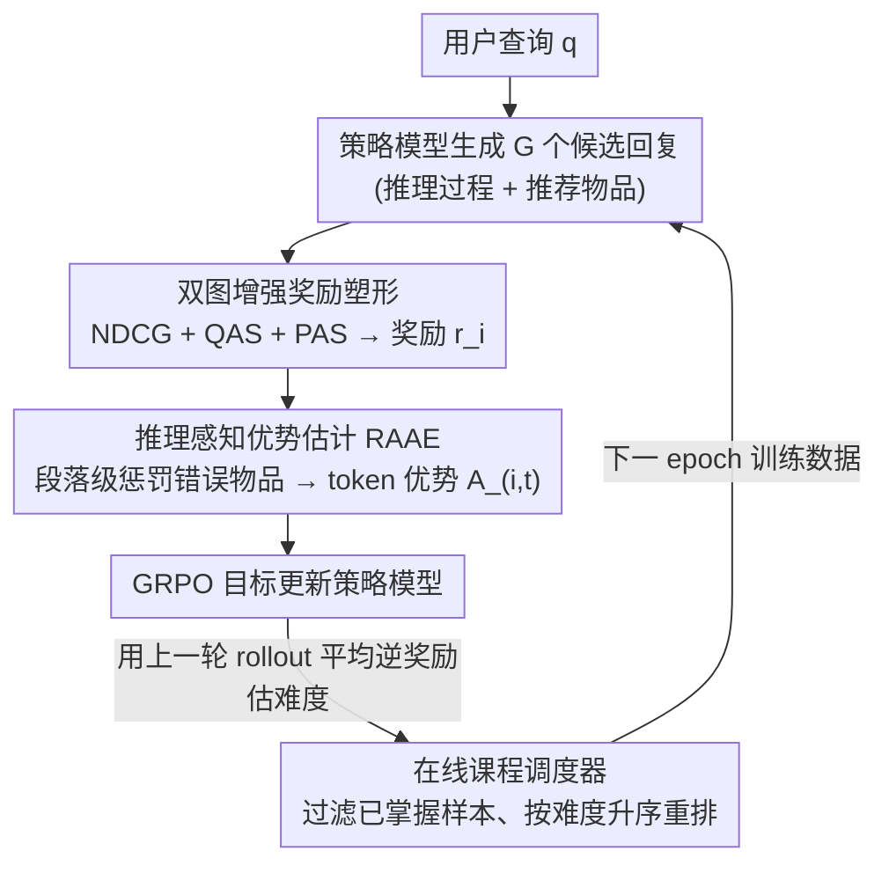

# ReRec: Reasoning-Augmented LLM-based Recommendation Assistant via Reinforcement Fine-tuning

**会议**: ACL 2026  
**arXiv**: [2604.07851](https://arxiv.org/abs/2604.07851)  
**代码**: [GitHub](https://github.com/jiani-huang/ReRec)  
**领域**: 强化学习  
**关键词**: 推荐助手, 强化微调, 推理增强, 奖励塑形, 课程学习

## 一句话总结

本文提出 ReRec，一个基于强化微调（RFT）的推荐助手框架，通过双图增强的奖励塑形提供细粒度奖励信号、推理感知的优势估计对推理步骤进行差异化监督、以及在线课程调度器动态调整训练难度，使 LLM 能处理复杂的多步推理推荐查询，在 RecBench+ 基准上显著超越现有方法。

## 研究背景与动机

**领域现状**：传统推荐系统（矩阵分解、GNN 等）依赖历史交互数据，无法处理自然语言查询。LLM 的出现为智能推荐助手带来了新可能，近期研究探索了基于 LLM 的对话推荐系统（CRS），但大多仅处理简单直接的查询，如"推荐一部科幻电影"。

**现有痛点**：(1) 现实用户查询往往复杂且需要多步推理。例如："推荐主演了那部关于一个人被困在岛上的电影中男主角出演的其他电影"——需要先推断是《荒岛余生》，再找到 Tom Hanks，再推荐他的其他电影。现有 LLM 推荐系统缺乏这种深层推理能力。(2) 将 RFT 直接应用于推荐任务面临两大挑战：奖励信号过于粗糙（NDCG 只看精确匹配，合理但不完全匹配的推荐得零分）；推理过程缺乏监督（所有 token 共享同一奖励分数，无法区分正确和错误的推理步骤）。

**核心矛盾**：NDCG 等精确匹配指标作为奖励信号过于苛刻和稀疏——满足查询约束但不匹配 ground truth 的推荐与完全无关的推荐获得相同的零奖励，导致策略模型的探索效率低下。

**本文目标**：设计一个专为推荐任务定制的 RFT 框架，解决奖励粒度不足和推理过程无监督两大核心问题。

**切入角度**：从三个维度改进 RFT 用于推荐：(1) 利用物品属性图和协同过滤信号丰富奖励空间；(2) 将推理过程分段并对错误步骤施加惩罚；(3) 根据模型动态能力调整训练课程。

**核心 idea**：将推荐任务的奖励从粗粒度的精确匹配扩展为融合查询对齐度和偏好对齐度的细粒度信号，同时在推理步骤级别提供差异化监督，使 LLM 学会推理而非记忆。

## 方法详解

### 整体框架

ReRec 基于 GRPO 强化学习框架。给定用户查询 $q$，LLM 策略模型生成多个候选回复 $\{o_1, ..., o_G\}$，每个回复包含推理过程和推荐物品。三个核心模块分别作用于奖励计算、优势估计和训练调度：双图增强奖励塑形计算每个回复的奖励 $r_i$；推理感知优势估计将奖励分配到推理步骤级别的 token 优势 $A_{i,t}$；在线课程调度器动态调整每个 epoch 的训练数据顺序和难度。

### 关键设计

**1. 双图增强奖励塑形：把"非黑即白"的精确匹配奖励，扩成既看查询约束又看用户偏好的细粒度信号**

NDCG@K 只认精确命中 ground truth，一个满足了"科幻 + Tom Hanks"约束、但碰巧不是标准答案的推荐，会和完全无关的推荐拿到同样的零分，策略模型根本探不出方向。ReRec 在 NDCG 之外补两路辅助分。**查询对齐分（QAS）**走物品-属性图 $G_{attr}$，看推荐物品与 ground truth 在属性关系上的重叠比例 $S_{QAS}(p_i, gt) = |R_{p_i}^{G_{attr}} \cap R_{gt}^{G_{attr}}| / |R_{gt}^{G_{attr}}|$，于是合理但不精确的推荐也能拿到部分奖励而不是被一刀切到零。**偏好对齐分（PAS）**则用预训练的轻量推荐模型（如 LightGCN）从用户-物品交互图里取嵌入，算余弦相似度 $S_{PAS}(p_i, gt) = \mathcal{M}(p_i) \cdot \mathcal{M}(gt) / (\|\mathcal{M}(p_i)\| \|\mathcal{M}(gt)\|)$，把协同过滤里的隐式偏好引进来，防止模型只对齐属性却丢了个性化。最终奖励是三者加权之和：

$$r_i = \text{NDCG} + w_1 S_{QAS} + w_2 S_{PAS}$$

QAS 管显式约束、PAS 管隐式偏好，两路一起把原本稀疏苛刻的奖励空间填密，Hard 查询上的探索效率提升尤其明显。

**2. 推理感知优势估计（RAAE）：给推理过程做步骤级监督，专门惩罚那些把错误物品放进去的段落**

传统 RFT 给一条回复里所有 token 同一个奖励，模型分不清是哪一步推理错了。RAAE 把输出 $o_i$ 按段落切成 $K$ 个推理步骤 $\mathcal{S}_i = \{s_{i,1}, ..., s_{i,K}\}$，逐段检查：如果某段落讨论了一个最终被错误推荐的物品（$p_i \neq gt$ 且 $p_i \in s_{i,k}$），说明模型在这一步没能把它排除掉，就把该段奖励打折为 $r_{s_{i,k}} = (1 - w_{penalty}) \cdot r_i$，其余段落保持原奖励。再把段落奖励铺到 token 级，做组内归一化得到优势 $A_{i,t} = (r_{i,t} - \text{mean}(\mathbf{r})) / \text{std}(\mathbf{r})$。这等于用"段落是否含错误物品"这条廉价规则换来了过程级监督，省掉了训练专用过程奖励模型的高昂成本，消融里它也是移除后掉点最狠的一块。

**3. 在线课程调度器：用上一轮的 rollout 零成本估难度，按由易到难重排训练数据**

推荐任务不像数学/代码有现成的难度分级，且静态课程跟不上模型边训边变强的节奏。ReRec 直接复用 RFT 本就产出的 rollout：在 epoch $t$ 开始时，用上一轮每个查询的平均逆奖励 $d^{t-1} = \frac{1}{G}\sum_{i=1}^G (1 - r_i)$ 当难度——奖励越低说明越难；接着过滤掉难度低于阈值 $\tau$ 的"已掌握"样本，剩下的按难度升序排成新数据集 $\mathcal{D}^t$；每个 epoch 重复一次，难度估计随模型能力同步刷新。整个过程不需要任何额外推理，靠现成 rollout 数据就把课程动态对齐到模型当前的真实水平。

### 损失函数 / 训练策略

采用 GRPO 目标函数，使用裁剪概率比：$\mathcal{J}(\theta) = \mathbb{E}[\frac{1}{N}\sum_{i=1}^G \sum_{t=1}^{|o_i|} \min(h_{i,t}(\theta) A_{i,t}, \text{clip}(h_{i,t}(\theta), 1-\varepsilon, 1+\varepsilon) A_{i,t})]$。骨干模型为 Qwen-2.5-3B-Instruct 和 Llama-3.2-3B-Instruct。

## 实验关键数据

### 主实验

**RecBench+ 基准上的推荐准确率（Llama-3.2-3B-Instruct 骨干）**

| 方法 | Movie-Simple | Movie-Medium | Movie-Hard | Movie-Interest | Book-Simple | Book-Hard | Book-Interest |
|------|-------------|-------------|-----------|---------------|-------------|----------|--------------|
| Llama 原始 | 0.107 | 0.052 | 0.029 | 0.097 | 0.215 | 0.106 | 0.254 |
| GPT-4o | 0.554 | 0.519 | 0.188 | 0.550 | 0.554 | 0.160 | 0.458 |
| GRPO | 0.686 | 0.600 | 0.644 | 0.651 | 0.664 | 0.713 | 0.786 |
| REINFORCE++ | 0.699 | 0.623 | 0.597 | 0.676 | 0.661 | 0.697 | 0.795 |
| **ReRec** | **0.748** | **0.700** | **0.729** | **0.719** | **0.671** | **0.750** | **0.811** |

### 消融实验

| 配置 | 效果 |
|------|------|
| ReRec (Full) | 最佳，全维度最高准确率 |
| w/o RAAE | 下降最大，推理步骤监督是核心贡献 |
| w/o QAS | 明显下降，查询约束对齐对 Hard 查询尤为重要 |
| w/o PAS | 轻微下降，隐式偏好对个性化场景更关键 |
| w/o Curriculum | 中等下降，训练稳定性受影响 |

### 关键发现

- ReRec 在 Movie-Hard 任务上相比未训练模型提升约 2414%（0.029→0.729），说明 RFT 极大增强了 LLM 处理误导性查询的推理能力
- 3B 参数的 ReRec 在大多数任务上超越 GPT-4o 和 DeepSeek-R1
- 消融实验中 RAAE 移除影响最大，证明推理过程监督是核心贡献
- 跨域泛化：Movie 训练的模型在 Book 上达 0.494（Llama 基线 0.168，提升 194%），超越 GPT-4o（0.453）
- 跨任务泛化：在序列推荐任务上达到专用模型 SASRec 88.4% 的性能
- 相比 SFT，ReRec 保持了推理能力（+21.6%），而 SFT 的知识能力下降 80%

## 亮点与洞察

- 双图奖励塑形的设计非常务实：QAS 利用物品属性图解决"精确匹配过于苛刻"的问题，PAS 利用协同过滤嵌入捕捉隐式偏好——两者分别从显式约束和隐式偏好两个维度丰富奖励信号，可迁移到其他需要细粒度奖励的 RFT 任务
- RAAE 的段落级惩罚机制提供了一种轻量级的过程监督替代方案：不需要训练专用奖励模型，仅通过检查推理段落是否包含错误推荐物品来分配差异化奖励，简单有效
- 在线课程调度器巧妙利用了 RFT 中已有的 rollout 数据来估计难度，零额外推理成本

## 局限与展望

- 仅支持单轮对话推荐，未考虑多轮对话中的上下文累积和动态需求调整
- 候选集设置为 1 正 19 负的选择题形式，与开放式推荐场景差距较大
- RAAE 的段落分解依赖简单的段落切分，对非结构化或混合推理的输出可能不够准确
- 骨干模型仅 3B 参数，更大模型上的效果未验证
- QAS 和 PAS 的权重 $w_1, w_2$ 需要调参，文中未充分讨论敏感性

## 相关工作与启发

- **vs GRPO/REINFORCE++**: 这些通用 RFT 方法使用精确匹配作为奖励，在推荐任务上奖励过于稀疏；ReRec 通过双图奖励塑形提供更丰富的学习信号，在 Hard 查询上优势尤为明显
- **vs TallRec/InteRecAgent**: 这些 LLM 推荐系统基于 SFT 或工具调用，处理简单查询尚可但缺乏深层推理能力；ReRec 通过 RFT 激发推理能力，在复杂查询上提升显著
- **vs Process Reward Models**: 传统过程奖励模型需要额外训练或调用大模型来评分推理步骤，成本高且可扩展性差；RAAE 通过简单的物品匹配规则实现轻量级的步骤监督

## 评分

- 新颖性: ⭐⭐⭐⭐ 将 RFT 系统性地适配到推荐任务，三个模块设计针对性强
- 实验充分度: ⭐⭐⭐⭐ 覆盖跨域、跨任务、个性化、能力保持等多个维度
- 写作质量: ⭐⭐⭐⭐ 问题动机清晰，方法描述完整，公式推导规范
- 价值: ⭐⭐⭐⭐ RFT 用于推荐系统的实践指南，双图奖励和 RAAE 可复用

<!-- RELATED:START -->

## 相关论文

- [\[NeurIPS 2025\] Transformer Copilot: Learning from The Mistake Log in LLM Fine-tuning](../../NeurIPS2025/recommender/transformer_copilot_learning_from_the_mistake_log_in_llm_fine-tuning.md)
- [\[ACL 2026\] HARPO: Hierarchical Agentic Reasoning for User-Aligned Conversational Recommendation](harpo_hierarchical_agentic_reasoning_for_user-aligned_conversational_recommendat.md)
- [\[ACL 2026\] Where and What: Reasoning Dynamic and Implicit Preferences in Situated Conversational Recommendation](where_and_what_reasoning_dynamic_and_implicit_preferences_in_situated_conversati.md)
- [\[AAAI 2026\] TraveLLaMA: A Multimodal Travel Assistant with Large-Scale Dataset and Structured Reasoning](../../AAAI2026/recommender/travellama_a_multimodal_travel_assistant_with_large-scale_dataset_and_structured.md)
- [\[AAAI 2026\] Tool4POI: A Tool-Augmented LLM Framework for Next POI Recommendation](../../AAAI2026/recommender/tool4poi_a_tool-augmented_llm_framework_for_next_poi_recommendation.md)

<!-- RELATED:END -->
