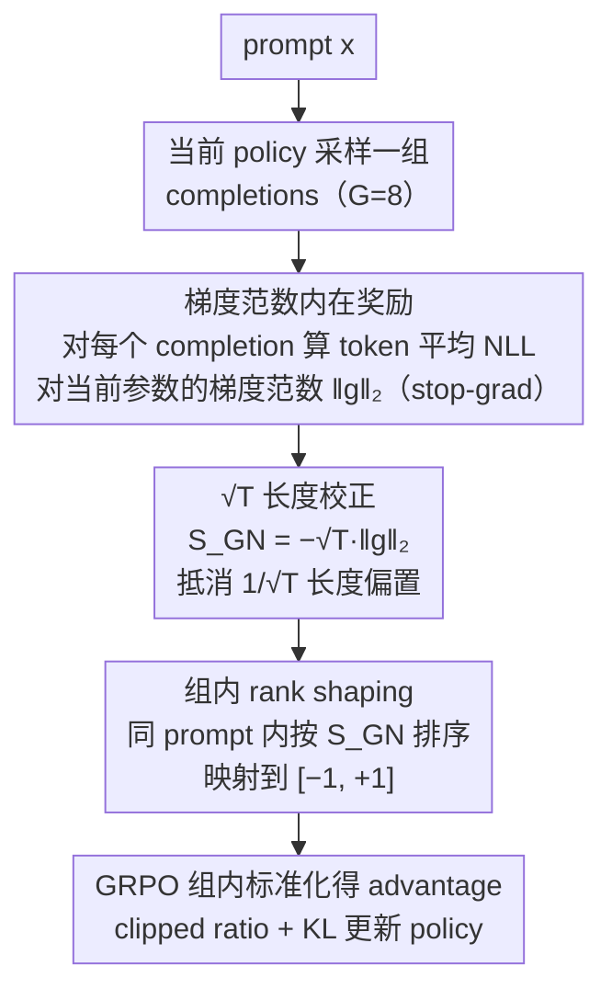

# Verifier-Free RL for LLMs via Intrinsic Gradient-Norm Reward

**会议**: ACL2026 Findings  
**arXiv**: [2605.09920](https://arxiv.org/abs/2605.09920)  
**代码**: https://github.com/ZJUSCL/VIGOR  
**领域**: reinforcement_learning  
**关键词**: verifier-free RL, GRPO, intrinsic reward, gradient norm, 长度校正  

## 一句话总结
VIGOR 用每个 completion 在当前模型参数下的 teacher-forced NLL 梯度范数作为内在奖励，偏好低梯度范数输出，并通过 $\sqrt{T}$ 长度校正和组内 rank shaping 稳定 GRPO，从而在无需 gold answer 或外部 verifier 的情况下提升数学与代码推理。

## 研究背景与动机
**领域现状**：RLVR 已经成为提升 LLM 推理能力的重要后训练范式，数学任务常用 exact-match verifier，代码任务常用单元测试或执行结果作为 reward。GRPO 等算法可以在每个 prompt 下采样一组 completions，再用组内 reward 标准化得到 advantage。

**现有痛点**：可验证 reward 并不是所有任务都有。数学答案需要可抽取且能精确匹配，代码需要测试用例，开放式问答、长文生成或弱监督任务很难构造可靠 verifier。已有 verifier-free 方法会用多数投票、likelihood、entropy 或 self-certainty 构造内在信号，但这些信号往往随着训练被模型“钻空子”，出现 reward proxy degeneration、长度膨胀或后期性能回退。

**核心矛盾**：RL 后训练需要 reward 指导模型偏向更好输出，但如果 reward 来自模型自身，它必须既不依赖标签，又不能被模型轻易操纵。token 概率/熵这类局部分布信号很便宜，却容易被表面行为影响；外部 verifier 更可靠，却不通用。

**本文目标**：作者希望找到一种只依赖 policy model 自身、对输出格式要求低、且训练过程稳定的 intrinsic reward，使 GRPO 可以在没有答案标签和任务 verifier 的情况下继续提升推理能力。

**切入角度**：论文从优化视角出发：如果一个 completion 在 teacher-forced 条件下对当前参数诱发较小的负对数似然梯度范数，说明它更靠近当前 policy 的平滑/稳定区域，更新方向更温和；反之，大梯度范数可能意味着该输出与当前模型不一致或需要剧烈参数调整。

**核心 idea**：把 completion 的长度校正梯度范数排序转成组内奖励，低梯度范数 completion 得高 reward，高梯度范数 completion 得低 reward，再用 GRPO 更新 policy。

## 方法详解
VIGOR 的直觉可以这样理解：对同一个 prompt，模型采样出 8 个候选解答。每个候选都可以被看成一段 teacher-forced 训练样本，计算它的 token 平均 NLL 对当前参数的梯度。如果某个候选让模型参数空间中的 loss surface 更平坦、梯度更小，作者就把它视作更“自洽”和更稳定的输出。VIGOR 不需要知道最终答案是否正确，而是在同一组候选内部按这个稳定性信号排序，作为 GRPO 的相对奖励。

### 整体框架
给定 prompt $x$，当前 policy $\pi_\theta$ 采样一组 completions $\{y_i\}_{i=1}^{G}$，论文实验中 $G=8$。对每个 completion $y=(y_1,\ldots,y_T)$，先计算 token 平均 NLL $\ell_{mean}(x,y)=\frac{1}{T}\sum_{t=1}^{T}\ell_t(x,y)$，再计算梯度 $g(x,y)=\nabla_\theta \ell_{mean}(x,y)$ 的 $\ell_2$ 范数。这个范数不会继续反向传播，只作为标量 reward 信号。

原始平均梯度范数有一个严重问题：completion 越长，token-level 梯度在求平均时越容易相互抵消，导致 $\|g\|_2$ 随长度大致按 $1/\sqrt{T}$ 缩小。若直接奖励低梯度范数，模型会倾向于生成更长文本来“骗” reward。因此 VIGOR 使用 $S_{GN}(x,y)=-\sqrt{T}\|g(x,y)\|_2$，用 $\sqrt{T}$ 抵消长度偏置，负号则把“越小越好”的梯度范数变成“越大越好”的 reward。

最后，对同一 prompt 的 $G$ 个 $S_{GN}$ 做排序，把最差 completion 映射到 -1，最好映射到 +1，中间均匀分布，再按 GRPO 的组内标准化得到 advantage，更新 policy。

### 关键设计
**1. 梯度范数作为 verifier-free intrinsic reward：用参数空间的局部几何代替"答案对不对"**

很多任务根本没有可靠 verifier——开放式问答、长文生成、弱监督任务都难构造 gold answer 或执行器，而已有的 entropy / self-certainty 这类信号直接来自词表概率分布，容易被模型用表面 token 模式钻空子。VIGOR 换了个视角：把每个 completion 当作 teacher-forced 序列，计算 token 平均 NLL $\ell_{mean}(x,y)=\frac{1}{T}\sum_{t=1}^{T}\ell_t(x,y)$ 对当前参数的梯度范数 $\|g(x,y)\|_2$，梯度范数越小，说明这段输出落在当前 policy 更平滑、更少引发剧烈更新的区域，因而在同组候选里被判为更优。相比只看局部概率分布，梯度范数汇总的是高维参数空间的整体变化，理论上更难被简单的 token 级模式操纵——这个范数只作为标量 reward，不再继续反向传播。

**2. $\sqrt{T}$ 长度校正：堵住"写长就能骗低梯度"的漏洞**

原始平均梯度范数有个致命偏置：completion 越长，token 级梯度在求平均时越容易相互抵消，$\|g\|_2$ 大致按 $1/\sqrt{T}$ 缩小，于是直接奖励低梯度范数会变相奖励"写得长"。论文实证看得很清楚——在约 250/500/750/1000 token 的长度 bin 里原始梯度范数从约 180 降到约 90，但乘上 $\sqrt{T}$ 后都稳定在约 $2.85\times10^3$ 到 $2.91\times10^3$。因此最终 reward 取 $S_{GN}(x,y)=-\sqrt{T}\|g(x,y)\|_2$：$\sqrt{T}$ 把长度因素从梯度信号里解耦出来，负号则把"越小越好"翻成"越大越好"。少了这一步，尤其在 3B 模型上会直接触发长度膨胀和准确率崩溃。

**3. 组内 rank-based reward shaping：只留相对顺序，丢掉跨 prompt 不可比的绝对幅值**

不同 prompt 的梯度范数尺度差异可能很大，若直接用原始值，少数极端 prompt 会主导整批更新。VIGOR 对同一 prompt 的 $G$ 个 $S_{GN}$ 排序，rank 从 0 到 $G-1$，再映射成 $R_{GN}(x,y_i)=2\frac{rank_i}{G-1}-1$，最差为 $-1$、最好为 $+1$，中间均匀分布。这样每个 prompt 内部贡献被拉平，既消除了跨 prompt 的尺度差，又压住了 reward outlier 的影响，天然契合 GRPO 的组相对优化语境。

### 损失函数 / 训练策略
VIGOR 直接接入 GRPO。每个 prompt 采样 $G=8$ 个 completions，计算长度校正的梯度范数 reward，做 rank normalization，再做组内 mean-std 标准化得到 advantage $\hat{A}_i$。策略目标与 GRPO 一致：最大化 clipped probability ratio 与 advantage 的乘积，并加 KL 正则约束当前 policy 与 reference policy。一个关键实现细节是 stop-gradient：reward 虽然由当前参数的梯度范数算出，但训练时把它 detach 成常数，避免二阶梯度带来的开销和不稳定。

## 实验关键数据

### 主实验
实验在 Qwen2.5-3B-Base 和 Qwen2.5-7B-Base 上进行，分别用 MATH 训练集和 CodeContests 子集做 post-training。训练时 VIGOR 不使用参考答案，只把题目作为 prompt；gold answer 只用于评测和 GT-Reward baseline。评测覆盖 MATH-500、GSM8K、AMC、LiveCodeBench v6、CRUX、MMLU-Pro、IFEval。

| 训练集/模型 | 方法 | 数学 Avg. | 代码 Avg. | MMLU-Pro | IFEval |
|-------------|------|-----------|-----------|----------|--------|
| MATH / Qwen2.5-3B | Base | 48.34 | 16.98 | 36.92 | 28.30 |
| MATH / Qwen2.5-3B | INTUITOR | 57.10 | 26.79 | 24.48 | 29.11 |
| MATH / Qwen2.5-3B | VIGOR | 59.14 | 27.95 | 32.65 | 31.72 |
| MATH / Qwen2.5-7B | Base | 42.58 | 9.69 | 47.21 | 35.90 |
| MATH / Qwen2.5-7B | INTUITOR | 66.46 | 38.51 | 43.04 | 34.91 |
| MATH / Qwen2.5-7B | VIGOR | 69.77 | 40.42 | 43.09 | 37.03 |

| 训练集/模型 | 方法 | GSM8K | MATH500 | AMC | 数学 Avg. | LiveCodeBench | CRUX | 代码 Avg. |
|-------------|------|-------|---------|-----|-----------|---------------|------|-----------|
| CodeContests / Qwen2.5-3B | Base | 67.93 | 54.80 | 22.28 | 48.34 | 9.57 | 24.38 | 16.98 |
| CodeContests / Qwen2.5-3B | INTUITOR | 75.13 | 58.60 | 22.59 | 52.11 | 11.47 | 39.38 | 25.43 |
| CodeContests / Qwen2.5-3B | VIGOR | 77.10 | 62.80 | 29.82 | 56.57 | 11.65 | 35.62 | 23.64 |

### 消融实验

| 模型 | 配置 | 数学 Avg. | 代码 Avg. | MMLU-Pro | IFEval | 说明 |
|------|------|-----------|-----------|----------|--------|------|
| Qwen2.5-3B | Full VIGOR | 59.14 | 27.95 | 32.65 | 31.72 | 完整方法 |
| Qwen2.5-3B | w/o $\sqrt{T}$ | 20.71 | 0.00 | 36.39 | 29.30 | 长度校正去掉后 GSM8K/AMC 接近崩溃，代码迁移归零 |
| Qwen2.5-3B | w/o rank | 58.00 | 27.07 | 33.44 | 30.19 | 数学略降，通用能力出现 trade-off |
| Qwen2.5-7B | Full VIGOR | 69.77 | 40.42 | 43.09 | 37.03 | 完整方法 |
| Qwen2.5-7B | w/o $\sqrt{T}$ | 68.29 | 41.34 | 41.34 | 37.23 | 7B 对长度偏置更稳，但仍低于 full |
| Qwen2.5-7B | w/o rank | 69.21 | 40.06 | 34.19 | 38.32 | MMLU-Pro 大幅退化，说明 rank shaping 保护通用能力 |

| Rank | Step 10 Acc. | Step 20 Acc. | 含义 |
|------|--------------|--------------|------|
| 1 (best) | 70.50 | 72.30 | 梯度范数排序最优的 completion 最常正确 |
| 2 | 68.20 | 71.10 | 排名靠前仍保持较高准确率 |
| 4 | 67.00 | 67.40 | 中位样本明显低于 top rank |
| 6 | 60.70 | 66.00 | 后排样本正确率下降 |
| 8 (worst) | 52.70 | 63.40 | 最差 rank 与最佳 rank 差距为 17.8/8.9 个点 |

### 关键发现
- 在 MATH 后训练中，VIGOR 在 7B 上相对 INTUITOR 提升数学平均 +3.31、代码平均 +1.91；在 3B 上也同时提升数学、代码和 IFEval。
- VIGOR 的跨域迁移很明显：只用 MATH 训练时，3B/7B 的代码平均分别从 16.98/9.69 提升到 27.95/40.42。
- 代码训练实验是轻量 sanity check。VIGOR 在 CodeContests 上让数学平均从 48.34 到 56.57，但代码平均 23.64 低于 INTUITOR 的 25.43，说明梯度范数对离散算法选择不一定最敏感。
- reward reliability 分析显示，按梯度范数排在 top-25% 的 completions 在训练过程中比 INTUITOR 更稳定，不像 self-certainty reward 那样后期退化。
- $\sqrt{T}$ 校正是最关键组件；尤其在 3B 模型上，去掉后出现长度 hacking，GSM8K 只有 0.08，AMC 只有 1.66。

## 亮点与洞察
- 这篇论文把 reward 从“输出表面概率”移到“参数空间局部几何”，角度很新。梯度范数不是直接判断答案正确，而是判断这个 completion 是否与当前 policy 的稳定区域一致。
- 长度校正做得很关键，也很诚实。作者没有只提出梯度范数，而是直接指出平均 NLL 梯度有 $1/\sqrt{T}$ 偏置，并用实验表明不校正会崩。
- rank shaping 很适合 GRPO 的组相对语境。它承认 intrinsic reward 的绝对值跨 prompt 不可比，只利用同一 prompt 内的排序，这让方法更稳。
- 这个思路可以迁移到弱可验证任务：当外部 reward 不可得时，可以尝试用模型内部的梯度/曲率/一致性信号做候选排序，再结合少量人工或自动 judge 校验。

## 局限与展望
- 论文主要验证的是数学和代码这类仍可评测正确性的任务。对于开放式写作、对话、安全对齐等任务，低梯度范数是否对应更好输出还不确定。
- 计算每个 completion 的梯度范数比 forward-only 的 entropy 或 likelihood reward 更贵，需要自动微分；虽然附录有 LM-head-only 近似，但大模型规模上仍可能是主要瓶颈。
- 梯度范数本质上只是 proxy。模型可能未来学会生成“低梯度但无用”的模式，仍存在 reward exploitation 风险。
- 代码任务上 VIGOR 对 CRUX 不如 INTUITOR，说明一些需要离散算法正确性的场景，参数空间平滑性不能完全替代执行反馈。

## 相关工作与启发
- **vs RLVR / GT-Reward**: RLVR 使用 exact match 或执行器，reward 可靠但依赖任务 verifier；VIGOR 不用标签和 verifier，更通用，但 reward 只是间接 proxy。
- **vs INTUITOR / RLIF**: INTUITOR 用 policy 内部 confidence/likelihood 信号，容易后期退化；VIGOR 用梯度范数和 rank shaping，训练动态更稳定。
- **vs 多数投票伪标签方法**: TTRL/Co-rewarding 等方法依赖最终答案可抽取和可聚合；VIGOR 不需要抽取答案，因此理论上更适合自由形式 completion。
- **vs entropy-based intrinsic reward**: entropy 来自 token 分布，容易被局部概率形态影响；梯度范数聚合参数空间信号，更像对整个 completion 与模型状态的一致性检查。

## 评分
- 新颖性: ⭐⭐⭐⭐⭐ 用 teacher-forced 梯度范数做 verifier-free reward，视角鲜明且和常见 confidence/entropy 方法不同。
- 实验充分度: ⭐⭐⭐⭐☆ 主实验、跨域迁移、训练动态、rank-accuracy 和消融都充分；开放式任务验证仍缺。
- 写作质量: ⭐⭐⭐⭐☆ 方法推导清楚，长度偏置解释到位；部分训练成本细节主要在附录，需要读者进一步查。
- 价值: ⭐⭐⭐⭐☆ 对无 verifier 场景的 RL 后训练很有价值，但梯度计算成本会影响实际部署范围。

<!-- RELATED:START -->

## 相关论文

- [\[ACL 2026\] Free Energy-Driven Reinforcement Learning with Adaptive Advantage Shaping for Unsupervised Reasoning in LLMs](free_energy-driven_reinforcement_learning_with_adaptive_advantage_shaping_for_un.md)
- [\[NeurIPS 2025\] RL Tango: Reinforcing Generator and Verifier Together for Language Reasoning](../../NeurIPS2025/reinforcement_learning/rl_tango_reinforcing_generator_and_verifier_together_for_lan.md)
- [\[ICML 2026\] From Reward-Free Representations to Preferences: Rethinking Offline Preference-Based Reinforcement Learning](../../ICML2026/reinforcement_learning/from_reward-free_representations_to_preferences_rethinking_offline_preference-ba.md)
- [\[ACL 2026\] RL-PLUS: Countering Capability Boundary Collapse of LLMs in Reinforcement Learning with Hybrid-policy Optimization](rl-plus_countering_capability_boundary_collapse_of_llms_in_reinforcement_learnin.md)
- [\[ACL 2026\] LearnAlign: Data Selection for LLM Reinforcement Learning with Improved Gradient Alignment](learnalign_data_selection_for_llm_reinforcement_learning_with_improved_gradient_.md)

<!-- RELATED:END -->
