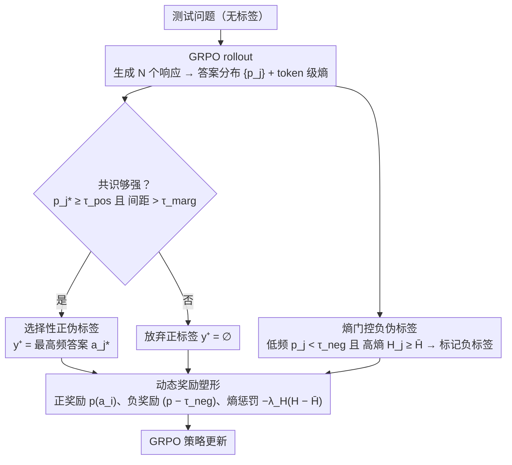

# SCRL: What If Consensus Lies? Selective-Complementary Reinforcement Learning at Test Time

**会议**: ACL 2026  
**arXiv**: [2603.19880](https://arxiv.org/abs/2603.19880)  
**代码**: [https://github.com/Jasper-Yan/SCRL](https://github.com/Jasper-Yan/SCRL)  
**领域**: 强化学习 / LLM推理  
**关键词**: 测试时强化学习, 伪标签噪声, 负标签, 共识可靠性, 无监督推理

## 一句话总结

本文提出 SCRL（Selective-Complementary Reinforcement Learning），一个鲁棒的测试时强化学习框架，通过选择性正伪标签（严格共识标准过滤不可靠多数）和熵门控负伪标签（首次在 TTRL 中引入负监督信号来修剪错误轨迹）缓解标签噪声放大问题，在 AIME25 上比 TTRL 提升高达 10.1 个百分点。

## 研究背景与动机

**领域现状**：测试时强化学习（TTRL）让 LLM 在无标签测试流上通过多数投票共识派生伪奖励进行自我改进，已成为无监督推理的关键范式。

**现有痛点**：现有 TTRL 方法完全依赖正伪标签策略——多数投票选择最频繁答案作为正标签。但在困难问题上，答案分布高度分散，共识薄弱。GRPO 的组归一化会放大噪声：当正标签比例 $f$ 很小时，正样本的归一化优势 $\hat{A}^+ = \sqrt{(1-f)/f}$ 变得很大，少数错误的正伪标签就会不成比例地影响策略更新，导致过早收敛到虚假解。

**核心矛盾**：在困难问题上，确定正确答案很难，但识别错误答案相对容易。然而现有方法忽视了负标签的潜力——当无法可靠地识别正确答案时，可以通过修剪错误轨迹来缩小搜索空间。

**本文目标**：在 TTRL 中同时利用正信号和负信号，在共识不可靠时通过负标签修剪搜索空间而非强行选择正标签。

**切入角度**：区分"低频但可能正确"和"低频且确实错误"的答案——通过生成不确定性（token 级熵）来判断：高频低熵=可能正确，低频高熵=大概率错误。

**核心 idea**：当共识足够强时才提供正监督（选择性），当共识不够时通过负标签修剪确定错误的轨迹（互补性），两者配合动态奖励塑形实现鲁棒的测试时学习。

## 方法详解

### 整体框架

SCRL 的目标是让测试时强化学习在困难问题、弱共识的场景下也不被噪声带偏。它在 GRPO 之上叠了三层防护：先用一套严格标准决定"这轮到底要不要给正标签"，再把那些明显错的低频轨迹拎出来作为负标签去修剪搜索空间，最后让正负信号的奖励幅度随共识强弱自适应缩放。三者配合，把原本"无脑信多数投票"的 TTRL 改造成"共识可信才学正、共识不可信就排错"的鲁棒框架。

### 关键设计

**1. 选择性正伪标签：共识不够强就干脆不给正标签**

TTRL 的痛点是多数投票在困难题上选出的答案往往只是"略多于别人"，把它当正标签强化会把错误解越练越牢。SCRL 给正监督加了一道双重闸门：对 $N$ 个响应统计答案分布 $\{p_j\}$，只有当最高比例 $p_{j^*} \geq \tau_{\text{pos}}$（支持率足够高）**且** 与次优答案的间距 $(p_{j^*} - p_{(2)}) > \tau_{\text{marg}}$（领先足够明显）同时成立时，才声明正伪标签 $y^+ = a_{j^*}$；否则 $y^+ = \varnothing$，本轮直接放弃正监督。阈值与间距的双条件意味着只有在分布"又尖又分离"时才相信共识，从源头掐断了弱共识下的噪声放大。

**2. 熵门控负伪标签：用不确定性把"罕见但错"和"罕见但对"分开**

当无法给正标签时，SCRL 转而做 TTRL 里以前没人做过的事——引入负监督，把确定错误的轨迹修剪掉。难点在于低频答案有两种可能：罕见但正确，或确实是错误推理。SCRL 用生成时的 token 级熵来区分：对每个答案 $a_j$ 算其轨迹的平均熵 $\bar{H}_j$，只有当 $p_j < \tau_{\text{neg}}$（低频）**且** $\bar{H}_j \geq \bar{H}$（高于全局平均不确定性）时才打负标签。那条 $\bar{H}_j \geq \bar{H}$ 的约束是关键——它保护了"低频但模型很笃定"的罕见正确解不被误伤，只惩罚那些既稀少、模型自己又心虚的轨迹。

**3. 动态奖励塑形：让奖励幅度和共识可靠性成正比**

固定大小的奖励在共识忽强忽弱时同样会放大噪声，所以 SCRL 让正负信号的幅度都随分布自适应：正奖励取答案比例 $p(a_i)$，共识越强给得越多；负奖励取 $(p(a_i) - \tau_{\text{neg}})$，答案越稀少惩罚越重；再叠一项熵惩罚 $-\lambda_H(\bar{H}(a_i) - \bar{H})$，把策略往低不确定性的响应上推。三项加权组合后，奖励信号的强度始终跟着共识可靠性走，避免了一刀切奖励在弱共识时把错误样本喂得过猛。

### 损失函数 / 训练策略

使用 GRPO 作为基础 RL 算法。AdamW 优化器，余弦学习率调度（峰值 $5 \times 10^{-7}$）。rollout 生成 64（或 32）个候选响应用于标签估计，下采样 32（或 16）个用于训练更新。阈值 $\tau_{\text{pos}}=0.375, \tau_{\text{marg}}=0.125, \tau_{\text{neg}}=0.125$。8×A100 80GB GPU。

## 实验关键数据

### 主实验

**Qwen2.5-Math-7B 上的 pass@1 准确率（%）**

| 方法 | AIME25 | AMC | MATH-500 | Minerva | 平均 |
|------|--------|-----|---------|---------|------|
| 基线 | 4.6 | 34.0 | 46.5 | 10.1 | 23.6 |
| + TTRL | 16.8 | 65.7 | 85.7 | 14.5* | 41.6 |
| **+ SCRL** | **26.9** | **66.9** | **85.6** | **41.6** | **49.3** |
| Δ vs TTRL | +10.1 | +1.2 | -0.1 | +27.1 | +7.7 |

*注：TTRL 在 Minerva 上达到 14.5% 峰值后性能急剧退化*

**Llama-3.1-8B-Instruct 上的 pass@1（%）**

| 方法 | AIME24 | AMC | 平均 |
|------|--------|------|------|
| + TTRL | 10.0 | 32.3 | 21.2 |
| + RESTRAIN | 16.7 | 40.0 | 28.4 |
| **+ SCRL** | **21.9** | 36.1 | **29.0** |

### 消融实验

| 配置 | AIME25 | AMC | 说明 |
|------|--------|-----|------|
| Full SCRL | 26.9 | 66.9 | 完整模型 |
| w/o 负标签 | 19.4 | 65.3 | 负标签贡献 +7.5 (AIME25) |
| w/o 选择性正标签 | 21.5 | 66.1 | 选择性贡献 +5.4 |
| w/o 熵门控 | 23.1 | 65.8 | 熵条件贡献 +3.8 |
| w/o 动态奖励 | 24.2 | 66.0 | 动态奖励贡献 +2.7 |

### 关键发现

- 在最困难的任务（AIME25）上提升最大（+10.1），恰好是弱共识问题最严重的场景
- Minerva 上 TTRL 出现训练不稳定（性能先升后急剧下降），SCRL 保持稳定训练动态（41.6% vs 14.5%）
- 负标签在困难任务上贡献最大（AIME25 +7.5），验证了"不知道什么对就排除什么错"的策略价值
- SCRL 的效果在低 rollout 预算下更显著——预算受限时共识更不可靠，SCRL 的保护机制更重要
- 跨模型族（Qwen、Llama）和跨规模（1B-7B）一致有效，展现模型无关性

## 亮点与洞察

- "共识可能是错的"这一洞察直击 TTRL 的根本假设，负标签机制是自然且优雅的解决方案
- 熵门控是区分"罕见正确"和"确实错误"的关键——仅用频率或仅用不确定性都不够，两者的交叉条件才可靠
- 动态奖励塑形让正负信号的强度与共识可靠性自适应匹配，避免了固定奖励的噪声放大

## 局限与展望

- 阈值参数（$\tau_{\text{pos}}, \tau_{\text{marg}}, \tau_{\text{neg}}$）跨所有实验固定，可能对某些任务不够灵活
- 仅在数学和通用推理任务上验证，代码生成等任务未涉及
- 负标签在简单任务上贡献较小，可能引入不必要的复杂性
- 未来可探索自适应阈值机制和更细粒度的不确定性估计

## 相关工作与启发

- **vs TTRL**: TTRL 仅用正标签，在弱共识时放大噪声；SCRL 增加选择性和负标签两个保护机制
- **vs RESTRAIN**: RESTRAIN 惩罚过度自信和低一致性响应，但仍在正标签框架内；SCRL 引入了真正的负监督信号
- **vs SPINE**: SPINE 限制更新到高熵 forking token，SCRL 在答案级别操作，互补性强

## 评分

- 新颖性: ⭐⭐⭐⭐⭐ 首次在 TTRL 中引入负监督信号，选择性+互补性的框架设计优雅
- 实验充分度: ⭐⭐⭐⭐⭐ 多模型、多规模、多任务、详尽消融和标签质量分析
- 写作质量: ⭐⭐⭐⭐ 动机清晰，公式推导完整
- 价值: ⭐⭐⭐⭐⭐ 解决了 TTRL 的核心瓶颈，提升幅度显著

<!-- RELATED:START -->

## 相关论文

- [\[ACL 2026\] Beyond Majority Voting: Towards Fine-grained and More Reliable Reward Signal for Test-Time Reinforcement Learning](beyond_majority_voting_towards_fine-grained_and_more_reliable_reward_signal_for_.md)
- [\[NeurIPS 2025\] Reinforcement Learning Teachers of Test Time Scaling](../../NeurIPS2025/reinforcement_learning/reinforcement_learning_teachers_of_test_time_scaling.md)
- [\[ICLR 2026\] Self-Harmony: Learning to Harmonize Self-Supervision and Self-Play in Test-Time Reinforcement Learning](../../ICLR2026/reinforcement_learning/self-harmony_learning_to_harmonize_self-supervision_and_self-play_in_test-time_r.md)
- [\[ICML 2025\] Test-Time Adaptation with Binary Feedback](../../ICML2025/reinforcement_learning/test-time_adaptation_with_binary_feedback.md)
- [\[AAAI 2026\] Aligning Machiavellian Agents: Behavior Steering via Test-Time Policy Shaping](../../AAAI2026/reinforcement_learning/aligning_machiavellian_agents_behavior_steering_via_test-tim.md)

<!-- RELATED:END -->
