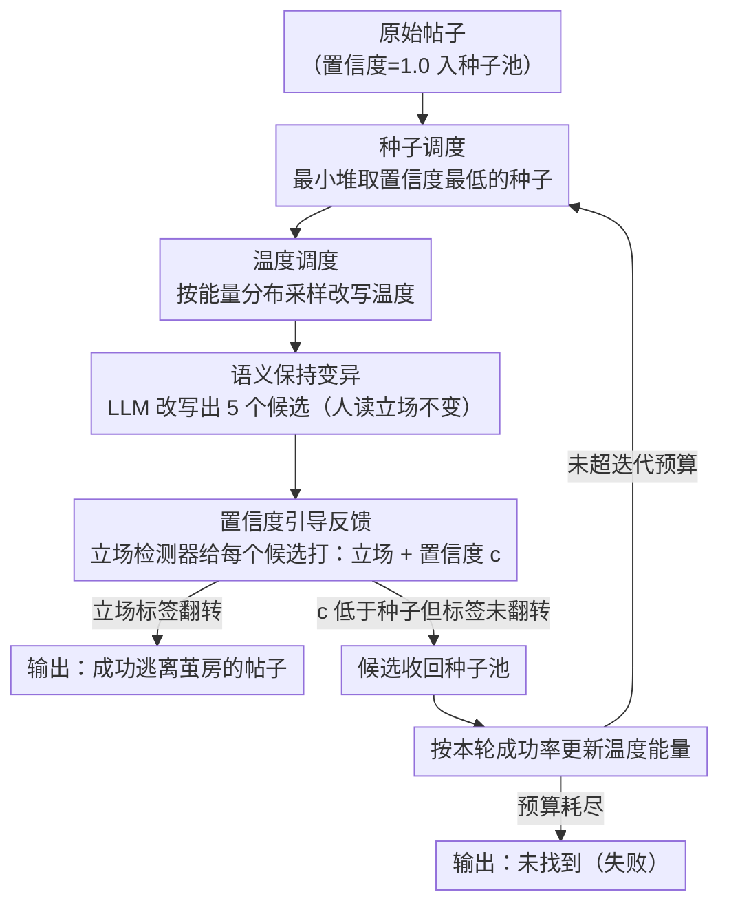

# Content Fuzzing for Escaping Information Cocoons on Social Media

**会议**: ACL 2026  
**arXiv**: [2604.05461](https://arxiv.org/abs/2604.05461)  
**代码**: 无  
**领域**: 社交计算 / 对抗学习  
**关键词**: 信息茧房, 立场检测, 模糊测试, 内容改写, 推荐系统

## 一句话总结
提出 ContentFuzz，一个从内容创作者视角出发的置信度引导模糊测试框架，通过 LLM 改写帖子使其在保持人类解读含义不变的前提下改变机器推断的立场标签，从而突破社交媒体信息茧房。

## 研究背景与动机

**领域现状**：社交媒体平台使用立场检测作为推荐和排序管道中的重要信号，将帖子主要路由给持相同观点的受众，减少了跨立场曝光。这限制了不同意见的传播范围，阻碍了建设性讨论。

**现有痛点**：现有打破信息茧房的方法主要是平台侧的算法干预（如多样性重排序），但这些方法由平台控制，个人用户和内容创作者无法修改推荐算法，也看不到帖子如何被过滤、排序和分发。创作者缺乏主动扩展内容触达范围的工具。

**核心矛盾**：用户和创作者有扩大跨群体曝光的需求，但缺乏可操作的技术手段——唯一能控制的是内容本身。

**本文目标**：从创作者角度，探索如何通过内容改写突破信息茧房——找到保持人类解读立场但改变机器分类立场的语义保持改写。

**切入角度**：借鉴软件测试中的模糊测试（fuzzing）方法论，将立场检测模型视为"被测系统"，迭代发现使其分类结果翻转的输入变体。

**核心 idea**：用立场检测模型的置信度反馈引导 LLM 生成语义保持改写——置信度下降说明改写在探索分类器决策边界附近，反复迭代直到标签翻转或耗尽预算。

## 方法详解

### 整体框架
ContentFuzz 把立场检测器当作"被测系统"，从原始帖子出发做迭代式模糊测试。每轮先由**种子调度**用最小堆从种子池里挑出当前置信度最低、最接近翻转的帖子，再由**温度调度**按历史成功率采样一个改写温度，让 LLM 在保持人类解读含义不变的前提下（**语义保持变异**）改写出 5 个候选；这些候选逐一送进立场检测器读取预测立场与置信度（**置信度引导反馈**）。一旦某候选的立场标签直接翻转就立即返回成功；凡是把置信度压得更低、但尚未翻转的候选都被收回种子池作为后续起点，并据本轮成功率更新各温度的能量。如此循环，直到某候选改变机器判断的立场标签、或迭代预算耗尽为止。

### 关键设计

**1. 置信度引导反馈：用分类器自己的"犹豫程度"当作搜索方向的指南针**

盲目改写帖子去碰运气翻转标签效率极低，因为没有任何信号告诉 LLM 哪个改写在"靠近"分类器的决策边界。ContentFuzz 在每次变异后都把候选喂给立场检测器，拿到预测立场和置信度 $c$：若新候选的 $c$ 低于其种子，说明它正把模型推离当前判断、更接近决策边界，就把它收进种子池；一旦某候选的立场标签直接翻转，立即返回成功。置信度越低相当于"温度"越低、越逼近边界，于是搜索从随机游走变成有方向的下降，整体效率大幅提升。

**2. 种子调度：用最小堆始终优先压榨最接近边界的种子**

模糊测试的算力有限，把变异次数浪费在远离边界的种子上是纯粹的损耗。ContentFuzz 把所有候选按置信度组织成一个最小堆（min-heap），每轮总是取出全池置信度最低的那个种子去变异——置信度越低意味着它越贴近检测器的决策边界、越可能一改就翻。这样调度把有限的迭代预算集中投到最有希望的方向上，是 ContentFuzz 能在少量迭代内收敛的关键。

**3. 语义保持变异：要的是逃离茧房，不是欺骗分类器**

这是 ContentFuzz 与对抗攻击的本质分界：对抗攻击允许人类也读不懂的扰动，而这里要求改写对人类读者而言含义完全不变。ContentFuzz 只设**一个**严格的改写算子（用 Gemini-2.5-Flash-Lite），通过专门的提示模板要求保留核心观点和态度、只改动措辞句式等表面特征；为加速探索、避免种子池过早枯竭，每次让算子一口气生成 5 个候选并逐一送检。正因为约束在"人读起来立场不变、机器判断的立场却翻转"，产出的才是真正能让创作者跨群体触达的自然帖子，而非一段对人类失真的对抗样本。

**4. 温度调度：用能量反馈自适应地调节改写的"创造力"**

固定的生成温度在这里并不好用——不同平台、不同话题需要的改写发散程度不同，而单一严格算子若配死温度，就会在探索与利用之间失衡。ContentFuzz 把温度离散成 $\mathcal{T}=\{0.0, 0.1, \dots, 2.0\}$，给每个温度一个能量值 $E_t$（初始为 1），每轮按 $P(t)=E_t / \sum_{t'} E_{t'}$ 采样一个温度来改写；该轮结束后，按"降低了置信度的候选占比" $s/N$ 给这个温度加能量 $E_t \leftarrow E_t + s/N$。于是历史上更能产出有效变体的温度会被采样得越来越频繁，框架无需手动调参就能跨平台、跨话题自适应（对应算法里的 `UpdateEnergy`）。

### 损失函数 / 训练策略
ContentFuzz 是推理时框架，无需训练。优化目标是最小化立场检测器对原始标签的置信度直到标签翻转。

## 实验关键数据

### 主实验

| 设置 | 立场模型 | 成功率 | 语义保持 | 流畅度 |
|------|---------|-------|---------|-------|
| 英文数据集 | BERT-based | 高 | 强 | 高 |
| 英文数据集 | LLM-based | 高 | 强 | 高 |
| 中文数据集 | BERT-based | 高 | 强 | 高 |
| 跨主题迁移 | 多模型 | 稳定 | 稳定 | 稳定 |

### 消融实验

| 配置 | 效果 | 说明 |
|------|------|------|
| 无置信度反馈（随机变异） | 低成功率 | 无方向性探索效率极低 |
| 无种子调度（均匀选择） | 降低 | 浪费资源在低潜力种子上 |
| 完整 ContentFuzz | **最优** | 反馈+调度协同作用 |

### 关键发现
- ContentFuzz 在 3 个数据集、2 种语言、4 个立场检测模型上均有效
- 改写在保持语义完整性的同时成功翻转机器立场标签
- 微小的措辞变化就能显著影响立场检测器的输出，揭示了这些模型的脆弱性

## 亮点与洞察
- **视角转换**是最大亮点：从"平台如何打破茧房"转为"创作者如何突围"，这是一个被忽视但实际可操作的方向
- **fuzzing 方法论的跨域迁移**很巧妙——将软件测试的核心理念（迭代变异+反馈引导+种子调度）无缝应用到 NLP 场景
- **揭示了立场检测模型的脆弱性**——语义不变的改写就能翻转预测，这对推荐系统的可靠性提出了质疑

## 局限与展望
- 依赖黑盒/灰盒访问立场检测模型——完全黑盒的推荐系统可能无法获取置信度
- 成功改写是否真能改变推荐算法的分发决策未在真实平台上验证
- 可能被滥用于操纵舆论——需要考虑伦理边界

## 相关工作与启发
- **vs 对抗攻击**：对抗攻击追求最小扰动翻转标签，ContentFuzz 追求语义保持的自然改写
- **vs 平台侧干预**：互补关系——平台控制算法，创作者控制内容

## 评分
- 新颖性: ⭐⭐⭐⭐⭐ 首个内容侧信息茧房突破框架，视角独特
- 实验充分度: ⭐⭐⭐⭐ 多语言多模型验证全面
- 写作质量: ⭐⭐⭐⭐ 问题动机清晰，方法类比恰当
- 价值: ⭐⭐⭐⭐ 对信息多样性和推荐系统鲁棒性有双重价值

<!-- RELATED:START -->

## 相关论文

- [\[ACL 2026\] Synthia: Scalable Grounded Persona Generation from Social Media Data](synthia_scalable_grounded_persona_generation_from_social_media_data.md)
- [\[ACL 2026\] DIA-HARM: Dialectal Disparities in Harmful Content Detection Across 50 English Dialects](dia-harm_dialectal_disparities_in_harmful_content_detection_across_50_english_di.md)
- [\[ACL 2026\] Bayesian Social Deduction with Graph-Informed Language Models](bayesian_social_deduction_with_graph-informed_language_models.md)
- [\[ACL 2026\] The Proxy Presumption: From Semantic Embeddings to Valid Social Measures](the_proxy_presumption_from_semantic_embeddings_to_valid_social_measures.md)
- [\[NeurIPS 2025\] Precise Information Control in Long-Form Text Generation](../../NeurIPS2025/social_computing/precise_information_control_in_long-form_text_generation.md)

<!-- RELATED:END -->
