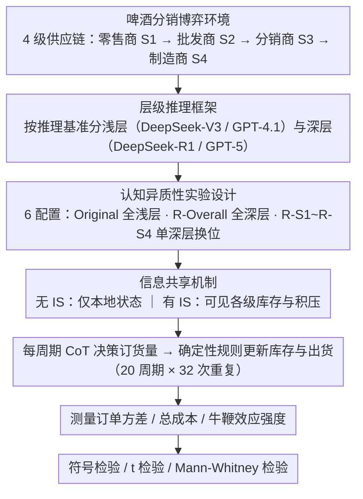

# Dynamics of Cognitive Heterogeneity: Investigating Behavioral Biases in Multi-Stage Supply Chains with LLM-Based Simulation

**会议**: ACL 2026  
**arXiv**: [2604.17220](https://arxiv.org/abs/2604.17220)  
**代码**: 无  
**领域**: 其他  
**关键词**: 供应链模拟, 认知异质性, 牛鞭效应, LLM智能体, 啤酒分销博弈

## 一句话总结

使用LLM智能体（DeepSeek/GPT系列）在经典啤酒分销博弈中模拟多阶段供应链，系统研究认知异质性（推理能力差异）对系统行为的影响，发现LLM智能体能复现人类的牛鞭效应和短视行为，且信息共享能有效缓解这些不良效应。

## 研究背景与动机

**领域现状**：行为实验（如啤酒分销博弈）揭示了认知偏差导致的供应链低效（如牛鞭效应），但传统人类实验面临可扩展性、成本和实验控制的限制。LLM作为行为代理的潜力正被探索。

**现有痛点**：（1）大多数LLM多智能体研究聚焦于静态或结构简单的设置，未探索高度动态的多周期环境；（2）现有研究通常部署同质智能体，忽略了认知异质性（不同推理能力的智能体混合）对群体行为的影响；（3）缺乏严格的统计验证。

**核心矛盾**：真实组织中策略多样性既普遍又重要，但其在合成环境中的交互效应尚未被充分研究。

**本文目标**：构建LLM驱动的供应链模拟范式，系统研究认知异质性如何影响集体行为。

**切入角度**：用不同推理能力的LLM（基础版 vs 推理增强版）代表不同的认知层级，在供应链不同位置部署异质智能体。

**核心 idea**：LLM智能体能复现人类行为偏差，认知异质性加剧系统低效，而信息共享是有效的缓解手段。

## 方法详解

### 整体框架

本文把经典的啤酒分销博弈（4 级线性供应链：零售商→批发商→分销商→制造商）搬到 LLM 智能体上：每个层级由一个 LLM 扮演，每个周期独立决定向上游订多少货，连续运行 20 个周期。核心变量是"认知深度"——用推理能力不同的 LLM 代表浅层与深层认知，再把深层智能体放到供应链的不同位置，观察整个系统的订单波动、成本和牛鞭效应如何随之变化。每种配置跑 32 次独立重复以支撑统计检验。

### 关键设计

**1. 层级推理框架：用基础版/推理增强版 LLM 给"认知深度"找经验锚点**

要研究"认知异质性"，先得有可信的认知分层标准，否则分层就是拍脑袋。本文把智能体分成浅层（DeepSeek-V3、GPT-4.1）和深层（DeepSeek-R1、GPT-5）两级，依据是深层模型在 AIME、GPQA 等推理基准上一致优于对应基础版——分层不是主观假设而是有 benchmark 背书。同时采用 DeepSeek 系列 + GPT 系列的双家族设计，既控制单一架构带来的偏差，又能验证结论在跨家族时是否依然成立。

> ⚠️ 原文将 GPT-5 列为"深层"代表模型，型号名称以原文为准。

**2. 认知异质性实验设计：每次只挪动一个深层智能体的位置，隔离因果效应**

直接把不同能力的智能体随机混在一起，会让"是谁、在哪个位置导致了变化"变得无法归因。本文用 6 种配置做受控变化：两种同质条件（Original 全浅层、R-Overall 全深层）作为两端基线，外加 R-S1 到 R-S4 四种分层条件——每种只在某一个供应链位置放一个深层智能体、其余保持浅层。每种配置再叠加"有/无信息共享"两种信息条件，并统一用 CoT 提示支撑结构化决策。这样单一变量（深层认知所处的位置）的移动就能干净地映射到系统行为的差异上。

**3. 信息共享机制：验证信息透明能否压住牛鞭效应**

牛鞭效应在人类实验里的经典成因之一是信息不对称，本文要看 LLM 智能体是否也吃这一套。在信息共享条件下，每个智能体除了自己的局部状态，还能看到其他层级的库存和积压信息；随后对比有/无共享两种情况下的订单波动、总成本和牛鞭效应强度。如果共享后波动和成本明显下降，就说明 LLM 智能体的偏差同样根植于信息结构、而非单纯的个体智力。

### 损失函数 / 训练策略

不涉及任何模型训练，智能体均为现成 LLM 零训练直接部署。结果显著性用符号检验、t 检验和 Mann-Whitney 检验等标准统计方法验证。

## 实验关键数据

### 主实验

牛鞭效应复现（同质条件，无信息共享）：

| 配置 | 订单方差增幅 | p值 | 说明 |
|------|-----------|-----|------|
| DeepSeek-Original | 82.3% | <0.001 | 显著牛鞭效应 |
| DeepSeek-R-Overall | 79.8% | <0.001 | 推理增强后仍存在 |
| GPT-Original | 74.2% | <0.001 | 跨家族一致 |
| GPT-R-Overall | 74.3% | <0.001 | 一致性验证 |

### 消融实验

信息共享的缓解效果：

| 条件 | 无IS总成本 | 有IS总成本 | 降低幅度 |
|------|-----------|-----------|---------|
| DeepSeek-Original | 39.43 | 20.15 | ~49% |
| DeepSeek-R-Overall | 29.43 | 17.71 | ~40% |

### 关键发现

- LLM智能体成功复现了人类实验中观察到的牛鞭效应（p<0.001），验证了LLM作为行为代理的可信性
- 与人类数据相比，LLM智能体的决策更稳定（方差更低），统计信号更清晰
- 认知增强（R1/GPT-5）虽降低总成本但未消除牛鞭效应——即使更"聪明"的智能体仍表现出短视行为
- 信息共享是最有效的干预：在所有配置中一致降低成本40-50%
- 自利行为（每个智能体最小化自身成本）是系统低效的根本原因

## 亮点与洞察

- 用LLM模拟行为实验是一个极有前景的范式：相比人类实验，成本低几个数量级、可大规模重复、变量精确控制。这对运营管理和行为经济学研究有变革性意义。
- 认知增强无法消除牛鞭效应这一发现很有洞察力：问题不在于个体智力不足，而在于信息结构和激励机制——这与现实组织中的情况高度吻合。
- 双家族验证设计（DeepSeek+GPT）确保了发现的跨平台鲁棒性。

## 局限与展望

- LLM智能体的"认知偏差"与人类的是否本质相同存疑——可能是训练数据中学到的行为模式而非真正的认知限制
- 啤酒分销博弈虽经典但高度简化，真实供应链的复杂性（多产品、随机性、合同约束）远超此设定
- 温度参数固定为1，不同温度下行为可能不同（虽然引用了先前工作的稳定性结果）
- 仅研究了4级线性供应链，网络化供应链的行为可能完全不同

## 相关工作与启发

- **vs Kirshner (2024)**: 在供应链中部署LLM智能体的先驱，但使用同质设置；本文首次引入认知异质性
- **vs Park et al. (2023) (Generative Agents)**: 聚焦社交互动模拟；本文将LLM智能体扩展到结构化经济环境
- **vs 传统RL方法（IPPO/MAPPO）**: 需要严格的状态空间定义和大量训练；LLM智能体零训练即可展现类人行为

## 评分
- 新颖性: ⭐⭐⭐⭐ 认知异质性+供应链模拟的新视角
- 实验充分度: ⭐⭐⭐⭐⭐ 32次重复×6配置×2信息条件，统计验证严格
- 写作质量: ⭐⭐⭐⭐ 实验设计清晰，统计分析扎实
- 价值: ⭐⭐⭐⭐ 为LLM智能体在组织行为研究中的应用开辟了新方向

<!-- RELATED:START -->

## 相关论文

- [\[ACL 2026\] Probing Multimodal Large Language Models on Cognitive Biases in Chinese Short-Video Misinformation](probing_multimodal_large_language_models_on_cognitive_biases_in_chinese_short-vi.md)
- [\[ACL 2026\] Why Are We Moral? An LLM-based Agent Simulation Approach to Study Moral Evolution](why_are_we_moral_an_llm-based_agent_simulation_approach_to_study_moral_evolution.md)
- [\[ACL 2026\] Point of Order: Action-Aware LLM Persona Modeling for Realistic Civic Simulation](point_of_order_action-aware_llm_persona_modeling_for_realistic_civic_simulation.md)
- [\[ACL 2026\] Investigating Counterfactual Unfairness in LLMs towards Identities through Humor](investigating_counterfactual_unfairness_in_llms_towards_identities_through_humor.md)
- [\[ACL 2026\] MM-StanceDet: Retrieval-Augmented Multi-modal Multi-agent Stance Detection](mm-stancedet_retrieval-augmented_multi-modal_multi-agent_stance_detection.md)

<!-- RELATED:END -->
