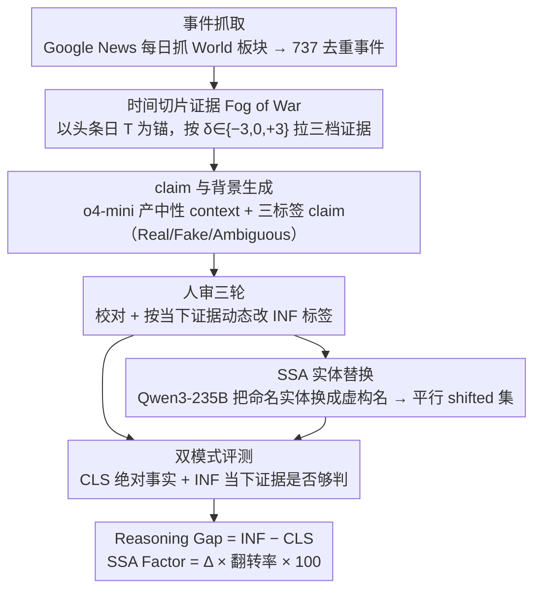

# LiveFact: A Dynamic, Time-Aware Benchmark for LLM-Driven Fake News Detection

**会议**: ACL 2026  
**arXiv**: [2604.04815](https://arxiv.org/abs/2604.04815)  
**代码**: https://github.com/bebxy/livefact  
**领域**: 社会计算 / 假新闻检测 / LLM 评测  
**关键词**: 动态基准、时间感知、benchmark 污染、认知谦逊、Fog of War

## 一句话总结
LiveFact 把"假新闻检测"从静态二分类升级成一个按月更新、按时间切片证据的动态推理基准，用 Classification + Inference 双模式同时考察 LLM 的事实判断和"该说不知道就说不知道"的认知谦逊，并用 SSA 实体替换显式监控基准污染。

## 研究背景与动机
**领域现状**：LLM 把假新闻检测从"特征+分类器"推到"基于多跳证据的复杂推理"，但评测端基本停留在 LIAR / FEVER / FakeNewsNet 这类静态数据集——给 LLM 一锅煮熟的证据，让它输出 Real/Fake。

**现有痛点**：第一，静态数据被反复用作预训练语料，存在严重的 Benchmark Data Contamination（BDC），LLM 可能只是"背答案"而非真推理；第二，所有证据"一次性给齐"的 god-view 设定完全脱离真实世界——记者拿到的就是不完整、随时间演化的碎片；第三，模型表现高低难以区分是真懂事实还是只是"自信地猜"。

**核心矛盾**：评测的静态本质（一次性快照）和 LLM 的持续预训练 + 新闻的持续产生这两个动态过程根本对不上号，导致排行榜数字越好可能越说明背得越熟而不是推得越好。

**本文目标**：构造一个能持续更新、能模拟"信息迷雾"、能量化 BDC 风险的评测体系，使分数同时反映 (a) 推理能力 和 (b) 在证据不足时承认"不知道"的能力。

**切入角度**：把每条新闻的证据按发生日 $T$ 切成 $E^{(-3)}$、$E^{(0)}$、$E^{(+3)}$ 三个时间片，强迫模型在不同信息密度下回答；并用 Classification（绝对事实）和 Inference（"在当下证据下能否判断"）双模式对照，区分真推理与硬猜。

**核心 idea**：用月度更新 + 时间切片证据 + 双模式评估 + 实体替换污染监控，把静态分类基准重塑为动态、时间感知、反污染的推理基准。

## 方法详解

### 整体框架
LiveFact 是一条"五阶段月度流水线 + 双模式评测"：
1. **事件抓取**：Google News API 每日 00:00 GMT 抓 World 板块，2025/11 一个月聚出 737 个去重事件；
2. **时间证据构造**：以事件头条日期 $T$ 为锚，按 $\delta\in\{-3,0,+3\}$ 三档拉证据，共 25,064 条；
3. **claim 与背景生成**：o4-mini 读事件+证据，生成中性背景 context 与三标签 claim（Real/Fake/Ambiguous）共 4,392 条；
4. **人审**：作者团队三轮独立校对，对 Inference 模式还要根据"当下证据是否足够判定"动态调整 ground truth；
5. **BDC 监控**：用 Qwen3-235B-A22B 跑 SSA 框架的实体替换（Trump → Wannetta），生成平行 shifted 数据集。

形式化上，对每个 claim $c_i$ 给出 LLM $f_\theta$ 输入三元组 $(c_i, E_i^{(\delta)}, k_i)$，输出 $\hat y_i^{(\delta)} \in \{\text{Real},\text{Fake},\text{Ambiguous}\}$；评测在两种模式下计算 Acc 与 Macro-F1。

### 关键设计

**1. 时间切片证据（Fog of War）：用三档证据窗模拟真实世界里"信息逐步显形"**

真实记者拿到的证据是不完整、随时间演化的碎片，而静态基准却一次性把证据喂齐，根本测不出模型在信息真空里能否克制乱猜。LiveFact 以事件头条日期 $T$ 为锚，按 $\delta\in\{-3,0,+3\}$ 切出事发前 3 天、当日、事发后 3 天三档证据。3 天窗不是随手定的，而是基于信息速率分析：证据密度在 $T\pm 48{\sim}72$h 达峰，扩到 $\pm 7$ 或 $\pm 15$ 天收益递减，缩到 $\pm 1$ 天又抓不到首发报道。窗口越早能"硬判定"的 claim 越少——在 $\delta=-3$ 下 Inference 模式的 Ambiguous 占比飙到 85%。这样就把"证据完备"和"证据不足"两种处境分离开来，单独考察模型在信息不全时的判断行为。

**2. 双模式评测（Classification + Inference）：把"过度自信"和"认知谦逊"分开计量**

只看一套绝对事实标签时，模型很容易靠参数化记忆"撞对"，分数高不代表会推理。LiveFact 在同一份 claim 上挂两套 ground truth：CLS 给与时间无关的绝对事实标签，INF 给"当下证据是否足够支持该结论"的时间相关标签——在 $\delta=-3$ 时绝大多数 claim 的 INF 标签被改成 Ambiguous（4,392 条里有 3,698 条，约 85%）。于是 CLS 在 $\delta=-3$ 上的高分恰恰是"幻觉自信"的信号：模型在没证据时被迫二选一却答得很笃定。引入 INF 后才能定义 $\text{Reasoning Gap} = \text{INF Acc} - \text{CLS Acc}$，正值说明模型懂得在信息不够时说 Ambiguous，负值则暴露硬猜倾向。

**3. SSA 实体替换 + Overturn Rate（BDC 监控）：把"是不是在背答案"量化成可上榜的数字**

静态数据被反复当预训练语料，模型可能只是记住了"Trump"这种具体实体而非真在读证据。作者用 Qwen3-235B-A22B（刻意避开 OpenAI 系评 OpenAI 系的偏好泄漏）做 Entity Shift，把命名实体替换成同结构但虚构的名字（Trump → Wannetta），得到平行 shifted 数据集 $(c_i', E_i'^{(\delta)}, k_i')$。再定义翻转率

$$\text{OTR}=\frac{1}{N}\sum_i \mathbb{1}\!\left[\hat y_i^{(\delta)}\neq \hat y_i'^{(\delta)}\right]$$

并乘上替换前后的指标差 $\Delta=\text{Metric}-\text{Metric}_{\text{shift}}$，得到 $\text{SSA Factor}=\Delta\times\text{OTR}\times 100$。分越高说明模型越依赖记住的具体实体而非证据本身，污染风险越大。配合数据集每月更新，这个量就成了可长期追踪的污染监控指标。

### 损失函数 / 训练策略
LiveFact 是评测基准，不做训练。评测时 `TEMPERATURE=0.0`、`TOP_P=1.0`、`MAX_NEW_TOKENS=128`（reasoning 类如 Kimi-K2-Thinking、GPT-OSS 放宽到 1024），强制输出 `[[LABEL]]` 形式以便机器解析。

## 实验关键数据

### 主实验
18 个 LLM 在 2025/11 数据集上的综合分数（Avg 为 12 项均值，节选自 Table 3）：

| 模型 | Acc$_0^{cls}$ | Acc$_{-3}^{inf}$ | Acc$_{+3}^{cls}$ | Avg |
|------|---------------|-------------------|------------------|-----|
| Qwen3-235B-A22B-Instruct-2507 | 79.76 | 66.67 | 82.08 | **72.40** |
| gpt-oss-120b⋆ | 79.94 | 62.23 | 81.81 | 72.13 |
| gpt-5.1-2025-11-13 | 78.60 | 68.44 | 81.01 | 72.02 |
| gpt-5.2-2025-12-11 | 76.34 | 80.71 | 77.32 | 71.52 |
| Qwen3-30B-A3B-Instruct-2507 | 75.05 | 64.55 | 77.00 | 69.46 |
| gpt-4o-2024-08-06 | 72.29 | 74.61 | 73.98 | 67.11 |
| DeepSeek-V3.1 | 64.44 | 78.03 | 63.73 | 61.48 |
| Llama-3.1-70B (base) | 33.45 | 7.90 | 33.47 | 22.16 |

最显著的发现：开源 MoE 旗舰 Qwen3-235B-A22B 平均分超过 GPT-5.1/5.2 等闭源模型；纯 dense base 模型（Llama-3.1-70B 等）因为不遵守输出格式直接崩到 22 分左右。

### 消融实验（Reasoning Gap：INF Acc − CLS Acc at $\delta=-3$）

| 模型类型 | 代表模型 | Reasoning Gap | 行为类型 |
|----------|----------|---------------|----------|
| Uncertainty Aware | Llama-3.1-8B-Instruct | +38% | 证据不足时正确说 Ambiguous |
| Uncertainty Aware | Qwen3-32B | +37% | 同上 |
| Overconfident（指令模型） | Llama-3.3-70B-Instruct | 约 −20% | 硬猜 Real/Fake |
| Overconfident（指令模型） | Qwen3-4B-Instruct | 负 / 接近 0 | 同上 |
| Format-Failed（base 模型） | Llama-3.1-70B | 负 | 格式不合规、近随机 |

成本对比也很有意思：Qwen3-30B-A3B-Instruct 一轮 $0.64，比 gpt-5.2 的 $9.27 便宜约 14×，平均分却只低 3 个点。

### 关键发现
- $\delta=-3$ 的 CLS 高分不是推理强，是"幻觉压力测试"——模型在没证据的时候被迫二选一，越自信越掉坑。
- MoE 架构（Qwen3-235B、DeepSeek-V3.1、gpt-oss-120b）在这种"知识检索 + 推理"任务上系统性强于 dense，作者认为是稀疏路由更适合多面任务。
- "Thinking Mode"模型（Kimi-K2、GPT-OSS）在 128 token 上限下几乎全废，放宽到 1024 后立刻反弹到一线水平——说明 reasoning 不是可选项而是结构必需。
- Base 模型集体崩盘的原因不是不会推理，而是不会按 `[[LABEL]]` 模板输出；评测 base 模型必须先做指令对齐。

## 亮点与洞察
- 把"benchmark 必须静态"这条隐式假设打破，给出可持续的月度更新方案。这对所有"测知识/事实"的基准都有借鉴意义——只要任务有时效性，就该考虑动态化。
- Reasoning Gap 这个单一标量把"过度自信"和"认知谦逊"分得很清楚，比单看 Acc 信息量大得多，可以直接迁移到 QA、code、agent 评测里去衡量"会不会说我不知道"。
- SSA Factor 给"模型在偷背答案吗"提供了一个能放进 leaderboard 列的数字，这比目前 contamination 分析多停留在事后审计要实用。
- 14× 成本优势的 Qwen3-30B-A3B-Instruct 说明对实时假新闻检测这种高频任务，MoE 中型模型才是落地最优解，不是越大越好。

## 局限与展望
- 当前仅英文，且来自全球英文新闻源；非英文区域的本地化造谣模式（如方言、地缘语境）完全没覆盖，作者承诺扩多语。
- 仅文本模态；深度伪造、被剪辑的图视频这些当代假新闻主力没纳入，需要扩到 multimodal RAG。
- 人工审核 + Ambiguous 标签判定是吞吐瓶颈，4,392 条/月的规模相对纯合成数据偏小；作者打算训校准过的 judge 模型半自动化。
- 我自己想到一个隐忧：实体替换在低概率事件上可能破坏 commonsense 一致性（虚构总统替真总统可能让某些证据反而成 Fake），SSA Factor 的解释需要谨慎；另外 3 天窗虽然实证最优，但对持续多周展开的事件（战争、选举）可能切得过细。

## 相关工作与启发
- **vs LIAR / FEVER / FakeNewsNet**：那些是一次性快照，无法对抗污染也无法测时间推理；LiveFact 是连续的、时间锚定的。
- **vs LiveBench**：思想最接近（持续更新对抗污染），但 LiveBench 评 coding/math/data，不为假新闻设计，缺证据链结构。
- **vs TripleFact / AdvFake**：都尝试动态化，但 TripleFact 因版权无法公开、缺时间切片，AdvFake 侧重对抗 RAG 而不是认知谦逊；LiveFact 是第一个同时做月更新 + 时间切片 + BDC 监控的。
- **vs SSA 原工作**：本文把 SSA 从独立工作整合进流水线，作为月度污染监控的一环，给 SSA 找到了最合适的工程化场景。

## 评分
- 新颖性: ⭐⭐⭐⭐⭐ 首个把动态更新、时间切片、双模式评测、BDC 监控四件事一次性做齐的假新闻基准。
- 实验充分度: ⭐⭐⭐⭐ 18 个 LLM 覆盖 1B 到 1T 参数与开源/闭源，但只跑了一个月（11/2025），长期趋势还要等几期。
- 写作质量: ⭐⭐⭐⭐ 动机推导清晰、Reasoning Gap 概念可视化好，公式略密。
- 价值: ⭐⭐⭐⭐⭐ 如果月度更新真坚持下去，这会成为 LLM 事实推理类评测的事实标准。

<!-- RELATED:START -->

## 相关论文

- [\[ICML 2026\] IDO: Incongruity-Aware Distribution Optimization for Multimodal Fake News Detection](../../ICML2026/social_computing/ido_incongruity-aware_distribution_optimization_for_multimodal_fake_news_detecti.md)
- [\[ACL 2026\] VeriTaS: The First Dynamic Benchmark for Multimodal Automated Fact-Checking](veritas_the_first_dynamic_benchmark_for_multimodal_automated_fact-checking.md)
- [\[AAAI 2026\] FactGuard: Event-Centric and Commonsense-Guided Fake News Detection](../../AAAI2026/social_computing/factguard_event-centric_and_commonsense-guided_fake_news_detection.md)
- [\[ACL 2025\] Detection of Human and Machine-Authored Fake News in Urdu](../../ACL2025/social_computing/detection_of_human_and_machine-authored_fake_news_in_urdu.md)
- [\[ACL 2026\] Confident, Calibrated, or Complicit: Safety Alignment and Ideological Bias in LLM Hate Speech Detection](confident_calibrated_or_complicit_safety_alignment_and_ideological_bias_in_llm_h.md)

<!-- RELATED:END -->
