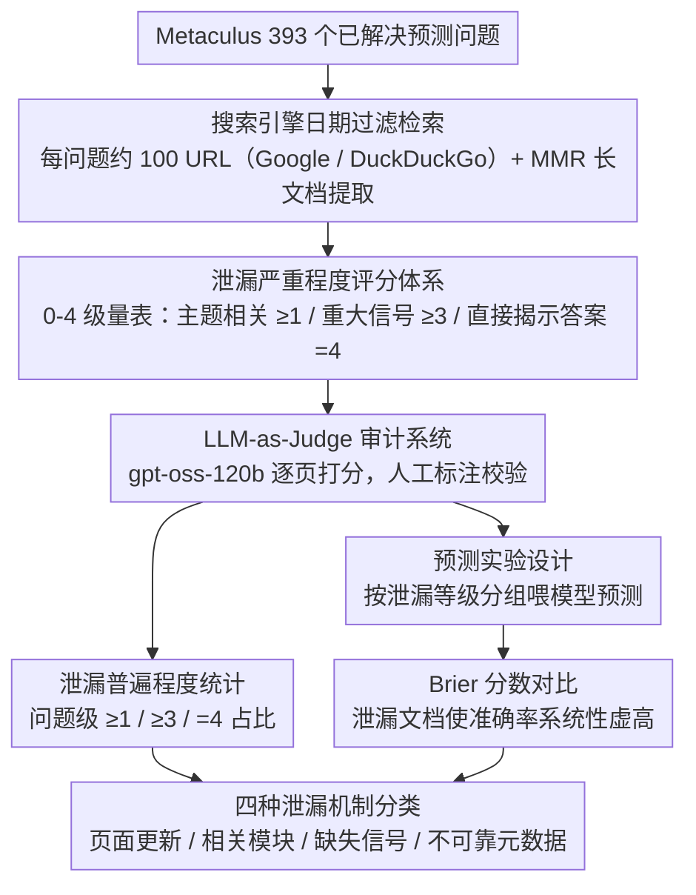

# Temporal Leakage in Search-Engine Date-Filtered Web Retrieval: A Retrospective Forecasting Case Study

**会议**: ACL 2026  
**arXiv**: [2602.00758](https://arxiv.org/abs/2602.00758)  
**代码**: [GitHub](https://github.com/theolivecode/WebDataLeakageAudit)  
**领域**: 时间序列  
**关键词**: 时间泄漏, 日期过滤, 回顾性预测, 搜索引擎审计, 评估可靠性

## 一句话总结

本文对 Google 和 DuckDuckGo 的日期过滤器进行系统审计，发现搜索引擎日期过滤在回顾性预测评估中严重失效——71%（Google）和 81%（DuckDuckGo）的问题至少有一个页面包含重大截止日期后信息泄漏，导致预测 Brier 分数从 0.24 虚降至 0.10。

## 研究背景与动机

**领域现状**：回顾性预测（Retrospective Forecasting, RF）是评估 LLM 预测能力的主流方法——在已有答案的问题上回测，要求检索的证据严格限制在问题公开日期之前。实践中，几乎所有 RF 系统都依赖搜索引擎的日期过滤器来强制信息截止。

**现有痛点**：(1) 先前工作仅通过少量手工案例提及日期过滤可能不可靠，缺乏系统性量化研究；(2) 不清楚时间泄漏是罕见边缘情况还是系统性问题；(3) 泄漏对下游预测准确率的实际影响未被量化。

**核心矛盾**：整个 RF 评估范式的有效性建立在"日期过滤能排除截止日期后信息"这一假设上——如果该假设不成立，所有基于日期过滤搜索的 RF 评估结果都不可信。

**本文目标**：系统审计两大搜索引擎的日期过滤器，量化时间泄漏的普遍程度和机制，并衡量其对预测准确率的实际影响。

**切入角度**：使用 Metaculus 平台上的 393 个已解决预测问题，对每个问题检索约 100 个 URL，用 LLM-as-Judge 对每个页面进行 0-4 级的泄漏严重程度评分。

**核心 idea**：搜索引擎日期过滤在时间回溯检索中是不可靠的——它被四种泄漏机制系统性地破坏：页面更新、相关内容模块、不可靠的元数据和缺失信号。

## 方法详解

### 整体框架

研究不训练任何模型，而是分三个层次审计搜索引擎日期过滤器的可靠性：先做泄漏审计——对约 39K (Google) 和约 35K (DuckDuckGo) 检索 URL 逐页打泄漏分；再做下游影响——对比喂入泄漏/无泄漏文档时 LLM 预测准确率的差异；最后做机制分析——把四种时间泄漏途径分类并用具体 URL 佐证。

### 关键设计

**1. 泄漏严重程度评分体系（0-4 级）：把"有没有泄漏"细化成"泄漏到什么程度"**

简单的"有/无泄漏"二分类没法区分一句无关闲话和一行直接揭示答案的内容，对预测决策的影响完全不同，所以作者定义了一套 0-4 级量表：$0$ = 无截止日期后信息或与问题无关；$1$ = 与主题相关但无信息量；$2$ = 弱方向性信号；$3$ = 重大信号，可支撑强推理或对部分子答案具决定性；$4$ = 直接揭示答案。其中"缺失信号"（关键来源本应提及预期信息却只字未提）这类泄漏的得分上限被卡在 $3$，避免对一处遗漏过度解读。这套分级是后续所有统计的基础——只有分清等级，才能把"主题相关"（$\ge1$）和"重大泄漏"（$\ge3$）拆开统计。

**2. LLM-as-Judge 审计系统：在约 73K URL 规模上自动化泄漏检测**

七万多个 URL 完全无法人工审，所以泄漏评分交给 LLM 来打。每个评分请求打包了问题标题、背景、解决标准、已解决答案、截止日期、页面正文，以及上面那套评分标准加示例，由 gpt-oss-120b（temperature=$0.5$）输出 JSON 格式的泄漏评估。为证明这套自动评分可信，作者用人工标注做了校验：合并 0-1 分后精确匹配准确率 $76.1\%$、二次加权 Kappa $0.85$、直接泄漏（$4$ 分）的 F1 达 $0.82$，说明 judge 在"是否直接揭示答案"这种关键判定上足够可靠。

**3. 预测实验设计（下游影响量化）：证明泄漏不只是存在，而是真的在虚高分数**

光统计泄漏比例还不够，得证明泄漏确实让预测准确率被系统性膨胀。作者特意选 2025 年才开放、落在 LLM 知识截止之后的二元问题，按泄漏等级把检索文档分组喂给 gpt-oss-120b 做预测，再比 Brier 分数。用 2025 年问题是为了保证"无检索"对照组公平——模型不可能靠预训练记忆作弊。这一设计让"泄漏 → 准确率虚高"成为可观测的因果链，而非仅相关。

### 损失函数 / 训练策略

不涉及模型训练。对超过 7680 token 的长文档使用 MMR 提取最相关段落（256 token 分块，最多 30 块，Qwen-0.6B 嵌入模型，$\lambda=0.7$）。

## 实验关键数据

### 主实验

**泄漏普遍程度**

| 指标 | Google | DuckDuckGo |
|------|--------|------------|
| 评估问题数 | 393 | 389 |
| 检索 URL 总数 | 38,879 | 34,454 |
| 含截止后信息的 URL 占比 | 33.2% | 34.5% |
| 问题级：≥1 分（主题相关） | 98.5% | 98.2% |
| 问题级：≥3 分（重大信号） | **71.0%** | **81.2%** |
| 问题级：4 分（直接揭示答案） | **41.0%** | **54.8%** |

**预测准确率影响（93 个 2025 二元问题）**

| 检索条件 | 平均源数 | Brier 均值 | Brier 中位数 |
|----------|---------|-----------|-------------|
| 无检索（基线） | — | 0.244 | 0.090 |
| 0 分（无截止后信息） | 73.5 | 0.242 | 0.102 |
| 2-4 分（弱到完全泄漏） | 9.6 | 0.128 | 0.023 |
| **3-4 分（强到完全泄漏）** | **4.8** | **0.108** | **0.014** |
| 仅 4 分（完全泄漏） | 2.6 | 0.129 | 0.014 |

### 消融实验

**按截止年份的泄漏率变化**

| 截止年份 | Google 泄漏率 | DuckDuckGo 泄漏率 |
|---------|-------------|-----------------|
| 2021 | 46.3% | 47.1% |
| 2022 | 46.5% | 48.0% |
| 2023 | 34.5% | 31.4% |
| 2025 | 26.6% | 27.7% |

### 关键发现

- 泄漏是系统性的而非偶发——近乎所有问题（98%+）至少有一个主题相关的截止后信息
- 无泄漏文档的 Brier 分数（0.242）与无检索基线（0.244）几乎相同——说明"干净"日期过滤检索几乎不提供有用信息
- 3-4 分泄漏的 Brier (0.108) 比仅 4 分 (0.129) 更低，因为 3 分文档提供上下文帮助模型更可靠地解读证据
- 早期截止日期（2021-2022）泄漏率最高（>46%），越近期越低（2025: 约27%）——因为旧页面有更多时间积累更新
- 四种泄漏机制：**页面直接更新**（最常见）、**相关内容侧边栏**（主文无泄漏但侧栏有）、**缺失信号**（综合源的遗漏暗示答案）、**不可靠元数据**（自报时间戳错误）

## 亮点与洞察

- 这项工作对整个 RF 评估方法论产生了根本性挑战——几乎所有声称"接近人类预测能力"的 LLM 预测系统都依赖日期过滤搜索，其性能可能被系统性高估
- "缺失信号"泄漏机制特别微妙——一个涵盖到 2025 年但未提及预期事件的时间线，本身就暗示了答案，但无法通过任何元数据过滤排除
- 将无泄漏检索与无检索对比发现 Brier 分数几乎一样，暗示即使日期过滤完美工作，历史文档对预测的帮助也极为有限

## 局限与展望

- 仅审计了 Google 和 DuckDuckGo 两个搜索引擎，其他引擎的泄漏模式可能不同
- 泄漏检测和预测实验使用同一个模型（gpt-oss-120b），可能存在共享解读偏差
- MMR 文档处理可能遗漏分散在被排除段落中的泄漏信号
- 诊断了问题但未实验评估缓解策略（如 Wayback Machine 检索或冻结快照数据库）

## 相关工作与启发

- **vs FutureSearch (2025)**: 后者提出冻结网页快照方法，但仍使用活跃 Google 搜索做排序——本文提供了移弃活跃日期过滤搜索的实证支持
- **vs Paleka et al. (2026)**: 后者定性提出日期过滤不可靠的担忧，本文首次系统性量化——在约 73K URL 上证实泄漏确实是系统性问题
- **vs ForecastBench (Karger et al., 2025)**: 后者用前瞻性基准避免泄漏，但迭代速度慢——两种方法互补

## 评分

- 新颖性: ⭐⭐⭐⭐ 首个系统性量化搜索引擎日期过滤泄漏的研究，填补重要方法论空白
- 实验充分度: ⭐⭐⭐⭐⭐ 约 73K URL 审计、双引擎对比、下游影响量化、人工验证、时间维度分析
- 写作质量: ⭐⭐⭐⭐⭐ 问题动机清晰、实验设计严谨、泄漏机制分类具体且有 URL 佐证
- 价值: ⭐⭐⭐⭐⭐ 对 RF 评估方法论有直接且深远的影响，所有使用日期过滤搜索的系统都需要重新审视

<!-- RELATED:START -->

## 相关论文

- [\[NeurIPS 2025\] StRap: Spatio-Temporal Pattern Retrieval for Out-of-Distribution Generalization](../../NeurIPS2025/time_series/strap_spatio-temporal_pattern_retrieval_for_out-of-distribution_generalization.md)
- [\[AAAI 2026\] Task-Aware Retrieval Augmentation for Dynamic Recommendation](../../AAAI2026/time_series/task-aware_retrieval_augmentation_for_dynamic_recommendation.md)
- [\[ICML 2026\] Nested Spatio-Temporal Time Series Forecasting](../../ICML2026/time_series/nested_spatio-temporal_time_series_forecasting.md)
- [\[ACL 2026\] STK-Adapter: Incorporating Evolving Graph and Event Chain for Temporal Knowledge Graph Extrapolation](stk-adapter_incorporating_evolving_graph_and_event_chain_for_temporal_knowledge_.md)
- [\[ACL 2026\] Test of Time: Rethinking Temporal Signal of Benchmark Contamination](test_of_time_rethinking_temporal_signal_of_benchmark_contamination.md)

<!-- RELATED:END -->
