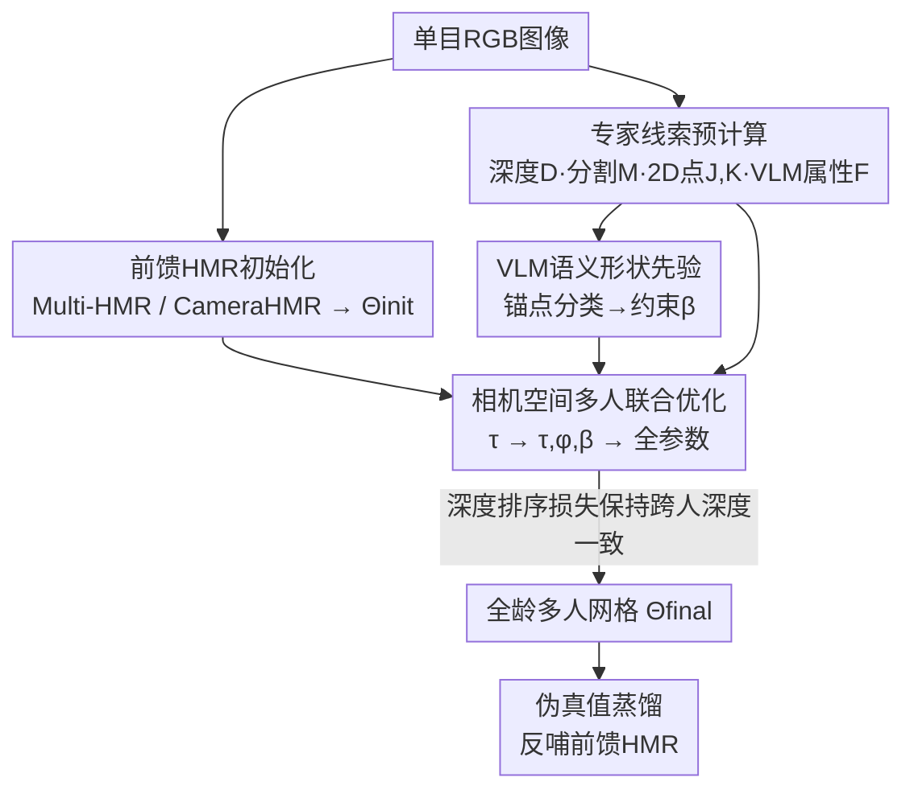

# Anny-Fit: All-Age Human Mesh Recovery

**会议**: CVPR 2026  
**arXiv**: [2605.04728](https://arxiv.org/abs/2605.04728)  
**代码**: https://github.com/naver/anny-fit (有)  
**领域**: 3D视觉 / 人体网格重建 (HMR)  
**关键词**: 全龄人体重建, 单目HMR, 相机空间优化, VLM语义先验, 深度-形状歧义

## 一句话总结
针对"只能重建成年人"的单目人体网格重建（HMR）方法，本文提出 Anny-Fit——一个直接在相机坐标系下、对全场景多人联合优化的框架，靠现成专家模型（度量深度、实例分割、2D 关键点）和 VLM 推出的年龄/性别语义属性来约束"小个子到底是远处大人还是近处小孩"的深度-形状歧义，无需重训就能把成年模型零样本适配到婴儿到老人的全年龄段，并能批量产出高质量伪真值反哺前馈模型。

## 研究背景与动机
**领域现状**：单目 HMR 是人本视觉的基石任务，主流做法是用参数化身体模型（SMPL/SMPL-X）回归或优化出 3D 姿态与体型。绝大多数方法默认"画面里都是成年人"，于是可以把"人在图里看着多大"直接当成深度线索——人越小就越远。

**现有痛点**：一旦场景里出现儿童，这个假设就崩了。一个小小的轮廓既可能是远处的成年人，也可能是近处的小孩，"表观大小"不再能唯一决定深度。同时，多数方法对每个人单独裁剪、独立拟合，重建出来的相对深度互相矛盾，整个场景的空间布局是乱的。

**核心矛盾**：全龄场景里，深度（距离）和体型（是大人还是小孩）两个未知量耦合在一起、互相纠缠——单看一个人的 2D 证据无法把它们解开，而且各人独立优化时缺乏全场景的相对深度约束，很容易陷入"满足了 2D 重投影但深度全错"的退化解。

**本文目标**：在不重训、不依赖大规模带儿童标注数据的前提下，恢复全龄、多人、相机空间一致的 3D 人体网格，并把这套能力封装成可生成伪真值的工具。

**切入角度**：作者观察到两件事——其一，新出的 Anny 身体模型用单一模型连续覆盖从婴儿到老人的体型，且其形状空间由年龄、性别、身高、体重等**语义属性**直接参数化，天然能和图像里可观测的线索对齐；其二，通用 VLM 已经能可靠地从图像里读出"这是个小孩还是大人"这类高层语义。把两者接起来，就能用一个免训练的途径给优化提供体型先验。

**核心 idea**：把"估计连续体型属性"重述为"在每个 $\beta$ 维度上做锚点分类"，用 VLM 当训练无关的形状估计器先把体型框住，再在相机空间对所有人联合做多阶段优化、并用现成度量深度图施加跨人深度排序约束，从而解开全龄场景的深度-形状歧义。

## 方法详解

### 整体框架
Anny-Fit 把全龄多人 HMR 当成"专家引导的优化"问题：先用一个现成前馈 HMR 网络（Multi-HMR 或 CameraHMR）给出每个人的初始 Anny 参数 $\Theta_{\text{init}}$，再用一堆现成专家模型预先算好的线索去迭代精修，最终在相机坐标系里得到全场景一致的网格 $\Theta_{\text{final}}$。每个人用 Anny 模型参数 $\Theta^i=\{\beta^i,\phi^i,\tau^i,\theta^i\}$ 表示（体型 $\beta\in\mathbb{R}^{10}$、根朝向 $\phi$、根平移 $\tau$、姿态 $\theta\in\mathbb{R}^{163}$）。

专家线索分两级：**人级线索** $\mathcal{P}=\{J,F,K\}$——2D 关节 $J$、VLM 估计的体型属性 $F$、稠密 2D 关键点 $K$；**场景级线索** $\mathcal{S}=\{D,M,\Theta_{t-1}\}$——度量深度图 $D$、实例分割 $M$、以及上一步优化状态 $\Theta_{t-1}$（当正则项防漂移）。这些线索一起进入加权目标函数，引导一个分阶段的全场景联合优化。最后，优化产出的高质量拟合还能当伪真值反哺前馈模型。

### 关键设计

**1. 用全龄身体模型 Anny 重述深度-形状歧义**

成年人专属设定能成立，是因为"大小=深度"这条捷径成立；但全龄场景里同一个 2D 投影既可能是远处大人也可能是近处小孩，必须把深度和体型联合估计。已有的 SMPL-A（AGORA 用 SMPL-X 与婴儿模型 SMIL 分段插值）在成人和婴儿形态之间是不连续的，常产生畸形体型（比如把小孩重建成放大的婴儿）。本文改用 Anny 模型，它有两个关键好处：一是用单一模型连续覆盖整个人类生命周期，能在复杂多人场景里一致地推理形状和深度；二是它的形状空间由年龄、性别、身高、体重、肌肉等**非独立的物理属性**直接参数化，每个 $\beta$ 维度都对应一个可观测的语义属性，从而能被图像线索直接约束。这把"全龄歧义"从一个纯几何难题，变成了"先判断这个人的语义属性、再回填深度"的可解问题

**2. 把 VLM 当训练无关的语义形状估计器**

光有表达力强的身体模型还不够——HMR 模型自己很难可靠地推断体型属性。作者的洞察是：与其训练一个专门的体型回归器，不如直接查询通用 VLM。但他们刻意**不让 VLM 直接回归连续属性**（如实际年龄），因为直接回归既受 tokenizer 限制、需要海量训练数据，连续属性本身也概念模糊（同龄人生理年龄差别巨大、体型也不同）。于是核心做法是把形状线索估计**重述为对每个 $\beta$ 维度的分类任务**——这已被证明对 VLM 更友好。具体在年龄轴选 6 个语义锚点（baby / toddler / child / teenager / adult / senior，早期年龄段更密，因为那时体型变化快），性别轴选 3 个锚点（male / neutral / female），并设 'unknown' 落在区间中心当兜底。VLM 预测的类别标签被映射回归一化的 Anny 空间得到 $F$，既用作初始化、也通过 $\mathcal{L}_{shape}=\text{MSE}(\beta,F)$ 在整个优化过程中约束 $\beta$ 不偏离。查询时优先用 $J$ 裁出头部、否则用检测框。$F$ 不必精确，只要是个接近真值的代理就能大幅简化优化

**3. 相机空间多人联合优化 + 分级专家线索融合**

各人独立裁剪、单独拟合再映射回图像坐标，必然导致相对深度互相打架、破坏场景布局。本文反其道而行：直接在 3D 相机空间里对所有人**联合**优化，强制施加跨人的关系一致性。为避免退化解，优化分多阶段进行——先只优化平移 $\tau$ 解决粗略深度摆位，再优化 $\{\tau,\phi,\beta\}$ 在保持稳定站位的同时精修朝向和体型，最后放开全部参数 $\{\tau,\phi,\beta,\theta\}$ 恢复细致姿态。2D 对齐项用 Geman-McClure 鲁棒函数 $\rho(x,\sigma)=\frac{\sigma^2 x^2}{\sigma^2+x^2}$ 抗离群点：$\mathcal{L}_{2D}=\mathcal{L}_{dense}=\frac{1}{|V|}\sum_{j\in V}\rho(c_j\|\hat{p}_j-p_j\|_2,\sigma)$，其中 $\hat{p}_j=\Pi(q_j)$ 是 3D 点 $q_j$ 用相机内参重投影到图像的位置、$c_j$ 是置信度。这种全场景联合 + 分阶段的设计，让每个人的解被其他人的空间关系约束住，绕开了独立优化各自陷入局部极小的问题

**4. 用度量深度图驱动的跨人深度排序损失**

要把所有人摆进一个连贯场景，光靠 2D 重投影不够——退化解可以满足 2D 但深度全错。本文把 BEV 的深度排序损失扩展到**连续的伪真值深度**：鼓励被预测在同一深度平面的人靠拢、不同平面的人分开。和 BEV 依赖人工标注的离散深度层不同，本文用现成度量深度估计器算出深度图 $D$，并通过每个人的分割掩码 $M$ 取其**中位深度**当排序依据（比用关键点更抗遮挡和深度噪声）。整体加权损失为 $\mathcal{L}=\lambda_{2D}\mathcal{L}_{2D}+\lambda_{dense}\mathcal{L}_{dense}+\lambda_{shape}\mathcal{L}_{shape}+\lambda_{init}\mathcal{L}_{init}+\lambda_{depth}\mathcal{L}_{depth}$，各 $\lambda$ 在不同优化阶段灵活调整。消融显示这个深度项对那些把儿童严重错估尺度的成年模型初始化（如 CameraHMR）尤其关键，能把它们拉回合理的尺度

### 损失函数 / 训练策略
优化本身是无训练的（zero-shot 适配），上面 5 项加权损失就是全部目标。在伪真值蒸馏环节，作者用 Anny-Fit 处理 MS-COCO 训练集的 3 万张图、生成语义伪真值，再把它与合成数据混合，训练 Multi-HMR（600K 步，输入分辨率 $672\times672$），让前馈模型学到有语义含义的体型参数。

## 实验关键数据

### 主实验
在野外全龄数据集 Relative Human 上，Anny-Fit 对两种初始化都带来大幅提升，让成年专属模型也变得能和 BEV（在该数据集上训练过的 SOTA）竞争：

| 初始化 | 指标 | 初始 | +Anny-Fit | 提升 Δ |
|--------|------|------|-----------|--------|
| Multi-HMR | 2D ($mPCKh^{0.6}$↑) | 65.39 | 78.84 | +13.45 |
| Multi-HMR | 深度排序 $PCRD^{0.2}$↑ | 59.79 | 66.11 | +6.32 |
| Multi-HMR | Age F1↑ | 23.29 | 48.57 | +25.28 |
| Multi-HMR | Gender F1↑ | 34.83 | 81.11 | +46.28 |
| CameraHMR | 2D↑ | 64.69 | 81.06 | +16.37 |
| CameraHMR | 深度排序↑ | 59.59 | 67.24 | +7.65 |
| CameraHMR | Age F1↑ | 0.00 | 48.75 | +48.75 |
| CameraHMR | Gender F1↑ | 0.00 | 82.13 | +82.13 |

3D 重建（CMU Panoptic 幼儿序列，MPJPE↓ mm）进一步验证误差大幅下降：

| 初始化 | Root MPJPE | +Ours | Δ | Joint-PA MPJPE | +Ours | Δ |
|--------|-----------|-------|---|----------------|-------|---|
| Multi-HMR | 102.15 | 92.52 | -9.63 | 263.78 | 223.13 | -40.66 |
| CameraHMR | 149.52 | 119.93 | -29.60 | 658.90 | 348.03 | -310.86 |

整体 2D 提升 +13~16、深度排序 +6~7、3D 误差 -9~-29、体型估计 +25~+82，与摘要一致。

### 消融实验
在 Relative Human 验证集的 'has child' 子集上拆解各组件（O: 多人优化, S: VLM 形状, D: 深度排序, RD: 根深度）：

| 配置 | 2D | $PCRD^{0.2}$ | Age F1 | Gender F1 | 说明 |
|------|----|----|--------|-----------|------|
| Multi-HMR | 60.99 | 62.66 | 28.55 | 41.95 | 初始 |
| + O | 71.76 | 60.09 | 36.05 | 77.41 | 加多人优化，2D 大涨 |
| + O + S | 76.28 | 59.95 | 59.70 | 84.53 | 加 VLM 形状，年龄/性别飙升 |
| + O + D | 79.21 | 63.37 | 30.61 | 38.38 | 仅加深度，深度排序回升 |
| + O + S + D | 79.22 | 65.13 | 56.78 | 83.75 | 完整模型，综合最强 |

CameraHMR 初始化下，完整模型把深度排序从 50.82 拉到 67.55、年龄 F1 从 18.49 拉到 56.52，验证了对错估尺度的成年模型，深度项尤其关键。

VLM 选型（Table 3）：Qwen2.5-VL-7B 年龄 F1 最高（67.23），各模型性别都很准（90%+），说明性别好估、细粒度年龄仍难。

伪真值蒸馏（Table 4，Multi-HMR 重训）：

| 训练数据 | 2D | $PCRD^{0.2}$ | Age F1 | Gender F1 |
|----------|----|----|--------|-----------|
| Anny-One (合成) | 62.70 | 63.42 | 24.47 | 33.60 |
| + CamSimplify fits | 59.75 | 52.09 | 11.75 | 29.55 |
| + 本文 fits | 70.18 | 68.68 | 42.96 | 81.32 |

加本文伪真值带来 +7.48 / +18.49 / +47.72 的全面提升，而加 CamSimplify 反而掉点——说明增益来自伪真值**质量**而非单纯加数据。

### 关键发现
- **VLM 语义形状先验贡献最大**：单加 S 就把年龄 F1 +30、性别 F1 +40，且形状一旦框对，深度排序和姿态都跟着变准——印证了任务的耦合性（形状→深度→姿态环环相扣）。
- **深度排序损失是尺度修正的关键**：对把儿童严重错估为远处大人的成年模型（CameraHMR），深度项能把场景拉回合理尺度，是其他项替代不了的。
- **深度排序损失 > 根深度回归**：两种深度损失都改善多人深度一致性，但排序损失（D）整体最优。

## 亮点与洞察
- **把"难回归的连续属性"重述成"VLM 友好的离散分类"**：这是全文最巧妙的一步——不硬碰直接回归年龄，而是设语义锚点做分类再映射回形状空间，绕开了 VLM 回归连续值的固有弱点，且免训练。这个 trick 可迁移到任何"想从 VLM 拿连续物理量"的场景。
- **复用现成专家、自身不训练**：深度、分割、关键点、语义全用 off-the-shelf 模型，框架本身是纯优化。意味着上游任一专家变强（更好的检测器/深度估计器），Anny-Fit 直接受益，是个"搭便车"式的可持续设计。
- **优化器即伪真值工厂**：把优化结果当伪真值反哺前馈模型，让全龄能力从"慢优化"蒸馏进"快回归"，且证明了质量比数量重要——这条"优化生成 GT → 训前馈"的闭环很有复用价值。

## 局限与展望
- **重度依赖初始化和专家质量**（作者承认）：低置信度关键点或被错分类的体型属性会让姿态/形状无法收敛；初始全局位置差时优化会停滞或产生人体穿模（失败案例见 Fig.8，尤其腿部关键点置信度低时）。
- **细粒度年龄仍难**：VLM 在相邻年龄段（如 teen vs adult）间频繁混淆，性别好估但年龄分辨率有限，限制了体型估计上限。
- **优化代价**：作为基于优化的方法，逐场景迭代相比纯前馈推理更慢，论文未给出运行时间分析（⚠️ 以原文为准）。
- **改进思路**：作者指出可借鉴已有工作引入更强的全局位置初始化和交互约束来缓解穿模与停滞。

## 相关工作与启发
- **vs BEV [50]**: BEV 首个用弱监督（年龄类别 + 深度层 + 2D 关键点）做野外全龄估计，但依赖人工标注的离散深度层、且基于 SMPL-A 易产生畸形儿童体型；Anny-Fit 用连续度量深度图 + Anny 模型，且无需在目标数据上训练，零样本就能匹配甚至超过 BEV。
- **vs CameraHMR / Multi-HMR（初始化）**: 它们是纯前馈、CameraHMR 还是成年专属单人模型；Anny-Fit 把它们当初始化，靠优化把成年模型零样本适配到全龄，并修正多人相对深度。
- **vs SHAPY [9] / STRAPS / BodyTalk**: 这些用文本属性（身高/体重/体型）增强成人体型估计；Anny-Fit 把语义条件从文本扩展到 VLM 自动推断、并直接对接 Anny 的语义形状空间，覆盖全年龄段且无需形状标注数据。
- **vs per-person 优化方法**: 传统方法逐人裁剪拟合导致深度互相矛盾；本文在相机空间联合优化所有人，靠深度排序损失强制场景级一致。

## 评分
- 新颖性: ⭐⭐⭐⭐⭐ 「VLM 锚点分类当形状先验 + 相机空间全龄联合优化」是清晰且少见的组合，把全龄歧义问题落到了可操作的工程方案上。
- 实验充分度: ⭐⭐⭐⭐ 覆盖野外/3D/消融/VLM 选型/伪真值蒸馏多角度，数字详实；但缺运行时与更多 3D 数据集的横向对比。
- 写作质量: ⭐⭐⭐⭐ 动机推导（深度-形状歧义）讲得透彻，方法分级清晰；部分损失细节甩到附录。
- 价值: ⭐⭐⭐⭐⭐ 解决了 HMR 长期忽视的儿童/全龄盲区，且提供了零样本适配 + 伪真值反哺的实用闭环，代码开源，落地价值高。

<!-- RELATED:START -->

## 相关论文

- [\[CVPR 2026\] OnlineHMR: Video-based Online World-Grounded Human Mesh Recovery](onlinehmr_video-based_online_world-grounded_human_mesh_recovery.md)
- [\[CVPR 2026\] Fall Risk and Gait Analysis using World-Spaced 3D Human Mesh Recovery](fall_risk_gait_analysis_hmr.md)
- [\[CVPR 2026\] ResiHMR: Residual-Limb Aware Single-Image 3D Human Mesh Recovery for Individuals with Limb Loss](resihmr_residual-limb_aware_single-image_3d_human_mesh_recovery_for_individuals_.md)
- [\[CVPR 2025\] PromptHMR: Promptable Human Mesh Recovery](../../CVPR2025/3d_vision/prompthmr_promptable_human_mesh_recovery.md)
- [\[ECCV 2024\] Global-to-Pixel Regression for Human Mesh Recovery](../../ECCV2024/3d_vision/global-to-pixel_regression_for_human_mesh_recovery.md)

<!-- RELATED:END -->
